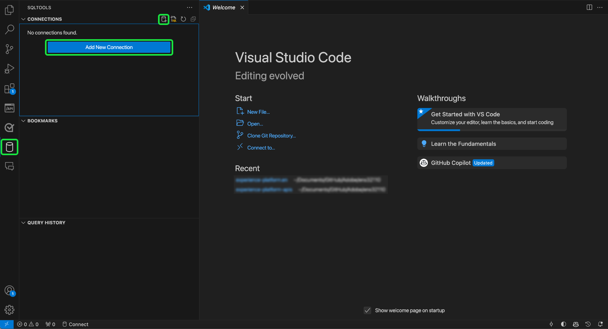

# Connetti [!DNL GitHub Copilot] e [!DNL Visual Studio Code] a Query Service

>[!IMPORTANT]
>
>Prima di utilizzare questo strumento integrato, è necessario comprendere quali dati vengono condivisi con GitHub. I dati condivisi includono informazioni contestuali sul codice e sui file in fase di modifica (&quot;prompt&quot;) e dettagli sulle azioni dell’utente (&quot;dati sul coinvolgimento dell’utente&quot;).  Rivedi l&#39;informativa sulla privacy di [[!DNL GitHub Copilot]](https://docs.github.com/en/site-policy/privacy-policies/github-general-privacy-statement#github-privacy-statement) per informazioni sui dati raccolti. È inoltre necessario considerare le implicazioni di sicurezza derivanti dal coinvolgimento di servizi di terze parti, in quanto sei responsabile di garantire la conformità con i criteri di governance dei dati della tua organizzazione. Adobe non è responsabile per eventuali problemi relativi ai dati o problemi che possono sorgere dall’utilizzo di questo strumento. Per ulteriori informazioni, consulta la documentazione di GitHub.

[!DNL GitHub Copilot], basato su OpenAI Codex, è uno strumento basato sull&#39;intelligenza artificiale che migliora l&#39;esperienza di codifica suggerendo frammenti di codice e intere funzioni direttamente nell&#39;editor. Integrato con [!DNL Visual Studio Code] ([!DNL VS Code]), [!DNL Copilot] può accelerare notevolmente il flusso di lavoro, soprattutto quando si lavora con query complesse. Segui questa guida per scoprire come connettere [!DNL GitHub Copilot] e [!DNL VS Code] a Query Service per scrivere e gestire le query con maggiore efficienza. Per ulteriori informazioni su [!DNL Copilot], visita la [pagina del prodotto Copilot di GitHub](https://github.com/pricing) e la [documentazione [!DNL Copilot] ufficiale](https://docs.github.com/en/copilot/about-github-copilot/what-is-github-copilot).

Questo documento descrive i passaggi necessari per connettere [!DNL GitHub Copilot] e [!DNL VS Code] a Adobe Experience Platform Query Service.

## Introduzione {#get-started}

Questa guida richiede che tu abbia già accesso a un account GitHub e che ti sia registrato per [!DNL GitHub Copilot]. Puoi [registrarti dal sito Web GitHub](https://github.com/github-copilot/signup). Sono inoltre necessari [!DNL VS Code]. Puoi [scaricare [!DNL VS Code] dal loro sito Web ufficiale](https://code.visualstudio.com/download).

Dopo aver installato [!DNL VS Code] e attivato l&#39;abbonamento a [!DNL Copilot], acquisisci le credenziali di connessione, ad Experience Platform. Queste credenziali si trovano nella scheda [!UICONTROL Credenziali] dell&#39;area di lavoro [!UICONTROL Query] nell&#39;interfaccia utente di Platform. Leggi la guida alle credenziali per [scopri come trovare questi valori nell&#39;interfaccia utente di Platform](../ui/credentials.md). Contatta l&#39;amministratore dell&#39;organizzazione se al momento non hai accesso all&#39;area di lavoro [!UICONTROL Query].

### Estensioni [!DNL Visual Studio Code] richieste {#required-extensions}

Le seguenti estensioni [!DNL Visual Studio Code] sono necessarie per gestire ed eseguire query sui database SQL di Platform direttamente nell&#39;editor di codice. Scarica e installa queste estensioni.

- [SQLTools](https://marketplace.visualstudio.com/items?itemName=mtxr.sqltools): utilizzare l&#39;estensione SQLTools per gestire ed eseguire query su più database SQL. Include funzionalità quali query runner, SQL formatter ed Esplora connessioni, con supporto per driver aggiuntivi per aumentare la produttività degli sviluppatori. Per ulteriori informazioni, vedere la panoramica di Visual Studio Marketplace.
- [SQLTools PostgreSQL/Cockroach Driver](https://marketplace.visualstudio.com/items?itemName=mtxr.sqltools-driver-pg): questa estensione consente di connettersi, eseguire query e gestire database PostgreSQL e CockroachDB direttamente nell&#39;editor di codice.

Le estensioni successive abilitano [!DNL GitHub Copilot] e le relative funzionalità di chat.

- [[!DNL GitHub Copilot]](https://marketplace.visualstudio.com/items?itemName=GitHub.copilot): fornisce suggerimenti di codifica in linea durante la digitazione.
- [[!DNL GitHub Copilot] Chat](https://marketplace.visualstudio.com/items?itemName=GitHub.copilot-chat): estensione correlata che fornisce assistenza di IA per la conversazione.

## Crea connessione {#create-connection}

Selezionare l&#39;icona del cilindro () nel menu di navigazione a sinistra di [!DNL VS Code], seguito da **[!DNL Add New Connection]** o dall&#39;icona del cilindro più ().

Verrà visualizzato **[!DNL Connection Assistant]**. Selezionare il driver di database **[!DNL PostgreSQL]**.

![Pagina delle impostazioni SQLTools in [!DNL VS Code] con PostgreSQl evidenziato.](../images/clients/github-copilot/postgres-database-driver.png)

### Impostazioni di connessione di input {#input-connection-settings}

Viene visualizzata la visualizzazione [!DNL Connection Settings]. Immettere le credenziali di connessione a Platform nei campi appropriati di SQL Tools [!DNL Connection Assistant]. I valori richiesti sono illustrati nella tabella seguente.

| Proprietà | Descrizione |
| --- |--- |
| [!DNL Connection name] | Fornire un &quot;[!DNL Connection name]&quot; come `Prod_MySQL_Server` descrittivo e indicante chiaramente lo scopo (ad esempio, un ambiente di produzione per un server MySQL). Le best practice includono: <ul><li>Attenersi alle convenzioni di denominazione della propria organizzazione per assicurarsi che sia univoca all’interno del sistema.</li><li>Mantieni la concisione per mantenere la chiarezza ed evitare confusione con altre connessioni.</li><li>Includi nel nome i dettagli rilevanti sulla funzione o sull’ambiente della connessione.</li></ul> |
| [!DNL Connect using] | Utilizzare l&#39;opzione **[!DNL Server and Port]** per specificare l&#39;indirizzo del server (nome host) e il numero di porta per stabilire una connessione diretta a Platform |
| [!DNL Server address] | Immetti il valore **[!UICONTROL Host]** fornito nelle credenziali di Platform Postgres, ad esempio `acmeprod.platform-query.adobe.io`. |
| [!DNL Port] | Questo valore è in genere `80` per i servizi Platform. |
| [!DNL Database] | Immetti il valore **[!UICONTROL Database]** fornito nelle credenziali di Platform Postgres, ad esempio `prod:all`. |
| [!DNL Username] | Questa proprietà fa riferimento al tuo ID organizzazione. Immetti il valore **[!UICONTROL Nome utente]** fornito nelle credenziali di Platform Postgres. |
| [!DNL Password] | Questa proprietà è il token di accesso. Immetti il valore **[!UICONTROL Password]** fornito nelle credenziali di Platform Postgres. |

Selezionare **[!DNL Use Password]**, seguito da **[!DNL Save as plaintext in settings]** dal menu a discesa visualizzato. Viene visualizzato il campo [!DNL Password]. Utilizza questo campo di immissione testo per immettere il token di accesso.

Infine, per abilitare SSL, selezionare il campo di input [!DNL SSL] e scegliere [!DNL Enabled] dal menu a discesa visualizzato.

>[!TIP]
>
>Dopo aver immesso tutte le credenziali, è possibile verificare la connessione prima di salvarla. Scorri verso il basso fino alla parte inferiore dell&#39;area di lavoro e seleziona **[!DNL Test Connection]**.
>
>{width="100" zoomable="yes"}

Dopo aver immesso correttamente i dettagli di connessione, selezionare **[!DNL Save Connection]** per confermare le impostazioni.

Verrà visualizzata la visualizzazione [!DNL Review connection details] con le credenziali di connessione. Quando si è certi della correttezza dei dettagli di connessione, selezionare **[!DNL Connect Now]**.

L&#39;area di lavoro [!DNL VS Code] viene visualizzata con un suggerimento di [!DNL GitHub Copilot].

![Sessione SQL connessa in [!DNL VS Code].](../images/clients/github-copilot/connected.png)

## Guida rapida di [!DNL GitHub Copilot]

Una volta connesso all&#39;istanza Platform, puoi utilizzare [!DNL Copilot] come assistente alla codifica AI per scrivere il codice più rapidamente e con maggiore sicurezza. Questa sezione descrive le sue funzioni chiave e come utilizzarle.

## Guida introduttiva a [!DNL GitHub Copilot] {#get-started-with-copilot}

Verificare innanzitutto che sia installata la versione più recente di [!DNL VS Code]. Una versione [!DNL VS Code] obsoleta può impedire il funzionamento corretto delle funzionalità chiave [!DNL Copilot]. Verificare quindi che l&#39;impostazione [!DNL Enable Auto Completions] sia abilitata. Se [!DNL Copilot] è in esecuzione correttamente, l&#39;icona **[!DNL Copilot]** () verrà visualizzata nella barra di stato (se si verifica un problema, verrà visualizzata l&#39;icona di errore [!DNL Copilot]). Selezionare l&#39;icona **[!DNL Copilot]** per aprire il menu [!DNL [!DNL GitHub Copilot]]. Dal menu **[!DNL [!DNL GitHub Copilot]]**, seleziona **[!DNL Edit Settings]**

![L&#39;editor [!DNL VS Code] con [!DNL GitHub Copilot Menu] visualizzato e l&#39;icona [!DNL Copilot] e Modifica impostazioni evidenziate.](../images/clients/github-copilot/github-copilot-menu.png)

Scorrere le opzioni verso il basso e verificare che la casella di controllo sia abilitata per l&#39;impostazione [!DNL Enable Auto Completions].

![Il pannello delle impostazioni per [!DNL GitHub Copilot] con la casella di controllo Abilita completamenti automatici selezionata ed evidenziata.](../images/clients/github-copilot/enable-auto-completions.png)

## Completamenti del codice {#code-completions}

Dopo aver installato l&#39;estensione [!DNL GitHub Copilot] e aver effettuato l&#39;accesso, viene attivata automaticamente una funzionalità denominata **Testo fantasma**, che suggerisce il completamento del codice durante la digitazione. Questi suggerimenti consentono di scrivere il codice in modo più efficiente e con meno interruzioni. Puoi anche utilizzare i commenti per guidare i suggerimenti sul codice di intelligenza artificiale. Ciò significa che gli utenti non tecnici possono convertire il linguaggio semplice in codice per esplorare i propri dati.

![L&#39;interfaccia utente di VSCode con un suggerimento di codice e l&#39;icona [!DNL GitHub Copilot] evidenziata.](../images/clients/github-copilot/ghost-text.png)

>[!TIP]
>
>Se si desidera disabilitare [!DNL Copilot] per un file o una lingua specifica, selezionare l&#39;icona sulla barra di stato e disabilitarla.

### Accetta suggerimenti testo fantasma completi o parziali {#accept-suggestions}

Quando [!DNL GitHub Copilot] suggerisce il completamento del codice, puoi accettare suggerimenti parziali o completi. Selezionare **Tab** per accettare l&#39;intero suggerimento oppure tenere premuto **Control (o Command su Mac)** e premere la **freccia destra** per accettare il testo parziale. Per ignorare un suggerimento, premere **Esc**.

>[!TIP]
>  
>Se non ricevi suggerimenti, assicurati che [[!DNL Copilot] sia abilitato nella lingua del file](#get-started-with-copilot).

![L&#39;editor [!DNL VS Code] visualizza un suggerimento di testo grigio debole di [!DNL GitHub Copilot] come testo fantasma accanto al codice parzialmente digitato.](../images/clients/github-copilot/accept-partial-suggestions.png)

### Suggerimenti alternativi {#alternative-suggestions}

Per scorrere i suggerimenti di codice alternativo, selezionare le frecce nella finestra di dialogo [!DNL Copilot].

![L&#39;editor [!DNL VS Code] che mostra il pannello dei suggerimenti alternativi Copilot.](../images/clients/github-copilot/code-suggestions.png)

## Usa chat in linea {#inline-chat}

Puoi anche chattare con [!DNL Copilot] direttamente sul tuo codice. Utilizza **Controllo (o Comando) + I** per attivare la finestra di dialogo della chat in linea. Questa funzione viene utilizzata per iterare il codice e perfezionare i suggerimenti nel contesto. Puoi evidenziare un blocco di codice e utilizzare la chat in linea per visualizzare una soluzione diversa proposta dall’intelligenza artificiale prima di accettare.

<!-- THis section is poss unnecessary:
There are inline features for chat including doc, expalin, fix and test

 -->

## Visualizzazione chat dedicata {#dedicated-chat}

Puoi utilizzare un’interfaccia di chat più tradizionale con una barra laterale dedicata alla chat per formare idee e strategie, risolvere problemi di codifica e discutere i dettagli di implementazione. Selezionare l&#39;icona della chat () nella barra laterale [!DNL VS Code] per aprire una finestra di chat dedicata.

![Barra laterale della chat di [!DNL GitHub Copilot] con l&#39;icona della chat evidenziata.](../images/clients/github-copilot/chat-sidebar.png)

È inoltre possibile accedere alla cronologia delle chat selezionando l&#39;icona della cronologia () nella parte superiore del pannello chat.

## Passaggi successivi

È ora possibile eseguire query sui database Platform direttamente dall&#39;editor di codice e utilizzare i suggerimenti di codice basati sull&#39;intelligenza artificiale di [!DNL GitHub Copilot] per semplificare la scrittura e l&#39;ottimizzazione delle query SQL. Per ulteriori informazioni su come scrivere ed eseguire query, consultare la [guida per l&#39;esecuzione delle query](../best-practices/writing-queries.md).
