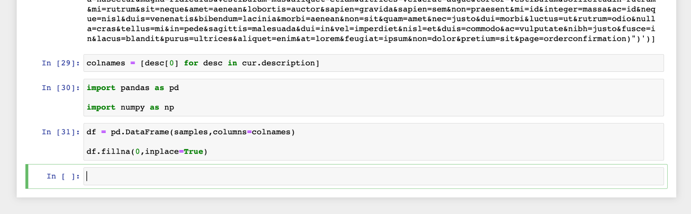

# Connetti [!DNL Jupyter Notebook] al servizio query

Questo documento descrive i passaggi necessari per la connessione [!DNL Jupyter Notebook] con Adobe Experience Platform Query Service.

## Introduzione

Questa guida richiede l’accesso a [!DNL Jupyter Notebook] e hanno familiarità con la sua interfaccia. Per scaricare [!DNL Jupyter Notebook] o per ulteriori informazioni, consulta la sezione [ufficiale [!DNL Jupyter Notebook] documentazione](https://jupyter.org/).

Acquisizione delle credenziali necessarie per la connessione [!DNL Jupyter Notebook] ad Experience Platform, devi avere accesso al [!UICONTROL Query] nell’interfaccia utente di Platform. Contatta l’amministratore dell’organizzazione se al momento non disponi dell’accesso a [!UICONTROL Query] workspace.

>[!TIP]
>
>[!DNL Anaconda Navigator] è un&#39;interfaccia utente grafica desktop (GUI) che offre un modo più semplice di installare e avviare comuni [!DNL Python] programmi quali [!DNL Jupyter Notebook]. Consente inoltre di gestire pacchetti, ambienti e canali senza utilizzare comandi a riga di comando.
>È possibile [installa la versione preferita dell&#39;applicazione](https://docs.anaconda.com/anaconda/install/) dal loro sito web.
>Seguire il processo di installazione guidato. Dalla schermata iniziale di Anaconda Navigator, selezionare **[!DNL Jupyter Notebook]** dall&#39;elenco delle applicazioni supportate per avviare il programma.
>![La [!DNL Anaconda Navigator] schermata iniziale con [!DNL Jupyter Notebook] evidenziato.](../images/clients/jupyter-notebook/anaconda-navigator-home.png)
>Ulteriori informazioni sono disponibili nella [documentazione ufficiale](https://docs.anaconda.com/anaconda/navigator/).

## Launch [!DNL Jupyter Notebook]

Dopo aver aperto una nuova [!DNL Jupyter Notebook] applicazione web, selezionare **[!DNL New]** menu a discesa seguito da **[!DNL Python 3]** per creare un nuovo blocco appunti. La [!DNL Notebook] viene visualizzato l&#39;editor.

![La [!DNL Jupiter Notebook] Scheda File con [!DNL New] a discesa e [!DNL Python] 3 evidenziato.](../images/clients/jupyter-notebook/new-notebook.png)

Sulla prima riga del [!DNL Notebook] editor, inserisci il seguente valore: `pip install psycopg2-binary` e seleziona **[!DNL Run]** dalla barra dei comandi. Sotto la riga di input viene visualizzato un messaggio di operazione riuscita.

>[!IMPORTANT]
>
>Come parte di questo processo per creare una connessione, è necessario selezionare **[!DNL Run]** per eseguire ogni riga di codice.

![La [!DNL Notebook] Interfaccia utente con il comando installa librerie evidenziato.](../images/clients/jupyter-notebook/install-library.png)

Quindi, importa un [!DNL PostgreSQL] scheda di database per [!DNL Python]. Immetti il valore: `import psycopg2`e seleziona **[!DNL Run]**. Nessun messaggio di successo per questo processo. Se non è presente alcun messaggio di errore, continua con il passaggio successivo.

![La [!DNL Notebook] Interfaccia utente con il codice del driver del database di importazione evidenziato.](../images/clients/jupyter-notebook/import-dbdriver.png)

È ora necessario fornire le credenziali Adobe Experience Platform immettendo il valore: `conn = psycopg2.connect("{YOUR_CREDENTIALS}")`. Le credenziali di connessione si trovano nella [!UICONTROL Query] nella sezione [!UICONTROL Credenziali] scheda dell’interfaccia utente di Platform. Consulta la documentazione su come [trova le credenziali aziendali](../ui/credentials.md) per istruzioni dettagliate.

Si consiglia di utilizzare le credenziali non in scadenza quando si utilizzano client di terze parti per risparmiare l&#39;impegno di immettere ripetutamente i dettagli. Consulta la documentazione per le istruzioni su [come generare e utilizzare credenziali non in scadenza](../ui/credentials.md#non-expiring-credentials).

>[!IMPORTANT]
>
>Durante la copia delle credenziali dall’interfaccia utente di Platform, assicurati che non vi sia alcuna formattazione aggiuntiva delle credenziali. Devono essere tutti in una riga, con un unico spazio tra le proprietà e i valori. Le credenziali sono racchiuse tra virgolette e **not** separati da virgole.

![La [!DNL Notebook] Interfaccia utente con le credenziali di connessione evidenziate.](../images/clients/jupyter-notebook/provide-credentials.png)

Le [!DNL Jupyter Notebook] L’istanza è ora connessa al servizio query.

## Esempio di esecuzione di query

Ora che ti sei connesso [!DNL Jupyter Notebook] per eseguire query sui set di dati tramite il servizio Query [!DNL Notebook] input. Nell&#39;esempio seguente viene utilizzata una semplice query per illustrare il processo.

Immetti i seguenti valori:

```console
cur = conn.cursor()
cur.execute('''{YOUR_QUERY_HERE}''')
data = [r for r in cur]
```

Quindi, chiama il parametro (`data` nell’esempio precedente) per visualizzare i risultati della query in una risposta non formattata.

![La [!DNL Notebook] Interfaccia utente con comandi per restituire e visualizzare i risultati SQL all&#39;interno del blocco appunti.](../images/clients/jupyter-notebook/example-query.png)

Per formattare i risultati in modo più leggibile, utilizzare i seguenti comandi:

- `colnames = [desc[0] for desc in cur.description]`
- `import pandas as pd`
- `import numpy as np`

Questi comandi non generano un messaggio di successo. Se non è presente alcun messaggio di errore, è possibile utilizzare una funzione per generare i risultati della query SQL in un formato tabella.



Inserisci ed esegui il `df.head()` per visualizzare i risultati della query tabularizzata.

![Risultati tabularizzati della query SQL in [!DNL Jupyter Notebook].](../images/clients/jupyter-notebook/format-results-output.png)

## Passaggi successivi

Dopo aver effettuato la connessione con Query Service, puoi utilizzare [!DNL Jupyter Notebook] per scrivere query. Per ulteriori informazioni su come scrivere ed eseguire le query, leggere il [guida all’esecuzione delle query](../best-practices/writing-queries.md).
