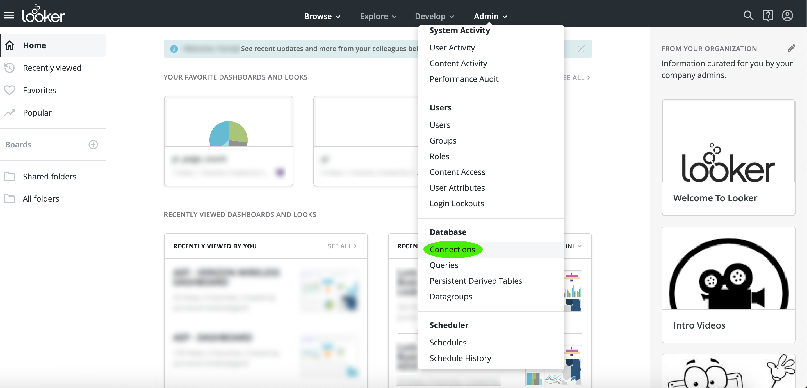

# Connetti con Looker

Per connettere Looker ad Adobe Query Service  Adobe Experience Platform, procedere come segue:

Dopo aver effettuato l&#39;accesso a Looker, fai clic su **Admin**, seguito da **Connessioni**.

In questa pagina, fate clic su **Nuova connessione**.

Da qui, potete compilare i dettagli per le Impostazioni di connessione.

- **Nome:** Nome della connessione.
- **Dialetto:** Il dialetto utilizzato per il database SQL. Il servizio query utilizza **PostgreSQL**.
- **Host e porta:** L&#39;endpoint host e la relativa porta per il servizio query.
- **Database:** Il database che verrà utilizzato.
- **Nome utente e password:** Le credenziali di accesso che verranno utilizzate. Il nome utente sarà in forma di `ORG_ID@AdobeOrg`.

>[!NOTE]
>
>Per ulteriori informazioni su come trovare l&#39;host e la porta, il nome del database e le credenziali di accesso, visitare la pagina delle [credenziali su Platform](https://platform.adobe.com/query/configuration). Per trovare le credenziali, accedere ad Platform, fare clic su **Query**, quindi su **Credenziali**.

Dopo aver inserito i dettagli di connessione, fate clic su **Prova queste impostazioni** per verificare che le credenziali funzionino correttamente. In caso affermativo, di seguito verrà visualizzato un messaggio in cui si informa che è possibile connettersi. Se la connessione ha esito positivo, fare clic su **Aggiungi connessione** per creare la connessione.

## Passaggi successivi

Ora che si è connessi a Query Service, è possibile utilizzare Looker per scrivere query. Per ulteriori informazioni su come scrivere ed eseguire query, consultare la guida [alle query](../creating-queries/creating-queries.md)in esecuzione.