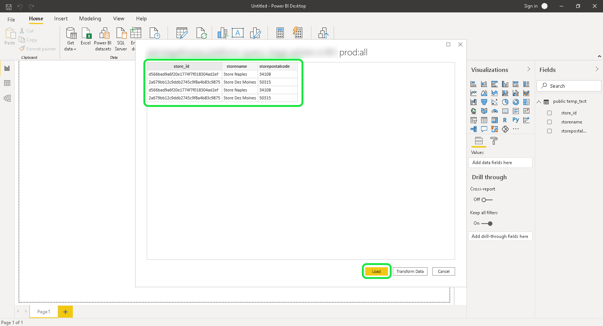

# [!DNL Power BI]

Questo documento descrive i passaggi per la connessione di Power BI con Adobe Experience Platform Query Service.

>[!NOTE]
>
> Questa guida presuppone che abbiate già accesso a [!DNL Power BI] e che abbiate familiarità con come navigare all&#39;interfaccia. Ulteriori informazioni su [!DNL Power BI] sono disponibili nella [documentazione  [!DNL Power BI] ufficiale](https://docs.looker.com/).
>
> Inoltre, l&#39;Power BI è **disponibile solo** sui dispositivi Windows.

## Imposta [!DNL Power BI]

Dopo l&#39;installazione di Power BI, sarà necessario installare `Npgsql`, un pacchetto di driver .NET per PostgreSQL. Ulteriori informazioni su Npgsql sono disponibili nella [Documentazione Npgsql](https://www.npgsql.org/doc/index.html).

>[!IMPORTANT]
>
>È necessario scaricare la versione v4.0.10 o precedente, in quanto le versioni più recenti generano errori.

In &quot;[!DNL Npgsql GAC Installation]&quot; nella schermata di configurazione personalizzata, selezionare **[!DNL Will be installed on local hard drive]**.

Per verificare che npgsql sia stato installato correttamente, riavviare il computer prima di procedere con i passaggi successivi.

## Connetti [!DNL Power BI] a [!DNL Query Service]

Per collegare [!DNL Power BI] a [!DNL Query Service], aprire [!DNL Power BI] e selezionare **[!DNL Get Data]** nella barra multifunzione del menu principale.

Selezionare **[!DNL PostgreSQL database]**, seguito da **[!DNL Connect]**.

È ora possibile immettere i valori per il server e il database. Per ulteriori informazioni su come trovare il nome del database, l&#39;host, la porta e le credenziali di accesso, visitare la pagina delle [credenziali sulla piattaforma](https://platform.adobe.com/query/configuration). Per trovare le credenziali, accedere a [!DNL Platform], quindi selezionare **[!UICONTROL Queries]**, seguito da **[!UICONTROL Credentials]**.

**[!DNL Server]** è l&#39;host che si trova nei dettagli della connessione. Per la produzione, aggiungete la porta `:80` alla fine della stringa host. **[!DNL Database]** può essere &quot;all&quot; o un nome di tabella di set di dati.

Inoltre, è possibile selezionare il **[!DNL Data Connectivity mode]**. Selezionare **[!DNL Import]** per visualizzare un elenco di tutte le tabelle disponibili oppure selezionare **[!DNL DirectQuery]** per creare direttamente una query.

Per ulteriori informazioni sulla modalità **[!DNL Import]**, consultare la sezione relativa alla [visualizzazione in anteprima e importazione di una tabella](#preview). Per ulteriori informazioni sulla modalità **[!DNL DirectQuery]**, consultare la sezione relativa alla creazione di istruzioni SQL](#create). [ Selezionare **[!DNL OK]** dopo aver confermato i dettagli del database.

Viene visualizzato un messaggio per richiedere le impostazioni di nome utente, password e applicazione. Compila questi dettagli, quindi seleziona **[!DNL Connect]** per continuare con il passaggio successivo.

## Visualizzare in anteprima e importare una tabella {#preview}

Se è stata selezionata la modalità **[!DNL Import]**, viene visualizzata una finestra di dialogo con un elenco di tutte le tabelle disponibili. Selezionare la tabella da visualizzare in anteprima, seguita da **[!DNL Load]** per inserire il dataset in [!DNL Power BI].

La tabella viene ora importata in Power BI.

## Creare istruzioni SQL {#create}

Se è stata selezionata la modalità **[!DNL DirectQuery]**, sarà necessario compilare la sezione Opzioni avanzate con la query SQL che si desidera creare.

In **[!DNL SQL statement]**, inserire la query SQL da creare. Assicurarsi che la casella di controllo **[!DNL Include relationship columns]** sia selezionata. Dopo aver scritto la query, selezionare **[!DNL OK]** per continuare.

Viene visualizzata un&#39;anteprima della query. Selezionare **[!DNL Load]** per visualizzare i risultati della query.

## Passaggi successivi

Ora che si è connessi con [!DNL Query Service], è possibile utilizzare [!DNL Power BI] per scrivere query. Per ulteriori informazioni su come scrivere ed eseguire query, consultare la guida in [esecuzione query](../best-practices/writing-queries.md).