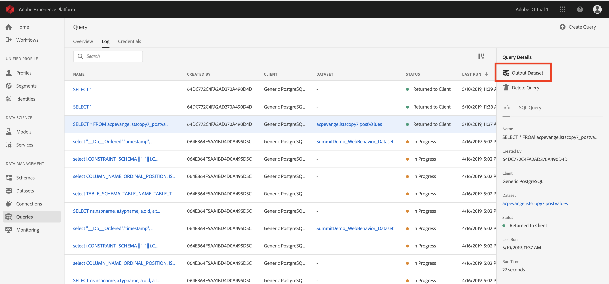

# Generazione di set di dati dai risultati della query

La vera potenza di [!DNL Query Service] viene rivelata quando le query vengono utilizzate per generare set di dati in [!DNL Data Lake] modo da essere utilizzate come input in più query o in altri servizi come [!DNL Data Science Workspace], [!DNL Real-time Customer Profile]o [!DNL Analysis Workspace].

[!DNL Query Service] consente la creazione di set di dati dall’interfaccia utente. Effettuate le seguenti operazioni:

1. Scrivete la query utilizzando un client connesso e convalidate l&#39;output.
2. Accedete all&#39; [!DNL Platform] interfaccia utente e passate a Query.
3. Trovare la query nell&#39;elenco e passare il mouse sulla riga.
4. Fai clic su **[!UICONTROL Create Dataset]**. 
5. Immettete un nome per il set di dati, preceduto dall’ID LDAP (non deve essere univoco o sicuro da SQL); il sistema genera un &quot;nome tabella&quot; in base al nome qui indicato).
6. Inserite una descrizione del set di dati e fate clic su **[!UICONTROL Run Query]**.
7. Osservate la query completa, quindi andate alla pagina dell&#39;elenco dei set di dati per vedere il set di dati appena creato.

Dopo la creazione di un set di dati, è possibile accedervi come qualsiasi altro set di dati in [!DNL Data Lake] e utilizzarlo per diversi casi di utilizzo.

>[!NOTE]
>
>In un&#39;implementazione live, è necessario applicare [!DNL Data Governance] etichette dopo la creazione del set di dati.

## Generazione di set di dati con uno schema predefinito [!DNL Experience Data Model]

Per generare un set di dati con uno schema [!DNL Experience Data Model] (XDM) predefinito, è necessario utilizzare la sintassi SQL. Per ulteriori informazioni sulla sintassi da utilizzare, consultare la guida [alla sintassi](../sql/syntax.md#create-table-as-select)SQL.

## Set di dati di output

I set di dati creati tramite questa funzionalità vengono generati con uno schema ad hoc che corrisponde alla struttura dei dati di output come definito nell&#39;istruzione SQL. Alcuni servizi a valle richiedono insiemi di dati con schemi [!DNL Experience Data Model] (XDM) particolari. Prima di scrivere le query, verificare i requisiti di formattazione dei dati per i servizi a valle.