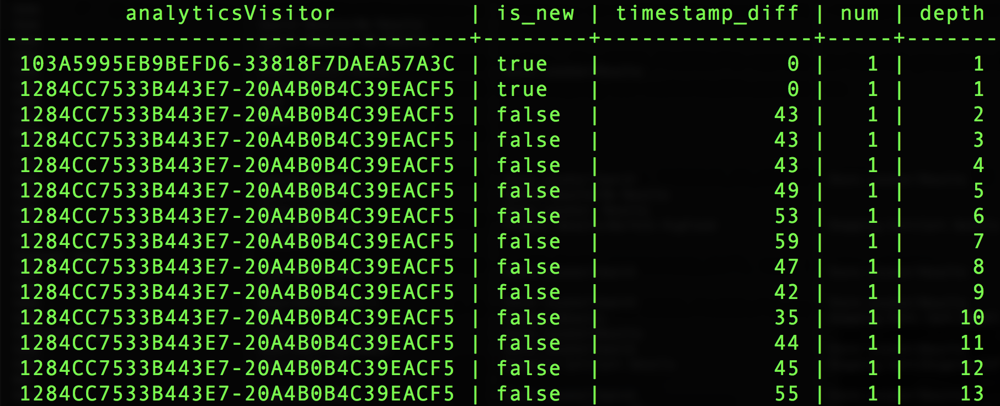

# Utilizzo  funzioni definite dal Adobe

Uno  Adobe  grande differenziatore è che comprendono i dati relativi all&#39;esperienza e ciò che i clienti devono fare con quei dati. È possibile utilizzare questa comprensione per creare funzioni di supporto che semplificano il lavoro.

Il presente documento descrive  funzioni definite dal Adobe (ADF) per supportare tre [!DNL Analytics] attività chiave:
- [Sessionizzazione](#sessionization)
- [Attribution](#attribution)
- [Tracciatura percorso](#pathing)

## Sessionizzazione

Vengono `SESS_TIMEOUT()` riprodotti i raggruppamenti di visite trovati con  Adobe Analytics. Esegue un raggruppamento simile basato sul tempo, ma con parametri personalizzabili.

**Sintassi:**

`SESS_TIMEOUT(timestamp, timeout_in_seconds) OVER ([partition] [order] [frame])`

**Restituisce:**

Struttura con campi `(timestamp_diff, num, is_new, depth)`

### Esplorare il livello di riga `SESS_TIMEOUT()` e l&#39;output

```sql
SELECT analyticsVisitor,
      session.is_new,
      session.timestamp_diff,
      session.num,
      session.depth
FROM  (
        SELECT endUserIDs._experience.aaid.id as analyticsVisitor,
        SESS_TIMEOUT(timestamp, 60 * 30)
        OVER (PARTITION BY endUserIDs._experience.aaid.id
        ORDER BY timestamp
        ROWS BETWEEN UNBOUNDED PRECEDING AND CURRENT ROW)
        AS session
        FROM your_analytics_table
        WHERE TIMESTAMP >= to_timestamp('2018-12-01') AND TIMESTAMP <= to_timestamp('2018-12-31')
      )
LIMIT 100;
```



### Creare un nuovo rapporto con tendenze con visitatori, sessioni e visualizzazioni di pagina

```sql
SELECT
      date_format( from_utc_timestamp(timestamp, 'EDT') , 'yyyy-MM-dd') as Day,
      COUNT(DISTINCT analyticsVisitor ) as Visitors,
      COUNT(DISTINCT analyticsVisitor || session.num ) as Sessions,
      SUM( PageViews ) as PageViews
FROM
    (
      SELECT
          timestamp,
          endUserIDs._experience.aaid.id as analyticsVisitor,
          SESS_TIMEOUT(timestamp, 60 * 30)
      OVER (PARTITION BY endUserIDs._experience.aaid.id
      ORDER BY timestamp
      ROWS BETWEEN UNBOUNDED PRECEDING AND CURRENT ROW)
      AS session,
          web.webPageDetails.pageviews.value as PageViews
      FROM your_analytics_table
      WHERE TIMESTAMP >= to_timestamp('2018-12-01') AND TIMESTAMP <= to_timestamp('2018-12-31')
    )
GROUP BY Day 
ORDER BY Day DESC 
LIMIT 31;
```


## Attribution

L&#39;attribuzione consente di allocare metriche o conversioni come ricavi, ordini o registrazioni alle attività di marketing.

In  Adobe Analytics, le impostazioni di attribuzione sono configurate utilizzando variabili come eVar e vengono generate al momento dell’assimilazione dei dati.

Le ADF di attribuzione riportate in [!DNL Query Service] consentono di definire e generare tali allocazioni al momento della query.

Questo esempio si concentra sull’attribuzione dell’ultimo tocco, ma  Adobe offre anche l’attribuzione del primo tocco.

>[!NOTE]
>
>Altre opzioni con timeout e scadenza basata sugli eventi saranno disponibili nelle versioni future di [!DNL Query Service].

**Sintassi:**

`ATTRIBUTION_LAST_TOUCH(timestamp, [channel_name], column) OVER ([partition] [order] [frame])`

**Restituisce:**

Struttura con campo `(value)`

### Esplorare l&#39;attribuzione a livello di riga

```sql
SELECT
  endUserIds._experience.aaid.id,
  _experience.analytics.customDimensions.evars.evar10 as MemberLevel,
  ATTRIBUTION_LAST_TOUCH(timestamp, 'eVar10', _experience.analytics.customDimensions.evars.evar10)
      OVER(PARTITION BY endUserIds._experience.aaid.id
           ORDER BY timestamp
           ROWS BETWEEN UNBOUNDED PRECEDING AND CURRENT ROW).value
      AS LastMemberLevel,
  commerce.purchases.value as Orders
FROM your_analytics_table 
WHERE TIMESTAMP >= to_timestamp('2018-04-01') AND TIMESTAMP <= to_timestamp('2018-04-30')
LIMIT 50;
```


### Crea una suddivisione degli ordini per Ultimo livello membro ( eVar10)

```sql
SELECT
  LastMemberLevel,
  SUM(Orders) as MemberLevelOrders
FROM 
(SELECT
  ATTRIBUTION_LAST_TOUCH(timestamp, 'eVar10', _experience.analytics.customDimensions.evars.evar10)
      OVER(PARTITION BY endUserIds._experience.aaid.id
           ORDER BY timestamp
           ROWS BETWEEN UNBOUNDED PRECEDING AND CURRENT ROW).value
      AS LastMemberLevel,
  commerce.purchases.value as Orders
FROM your_analytics_table 
WHERE TIMESTAMP >= to_timestamp('2018-04-01') AND TIMESTAMP <= to_timestamp('2018-04-30')
)
GROUP BY LastMemberLevel 
ORDER BY MemberLevelOrders DESC
LIMIT 25;
```


## Tracciatura percorso

I percorsi consentono di comprendere in che modo i clienti navigano nel sito. Le `NEXT()` e `PREVIOUS()` le ADF ne rendono possibile la realizzazione.

**Sintassi:**

```sql
NEXT(key, [shift, [ignoreNulls]]) OVER ([partition] [order] [frame])
PREVIOUS(key, [shift, [ignoreNulls]]) OVER ([partition] [order] [frame])
```

**Restituisce:**

Struttura con campo `(value)`

### Seleziona la pagina corrente e quella successiva

```sql
SELECT 
      endUserIds._experience.aaid.id,
      timestamp,
      web.webPageDetails.name,
      NEXT(web.webPageDetails.name, 1, true)
          OVER(PARTITION BY endUserIds._experience.aaid.id
              ORDER BY timestamp
              ROWS BETWEEN CURRENT ROW AND UNBOUNDED FOLLOWING).value
          AS next_pagename
FROM your_analytics_table
WHERE TIMESTAMP >= to_timestamp('2018-12-01') AND TIMESTAMP <= to_timestamp('2018-12-31') 
LIMIT 10;
```


### Creare un rapporto dettagliato per i primi cinque nomi di pagina all’ingresso della sessione

```sql
  SELECT 
    PageName,
    PageName_2,
    PageName_3,
    PageName_4,
    PageName_5,
    SUM(PageViews) as PageViews
  FROM
    (SELECT
      PageName,
      NEXT(PageName, 1, true)
        OVER(PARTITION BY VisitorID, session.num
              ORDER BY timestamp
              ROWS BETWEEN CURRENT ROW AND UNBOUNDED FOLLOWING).value
        AS PageName_2,
      NEXT(PageName, 2, true)
        OVER(PARTITION BY VisitorID, session.num
              ORDER BY timestamp
              ROWS BETWEEN CURRENT ROW AND UNBOUNDED FOLLOWING).value
        AS PageName_3,
      NEXT(PageName, 3, true)
         OVER(PARTITION BY VisitorID, session.num
              ORDER BY timestamp
              ROWS BETWEEN CURRENT ROW AND UNBOUNDED FOLLOWING).value
        AS PageName_4,
      NEXT(PageName, 4, true)
         OVER(PARTITION BY VisitorID, session.num
              ORDER BY timestamp
              ROWS BETWEEN CURRENT ROW AND UNBOUNDED FOLLOWING).value
        AS PageName_5,
      PageViews,
      session.depth AS SessionPageDepth
    FROM
      (SELECT
        endUserIds._experience.aaid.id as VisitorID,
        timestamp,
        web.webPageDetails.pageviews.value AS PageViews,
        web.webPageDetails.name AS PageName,
        SESS_TIMEOUT(timestamp, 60 * 30) 
          OVER (PARTITION BY endUserIDs._experience.aaid.id 
                ORDER BY timestamp 
                ROWS BETWEEN UNBOUNDED PRECEDING AND CURRENT ROW) 
        AS session
      FROM your_analytics_table
      WHERE TIMESTAMP >= to_timestamp('2018-12-01') AND TIMESTAMP <= to_timestamp('2018-12-31')
    )
  WHERE SessionPageDepth=1
  GROUP BY PageName, PageName_2, PageName_3, PageName_4, PageName_5
  ORDER BY PageViews DESC
  LIMIT 100;
```


## Risorse aggiuntive

Il seguente video mostra come eseguire le query nell&#39;interfaccia Adobe Experience Platform e in un client PSQL. Inoltre, il video utilizza anche esempi che coinvolgono singole proprietà in un oggetto XDM, utilizzando  funzioni definite dal Adobe e utilizzando CREATE TABLE AS SELECT (CTAS).

>[!VIDEO](https://video.tv.adobe.com/v/29796?quality=12&learn=on)

