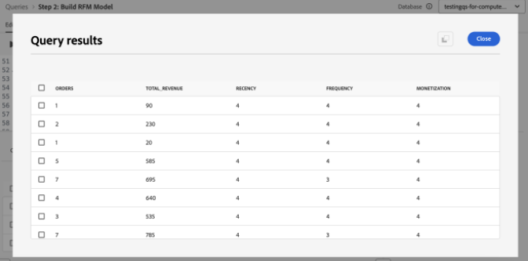
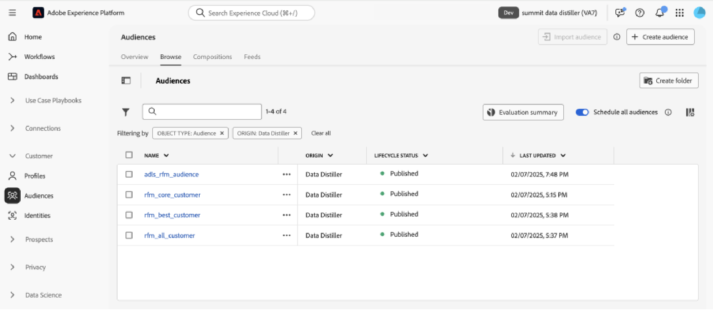

# Suggerimenti per massimizzare il valore con Adobe Experience Platform Data Distiller - OS656

Questa pagina contiene il set di dati di esempio per applicare ciò che hai imparato nella sessione Adobe Summit &quot;OS656 - Suggerimenti principali per massimizzare il valore con Adobe Experience Platform Data Distiller&quot;. Scoprirai come accelerare le implementazioni di Adobe Real-Time Customer Data Platform e Journey Optimizer arricchendo i dati dei profili cliente in tempo reale. Questo arricchimento sfrutta informazioni approfondite sui modelli di comportamento dei clienti per creare tipi di pubblico per la distribuzione e l’ottimizzazione delle esperienze.

Tramite il caso di studio Luma, analizzerai i dati comportamentali degli utenti e creerai un modello *Recency, Frequency, Monetary (RFM)*, una tecnica di analisi marketing per la segmentazione dei clienti basata sui modelli di acquisto.

## Prerequisito

Per eseguire questo caso d&#39;uso, l&#39;istanza di Adobe Experience Platform deve essere concessa in licenza per [Data Distiller](./overview.md). Per ulteriori informazioni, contatta il rappresentante Adobe.

## Panoramica del modello RFM {#rfm-overview}

RFM, abbreviazione di Recency (R), Frequency (F) e Monetary (M), è un approccio basato sui dati alla segmentazione e all&#39;analisi dei clienti. Questa metodologia valuta tre aspetti chiave del comportamento del cliente: quanto recentemente ha effettuato un acquisto, quanto spesso interagisce e quanto spende. Quantificando questi fattori, le aziende possono ottenere informazioni fruibili sui segmenti dei clienti e sviluppare strategie di marketing mirate che soddisfino meglio le esigenze dei singoli clienti.

## Comprendere il comportamento dei clienti con il modello RFM {#understand-customer-behavior}

Il modello RFM segmenta i clienti in base al comportamento transazionale utilizzando tre parametri chiave.

- **Recency** misura il tempo trascorso dall&#39;ultimo acquisto di un cliente, indicando i livelli di coinvolgimento e il potenziale di acquisto futuro.
- **Frequenza** tiene traccia di quanto spesso un cliente interagisce, fungendo da chiaro indicatore di fedeltà e coinvolgimento sostenuto.
- **Il valore monetario** valuta la spesa totale dei clienti, evidenziandone il valore complessivo per l&#39;azienda.

Combinando questi fattori, le aziende assegnano a ciascun cliente punteggi numerici (in genere su una scala da `1` a `4`). Punteggi più bassi indicano risultati più favorevoli. Ad esempio, un punteggio cliente `1` in tutte le categorie è considerato tra i migliori, a dimostrazione dell&#39;attività recente, dell&#39;elevato coinvolgimento e della spesa significativa.

## Vantaggi e limitazioni del modello RFM {#benefits-and-limitations}

Ogni tecnica di modellazione di marketing prevede compromessi, offrendo sia vantaggi che limitazioni. La modellazione RFM è uno strumento utile per comprendere il comportamento dei clienti e perfezionare le strategie di marketing. I vantaggi includono la segmentazione dei clienti per personalizzare la messaggistica, ottimizzare i ricavi e migliorare i tassi di risposta, la fidelizzazione, la soddisfazione e il valore del ciclo di vita del cliente (CLTV).

Tuttavia, la modellazione RFM presenta alcune limitazioni. Presuppone l’uniformità all’interno dei segmenti in base all’attualità, alla frequenza e al valore monetario, il che può semplificare eccessivamente il comportamento dei clienti. Il modello assegna inoltre lo stesso peso a questi fattori, rappresentando potenzialmente in modo errato il valore del cliente. Inoltre, non tiene conto del contesto, ad esempio caratteristiche specifiche del prodotto o preferenze del cliente, che possono portare a interpretazioni errate del comportamento d’acquisto.

## Creare un pubblico SQL dinamico basato su punteggio RFM {#build-a-dynamic-rfm-audience}

Prima di avviare il case study Luma, è necessario acquisire un set di dati di esempio. Innanzitutto, [seleziona il collegamento per scaricare il set di dati `luma_web_data.zip` localmente](../resources/luma_web_data.zip). Il set di dati di esempio è un file csv in formato .zip compresso per l’allineamento con il caso d’uso. Decomprimi questo file ZIP utilizzando Adobe Acrobat o uno strumento di estrazione file affidabile, come l’utility incorporata del sistema operativo. In pratica, in genere i dati vengono originati da Adobe Analytics, Adobe Commerce o Adobe Web/Mobile SDK.

In questa esercitazione utilizzerai Data Distiller per estrarre eventi e campi rilevanti in un formato CSV standardizzato. L’obiettivo è quello di includere solo i campi essenziali, mantenendo al contempo una struttura dati piatta per l’efficienza e la facilità d’uso.

### Passaggio 1: caricare i dati CSV in Experience Platform {#upload-csv-data}

Per caricare un file CSV in Adobe Experience Platform, segui la procedura riportata di seguito.

#### Creare un set di dati da un file CSV {#create-a-dataset}

Nell&#39;interfaccia utente di Experience Platform, seleziona **[!UICONTROL Set di dati]** nella barra di navigazione a sinistra, seguito da **[!UICONTROL Crea set di dati]**. Quindi seleziona **[!UICONTROL Crea set di dati dal file CSV]** tra le opzioni disponibili.

Viene visualizzato il pannello [!UICONTROL Configura set di dati]. Nel campo **[!UICONTROL Name]**, inserisci il nome del set di dati come &quot;luma_web_data&quot; e seleziona **[!UICONTROL Next]**.

Viene visualizzato il pannello [!UICONTROL Aggiungi dati]. Trascina e rilascia il file CSV nella casella **[!UICONTROL Aggiungi dati]** oppure seleziona **[!UICONTROL Scegli file]** per sfogliare e caricare il file.

Per ulteriori informazioni su questo processo, consulta l&#39;[esercitazione sull&#39;acquisizione batch](../../ingestion/tutorials/ingest-batch-data.md) e il [flusso di lavoro per la creazione di set di dati](../../catalog/datasets/user-guide.md#create) nella guida dell&#39;interfaccia utente del set di dati.

#### Rivedi e completa il caricamento {#review-and-complete-upload}

Una volta caricato il file, nella parte inferiore dell’interfaccia utente viene visualizzata un’anteprima dei dati. Seleziona **[!UICONTROL Fine]** per completare il caricamento.


Viene visualizzata la vista delle attività del set di dati &quot;luma_web_data&quot;. Caricamento manuale del file CSV
viene acquisito come batch e identificato da un [!UICONTROL ID batch]. Un pannello a destra visualizza il nome della tabella come `luma_web_data`.

>[!TIP]
>
>Durante la scrittura di query in Data Distiller, utilizza il nome della tabella anziché il nome del set di dati. Il nome del set di dati viene utilizzato solo per la navigazione nell’interfaccia utente.


<!--  
My table name is; luma_web_data_20250312_235611_817 Should we explain the suffix? 
-->

Al termine dell&#39;elaborazione dei dati, seleziona [!UICONTROL Anteprima set di dati] nell&#39;angolo in alto a destra per visualizzare l&#39;anteprima del set di dati. Ecco come viene visualizzata l’anteprima del set di dati:


#### Considerazioni sugli schemi {#schema-considerations}

Non è necessario uno schema XDM strutturato (ad esempio, record, evento o schemi B2B) perché i dati vengono importati come file CSV non elaborato. Il set di dati utilizza invece uno schema ad hoc.

>[!TIP]
>
>Gli schemi ad hoc sono schemi XDM con campi a cui viene assegnato un namespace e che possono essere utilizzati solo da un singolo set di dati. Gli schemi ad hoc vengono utilizzati in vari flussi di lavoro di acquisizione dati per Experience Platform e nella creazione di alcuni tipi di connessioni sorgente.

Sebbene Data Distiller supporti tutti i tipi di schema, il set di dati finale per l’acquisizione nel profilo cliente in tempo reale utilizzerà uno schema XDM di record.

### Passaggio 2: collegati al data lake ed esplora i set di dati disponibili {#connect-to-the-data-lake-and-explore-datasets}

Il passaggio successivo consiste nell’esplorare i dati nel data lake di Adobe Experience Platform per garantire precisione e integrità. I dati devono essere precisi e completi per generare informazioni significative, ma durante i trasferimenti di dati possono verificarsi errori, incoerenze o valori mancanti. Ciò rende essenziali la verifica e l’esplorazione dei dati.

>[!TIP]
>
>Il data lake archivia dati non elaborati, come registri di eventi, dati clickstream e record acquisiti in blocco, per l’analisi e l’elaborazione. L’archivio profili contiene dati identificabili dal cliente, inclusi eventi con unione di identità e informazioni sugli attributi, per supportare la personalizzazione e l’attivazione in tempo reale.

Utilizza Data Distiller per verificare la qualità e la completezza dei set di dati attraverso varie operazioni. Per verificare che i dati siano stati tradotti correttamente durante l&#39;acquisizione, eseguire `SELECT` query per esaminarli, convalidarli e analizzarli. Questo processo consente di identificare e risolvere eventuali discrepanze, incoerenze o informazioni mancanti.

#### Eseguire una query di esplorazione di base {#basic-exploration-queries}

Nell&#39;interfaccia utente di Adobe Experience Platform, seleziona **[!UICONTROL Query]** nella barra di navigazione a sinistra, quindi seleziona **[!UICONTROL Crea query]**. Viene visualizzato l&#39;editor delle query.

Incolla la seguente query nell’editor ed eseguila:

```sql
SELECT * FROM luma_web_data; 
```

I risultati della query vengono visualizzati sotto l&#39;Editor query nella scheda **[!UICONTROL Risultati]**. Per espandere i risultati in una nuova finestra di dialogo, selezionare **[!UICONTROL Visualizza risultati]**. I risultati sono simili a quelli dell’immagine seguente.


Per ulteriori informazioni, vedere la [guida generale per l&#39;esecuzione della query](../best-practices/writing-queries.md).

#### Concentrati sugli ordini ed escludi le transazioni annullate {#focus-orders-exclude-cancelled}

Il modello RFM valuta l&#39;attualità, la frequenza e il valore monetario in base agli acquisti completati. Gli eventi non transazionali, come le visualizzazioni di pagina e le interazioni di pagamento, sono esclusi dall’analisi. Inoltre, gli ordini annullati devono essere rimossi, in quanto non contribuiscono a calcoli RFM validi e richiedono un diverso approccio di elaborazione.

Per garantire la precisione:

- Identificare gli ID acquisto associati agli annullamenti e raggrupparli utilizzando `GROUP BY`.
- Escludi questi ID acquisto dal set di dati.
- Filtrare i dati per conservare solo gli ordini completati.

Le query seguenti mostrano come identificare ed escludere gli ordini annullati dal set di dati.

Questa prima query seleziona tutti gli ID acquisto non nulli associati a un annullamento e li aggrega utilizzando `GROUP BY`. Gli ID acquisto risultanti devono essere esclusi dal set di dati.

```sql
CREATE VIEW orders_cancelled
AS
  SELECT purchase_id
  FROM   luma_web_data
  WHERE  event_type IN ( 'order', 'cancellation' )
         AND purchase_id IS NOT NULL
  GROUP  BY purchase_id
  HAVING Count(DISTINCT event_type) = 2; 
```

La seconda query recupera solo gli ID acquisto che non si trovano in questo set escluso.

```sql
SELECT *
FROM   luma_web_data
WHERE  purchase_id NOT IN (SELECT purchase_id
                           FROM   orders_cancelled)
        OR purchase_id IS NULL; 
```

La terza query rimuove tutti gli eventi non relativi all’ordine dal set di dati.

```sql
SELECT *
FROM   luma_web_data
WHERE  event_type = 'order'
       AND purchase_id NOT IN (SELECT purchase_id
                               FROM   orders_cancelled); 
```

### Passaggio 3: arricchire i dati utilizzando le funzioni di Data Distiller {#enrich-the-data}

Quindi, utilizza Data Distiller per estrarre e trasformare i dati dei clienti, generare punteggi RFM, aggregare le transazioni e segmentare i clienti in base al comportamento di acquisto. Segui questi passaggi per calcolare i valori Recency, Frequency e Monetario (RFM), creare un modello di pubblico e preparare approfondimenti per l’attivazione.

#### Calcola il punteggio RFM per ogni ID utente univoco

Per calcolare i punteggi RFM, estrarre i campi chiave dai dati non elaborati utilizzando il filtro dei campi.

La query successiva si basa sulla logica della sezione precedente selezionando e-mail come `userid`, in quanto ogni ordine richiede un accesso e-mail. Data Distiller applica la funzione `TO_DATE` per convertire la marca temporale in un formato data. Il campo `total_revenue` rappresenta il prezzo di ogni transazione e viene successivamente aggregato sommando il valore per ogni `userid`.

```sql
SELECT email AS userid, 
       purchase_id AS purchaseid, 
       price_total AS total_revenue, -- reflects the price for each individual transaction
       TO_DATE(timestamp) AS purchase_date -- converts timestamp to date format
FROM luma_web_data 
WHERE event_type = 'order' 
      AND purchase_id NOT IN (SELECT purchase_id FROM orders_cancelled) 
      AND email IS NOT NULL;
```

I risultati sono simili all’immagine riportata di seguito.


Quindi, crea un `TABLE` per memorizzare i risultati della query precedente in un set di dati derivato. Copiare e incollare il comando seguente nell&#39;editor di query per creare un `TABLE`.

```sql
CREATE TABLE IF NOT EXISTS order_data AS
  SELECT email              AS userid,
         purchase_id        AS purchaseid,
         price_total        AS total_revenue,
         To_date(timestamp) AS purchase_date
  FROM   luma_web_data
  WHERE  event_type = 'order'
         AND purchase_id NOT IN (SELECT purchase_id FROM orders_cancelled)
         AND email IS NOT NULL; 
```

Il risultato è simile all’immagine seguente ma con un ID set di dati diverso.


Come best practice, esegui una semplice query di esplorazione per esaminare i dati nel set di dati. Utilizzare l&#39;istruzione seguente per visualizzare i dati.

```sql
SELECT * FROM order_data;
```


#### Aggregare le transazioni per generare i valori RFM {#aggregate-transactions}

Per calcolare i valori RFM, questa query aggrega le transazioni per ogni utente.

La funzione `DATEDIFF(CURRENT_DATE, MAX(purchase_date)) AS days_since_last_purchase` calcola il numero di giorni dall&#39;acquisto più recente per ogni utente.

Utilizza la seguente query SQL:

```sql
SELECT 
    userid, 
    DATEDIFF(CURRENT_DATE, MAX(purchase_date)) AS days_since_last_purchase, 
    COUNT(purchaseid) AS orders, 
    SUM(total_revenue) AS total_revenue 
FROM order_data 
GROUP BY userid;
```

I risultati sono simili all’immagine riportata di seguito.


Per migliorare l&#39;efficienza delle query e la riutilizzabilità, creare un `VIEW` per memorizzare i valori RFM aggregati.

```sql
CREATE VIEW rfm_values
AS
  SELECT userid,
         DATEDIFF(current_date, MAX(purchase_date)) AS days_since_last_purchase,
         COUNT(purchaseid)                          AS orders,
         SUM(total_revenue)                         AS total_revenue
  FROM   order_data
  GROUP BY userid; 
```

Il risultato è simile all&#39;immagine seguente ma con un ID diverso.


Come best practice, esegui una semplice query di esplorazione per esaminare i dati nella visualizzazione. Utilizza l’istruzione seguente.

```sql
SELECT * FROM rfm_values;
```

La schermata seguente mostra un esempio di risultato della query, con i valori RFM calcolati per ciascun utente. Il risultato corrisponde all&#39;ID visualizzazione della query `CREATE VIEW`.


#### Generare il cubo multidimensionale RFM {#generate-multi-dimensional-cube}

Per segmentare i clienti in base ai punteggi RFM, utilizzare un cubo multidimensionale RFM. La funzione di finestra `NTILE` ordina i valori in contenitori classificati e divide ogni dimensione in quattro gruppi uguali (quartili), consentendo una segmentazione strutturata.

- Recency: i clienti sono classificati in base a quanto recentemente hanno effettuato un acquisto (`days_since_last_purchase`). Gli acquirenti più recenti sono nel gruppo 1, mentre quelli che non hanno acquistato per più tempo sono nel gruppo 4.
- Frequenza: i clienti vengono classificati in base alla frequenza con cui effettuano acquisti (`ORDER BY orders DESC`). Gli acquirenti più frequenti sono nel gruppo 1, mentre i meno frequenti sono nel gruppo 4.
- Monetario: i clienti sono classificati in base alla spesa totale (`total_revenue`). Le spese più elevate si trovano nel gruppo 1, mentre quelle più basse nel gruppo 4.

Eseguire la seguente query SQL per generare il cubo multidimensionale RFM:

```sql
SELECT userid,
       days_since_last_purchase,
       orders,
       total_revenue,
       5 - NTILE(4)
             OVER (
               ORDER BY days_since_last_purchase DESC) AS recency,
       NTILE(4)
         OVER (
           ORDER BY orders DESC)                       AS frequency,
       NTILE(4)
         OVER (
           ORDER BY total_revenue DESC)                AS monetization
FROM rfm_values; 
```

I risultati sono simili alle immagini seguenti.




Quindi, utilizzare l&#39;istruzione seguente per creare `VIEW` per questi dati.

La creazione di un `VIEW` per il cubo multidimensionale RFM migliora l&#39;efficienza memorizzando i dati pre-segmentati, eliminando la necessità di ricalcolare i punteggi RFM nelle query future. Semplifica le istruzioni SQL, garantisce la coerenza dei dati e migliora la riutilizzabilità per ulteriori analisi.

```sql
CREATE OR replace VIEW rfm_scores
AS
  SELECT userid,
         days_since_last_purchase,
         orders,
         total_revenue,
         5 - NTILE(4)
               over (
                 ORDER BY days_since_last_purchase DESC) AS recency,
         NTILE(4)
           over (
             ORDER BY orders DESC)                       AS frequency,
         NTILE(4)
           over (
             ORDER BY total_revenue DESC)                AS monetization
  FROM   rfm_values;
```

Il risultato è simile all&#39;immagine seguente ma con un ID di visualizzazione diverso.


#### Modelli di segmenti RFM {#model-rfm-segments}

Con il calcolo dei punteggi RFM, i clienti possono essere suddivisi nei seguenti sei segmenti prioritari:

1. `Core`: migliori clienti con elevata recency, frequenza e valore monetario (recency = 1, frequenza = 1, monetario = 1).
1. `Loyal`: clienti frequenti coerenti ma senza spese principali (frequenza = 1).
1. `Whales`: spese più elevate, indipendentemente da recency e frequenza (monetario = 1).
1. `Promising`: spese frequenti ma inferiori (frequenza = 1, 2, 3; monetaria = 2, 3, 4).
1. `Rookies`: nuovi clienti con bassa frequenza (recency = 1, frequency = 4).
1. `Slipping`: clienti precedentemente fedeli con attività ridotta (recency = 2, 3, 4; frequenza = 4).

Per semplificare l&#39;accesso e il riutilizzo, creare un `VIEW` che memorizzi i segmenti, i punteggi e i valori RFM.

Le istruzioni `CASE` nelle istruzioni SQL seguenti classificano i clienti in segmenti in base ai punteggi RFM e assegnano i risultati alla variabile `RFM_Model`.

+++Selezionare per visualizzare SQL

```sql
CREATE OR replace VIEW rfm_model_segment
AS
  SELECT userid,
         days_since_last_purchase,
         orders,
         total_revenue,
         recency,
         frequency,
         monetization,
         CASE
           WHEN recency = 1
                AND frequency = 1
                AND monetization = 1 THEN '1. Core - Your Best Customers'
           WHEN recency IN( 1, 2, 3, 4 )
                AND frequency = 1
                AND monetization IN ( 1, 2, 3, 4 ) THEN
           '2. Loyal - Your Most Loyal Customers'
           WHEN recency IN( 1, 2, 3, 4 )
                AND frequency IN ( 1, 2, 3, 4 )
                AND monetization = 1 THEN
           '3. Whales - Your Highest Paying Customers'
           WHEN recency IN( 1, 2, 3, 4 )
                AND frequency IN ( 1, 2, 3 )
                AND monetization IN( 2, 3, 4 ) THEN
           '4. Promising - Faithful customers'
           WHEN recency = 1
                AND frequency = 4
                AND monetization IN ( 1, 2, 3, 4 ) THEN
           '5. Rookies - Your Newest Customers'
           WHEN recency IN ( 2, 3, 4 )
                AND frequency = 4
                AND monetization IN ( 1, 2, 3, 4 ) THEN
           '6. Slipping - Once Loyal, Now Gone'
         END RFM_Model
  FROM   rfm_scores; 
```

+++

`VIEW` generato segue la stessa struttura delle creazioni precedenti, ma con un ID diverso.

Come best practice, esegui una semplice query di esplorazione per esaminare i dati nella visualizzazione. Utilizza l’istruzione seguente.

<!-- Double check this SQL. I wrote it.- it was absent fom the KT doc. -->

```sql
SELECT * FROM rfm_model_segment;
```

<!-- Perhaps these VIEW results could be chopped? -->

Nelle schermate seguenti viene visualizzato un risultato di esempio della query `SELECT * FROM rfm_model_segment;` che mostra i dati del modello RFM segmentato. L&#39;output riflette la struttura di `VIEW` generato, inclusi i segmenti cliente assegnati in base ai punteggi RFM.


### Passaggio 4: utilizzare SQL per inserire in batch i dati RFM nel profilo cliente in tempo reale {#sql-batch-ingest-rfm-data}

Successivamente, acquisire in batch i dati dei clienti arricchiti da RFM in Real-Time Customer Profile. Per prima cosa, crea un set di dati abilitato per il profilo e inserisci i dati trasformati utilizzando SQL.

#### Creare un set di dati derivato per memorizzare gli attributi RFM {#create-a-derived-dataset}

Poiché questo set di dati verrà acquisito nell’archivio profili, richiede una chiave di partizione.

>[!TIP]
>
>Il campo di identità primaria funge da chiave di partizione, garantendo una distribuzione efficiente dei dati, il recupero e le prestazioni delle query. L’assegnazione di un’identità primaria con uno spazio dei nomi delle identità raggruppa i record di profilo correlati, ottimizzando le ricerche e gli aggiornamenti all’interno dell’archivio profili.

Creare un set di dati vuoto per memorizzare gli attributi RFM e assegnare un’identità primaria.

In questa istruzione SQL:

- `userId TEXT PRIMARY IDENTITY NAMESPACE 'Email'`: definisce la colonna userId come identità primaria utilizzando lo spazio dei nomi &quot;E-mail&quot;&#x200B;
- `days_since_last_purchase INTEGER`: memorizza il numero di giorni dall&#39;ultimo acquisto dell&#39;utente&#x200B;
- `orders INTEGER`: rappresenta il numero totale di ordini effettuati dall&#39;utente.&#x200B;
- `total_revenue DECIMAL(18, 2)`: acquisisce il ricavo totale generato dall&#39;utente con precisione fino a 18 cifre e due posizioni decimali&#x200B;
- `recency INTEGER, frequency INTEGER, monetization INTEGER`: memorizzare i rispettivi punteggi RFM per l&#39;utente&#x200B;
- `rfm_model TEXT`: mantiene la classificazione del segmento RFM assegnata all&#39;utente.&#x200B;
- `WITH (LABEL = 'PROFILE')`: contrassegna la tabella come abilitata per il profilo in Experience Platform, assicurandosi che i dati acquisiti contribuiscano alla creazione di profili cliente in tempo reale.&#x200B;

>[!NOTE]
>
>Lo spazio dei nomi &quot;E-mail&quot; è uno spazio dei nomi di identità [standard](../../identity-service/features/namespaces.md#standard) in Adobe Experience Platform. Quando definisci i campi di identità, accertati di specificare lo spazio dei nomi appropriato per facilitare una risoluzione accurata dell’identità. &#x200B;
>
>Per ulteriori informazioni sulla definizione dei campi di identità e sull&#39;utilizzo degli spazi dei nomi di identità, consulta la [documentazione di Identity Service](../../identity-service/home.md) o la guida su [definizione di un campo di identità nell&#39;interfaccia utente di Adobe Experience Platform](../../xdm/ui/fields/identity.md).

Poiché l&#39;editor delle query supporta l&#39;esecuzione sequenziale, è possibile includere le query di creazione tabella e di inserimento dati in una singola sessione. Nell&#39;istruzione SQL seguente viene innanzitutto creata una tabella abilitata per il profilo per memorizzare gli attributi RFM. Quindi inserisce i dati del cliente arricchiti da RFM da `rfm_model_segment` nella tabella `adls_rfm_profile`, strutturando ogni record nello spazio dei nomi specifico del tenant richiesto per l&#39;acquisizione del profilo cliente in tempo reale.

Poiché l&#39;editor delle query supporta l&#39;esecuzione sequenziale, è possibile eseguire le query di creazione tabella e di inserimento dati in una singola sessione. Nell&#39;istruzione SQL seguente viene innanzitutto creata una tabella abilitata per il profilo per memorizzare gli attributi RFM. Quindi inserisce i dati del cliente arricchiti da RFM da `rfm_model_segment` nella tabella `adls_rfm_profile`, assicurandosi che ogni record sia strutturato correttamente nello spazio dei nomi specifico del tenant (`_{TENANT_ID}`). Questo spazio dei nomi è essenziale per l’acquisizione del profilo cliente in tempo reale e per una risoluzione accurata delle identità.

>[!IMPORTANT]
>
>Sostituisci `_{TENANT_ID}` con lo spazio dei nomi tenant della tua organizzazione. Questo spazio dei nomi è univoco per la tua organizzazione e assicura che tutti i dati acquisiti siano correttamente assegnati in Adobe Experience Platform.

```sql
CREATE TABLE IF NOT EXISTS adls_rfm_profile (
    userId TEXT PRIMARY IDENTITY NAMESPACE 'Email', -- Primary identity field using the 'Email' namespace
    days_since_last_purchase INTEGER, -- Days since the last purchase
    orders INTEGER, -- Total number of orders
    total_revenue DECIMAL(18, 2), -- Total revenue with two decimal precision
    recency INTEGER, -- Recency score
    frequency INTEGER, -- Frequency score
    monetization INTEGER, -- Monetary score
    rfm_model TEXT -- RFM segment classification
) WITH (LABEL = 'PROFILE'); -- Enable the table for Real-Time Customer Profile

INSERT INTO adls_rfm_profile
SELECT STRUCT(userId, days_since_last_purchase, orders, total_revenue, recency,
              frequency, monetization, rfm_model) _{TENANT_ID}
FROM rfm_model_segment;
```

Il risultato di questa query assomiglia alle creazioni di set di dati precedenti in questo playbook, ma con un ID diverso.

Dopo aver creato il set di dati, passa a **[!UICONTROL Set di dati]** > **[!UICONTROL Sfoglia]** > `adls_rfm_profile` per verificare che il set di dati sia vuoto.


Puoi anche passare a **[!UICONTROL Schemi]** > **[!UICONTROL Sfoglia]** > `adls_rfm_profile` per visualizzare il diagramma schema XDM per profilo individuale del set di dati appena creato e i relativi gruppi di campi personalizzati.


#### Inserisci dati nel set di dati derivato appena creato {#insert-data-into-derived-dataset}

Inserire quindi i dati da `rfm_model_segment VIEW` in `adls_rfm_profile`, abilitato per Real-Time Customer Profile.

Verificare che l&#39;ordine dei campi nella query `SELECT` dell&#39;istruzione `INSERT` corrisponda esattamente alla struttura di `rfm_model_segment`. Questo allineamento garantisce che i valori di `rfm_model_segment` vengano inseriti correttamente nei campi corrispondenti della tabella di destinazione. Il disallineamento tra i campi di origine e di destinazione può causare incongruenze nei dati.

>[!NOTE]
>
>Questa query viene eseguita in modalità batch, che richiede la rotazione di un cluster per eseguire il processo. L&#39;operazione legge i dati dal data lake, li elabora all&#39;interno del cluster e riscrive i risultati nel data lake.

```sql
INSERT INTO adls_rfm_profile
SELECT Struct(userid, days_since_last_purchase, orders, total_revenue, recency,
              frequency, monetization, rfm_model) _{TENANT_ID}
FROM   rfm_model_segment; 
```

Una volta completata, l’output della query mostra &quot;Query completata&quot; nella console.

### Passaggio 5: pianificare la query per l&#39;elaborazione batch {#schedule-the-query}

Ora che il codice SQL genera un set di dati derivato e lo abilita per Real-Time Customer Profile, il passaggio successivo consiste nell’automatizzare gli aggiornamenti pianificando l’esecuzione della query a intervalli specifici. Grazie agli aggiornamenti automatici dei set di dati, non è più necessario eseguire le operazioni manualmente.

#### Pianificare l’esecuzione della query

Dopo aver salvato l&#39;istruzione SQL, passare alla scheda **[!UICONTROL Modelli]** per visualizzare la query salvata e avviare il processo di pianificazione. Esistono due modi per pianificare una query:

Seleziona **[!UICONTROL Aggiungi pianificazione]** nella barra laterale a destra.


In alternativa, seleziona la scheda **[!UICONTROL Schedules]** sotto il nome del modello, quindi seleziona **[!UICONTROL Aggiungi pianificazione]**.


Per ulteriori dettagli sulla pianificazione delle query, consulta la [documentazione sugli Schedules delle query](../ui/query-schedules.md).

Viene visualizzata la visualizzazione [!UICONTROL Dettagli pianificazione]. Da qui, inserisci i seguenti dettagli per configurare la pianificazione:

- **[!UICONTROL Frequenza di esecuzione]**: **Settimanale**
- **[!UICONTROL Giorno dell&#39;esecuzione]**: **Lunedì e martedì**
- **[!UICONTROL Ora di esecuzione pianificata]**: **10:10 ora UTC**
- **[!UICONTROL Periodo di pianificazione]**: **17 marzo - 30 aprile 2025**

Seleziona **[!UICONTROL Salva]** per confermare la pianificazione.


Dopo aver salvato la pianificazione, puoi passare alla scheda **[!UICONTROL Query pianificate]** in qualsiasi momento per monitorare i processi pianificati di Data Distiller. Per ulteriori dettagli sulla [visualizzazione dello stato di esecuzione della query, dei messaggi di errore e degli avvisi](../ui/monitor-queries.md), vedere il documento Monitorare le query pianificate.

Una volta configurata, la query SQL viene eseguita automaticamente agli intervalli definiti, garantendo che i dati rimangano aggiornati senza richiedere l&#39;intervento manuale.

### Passaggio 6: creare e attivare un pubblico basato su RFM

<!-- double check this intro paragraph ... -->

In questa esercitazione sono disponibili due metodi per creare e attivare un pubblico basato su RFM.

- Soluzione 1: creare e attivare un pubblico direttamente tramite query Data Distiller e SQL.
- Soluzione 2: definire e gestire un pubblico nell’interfaccia utente di Experience Platform utilizzando gli attributi RFM precalcolati, senza SQL.

Scegli l&#39;approccio più adatto al tuo flusso di lavoro.

#### Soluzione 1: pubblico SQL tramite Data Distiller {#data-distiller-sql-audience}

Utilizza il comando `CREATE AUDIENCE AS SELECT` per definire un nuovo pubblico. Il pubblico creato viene salvato in un set di dati e registrato nell&#39;area di lavoro **[!UICONTROL Tipi di pubblico]** in **[!UICONTROL Data Distiller]**.

I tipi di pubblico creati con l&#39;estensione SQL vengono registrati automaticamente nell&#39;origine [!UICONTROL Data Distiller] nell&#39;area di lavoro [!UICONTROL Tipi di pubblico]. Da [Audience Portal](../../segmentation/ui/audience-portal.md) puoi visualizzare, gestire e attivare i tipi di pubblico in base alle esigenze.




Per ulteriori dettagli sui tipi di pubblico SQL, consulta la [documentazione sui tipi di pubblico di Data Distiller](../data-distiller-audiences/overview.md). Per informazioni su come gestire i tipi di pubblico nell&#39;interfaccia utente, consulta la [panoramica del portale dei tipi di pubblico](../../segmentation/ui/audience-portal.md#audience-list).

#### Creazione di un pubblico {#create-an-audience}

Per creare un pubblico, utilizza i seguenti comandi SQL:

```sql
-- Define an audience for best customers based on RFM scores
CREATE AUDIENCE rfm_best_customer 
WITH (
    primary_identity = _{TENANT_ID}.userId, 
    identity_namespace = queryService
) AS ( 
    SELECT * FROM adls_rfm_profile 
    WHERE _{TENANT_ID}.recency = 1 
        AND _{TENANT_ID}.frequency = 1 
        AND _{TENANT_ID}.monetization = 1 
);

-- Define an audience that includes all customers
CREATE AUDIENCE rfm_all_customer 
WITH (
    primary_identity = _{TENANT_ID}.userId, 
    identity_namespace = queryService
) AS ( 
    SELECT * FROM adls_rfm_profile 
);

-- Define an audience for core customers based on email identity
CREATE AUDIENCE rfm_core_customer 
WITH (
    primary_identity = _{TENANT_ID}.userId, 
    identity_namespace = Email
) AS ( 
    SELECT * FROM adls_rfm_profile 
    WHERE _{TENANT_ID}.recency = 1 
        AND _{TENANT_ID}.frequency = 1 
        AND _{TENANT_ID}.monetization = 1 
);
```

#### Inserire un pubblico {#insert-an-audience}

Per aggiungere profili a un pubblico esistente, utilizzare il comando `INSERT INTO`. Questo consente di aggiungere profili singoli o interi tipi di pubblico a un set di dati pubblico esistente.

```sql
-- Insert profiles into the audience dataset
INSERT INTO AUDIENCE adls_rfm_audience 
SELECT 
    _{TENANT_ID}.userId, 
    _{TENANT_ID}.days_since_last_purchase, 
    _{TENANT_ID}.orders, 
    _{TENANT_ID}.total_revenue, 
    _{TENANT_ID}.recency, 
    _{TENANT_ID}.frequency, 
    _{TENANT_ID}.monetization 
FROM adls_rfm_profile 
WHERE _{TENANT_ID}.rfm_model = '6. Slipping - Once Loyal, Now Gone';
```

#### Aggiungere profili a un pubblico {#add-profiles-to-audience}

Utilizza i seguenti comandi SQL per creare e popolare un pubblico:

```sql
-- Create an empty audience dataset
CREATE AUDIENCE adls_rfm_audience 
WITH (
    primary_identity = userId, 
    identity_namespace = Email
) AS 
SELECT 
    CAST(NULL AS STRING) userId, 
    CAST(NULL AS INTEGER) days_since_last_purchase, 
    CAST(NULL AS INTEGER) orders, 
    CAST(NULL AS DECIMAL(18,2)) total_revenue, 
    CAST(NULL AS INTEGER) recency, 
    CAST(NULL AS INTEGER) frequency, 
    CAST(NULL AS INTEGER) monetization, 
    CAST(NULL AS STRING) rfm_model 
WHERE FALSE;
```

#### Eliminare un pubblico {#delete-an-audience}

Per eliminare un pubblico esistente, utilizzare il comando `DROP AUDIENCE`. Se il pubblico non esiste, si verifica un&#39;eccezione a meno che non sia specificato `IF EXISTS`.

Utilizza il seguente comando SQL per eliminare un pubblico:

```sql
DROP AUDIENCE IF EXISTS adls_rfm_audience;
```

#### Soluzione 2: creare un pubblico con attributi RFM {#create-audience-with-rfm-attributes}

Utilizza gli attributi RFM per segmentare gli utenti in base al loro comportamento e alle loro caratteristiche. Questa sezione ti guida attraverso l’interfaccia utente di Adobe Experience Platform per definire un pubblico utilizzando i punteggi RFM.

Per verificare che i dati siano stati caricati nel profilo cliente in tempo reale, passa a **[!UICONTROL Clienti] > [!UICONTROL Profili] > [!UICONTROL Sfoglia]**. Seleziona **[!UICONTROL Spazio dei nomi identità]** come `Email` e immetti `user0076@example.com`. Controllare i dettagli del profilo per verificare che contenga gli attributi RFM previsti.


Per sfogliare i tipi di pubblico esistenti, seleziona **[!UICONTROL Tipi di pubblico]** nel pannello di navigazione a sinistra e accertati che la scheda **[!UICONTROL Sfoglia]** sia selezionata. Viene visualizzato l’elenco dei tipi di pubblico disponibili nella sandbox. Quando si seleziona un pubblico, vengono visualizzate la descrizione, le regole di qualificazione e il numero di profili inclusi.

Per creare un nuovo pubblico, seleziona **[!UICONTROL Crea pubblico]** in alto a destra. Viene visualizzata una finestra di dialogo con due opzioni. Seleziona **[!UICONTROL Genera regola]** seguito da **[!UICONTROL Crea]**.


L’interfaccia utente di Composizione del pubblico consente di accedere agli attributi del profilo. Passa a **[!UICONTROL Attributi] > [!UICONTROL Profilo individuale XDM]** per visualizzare gli attributi disponibili.

Per ulteriori dettagli sull&#39;utilizzo di Audience Composition, consulta la [guida dell&#39;interfaccia utente di Audience Composition](../../segmentation/ui/audience-composition.md). Per ulteriori dettagli sull&#39;utilizzo di Segment Builder, consulta la [guida dell&#39;interfaccia utente di Segment Builder](../../segmentation/ui/segment-builder.md).


Gli attributi personalizzati creati in Data Distiller vengono memorizzati nella cartella che corrisponde al nome dello spazio dei nomi del tenant, visualizzato accanto al nome della sandbox. Questi attributi possono essere utilizzati per definire i criteri di segmentazione del pubblico.


Per creare un pubblico utilizzando gli attributi RFM, trascina e rilascia l&#39;attributo `Rfm_Model` nel Compositore pubblico. Questi attributi possono essere utilizzati per Edge, Streaming e Batch Audiences.


Per finalizzare il pubblico, seleziona **[!UICONTROL Salva e pubblica]** nell&#39;angolo in alto a destra. Dopo il salvataggio, il pubblico appena creato viene visualizzato nell&#39;area di lavoro [!UICONTROL Tipi di pubblico], in cui puoi esaminarne il riepilogo e i criteri di qualificazione.

Utilizza Segment Builder (Generatore segmenti) per accedere agli attributi RFM derivati e progettare tipi di pubblico aggiuntivi. Attiva il pubblico SQL appena creato in base ai punteggi RFM e invialo a qualsiasi destinazione preferita, incluso Adobe Journey Optimizer.
