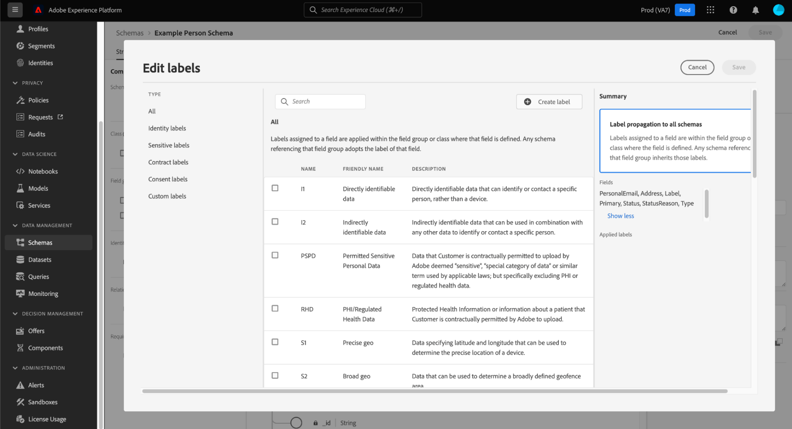

# Supporto del controllo degli accessi basato su attributi per schemi ad hoc

Tutti i dati introdotti in Adobe Experience Platform sono incapsulati da schemi Experience Data Model (XDM) e possono essere soggetti a restrizioni di utilizzo definite dall’organizzazione o da normative legali.

Se non viene specificato alcuno schema, viene generato automaticamente uno schema ad hoc eseguendo una query CTAS tramite Query Service. Spesso è necessario limitare l’utilizzo di determinati campi o set di dati di schemi ad hoc per controllare l’accesso sia ai dati personali sensibili che alle informazioni personali. Adobe Experience Platform facilita questo controllo di accesso consentendoti di etichettare i campi dello schema tramite l’interfaccia utente di Platform utilizzando la funzionalità di controllo di accesso basato su attributi.

Le etichette possono essere applicate in qualsiasi momento, offrendo flessibilità nella scelta di come gestire i dati. Tuttavia, è consigliabile etichettare i dati non appena vengono acquisiti in Platform o non appena i dati diventano disponibili per l’utilizzo in Platform.

L’etichettatura basata su schema è un componente importante del controllo dell’accesso basato su attributi per gestire meglio l’accesso concesso a utenti o gruppi di utenti. Adobe Experience Platform consente di limitare l’accesso a qualsiasi campo di uno schema ad hoc tramite la creazione e l’applicazione di etichette.

Questo documento fornisce un tutorial per gestire l’accesso ai dati sensibili applicando etichette ai campi di dati di schemi ad hoc generati tramite Query Service.

## Introduzione

Questa guida richiede una buona conoscenza dei seguenti componenti di Adobe Experience Platform:

* [Sistema Experience Data Model (XDM)](https://experienceleague.adobe.com/docs/experience-platform/xdm/home.html?lang=it): framework standardizzato tramite il quale Experience Platform organizza i dati sull’esperienza del cliente.
   * [[!DNL Schema Editor]](https://experienceleague.adobe.com/docs/experience-platform/xdm/ui/overview.html?lang=it): scopri come creare e gestire schemi e altre risorse nell’interfaccia utente di Platform.
* [[!DNL Data Governance]](../../data-governance/home.md): scopri come [!DNL Data Governance] consente di gestire i dati dei clienti e garantire la conformità a normative, restrizioni e criteri applicabili all’utilizzo dei dati.
* [Controllo degli accessi basato su attributi](../../access-control/abac/overview.md): il controllo degli accessi basato sugli attributi è una funzionalità di Adobe Experience Platform che consente agli amministratori di controllare l’accesso a oggetti e/o funzionalità specifici in base agli attributi. Gli attributi possono essere metadati aggiunti a un oggetto, ad esempio un’etichetta aggiunta a un campo schema ad hoc o normale. Un amministratore definisce i criteri di accesso che includono attributi per gestire le autorizzazioni di accesso degli utenti.

## Creare uno schema ad hoc

Una volta eseguita la query e generati i risultati, viene generato automaticamente uno schema ad hoc che viene aggiunto all’inventario degli schemi.

Per aggiungere un’etichetta di dati, passa a [!UICONTROL Schemi] scheda Sfoglia dashboard selezionando [!UICONTROL Schemi] nella barra a sinistra dell’interfaccia utente di Platform. Viene visualizzato l’inventario degli schemi.

>[!NOTE]
>
>Gli schemi ad hoc non vengono visualizzati per impostazione predefinita nell’inventario degli schemi.

## Scopri gli schemi ad hoc nell’inventario degli schemi dell’interfaccia utente di Platform {#discover-ad-hoc-schemas}

Per abilitare la visualizzazione degli schemi ad hoc nell’interfaccia utente di Platform, seleziona l’icona del filtro () a sinistra del campo di ricerca, quindi selezionare **[!UICONTROL Mostra schemi ad hoc] nella barra a sinistra visualizzata.

Seleziona il nome dello schema ad hoc creato di recente dall’elenco disponibile. Viene visualizzata una visualizzazione della struttura dello schema ad hoc.

## Modificare le etichette di governance

Per modificare le etichette dati per lo schema ad hoc, seleziona la [!UICONTROL Etichette] scheda. L’area di lavoro etichette consente di applicare, creare e modificare le etichette nei campi dello schema ad hoc e di controllare le autorizzazioni di accesso tramite l’interfaccia utente. Tutti i campi all’interno dello schema ad hoc sono rappresentati qui.

## Modifica le etichette per lo schema o il campo

Per modificare le etichette per l’intero schema, seleziona l’icona a forma di matita () a lato del nome dello schema sotto il [!UICONTROL Etichette] scheda.

Per applicare un&#39;etichetta a un campo esistente, selezionare uno o più campi dall&#39;elenco seguito da [!UICONTROL Modifica etichette di governance] nella barra laterale a destra.

## Popover Modifica etichette

Il [!UICONTROL Modifica etichette] viene visualizzato popover. Da questa vista puoi creare o modificare le etichette di governance esistenti tramite l’interfaccia utente.

Consulta la documentazione per istruzioni su come [crea o modifica etichette per lo schema o il campo selezionato](https://experienceleague.adobe.com/docs/experience-platform/xdm/tutorials/labels.html#edit-the-labels-for-the-schema-or-field).

>[!NOTE]
>
>La creazione di una nuova etichetta o la modifica di un’etichetta esistente richiede le autorizzazioni di amministratore per la tua organizzazione. Se non disponi dei privilegi di amministratore, contatta l’amministratore di sistema per organizzare l’accesso.

Le etichette possono essere create anche utilizzando l’area di lavoro delle autorizzazioni. Consulta la [guida alla creazione di etichette nell’area di lavoro autorizzazioni](../../access-control/abac/ui/labels.md) per istruzioni.

Una volta applicato il livello appropriato di controllo degli accessi basato su attributi, il seguente comportamento di sistema si applica a qualsiasi query eseguita tramite Query Service quando un utente tenta di accedere a dati non accessibili:

1. Se a un utente viene negato l’accesso a uno dei campi all’interno di uno schema, non potrà leggere o scrivere nel campo con restrizioni. Questo vale per i seguenti scenari comuni:

   * Quando un utente tenta di eseguire una query con una sola colonna con restrizioni, il sistema restituisce un errore per informare che la colonna non esiste.
   * Quando un utente tenta di eseguire una query con più colonne che includono una colonna con restrizioni, il sistema restituisce l’output solo per tutte le colonne senza restrizioni.

1. Se un utente richiede l’accesso a un campo calcolato, deve avere accesso a tutti i campi utilizzati nella composizione, altrimenti il sistema negherà l’accesso al campo calcolato.

Se un’identità o un’identità primaria è impostata su uno schema ad hoc, il sistema rispetta automaticamente tutte le richieste di igiene dei dati associate e pulisce i dati in tali set di dati associati alla colonna di identità.

## Passaggi successivi

Dopo aver letto questo documento hai una migliore comprensione di come aggiungere etichette di utilizzo dei dati a schemi ad hoc creati tramite query CTAS di Query Service. Se non lo hai già fatto, i seguenti documenti sono utili per comprendere meglio la governance dei dati in Query Service:

* [Identità di schemi ad hoc](./ad-hoc-schema-identities.md)
* [Governance dei dati](https://experienceleague.adobe.com/docs/experience-platform/data-governance/home.html?lang=it)
