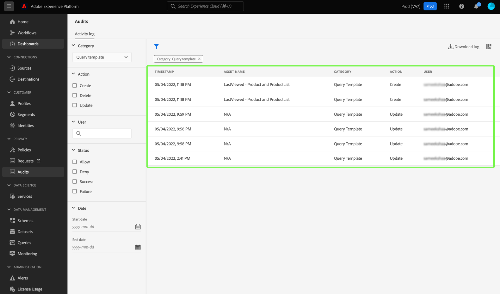

# [!DNL Query Service] integrazione del registro di controllo

Adobe Experience Platform [!DNL Query Service] l’integrazione del registro di audit fornisce record delle azioni utente correlate alle query. I registri di audit sono uno strumento essenziale per la risoluzione dei problemi e il rispetto delle politiche aziendali di gestione dei dati e dei requisiti normativi. La funzionalità ti consente di restituire un registro delle azioni per molti tipi di eventi, nonché di filtrare ed esportare i record. I registri sono accessibili tramite l’interfaccia utente di Platform o [API di query di controllo](https://www.adobe.io/experience-platform-apis/references/audit-query/) e scaricato in formato CSV o JSON.

Per ulteriori informazioni sull’interfaccia utente dei registri di audit, consulta [documento di panoramica dei registri di audit](../../landing/governance-privacy-security/audit-logs/overview.md). Per ulteriori informazioni sull’esecuzione di chiamate alle API di Platform, consulta [guida API per registri di audit](../../landing/api-guide.md).

## Prerequisiti

È necessario disporre di [!DNL Data Governance] [!UICONTROL Visualizza registro attività utente] autorizzazione abilitata per visualizzare il dashboard dei registri di controllo nell’interfaccia utente di Platform. L’autorizzazione è abilitata tramite l’Adobe [Admin Console](https://adminconsole.adobe.com/). Se non disponi dei privilegi di amministratore per abilitare questa autorizzazione, contatta l’amministratore della tua organizzazione. Consulta la documentazione sul controllo degli accessi per [istruzioni complete sull’aggiunta di autorizzazioni tramite Admin Console](../../access-control/home.md).

## [!DNL Query Service] categorie del registro di controllo {#audit-log-categories}

Le categorie dei registri di audit fornite da [!DNL Query Service] sono i seguenti.

| Categoria | Descrizione |
|---|---|
| [!UICONTROL Query] | Questa categoria consente di controllare le esecuzioni delle query. |
| [!UICONTROL Modello di query] | Questa categoria consente di controllare le varie azioni (creazione, aggiornamento ed eliminazione) eseguite su un modello di query. |
| [!UICONTROL Query pianificata] | Questa categoria consente di controllare le pianificazioni create, aggiornate o eliminate in [!DNL Query Service]. |

## Eseguire una [!DNL Query Service] registro di controllo {#perform-an-audit-log}

Per eseguire un controllo di audit [!DNL Query Service] attività, seleziona **[!UICONTROL Audit]** dal menu di navigazione a sinistra, seguito dall’icona funnel () per visualizzare un elenco di controlli filtro che consentono di limitare i risultati.

Dalla sezione [!UICONTROL Audit] dashboard [!UICONTROL Registro attività] , è possibile filtrare tutte le azioni di Platform registrate in base a una delle [!DNL Query Service] categorie. I risultati del registro possono essere ulteriormente filtrati in base al periodo di tempo in cui sono stati eseguiti, all’azione/funzione intrapresa o all’utente che ha eseguito la query. Consulta la documentazione del registro di controllo per [istruzioni complete su come filtrare i registri in base a categoria, azione, utente e stato](../../landing/governance-privacy-security/audit-logs/overview.md#managing-audit-logs-in-the-ui).

I dati del registro di controllo restituiti contengono le seguenti informazioni su tutte le query che soddisfano i criteri di filtro selezionati.

| Nome colonna | Descrizione |
|---|---|
| [!UICONTROL Marca temporale] | Data e ora esatte dell’azione eseguita in un `month/day/year hour:minute AM/PM` formato. |
| [!UICONTROL Nome risorsa] | Il valore per [!UICONTROL Nome risorsa] dipende dalla categoria scelta come filtro. Quando si utilizza [!UICONTROL Query pianificata] categoria: **nome pianificazione**. Quando si utilizza [!UICONTROL Modello di query] categoria, questa è la **nome modello**. Quando si utilizza [!UICONTROL Query] categoria, questa è la **session ID** |
| [!UICONTROL Categoria] | Questo campo corrisponde alla categoria selezionata dall’utente nel menu a discesa del filtro. |
| [!UICONTROL Azione] | Può essere creata, eliminata, aggiornata o eseguita. Le azioni disponibili dipendono dalla categoria scelta come filtro. |
| [!UICONTROL Utente] | Questo campo fornisce l’ID utente che ha eseguito la query. |

>[!NOTE]
>
>Vengono forniti più dettagli sulle query scaricando i risultati del registro in formato CSV o JSON di quanti ne vengano visualizzati per impostazione predefinita nel dashboard del registro di controllo.

## Pannello Dettagli

Seleziona una riga di risultati del registro di controllo per aprire un pannello dei dettagli a destra dello schermo.

Il pannello dei dettagli può essere utilizzato per trovare [!UICONTROL ID risorsa] e [!UICONTROL Stato evento].

Il valore della proprietà [!UICONTROL ID risorsa] varia a seconda della categoria utilizzata nel controllo di audit.

* Quando si utilizza [!UICONTROL Query] categoria, la [!UICONTROL ID risorsa] è il  **session ID**.
* Quando si utilizza [!UICONTROL Modello di query] categoria, la [!UICONTROL ID risorsa] è il **ID modello** e con prefisso `[!UICONTROL templateID:]`.
* Quando si utilizza [!UICONTROL Query pianificata] categoria, la [!UICONTROL ID risorsa] è il  **ID pianificazione** e con prefisso `[!UICONTROL scheduleID:]`.

Il valore della proprietà [!UICONTROL Stato evento] varia a seconda della categoria utilizzata nel controllo di audit.

* Quando si utilizza [!UICONTROL Query] categoria, la [!UICONTROL Stato evento] fornisce un elenco di tutti **ID query** eseguita dall&#39;utente all&#39;interno della sessione.
* Quando si utilizza [!UICONTROL Modello di query] categoria, la [!UICONTROL Stato evento] fornisce il **nome modello** come prefisso per lo stato dell’evento.
* Quando si utilizza [!UICONTROL Pianificazione query] categoria, la [!UICONTROL Stato evento] fornisce il **nome pianificazione** come prefisso per lo stato dell’evento.

## Filtri disponibili per [!DNL Query Service] categorie del registro di controllo {#available-filters}

I filtri disponibili variano a seconda della categoria selezionata nel menu a discesa. La tabella seguente descrive i filtri disponibili per [[!DNL Query Service] categorie del registro di controllo](#audit-log-categories).

| Filtro | Descrizione |
|---|---|
| Categoria | Consulta la [[!DNL Query Service] categorie del registro di controllo](#audit-log-categories) per un elenco completo delle categorie disponibili. |
| Azione | Quando si fa riferimento [!DNL Query Service] categorie di controllo, l&#39;aggiornamento è un **modifica al modulo esistente**, elimina è il **rimozione della pianificazione o del modello**, creare è **creazione di una nuova pianificazione o modello**, ed esegui è **esecuzione di una query**. |
| Utente | Immetti l’ID utente completo (ad esempio, johndoe@acme.com) da filtrare per utente. |
| Stato | Il [!UICONTROL Consenti], [!UICONTROL Completato], e [!UICONTROL Errore] Le opzioni filtrano i registri in base allo &quot;Stato&quot; o allo &quot;Stato evento&quot;, mentre il [!UICONTROL Rifiuta] l&#39;opzione escluderà **tutto** log. |
| Data | Seleziona una data di inizio e/o una data di fine per definire un intervallo di date in base al quale filtrare i risultati. |

## Passaggi successivi

La lettura di questo documento consente di comprendere meglio [!DNL Query Service] funzionalità del registro di controllo e come utilizzarlo per filtrare [!DNL Query Service] azioni utente.

Se utilizzi il [!DNL Query Service] per la risoluzione dei problemi, si consiglia di leggere il [guida alla risoluzione dei problemi](../troubleshooting-guide.md).
