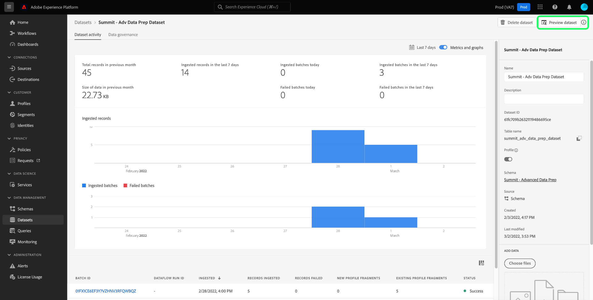

# Domande frequenti

Questo documento fornisce le risposte alle domande più frequenti su Query Service e fornisce un elenco dei codici di errore più comuni durante l’utilizzo di Query Service. Per domande e risoluzione dei problemi relativi ad altri servizi in Adobe Experience Platform, consulta la [guida alla risoluzione dei problemi di Experience Platform](../landing/troubleshooting.md).

Il seguente elenco di risposte alle domande frequenti è suddiviso nelle seguenti categorie:

- [Generale](#general)
- [Esportazione dei dati](#exporting-data)
- [Strumenti di terze parti](#third-party-tools)
- [Errori API PostgreSQL](#postgresql-api-errors)
- [Errori REST API](#rest-api-errors)

## Domande generali su Query Service {#general}

Questa sezione include informazioni su prestazioni, limiti e processi.

### È possibile disattivare la funzione di completamento automatico nell’editor di Query Service?

+++Risposta
No. La disattivazione della funzione di completamento automatico non è attualmente supportata dall’editor.
+++

### Perché l&#39;editor di query a volte diventa lento quando si digita una query?

+++Risposta
Una possibile causa è la funzione di completamento automatico. La funzione elabora alcuni comandi di metadati che possono occasionalmente rallentare l’editor durante la modifica delle query.
+++

### Posso usare [!DNL Postman] per l&#39;API Query Service?

+++Risposta
Sì, è possibile visualizzare e interagire con tutti i servizi API Adobe utilizzando [!DNL Postman] (un&#39;applicazione gratuita di terze parti). Consultare la [[!DNL Postman] guida all&#39;installazione](https://video.tv.adobe.com/v/28832) per istruzioni dettagliate sulla configurazione di un progetto in Adobe Developer Console e l&#39;acquisizione di tutte le credenziali necessarie per l&#39;utilizzo con [!DNL Postman]. Consulta la documentazione ufficiale per [istruzioni su come avviare, eseguire e condividere [!DNL Postman] le raccolte](https://learning.postman.com/docs/running-collections/intro-to-collection-runs/).
+++

### Esiste un limite al numero massimo di righe restituite da una query tramite l’interfaccia utente?

+++Risposta
Sì, Query Service applica internamente un limite di 50.000 righe, a meno che non venga specificato esternamente un limite esplicito. Per ulteriori dettagli, consulta le linee guida sull&#39;[esecuzione di query interattive](./best-practices/writing-queries.md#interactive-query-execution).
+++

### È possibile utilizzare le query per aggiornare le righe?

+++Risposta
Nelle query batch, l’aggiornamento di una riga all’interno del set di dati non è supportato.
+++

### Esiste un limite di dimensione dei dati per l’output risultante da una query?

+++Risposta
No. Non vi è alcun limite alla dimensione dei dati, ma esiste un limite di timeout della query di 10 minuti da una sessione interattiva. Se la query viene eseguita come CTAS batch, non è applicabile un timeout di 10 minuti. Per ulteriori dettagli, consulta le linee guida sull&#39;[esecuzione di query interattive](./best-practices/writing-queries.md#interactive-query-execution).
+++

### Come si aggira il limite del numero di righe di output da una query SELECT?

+++Risposta
Per ignorare il limite di righe di output, applica &quot;LIMIT 0&quot; nella query. Ad esempio:

```sql
SELECT * FROM customers LIMIT 0;
```

+++

### Come posso evitare che le query scadano in 10 minuti?

+++Risposta
In caso di timeout delle query, si consiglia una o più delle seguenti soluzioni.

- [Convertire la query in una query CTAS](./sql/syntax.md#create-table-as-select) e pianificare l&#39;esecuzione. È possibile pianificare un&#39;esecuzione [tramite l&#39;interfaccia utente](./ui/user-guide.md#scheduled-queries) o l&#39;[API](./api/scheduled-queries.md#create).
- Eseguire la query su un blocco di dati più piccolo applicando ulteriori [condizioni filtro](https://spark.apache.org/docs/latest/api/sql/index.html#filter).
- [Eseguire il comando EXPLAIN](./sql/syntax.md#explain) per raccogliere ulteriori dettagli.
- Esamina le statistiche dei dati all’interno del set di dati.
- Converti la query in una forma semplificata ed esegui nuovamente utilizzando [istruzioni preparate](./sql/prepared-statements.md).
+++

### Se vengono eseguite più query contemporaneamente, si verificano problemi o un impatto sulle prestazioni di Query Service?

+++Risposta
No. Query Service dispone di una funzionalità di scalabilità automatica che garantisce che le query simultanee non abbiano alcun impatto rilevante sulle prestazioni del servizio.
+++

### È possibile utilizzare parole chiave riservate come nome di colonna?

+++Risposta
Alcune parole chiave riservate non possono essere utilizzate come nome di colonna, ad esempio `ORDER`, `GROUP BY`, `WHERE`, `DISTINCT`. Se desideri utilizzare queste parole chiave, devi eseguire l’escape di queste colonne.
+++

### Come si trova un nome di colonna da un set di dati gerarchico?

+++Risposta
I passaggi seguenti descrivono come visualizzare una vista a tabella di un set di dati tramite l’interfaccia utente, inclusi tutti i campi e le colonne nidificati in un modulo appiattito.

- Dopo aver effettuato l&#39;accesso a Experience Platform, seleziona **[!UICONTROL Set di dati]** nell&#39;area di navigazione a sinistra dell&#39;interfaccia utente per passare a [!UICONTROL Set di dati] dashboard.
- Si apre la scheda [!UICONTROL Sfoglia] dei set di dati. Puoi utilizzare la barra di ricerca per perfezionare le opzioni disponibili. Seleziona un set di dati dall’elenco visualizzato.


- Viene visualizzata la schermata [!UICONTROL Attività set di dati]. Seleziona **[!UICONTROL Anteprima set di dati]** per aprire una finestra di dialogo dello schema XDM e una visualizzazione a tabella dei dati appiattiti dal set di dati selezionato. Ulteriori dettagli sono disponibili nella [anteprima della documentazione di un set di dati](../catalog/datasets/user-guide.md#preview-a-dataset)



- Seleziona un campo dello schema per visualizzarne il contenuto in una colonna appiattita. Il nome della colonna viene visualizzato sopra il suo contenuto sul lato destro della pagina. È necessario copiare questo nome da utilizzare per eseguire query su questo set di dati.


Consulta la documentazione per informazioni complete su [come utilizzare strutture di dati nidificate](./key-concepts/nested-data-structures.md) utilizzando Query Editor o un client di terze parti.
+++

### Come velocizzare una query su un set di dati contenente array?

+++Risposta
Per migliorare le prestazioni delle query sui set di dati contenenti array, è necessario [esplodere l&#39;array](https://spark.apache.org/docs/latest/api/sql/index.html#explode) come [query CTAS](./sql/syntax.md#create-table-as-select) in fase di esecuzione, quindi esplorarlo ulteriormente per individuare le opportunità per migliorarne il tempo di elaborazione.
+++

### Perché la query CTAS viene ancora elaborata dopo molte ore solo per un numero limitato di righe?

+++Risposta
Se la query ha richiesto molto tempo su un set di dati molto piccolo, contatta l’assistenza clienti.

Un’interrogazione può essere bloccata durante l’elaborazione per diversi motivi. Per determinare la causa esatta è necessaria un’analisi approfondita caso per caso. [Contatta l&#39;Assistenza clienti di Adobe](#customer-support) per informazioni su questa procedura.
+++

### Come posso contattare l’assistenza clienti Adobe? {#customer-support}

+++Risposta
[Nella pagina della guida di Adobe è disponibile un elenco completo dei numeri di telefono dell&#39;assistenza clienti](https://helpx.adobe.com/ca/contact/phone.html) di Adobe. In alternativa, è possibile trovare la guida online completando i passaggi seguenti:

- Passa a [https://www.adobe.com/](https://www.adobe.com/it/) nel browser Web.
- Sul lato destro della barra di navigazione superiore, seleziona **[!UICONTROL Accedi]**.


- Utilizza l’Adobe ID e la password registrati con la tua licenza di Adobe.
- Seleziona **[!UICONTROL Guida e supporto]** dalla barra di navigazione superiore.


Verrà visualizzato un banner a discesa contenente una sezione [!UICONTROL Guida e supporto tecnico]. Seleziona **[!UICONTROL Contattaci]** per aprire l&#39;Assistente virtuale dell&#39;Assistenza clienti Adobe oppure seleziona **[!UICONTROL Supporto Enterprise]** per assistenza dedicata alle organizzazioni di grandi dimensioni.
+++

### Come si implementa una serie sequenziale di job senza eseguire i job successivi se il job precedente non viene completato correttamente?

+++Risposta
La funzione di blocco anonimo consente di concatenare una o più istruzioni SQL eseguite in sequenza. Consentono inoltre di gestire le eccezioni.

Per ulteriori dettagli, consulta la [documentazione sui blocchi anonimi](./key-concepts/anonymous-block.md).
+++

### Come si implementa l’attribuzione personalizzata in Query Service?

+++Risposta
Esistono due modi per implementare l’attribuzione personalizzata:

1. Utilizza una combinazione di [funzioni definite dall&#39;Adobe](./sql/adobe-defined-functions.md) esistenti per identificare se le esigenze del caso d&#39;uso sono soddisfatte.
1. Se il suggerimento precedente non soddisfa il tuo caso d&#39;uso, devi utilizzare una combinazione di [funzioni finestra](./sql/adobe-defined-functions.md#window-functions). Le funzioni di finestra esaminano tutti gli eventi in una sequenza. Consentono inoltre di rivedere i dati storici e possono essere utilizzati in qualsiasi combinazione.
+++

### Posso modellare le mie query in modo da poterle riutilizzare facilmente?

+++Risposta
Sì, è possibile modellare le query tramite l’utilizzo di istruzioni preparate. Le istruzioni preparate possono ottimizzare le prestazioni ed evitare di rianalizzare ripetutamente una query. Per ulteriori dettagli, consulta la [documentazione delle istruzioni preparate](./sql/prepared-statements.md).
+++

### Come si recuperano i registri di errore per una query? {#error-logs}

+++Risposta
Per recuperare i registri degli errori per una query specifica, devi prima utilizzare l’API Query Service per recuperare i dettagli del registro delle query. La risposta HTTP contiene gli ID query necessari per individuare un errore di query.

Utilizzare il comando GET per recuperare più query. Le informazioni su come effettuare una chiamata all&#39;API sono disponibili nella [documentazione di esempio sulle chiamate API](./api/queries.md#sample-api-calls).

Dalla risposta, identifica la query da esaminare e invia un&#39;altra richiesta GET utilizzando il relativo valore `id`. Le istruzioni complete sono disponibili nella [documentazione relativa al recupero di una query in base all&#39;ID](./api/queries.md#retrieve-a-query-by-id).

In caso di esito positivo, la risposta restituisce lo stato HTTP 200 e contiene l’array `errors`. La risposta è stata ridotta per brevità.

```json
{
    "isInsertInto": false,
    "request": {
                "dbName": "prod:all",
                "sql": "SELECT *\nFROM\n  accounts\nLIMIT 10\n"
            },
    "clientId": "8c2455819a624534bb665c43c3759877",
    "state": "SUCCESS",
    "rowCount": 0,
    "errors": [{
      'code': '58000', 
      'message': 'Batch query execution gets : [failed reason ErrorCode: 58000 Batch query execution gets : [Analysis error encountered. Reason: [sessionId: f055dc73-1fbd-4c9c-8645-efa609da0a7b Function [varchar] not defined.]]]', 
      'errorType': 'USER_ERROR'
      }],
    "isCTAS": false,
    "version": 1,
    "id": "343388b0-e0dd-4227-a75b-7fc945ef408a",
}
```

La [documentazione di riferimento API di Query Service](https://www.adobe.io/experience-platform-apis/references/query-service/) fornisce ulteriori informazioni su tutti gli endpoint disponibili.
+++

### Cosa significa &quot;Errore durante la convalida dello schema&quot;?

+++Risposta
Il messaggio &quot;Errore durante la convalida dello schema&quot; indica che il sistema non è in grado di individuare un campo all’interno dello schema. È necessario leggere il documento sulle best practice per [organizzare le risorse dati in Query Service](./best-practices/organize-data-assets.md) seguito dalla [documentazione Crea tabella come selezione](./sql/syntax.md#create-table-as-select).

L&#39;esempio seguente illustra l&#39;utilizzo di una sintassi CTAS e di un tipo di dati struct:

```sql
CREATE TABLE table_name WITH (SCHEMA='schema_name')

AS SELECT '1' as _id,

 STRUCT

  ('2021-02-17T15:39:29.0Z' AS taskActualCompletionDate,

    '2020-09-09T21:21:16.0Z' AS taskActualStartDate,

    'Consulting' AS taskdescription,

    '5f6527c10011e09b89666c52d9a8c564' AS taskguide,

    'Stakeholder Consulting Engagement' AS taskname, 

    '2020-09-09T15:00:00.0Z' AS taskPlannedStartDate,

    '2021-02-15T11:00:00.0Z' AS taskPlannedCompletionDate

  ) AS _workfront ;
```

+++

### Come posso elaborare rapidamente i nuovi dati che entrano nel sistema ogni giorno?

+++Risposta
La clausola [`SNAPSHOT`](./sql/syntax.md#snapshot-clause) può essere utilizzata per leggere in modo incrementale i dati su una tabella basata su un ID snapshot. Ideale per l&#39;utilizzo con il modello di progettazione [carico incrementale](./key-concepts/incremental-load.md) che elabora solo le informazioni nel set di dati creato o modificato dopo l&#39;ultima esecuzione del caricamento. Di conseguenza, aumenta l’efficienza di elaborazione e può essere utilizzato sia con l’elaborazione dei dati in streaming che in batch.
+++

### Perché esiste una differenza tra i numeri visualizzati nell’interfaccia utente del profilo e i numeri calcolati dal set di dati di esportazione del profilo?

+++Risposta
I numeri visualizzati nel quadro comandi del profilo sono accurati all&#39;ultima istantanea. I numeri generati nella tabella di esportazione del profilo dipendono interamente dalla query di esportazione. Di conseguenza, l’esecuzione di query sul numero di profili idonei per un determinato pubblico è una causa comune di questa discrepanza.

>[!NOTE]
>
>La query include dati storici, mentre l’interfaccia utente visualizza solo i dati di profilo correnti.

+++

### Perché la query ha restituito un sottoinsieme vuoto e cosa devo fare?

+++Risposta
La causa più probabile è che la query ha un ambito troppo limitato. Rimuovere sistematicamente una sezione della clausola `WHERE` finché non si iniziano a visualizzare alcuni dati.

Puoi anche verificare che il set di dati contenga dati utilizzando una piccola query come:

```sql
SELECT count(1) FROM myTableName
```

+++

### Posso campionare i miei dati?

+++Risposta
Questa funzione è attualmente in corso di lavorazione. I dettagli saranno disponibili nelle [note sulla versione](../release-notes/latest/latest.md) e nelle finestre di dialogo dell&#39;interfaccia utente di Platform quando la funzione sarà pronta per il rilascio.
+++

### Quali funzioni di assistenza sono supportate da Query Service?

+++Risposta
Query Service fornisce diverse funzioni di supporto SQL integrate per estendere le funzionalità SQL. Vedere il documento per un elenco completo delle [funzioni SQL supportate da Query Service](./sql/spark-sql-functions.md).
+++

### Tutte le funzioni native di [!DNL Spark SQL] sono supportate o gli utenti sono limitati solo alle funzioni wrapper [!DNL Spark SQL] fornite da Adobe?

+++Risposta
Non tutte le funzioni [!DNL Spark SQL] open-source sono state ancora testate sui dati del data lake. Una volta testate e confermate, verranno aggiunte all’elenco delle supportate. Fai riferimento all&#39;[elenco di [!DNL Spark SQL] funzioni](./sql/spark-sql-functions.md) supportate per verificare la presenza di una funzione specifica.
+++

### Gli utenti possono definire le proprie funzioni definite dall&#39;utente (FDU) che possono essere utilizzate in altre query?

+++Risposta
A causa di considerazioni sulla sicurezza dei dati, la definizione personalizzata di FDU non è consentita.
+++

### Cosa devo fare se la query pianificata non riesce?

+++Risposta
Per prima cosa, controlla i registri per scoprire i dettagli dell’errore. La sezione Domande frequenti su [individuazione di errori nei registri](#error-logs) fornisce ulteriori informazioni su come eseguire questa operazione.

Consultare la documentazione per informazioni su come eseguire [query pianificate nell&#39;interfaccia utente](./ui/user-guide.md#scheduled-queries) e tramite [l&#39;API](./api/scheduled-queries.md).

Quando si utilizza [!DNL Query Editor] è possibile aggiungere solo una pianificazione a una query già creata e salvata. Questo non si applica all&#39;API [!DNL Query Service].
+++

### Cosa significa l’errore &quot;Limite di sessione raggiunto&quot;?

+++Risposta
&quot;Limite di sessione raggiunto&quot; significa che è stato raggiunto il numero massimo di sessioni di Query Service consentite per la tua organizzazione. Stabilisci una connessione con l’amministratore Adobe Experience Platform della tua organizzazione.
+++

### In che modo il registro delle query gestisce le query relative a un set di dati eliminato?

+++Risposta
Query Service non elimina mai la cronologia delle query. Ciò significa che eventuali query che fanno riferimento a un set di dati eliminato restituirebbero come risultato &quot;Nessun set di dati valido&quot;.
+++

### Come posso ottenere solo i metadati per una query?

+++Risposta
Puoi eseguire una query che restituisce zero righe per ottenere solo i metadati in risposta. Questa query di esempio restituisce solo i metadati per la tabella specificata.

```sql
SELECT * FROM <table> WHERE 1=0
```

+++

### Come è possibile eseguire rapidamente l&#39;iterazione su una query CTAS (Create Table As Select) senza materializzarla?

+++Risposta
È possibile creare tabelle temporanee per eseguire rapidamente l&#39;iterazione e la sperimentazione di una query prima di materializzarla per l&#39;utilizzo. È inoltre possibile utilizzare tabelle temporanee per verificare se una query funziona.

Ad esempio, puoi creare una tabella temporanea:

```sql
CREATE temp TABLE temp_dataset AS
SELECT *
FROM actual_dataset
WHERE 1 = 0;
```

È quindi possibile utilizzare la tabella temporanea nel modo seguente:

```sql
INSERT INTO temp_dataset
SELECT a._company AS _company,
a._id AS _id,
a.timestamp AS timestamp
FROM actual_dataset a
WHERE timestamp >= TO_TIMESTAMP('2021-01-21 12:00:00')
AND timestamp < TO_TIMESTAMP('2021-01-21 13:00:00')
LIMIT 100;
```

+++

### Come si modifica il fuso orario in e da un timestamp UTC?

+++Risposta
Adobe Experience Platform mantiene i dati in formato timestamp UTC (Coordinated Universal Time). Un esempio del formato UTC è `2021-12-22T19:52:05Z`

Query Service supporta funzioni SQL incorporate per convertire un determinato timestamp in e dal formato UTC. Entrambi i metodi `to_utc_timestamp()` e `from_utc_timestamp()` richiedono due parametri: timestamp e timezone.

| Parametro | Descrizione |
|-----------|---------------|
| Timestamp | Il timestamp può essere scritto in formato UTC o in formato `{year-month-day}` semplice. Se non viene specificata un&#39;ora, il valore predefinito è la mezzanotte del mattino del giorno specificato. |
| Fuso orario | Il fuso orario è scritto in un formato `{continent/city})`. Deve corrispondere a uno dei codici di fuso orario riconosciuti presenti nel [database TZ di dominio pubblico](https://data.iana.org/time-zones/tz-link.html#tzdb). |

#### Converti in timestamp UTC

Il metodo `to_utc_timestamp()` interpreta i parametri specificati e li converte **nel timestamp del fuso orario locale** in formato UTC. Ad esempio, il fuso orario a Seul, Corea del Sud, è UTC/GMT +9 ore. Specificando un timestamp di sola data, il metodo utilizza il valore predefinito mezzanotte del mattino. La marca temporale e il fuso orario vengono convertiti in formato UTC dall’ora dell’area geografica a una marca temporale UTC dell’area locale.

```SQL
SELECT to_utc_timestamp('2021-08-31', 'Asia/Seoul');
```

La query restituisce un timestamp nell’ora locale dell’utente. In questo caso sono le 15 del giorno prima, mentre Seoul è avanti di nove ore.

```
2021-08-30 15:00:00
```

Come altro esempio, se la marca temporale specificata era `2021-07-14 12:40:00.0` per il fuso orario `Asia/Seoul`, la marca temporale UTC restituita sarebbe `2021-07-14 03:40:00.0`

L’output della console fornito nell’interfaccia utente di Query Service è un formato più leggibile:

```
8/30/2021, 3:00 PM
```

#### Converti dal timestamp UTC

Il metodo `from_utc_timestamp()` interpreta i parametri specificati **dalla marca temporale del fuso orario locale** e fornisce la marca temporale equivalente dell&#39;area desiderata in formato UTC. Nell’esempio seguente, l’ora è le 14:40 nel fuso orario locale dell’utente. Il fuso orario di Seoul superato come variabile è di nove ore davanti al fuso orario locale.

```SQL
SELECT from_utc_timestamp('2021-08-31 14:40:00.0', 'Asia/Seoul');
```

La query restituisce una marca temporale in formato UTC per il fuso orario passato come parametro. Il risultato è nove ore prima del fuso orario in cui è stata eseguita la query.

```
8/31/2021, 11:40 PM
```

### Come posso filtrare i dati delle serie temporali?

+++Risposta
Quando esegui una query con dati di serie temporali, utilizza il filtro timestamp quando possibile per un’analisi più accurata.

>[!NOTE]
>
> La stringa di data **deve** essere nel formato `yyyy-mm-ddTHH24:MM:SS`.

Di seguito è riportato un esempio di utilizzo del filtro timestamp:

```sql
SELECT a._company  AS _company,
       a._id       AS _id,
       a.timestamp AS timestamp
FROM   dataset a
WHERE  timestamp >= To_timestamp('2021-01-21 12:00:00')
       AND timestamp < To_timestamp('2021-01-21 13:00:00')
```

+++

### Come posso utilizzare correttamente l&#39;operatore `CAST` per convertire i miei timestamp nelle query SQL?

+++Risposta
Quando si utilizza l&#39;operatore `CAST` per convertire una marca temporale, è necessario includere sia la data **che l&#39;ora**.

Ad esempio, la mancanza del componente tempo, come mostrato di seguito, genera un errore:

```sql
SELECT * FROM ABC
WHERE timestamp = CAST('07-29-2021' AS timestamp)
```

L&#39;utilizzo corretto dell&#39;operatore `CAST` è mostrato di seguito:

```sql
SELECT * FROM ABC
WHERE timestamp = CAST('07-29-2021 00:00:00' AS timestamp)
```

+++

### È necessario utilizzare caratteri jolly, ad esempio *, per ottenere tutte le righe dai set di dati?

+++Risposta
Non è possibile utilizzare i caratteri jolly per ottenere tutti i dati dalle righe, in quanto Query Service deve essere trattato come **columnar-store** anziché come sistema di archiviazione tradizionale basato su righe.
+++

### Devo utilizzare `NOT IN` nella query SQL?

+++Risposta
L&#39;operatore `NOT IN` viene spesso utilizzato per recuperare le righe non trovate in un&#39;altra tabella o istruzione SQL. Questo operatore può rallentare le prestazioni e restituire risultati imprevisti se le colonne confrontate accettano `NOT NULL` o se si dispone di un numero elevato di record.

Anziché utilizzare `NOT IN`, è possibile utilizzare `NOT EXISTS` o `LEFT OUTER JOIN`.

Ad esempio, se sono state create le seguenti tabelle:

```sql
CREATE TABLE T1 (ID INT)
CREATE TABLE T2 (ID INT)
INSERT INTO T1 VALUES (1)
INSERT INTO T1 VALUES (2)
INSERT INTO T1 VALUES (3)
INSERT INTO T2 VALUES (1)
INSERT INTO T2 VALUES (2)
```

Se si utilizza l&#39;operatore `NOT EXISTS`, è possibile eseguire la replica utilizzando l&#39;operatore `NOT IN` utilizzando la query seguente:

```sql
SELECT ID FROM T1
WHERE NOT EXISTS
(SELECT ID FROM T2 WHERE T1.ID = T2.ID)
```

In alternativa, se si utilizza l&#39;operatore `LEFT OUTER JOIN`, è possibile eseguire la replica utilizzando l&#39;operatore `NOT IN` utilizzando la query seguente:

```sql
SELECT T1.ID FROM T1
LEFT OUTER JOIN T2 ON T1.ID = T2.ID
WHERE T2.ID IS NULL
```

+++

### È possibile creare un set di dati utilizzando una query CTAS con un doppio nome di sottolineatura come quelli visualizzati nell’interfaccia utente? Esempio: `test_table_001`.

+++Risposta
No, si tratta di una limitazione intenzionale per tutto l’Experience Platform che si applica a tutti i servizi Adobe, incluso Query Service. Un nome con due trattini bassi è accettabile come nome di schema e set di dati, ma il nome della tabella per il set di dati può contenere solo un singolo trattino basso.
+++

### Quante query simultanee è possibile eseguire alla volta?

+++Risposta
Non esiste alcun limite di concorrenza per le query, poiché le query batch vengono eseguite come processi back-end. Tuttavia, è stato impostato un limite di timeout per le query di 24 ore.
+++

### Esiste un dashboard attività in cui è possibile visualizzare le attività e lo stato delle query?

+++Risposta
Sono disponibili funzionalità di monitoraggio e di avviso per verificare le attività e gli stati delle query. Per ulteriori informazioni, vedere i documenti [Integrazione del registro di controllo di Query Service](./data-governance/audit-log-guide.md) e [registri di query](./ui/overview.md#log).
+++

### Esiste un modo per eseguire il rollback degli aggiornamenti? Ad esempio, in caso di errore o se alcuni calcoli devono essere riconfigurati durante la scrittura di dati in Platform, come deve essere gestito lo scenario?

+++Risposta
Attualmente, non sono supportati rollback o aggiornamenti in questo modo.
+++

### Come si ottimizzano le query in Adobe Experience Platform?

+++Risposta
Il sistema non dispone di indici in quanto non è un database ma dispone di altre ottimizzazioni associate all’archivio dati. Per ottimizzare le query sono disponibili le seguenti opzioni:

- Un filtro basato sul tempo per i dati della serie temporale.
- Push-down ottimizzato per il tipo di dati struct.
- Ottimizzazione del push-down dei costi e della memoria per array e tipi di dati delle mappe.
- Elaborazione incrementale mediante snapshot.
- Un formato di dati persistente.
+++

### Gli accessi possono essere limitati ad alcuni aspetti di Query Service o si tratta di una soluzione &quot;tutto o niente&quot;?

+++Risposta
Query Service è una soluzione &quot;tutto o niente&quot;. Impossibile fornire l&#39;accesso parziale.
+++

### È possibile limitare i dati utilizzabili da Query Service o accedere semplicemente all’intero data lake di Adobe Experience Platform?

+++Risposta
Sì, è possibile limitare la query ai set di dati con accesso in sola lettura.
+++

### Quali altre opzioni sono disponibili per limitare i dati a cui può accedere Query Service?

+++Risposta
Esistono tre approcci per limitare l’accesso. Essi sono i seguenti:

- Utilizza le istruzioni SELECT only e concedi ai set di dati l’accesso in sola lettura. Inoltre, assegna l’autorizzazione per gestire le query.
- Utilizza le istruzioni SELECT/INSERT/CREATE e concedi l’accesso in scrittura ai set di dati. Inoltre, assegna l’autorizzazione di gestione della query.
- Utilizza un account di integrazione con i suggerimenti precedenti e assegna l’autorizzazione per l’integrazione della query.

+++

### Una volta che i dati sono stati restituiti da Query Service, vengono eseguiti alcuni controlli da parte di Platform per verificare che non siano stati restituiti dati protetti?

- Query Service supporta il controllo degli accessi basato su attributi. Puoi limitare l’accesso ai dati a livello di colonna/foglia e/o di struttura. Per ulteriori informazioni sul controllo degli accessi basato su attributi, consulta la documentazione.

### È possibile specificare una modalità SSL per la connessione a un client di terze parti? È possibile, ad esempio, utilizzare &quot;verify-full&quot; con Power BI?

+++Risposta
Sì, sono supportate le modalità SSL. Consulta la [documentazione sulle modalità SSL](./clients/ssl-modes.md) per informazioni dettagliate sulle diverse modalità SSL disponibili e sul livello di protezione fornito.
+++

### Usiamo TLS 1.2 per tutte le connessioni dai client Power BI al servizio di query?

+++Risposta
Sì. I dati in transito sono sempre conformi a HTTPS. La versione attualmente supportata è TLS1.2.
+++

### Una connessione effettuata sulla porta 80 utilizza ancora https?

+++Risposta
Sì, una connessione effettuata sulla porta 80 utilizza ancora SSL. È inoltre possibile utilizzare la porta 5432.
+++

### Posso controllare l’accesso a set di dati e colonne specifici per una particolare connessione? Come si configura?

+++Risposta
Sì, il controllo degli accessi basato su attributi viene applicato se configurato. Per ulteriori informazioni, vedere la [panoramica sul controllo degli accessi basato su attributi](../access-control/abac/overview.md).
+++

### Query Service supporta il comando &quot;INSERT OVERWRITE INTO&quot;?

+++Risposta
No, Query Service non supporta il comando &quot;INSERT OVERWRITE INTO&quot;.
+++

### Con quale frequenza vengono aggiornati i dati di utilizzo nel dashboard utilizzo licenze per le ore di calcolo di Data Distiller?

+++Risposta
La dashboard utilizzo licenze per le ore computer di Data Distiller viene aggiornata quattro volte al giorno, ogni sei ore.
+++

### È possibile utilizzare il comando CREATE VIEW senza accedere a Data Distiller?

+++Risposta
Sì, è possibile utilizzare il comando `CREATE VIEW` senza accedere a Data Distiller. Questo comando fornisce una vista logica dei dati ma non li riscrive nel data lake.
+++

### È possibile utilizzare blocchi anonimi in DbVisualizer?

+++Risposta
Sì. Tuttavia, alcuni client di terze parti, come DbVisualizer, potrebbero richiedere un identificatore separato prima e dopo un blocco SQL per indicare che una parte di uno script deve essere gestita come una singola istruzione. Ulteriori dettagli sono disponibili nella [documentazione sui blocchi anonimi](./key-concepts/anonymous-block.md) o nella [documentazione ufficiale di DbVisualizer](https://confluence.dbvis.com/display/UG120/Executing+Complex+Statements#ExecutingComplexStatements-UsinganSQLDialect).
+++

## Esportazione dei dati {#exporting-data}

Questa sezione fornisce informazioni sull’esportazione di dati e sui limiti.

### Esiste un modo per estrarre i dati da Query Service dopo l’elaborazione delle query e salvare i risultati in un file CSV? {#export-csv}

+++Risposta
Sì. I dati possono essere estratti da Query Service ed è inoltre possibile memorizzare i risultati in formato CSV tramite un comando SQL.

Esistono due modi per salvare i risultati di una query quando si utilizza un client PSQL. È possibile utilizzare il comando `COPY TO` o creare un&#39;istruzione utilizzando il seguente formato:

```sql
SELECT column1, column2 
FROM <table_name>  
\g <table_name>.out
```

[Per istruzioni sull&#39;utilizzo del comando `COPY TO`](./sql/syntax.md#copy), vedere la documentazione di riferimento della sintassi SQL.
+++

### Posso estrarre il contenuto del set di dati finale che è stato acquisito tramite query CTAS (supponendo che si tratti di quantità di dati più grandi, come Terabyte)?

+++Risposta
No. Al momento non è disponibile alcuna funzione per l’estrazione dei dati acquisiti.
+++

### Perché il connettore dati di Analytics non restituisce dati?

+++Risposta
Una causa comune di questo problema è l’esecuzione di query su dati di serie temporali senza un filtro temporale. Ad esempio:

```sql
SELECT * FROM prod_table LIMIT 1;
```

Deve essere scritto come:

```sql
SELECT * FROM prod_table
WHERE
timestamp >= to_timestamp('2022-07-22')
and timestamp < to_timestamp('2022-07-23');
```

+++

## Strumenti di terze parti {#third-party-tools}

Questa sezione include informazioni sull’utilizzo di strumenti di terze parti come PSQL e Power BI.

### È possibile collegare Query Service a uno strumento di terze parti?

+++Risposta
Sì, è possibile collegare più client desktop di terze parti a Query Service. Consulta la documentazione per [informazioni complete sui client disponibili e su come connetterli a Query Service](./clients/overview.md).
+++

### Esiste un modo per connettere Query Service una volta per un utilizzo continuo con uno strumento di terze parti?

+++Risposta
Sì, i client desktop di terze parti possono essere collegati a Query Service tramite l’impostazione una tantum di credenziali senza scadenza. Le credenziali senza scadenza possono essere generate da un utente autorizzato e ricevute in un file JSON che viene scaricato automaticamente nel computer locale. Le [istruzioni complete su come creare e scaricare credenziali senza scadenza](./ui/credentials.md#non-expiring-credentials) sono disponibili nella documentazione.
+++

### Perché le mie credenziali senza scadenza non funzionano?

+++Risposta
Il valore per le credenziali senza scadenza sono gli argomenti concatenati di `technicalAccountID` e `credential` ricavati dal file JSON di configurazione. Il valore della password assume la forma: `{{technicalAccountId}:{credential}}`.
Per ulteriori informazioni su come [connettersi ai client esterni con le credenziali](./ui/credentials.md#using-credentials-to-connect-to-external-clients), vedere la documentazione.
+++

### Che tipo di editor SQL di terze parti è possibile connettere a Query Service Editor?

+++Risposta
Qualsiasi editor SQL di terze parti compatibile con PSQL o client [!DNL Postgres] può essere connesso all&#39;editor di Query Service. Per un elenco delle istruzioni disponibili, vedere la documentazione relativa alla connessione di [client a Query Service](./clients/overview.md).
+++

### È possibile collegare lo strumento Power BI a Query Service?

+++Risposta
Sì, è possibile collegare Power BI a Query Service. Consulta la documentazione per [istruzioni sulla connessione dell&#39;app desktop Power BI a Query Service](./clients/power-bi.md).
+++

### Perché il caricamento delle dashboard richiede molto tempo quando si è connessi a Query Service?

+++Risposta
Quando il sistema è connesso a Query Service, è connesso a un motore di elaborazione interattivo o batch. Questo può comportare tempi di caricamento più lunghi per riflettere i dati elaborati.

Se desideri migliorare i tempi di risposta per i dashboard, devi implementare un server di Business Intelligence (BI) come livello di caching tra gli strumenti Query Service e BI. In genere, la maggior parte degli strumenti di business intelligence dispone di un&#39;offerta aggiuntiva per un server.

Lo scopo dell’aggiunta del livello del server di cache è quello di memorizzare in cache i dati da Query Service e utilizzarli ugualmente per i dashboard per velocizzare la risposta. Ciò è possibile in quanto i risultati per le query eseguite verrebbero memorizzati nella cache del server di business intelligence ogni giorno. Il server di caching fornisce quindi questi risultati a tutti gli utenti con la stessa query per ridurre la latenza. Per ulteriori informazioni su questa configurazione, consulta la documentazione dell’utility o dello strumento di terze parti in uso.
+++

### È possibile accedere a Query Service utilizzando lo strumento di connessione pgAdmin?

+++Risposta
No, connettività pgAdmin non supportata. Nella documentazione sono disponibili un [elenco dei client di terze parti disponibili e istruzioni su come connetterli a Query Service](./clients/overview.md).
+++

## Errori API PostgreSQL {#postgresql-api-errors}

Nella tabella seguente sono riportati i codici di errore PSQL e le possibili cause.

| Codice errore | Stato della connessione | Descrizione | Possibile causa |
|------------|---------------------------|-------------|----------------|
| **08P01** | N/D | Tipo di messaggio non supportato | Tipo di messaggio non supportato |
| **28P01** | Avvio - Autenticazione | Password non valida | Token di autenticazione non valido |
| **28000** | Avvio - Autenticazione | Tipo di autorizzazione non valido | Tipo di autorizzazione non valido. Deve essere `AuthenticationCleartextPassword`. |
| **42P12** | Avvio - Autenticazione | Nessuna tabella trovata | Nessuna tabella trovata per l&#39;utilizzo |
| **42601** | Query | Errore di sintassi | Errore di comando o sintassi non valida |
| **42P01** | Query | Tabella non trovata | Impossibile trovare la tabella specificata nella query |
| **42P07** | Query | Tabella esistente | Esiste già una tabella con lo stesso nome (CREATE TABLE) |
| **53400** | Query | Il limite supera il valore massimo | L&#39;utente ha specificato una clausola LIMIT superiore a 100.000 |
| **53400** | Query | Timeout rendiconto | Il rendiconto live inviato ha richiesto più di 10 minuti |
| **58000** | Query | Errore di sistema | Guasto del sistema interno |
| **0A000** | Query/Comando | Non supportato | La funzionalità nella query o nel comando non è supportata |
| **42501** | DROP TABLE Query | Eliminazione della tabella non creata da Query Service | La tabella che viene eliminata non è stata creata da Query Service utilizzando l&#39;istruzione `CREATE TABLE` |
| **42501** | DROP TABLE Query | Tabella non creata dall&#39;utente autenticato | La tabella in fase di eliminazione non è stata creata dall&#39;utente attualmente connesso |
| **42P01** | DROP TABLE Query | Tabella non trovata | Impossibile trovare la tabella specificata nella query |
| **42P12** | DROP TABLE Query | Nessuna tabella trovata per `dbName`: controllare `dbName` | Nessuna tabella trovata nel database corrente |

### Perché è stato ricevuto un codice di errore 58000 quando si utilizza il metodo history_meta() nella tabella?

+++Risposta
Il metodo `history_meta()` viene utilizzato per accedere a uno snapshot da un set di dati. In precedenza, se si eseguiva una query su un set di dati vuoto in Azure Data Lake Storage (ADLS), veniva visualizzato un codice di errore 58000 che indicava che il set di dati non esiste. Di seguito è riportato un esempio del precedente errore di sistema.

```shell
ErrorCode: 58000 Internal System Error [Invalid table your_table_name. historyMeta can be used on datalake tables only.]
```

Questo errore si è verificato perché non è stato restituito alcun valore per la query. Questo comportamento è stato corretto per restituire il seguente messaggio:

```text
Query complete in {timeframe}. 0 rows returned. 
```

+++

## Errori REST API {#rest-api-errors}

Nella tabella seguente sono riportati i codici di errore HTTP e le possibili cause.

| Codice di stato HTTP | Descrizione | Possibili cause |
|------------------|-----------------------|----------------------------|
| 400 | Richiesta non valida | Query non valida o non valida |
| 401 | Autenticazione non riuscita | Token di autenticazione non valido |
| 500 | Errore interno del server | Guasto del sistema interno |
