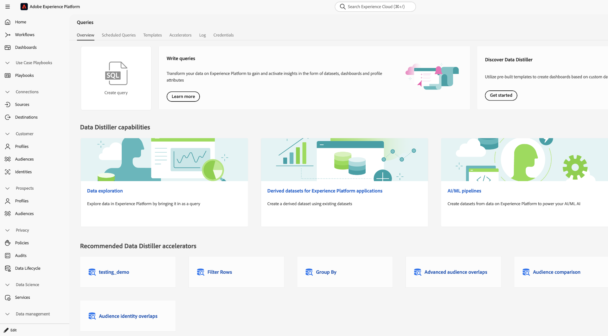
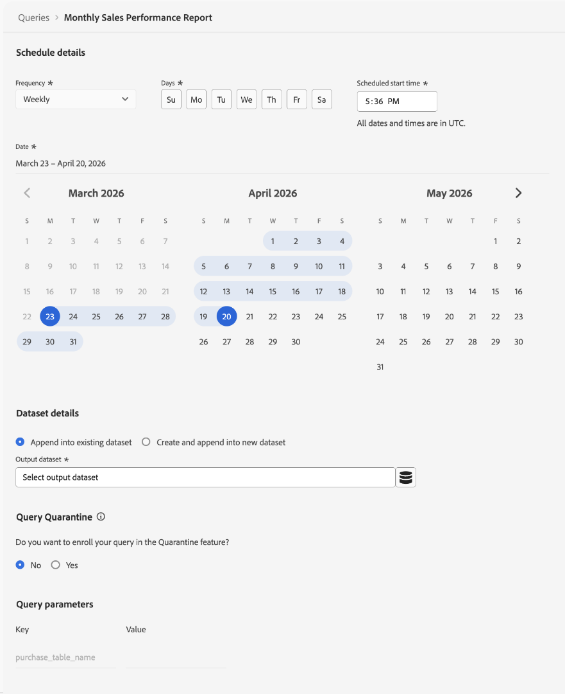
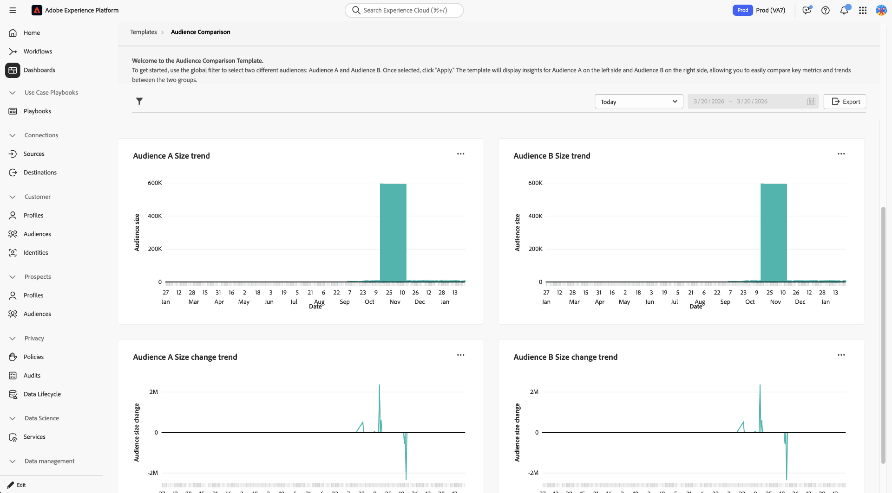

# Acceleratori Data Distiller {#data-distiller-accelerators}

Gli acceleratori Data Distiller sono modelli SQL con parametri creati da Adobe e progettati per scenari analitici comuni. Utilizzare gli acceleratori per eseguire analisi comuni senza scrivere SQL da zero. Gli acceleratori sono di sola lettura e gestiti da Adobe, per garantire la coerenza all&#39;interno dell&#39;organizzazione. Se devi modificarne uno, puoi clonarlo come modello personalizzato.

Leggere questa guida per scoprire come eseguire, pianificare e clonare gli acceleratori nell&#39;area di lavoro [!UICONTROL Queries].

>[!AVAILABILITY]
>
>I Data Distiller Accelerator sono disponibili solo per le organizzazioni con una SKU di Data Distiller. La scheda [!UICONTROL Accelerators] e i flussi di lavoro correlati richiedono il componente aggiuntivo Data Distiller. Consulta la [Panoramica di Data Distiller](../data-distiller/overview.md) o contatta il tuo rappresentante Adobe per ulteriori informazioni.

## Prerequisiti {#prerequisites}

Prima di iniziare, assicurati di soddisfare i seguenti requisiti:

* Si dispone dell&#39;accesso all&#39;area di lavoro [!UICONTROL Queries] in Experience Platform.
* [Come utilizzare l&#39;editor di query ed eseguire query](./user-guide.md).
* Conosci [query con parametri](./parameterized-queries.md) (segnaposto in SQL sostituiti in fase di esecuzione).

## Quando utilizzare gli acceleratori {#when-to-use}

Utilizza gli acceleratori quando hai bisogno di istruzioni SQL predefinite per i pattern analitici comuni, come l’analisi funnel, le medie mobili o la sovrapposizione di pubblico. Se nessun acceleratore è adatto al tuo caso d&#39;uso, [scrivi una query personalizzata nell&#39;editor di query](./user-guide.md#query-authoring) o richiedi un nuovo acceleratore (vedi [Richiedi un nuovo acceleratore](#request-accelerator)).

Un piccolo gruppo di acceleratori si apre come dashboard per l’analisi immediata, mentre altri si aprono nell’editor delle query dove è possibile eseguire, pianificare o adattare la logica. Consulta la sezione [Acceleratori collegati al dashboard](#dashboard-accelerators) per scoprire in che modo queste visualizzazioni preconfigurate forniscono informazioni approfondite sui dati del pubblico.

Per iniziare a utilizzare gli acceleratori, passare all&#39;area di lavoro **[!UICONTROL Queries]** e aprire la scheda **[!UICONTROL Accelerators]** o **[!UICONTROL Overview]**.

## Percorsi di individuazione accelerati {#discovery-paths}

È possibile accedere agli acceleratori dall’area di lavoro Query in due modi, a seconda che si desideri il catalogo completo o i modelli consigliati.

### Utilizzare la scheda Acceleratori

Utilizzare questo percorso per sfogliare tutti gli acceleratori disponibili. Per aprire il catalogo acceleratore completo, selezionare **[!UICONTROL Queries]** nel menu di navigazione a sinistra, quindi selezionare la scheda **[!UICONTROL Accelerators]**.

Nell&#39;area di lavoro viene visualizzata una tabella di acceleratori con nomi, anteprime SQL e timestamp. Selezionate un nome di acceleratore per aprirlo nell&#39;editor delle query.

>[!NOTE]
>
>Tutti gli acceleratori selezionati dalla scheda **[!UICONTROL Accelerators]** vengono aperti nell&#39;editor delle query.

### Utilizzare la scheda Panoramica

Usa questo percorso per accedere rapidamente agli acceleratori consigliati. Passa a **[!UICONTROL Queries]**, quindi seleziona la scheda **[!UICONTROL Overview]**. Quindi, selezionare una scheda dalla sezione **[!UICONTROL Recommended Data Distiller accelerators]**.

La maggior parte degli acceleratori viene aperta nell&#39;editor di query. Un piccolo set di acceleratori si apre come dashboard con visualizzazioni predefinite. Se la scheda apre un dashboard invece che l&#39;editor di query, vedi [Acceleratori collegati al dashboard](#dashboard-accelerators).

## Aprire un acceleratore nell&#39;editor di query {#open-accelerator}

In questa sezione viene illustrato cosa accade quando si apre un acceleratore nell&#39;editor delle query e le azioni che è possibile eseguire successivamente, tra cui l&#39;esecuzione dell&#39;acceleratore, la pianificazione o la creazione di un modello personalizzato.

Dopo aver aperto un acceleratore, è possibile **eseguirlo** per visualizzare i risultati, **pianificare** l&#39;esecuzione automatica dell&#39;acceleratore oppure **creare un modello personalizzato** per modificare l&#39;istruzione SQL.

>[!NOTE]
>
>Quando si apre un acceleratore nell&#39;editor delle query, l&#39;istruzione SQL viene precaricata in uno stato di sola lettura e le azioni della barra degli strumenti come [!UICONTROL Show results], [!UICONTROL Undo text], [!UICONTROL Format text] sono disabilitate.

Il pannello di destra visualizza metadati quali **[!UICONTROL Accelerator ID]**, **[!UICONTROL Name]** e dettagli di modifica e fornisce l&#39;accesso alla pianificazione tramite **[!UICONTROL Add schedule]**.

### Fornire parametri ed eseguire un acceleratore {#provide-parameters-execute}

Per eseguire l&#39;acceleratore, è innanzitutto necessario fornire i valori per tutti i parametri richiesti. I parametri utilizzano la sintassi `${PARAMETER_NAME}` e vengono visualizzati nella scheda **[!UICONTROL Query parameters]** sotto l&#39;editor. Ad esempio, `${START_DATE}` richiede un valore di data nel formato `YYYY-MM-DD` (ad esempio, `2024-01-01`) e `${AUDIENCE_ID}` richiede un identificatore di pubblico specifico.

Per eseguire un acceleratore:

1. Selezionare **[!UICONTROL Query parameters]** e immettere un valore per ogni parametro.
2. Seleziona l&#39;icona di riproduzione () nella barra degli strumenti.

L&#39;acceleratore viene eseguito e visualizza i risultati nella scheda **[!UICONTROL Results]**. Questi risultati non vengono mantenuti in un set di dati a meno che non si utilizzi **[!UICONTROL Run as CTAS]** o si pianifichi l&#39;acceleratore.

Per ulteriori informazioni sulle query con parametri, vedere [Query con parametri in Query Editor](./parameterized-queries.md).

## Mantieni risultati da un acceleratore {#persist-results}

Dopo aver eseguito un acceleratore e confermato i risultati, puoi rendere persistente l’output in un set di dati.

Per creare un set di dati dai risultati, selezionare **[!UICONTROL Save]** per salvare l&#39;acceleratore come modello, quindi selezionare **[!UICONTROL Run as CTAS]**. Viene visualizzata la finestra di dialogo **[!UICONTROL Enter output dataset details]**. Inserisci un nome per il set di dati e una descrizione facoltativa, quindi conferma la creazione del set di dati. Questa azione crea un nuovo set di dati e vi scrive i risultati.

![La finestra di dialogo [!UICONTROL Enter output dataset details] con il nome e la descrizione di un set di dati è stata compilata.](../images/ui/accelerators/output-dataset-details-dialog.png)

## Pianificare un acceleratore {#schedule-accelerator}

Per pianificare l&#39;esecuzione automatica di un acceleratore con valori di parametro fissi, selezionare **[!UICONTROL Add schedule]** nel pannello di destra.

>[!TIP]
>
>Prima di pianificare, assicurati di conoscere i valori dei parametri richiesti. Esegui prima l’acceleratore per convalidare i risultati.

Viene visualizzata la finestra di dialogo per la configurazione della pianificazione.

Nella finestra di dialogo di configurazione della pianificazione, devi fornire nuovamente una frequenza, un intervallo temporale, un set di dati di output e i valori dei parametri. I valori dei parametri immessi nell’editor delle query non vengono inclusi nella configurazione della pianificazione. Nella sezione **[!UICONTROL Dataset details]** è possibile scegliere di **[!UICONTROL Append into existing dataset]** o **[!UICONTROL Create and append into new dataset]**. Dopo aver configurato la pianificazione, l’acceleratore viene eseguito automaticamente in base alle impostazioni e scrive i risultati nel set di dati selezionato.

Per istruzioni dettagliate, consulta la guida [Creare una pianificazione di query](./query-schedules.md#create-schedule).

## Creare un modello personalizzato da un acceleratore {#create-custom-template}

Se devi modificare l’istruzione SQL o riutilizzare la logica nella tua configurazione, puoi creare un modello personalizzato da un acceleratore. Aprire un acceleratore nell&#39;editor di query, quindi selezionare **[!UICONTROL Create custom template]**. Modificare l&#39;istruzione SQL e i dettagli in base alle esigenze e selezionare **[!UICONTROL Save]** o **[!UICONTROL Save and close]** per memorizzare il modello.

Una volta salvato, il modello può essere modificato e può essere eseguito, pianificato o utilizzato con CTAS. Il modello viene salvato nella scheda **[!UICONTROL Templates]**, in cui è possibile gestirlo come qualsiasi altro modello. Per ulteriori informazioni, vedere [Modelli di query](./query-templates.md).

### Cosa cambia quando crei un modello personalizzato {#custom-template-differences}

Il modello clonato è diverso dall&#39;acceleratore originale perché l&#39;istruzione SQL è modificabile, è possibile salvare le modifiche, eliminare il modello e pianificarlo. Il campo **[!UICONTROL Modified by]** mostra il tuo nome. Il modello si trova nella scheda **[!UICONTROL Templates]** invece di **[!UICONTROL Accelerators]**.

## Acceleratori collegati al dashboard {#dashboard-accelerators}

Alcuni acceleratori nella scheda **[!UICONTROL Overview]** si aprono come dashboard anziché come query SQL. Questi acceleratori forniscono visualizzazioni predefinite per l’analisi dei dati sul pubblico e non richiedono l’input di parametri o l’esecuzione manuale.

Nell&#39;area di lavoro **[!UICONTROL Dashboards]** vengono aperti i seguenti acceleratori:

**[!UICONTROL Advanced Audience Overlaps]** analizza le intersezioni tra i tipi di pubblico selezionati o nell&#39;intero set di destinatari per identificare i pattern di sovrapposizione. Utilizza queste informazioni per perfezionare la segmentazione e ridurre il targeting ridondante.

**[!UICONTROL Audience Comparison]** confronta le metriche chiave tra due tipi di pubblico affiancati, incluse le dimensioni, la composizione dell&#39;identità e le modifiche nel tempo. Utilizza questa vista per valutare le differenze di prestazioni e prendere decisioni informate sul targeting.

**[!UICONTROL Audience Trends]** tiene traccia del cambiamento delle metriche del pubblico nel tempo, incluse le dimensioni del pubblico e i conteggi di identità. Utilizza queste tendenze per monitorare la crescita e valutare l’impatto delle strategie di segmentazione.

**[!UICONTROL Audience Identity Overlaps]** esamina il modo in cui i tipi di identità si sovrappongono nei tipi di pubblico selezionati per comprendere le relazioni di identità. Utilizza questa analisi per migliorare l’unione delle identità e la precisione della segmentazione.

Una volta aperta la dashboard, utilizza i controlli e i filtri disponibili per esplorare e confrontare i dati sul pubblico. Per ulteriori dettagli, vedere [modelli di dashboard](../../dashboards/sql-insights-query-pro-mode/templates/overview.md).

## Richiedi un nuovo acceleratore {#request-accelerator}

Se hai un caso d’uso ricorrente che non è coperto da acceleratori esistenti, invia una richiesta tramite il tuo canale di supporto Adobe. Adobe valuta le richieste in base ai pattern di utilizzo comuni e all’applicabilità nel settore.

## Passaggi successivi {#next-steps}

È ora possibile utilizzare gli acceleratori per eseguire e automatizzare query analitiche comuni.

Per estendere i flussi di lavoro, crea e sfoglia [modelli di query](./query-templates.md#browse), crea [query con parametri](./parameterized-queries.md), pianifica [query](./query-schedules.md) o esplora [flussi di lavoro Query Service](./user-guide.md).
