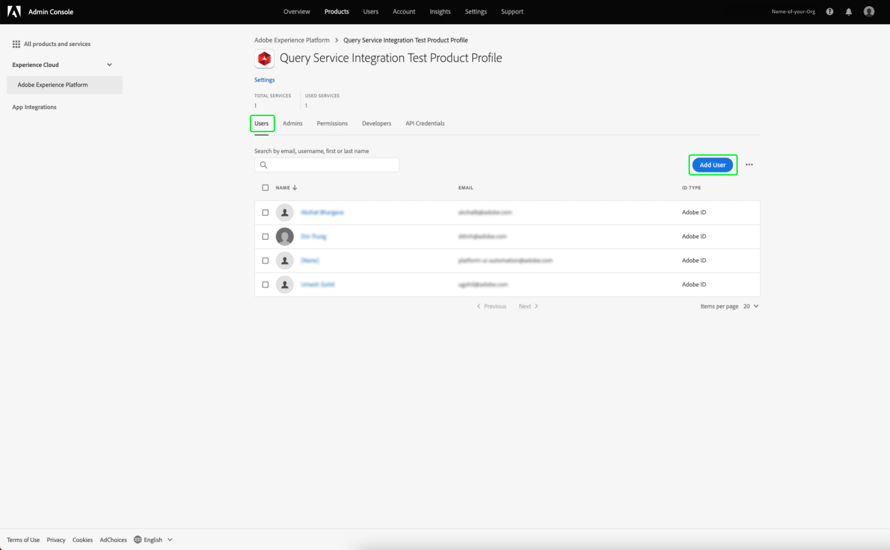

# Guida alle credenziali

Adobe Experience Platform Query Service consente di connettersi con client esterni. È possibile connettersi a questi client esterni utilizzando credenziali in scadenza o credenziali in scadenza.

## Credenziali in scadenza

È possibile utilizzare le credenziali in scadenza per configurare rapidamente una connessione a un client esterno.


La sezione **[!UICONTROL Credenziali in scadenza]** fornisce le seguenti informazioni:

- **[!UICONTROL Host]**: Nome dell&#39;host a cui ti connetterai. Per la connessione al servizio query, verrà incluso il nome dell’organizzazione IMS attualmente in uso.
- **[!UICONTROL Porta]**: Numero di porta dell&#39;host a cui ci si connette.
- **[!UICONTROL Database]**: Nome del database a cui ci si connette.
- **[!UICONTROL Nome utente]**: Nome utente che verrà utilizzato per connettersi al servizio query.
- **[!UICONTROL Password]**: Password da utilizzare per la connessione al servizio query.
- **[!UICONTROL Comando]** PSQL: Comando che ha inserito automaticamente tutte le informazioni pertinenti per la connessione a Query Service tramite PSQL nella riga di comando.
- **[!UICONTROL Scade]**: Data di scadenza delle credenziali in scadenza. Le credenziali scadono 24 ore dopo la generazione.

## Credenziali non in scadenza

È possibile utilizzare le credenziali non in scadenza per impostare una connessione più permanente a un client esterno.

Prima di poter creare credenziali non in scadenza, è necessario configurare entrambe le autorizzazioni **Sandbox** e **Gestisci integrazione servizio query** per la tua organizzazione in Adobe Admin Console.

Accedi a [Adobe Admin Console](https://adminconsole.adobe.com/) e seleziona l&#39;organizzazione pertinente dalla barra di navigazione superiore.

Nella sezione [!UICONTROL Prodotti e servizi] della [!UICONTROL Panoramica], seleziona **Adobe Experience Platform**.


Viene visualizzata la pagina Dettagli Adobe Experience Platform. Quindi, crea un nuovo profilo. Seleziona [!UICONTROL **Nuovo profilo**].


Viene visualizzata una finestra di dialogo per la creazione del profilo. Immetti un nome descrittivo per il nuovo profilo e seleziona [!UICONTROL **Salva**]. Viene visualizzata la pagina [!UICONTROL Impostazioni] per il nuovo profilo. Seleziona la scheda [!UICONTROL **Autorizzazioni**] dalle opzioni disponibili.

### Abilitare le autorizzazioni del servizio query

Per garantire che le autorizzazioni corrette per il servizio query siano abilitate per la tua organizzazione, trova e seleziona la categoria [!UICONTROL **Servizio query**] dall’elenco.


Viene visualizzata l&#39;area di lavoro [!UICONTROL Modifica autorizzazioni] per Query Service. Seleziona l’icona più (**+**) per [!UICONTROL **Gestisci query**] e [!UICONTROL **Gestisci integrazione servizio query**] per aggiungerle alla colonna [!UICONTROL Elementi autorizzazione inclusi]. Quindi, seleziona [!UICONTROL **Salva**] per confermare le modifiche.


Viene visualizzata la scheda Impostazioni > Autorizzazioni .

### Abilita autorizzazioni sandbox

Per verificare che la sandbox corretta sia selezionata per la tua organizzazione, trova e seleziona la categoria [!UICONTROL **Sandbox**] dall’elenco.


Viene visualizzata l’area di lavoro Sandbox. Dall’ [!UICONTROL Autorizzazioni disponibili], trova la sandbox pertinente, in questa immagine è la sandbox Prod. Seleziona l&#39;icona più (**+**) per aggiungerla a [!UICONTROL Autorizzazioni incluse]. Quindi, seleziona [!UICONTROL **Salva**] per confermare le modifiche.


Viene visualizzata la scheda Impostazioni > Autorizzazioni .

Sono necessari altri tre passaggi per consentire a un utente di accedere alla funzione dell’account non in scadenza.

- Aggiungi un nuovo utente a cui concedere le autorizzazioni appena create. Selezionare la scheda [!UICONTROL **Utenti**], seguita da [!UICONTROL **Aggiungi utente**].



Viene visualizzata la finestra di dialogo Crea utente. Inserisci un nome e un&#39;e-mail per il nuovo utente e seleziona [!UICONTROL **Salva**].

- L’utente deve quindi essere aggiunto come amministratore per consentire la creazione di un account per qualsiasi profilo di prodotto attivo. Per aggiungere l’utente appena creato come amministratore. selezionare la scheda [!UICONTROL **Amministratori**], seguita da [!UICONTROL **Aggiungi amministratori**].


Viene visualizzata la finestra di dialogo aggiungi amministratore. Inserisci i dettagli del nuovo amministratore nei campi di testo e seleziona [!UICONTROL **Salva**].

- L’utente deve quindi essere aggiunto come sviluppatore per creare un’integrazione. Seleziona la scheda **Sviluppatori** , seguita dalla scheda **Aggiungi sviluppatore**.


Viene visualizzata la finestra di dialogo Aggiungi sviluppatore . Inserisci i dettagli del nuovo sviluppatore nei campi di testo e seleziona **Salva**.

Per ulteriori informazioni su come assegnare le autorizzazioni, consulta la documentazione su [Controllo accessi](../../access-control/home.md).

Tutte le autorizzazioni necessarie sono ora configurate in Adobe Developer Console in modo che l’utente possa utilizzare la funzione delle credenziali in scadenza.

Per creare un set di credenziali non in scadenza, nell&#39;area di lavoro Credenziali query selezionare **[!UICONTROL Genera credenziali]**.


Viene visualizzata la finestra modale per la generazione delle credenziali. Per creare credenziali non in scadenza, è necessario fornire i seguenti dettagli:

- **[!UICONTROL Nome]**: Nome delle credenziali che si sta generando.
- **[!UICONTROL Descrizione]**: (Facoltativo) Una descrizione delle credenziali che stai generando.
- **[!UICONTROL Assegnato a]**: Utente a cui verranno assegnate le credenziali. Questo valore deve essere l&#39;indirizzo e-mail dell&#39;utente che sta creando le credenziali.
- **[!UICONTROL Password]**  (opzionale) Una password opzionale per le tue credenziali. Se la password non è impostata, Adobe genererà automaticamente una password.

Dopo aver fornito tutti i dettagli richiesti, seleziona **[!UICONTROL Genera credenziali]** per generare le credenziali.


>[!IMPORTANT]
>
>Una volta selezionato il pulsante **[!UICONTROL Genera credenziali]**, viene scaricato un file JSON di configurazione nel computer locale. Poiché in Adobe **non** viene registrata la credenziale generata, **è necessario** memorizzare in modo sicuro il file scaricato e conservare un record della credenziale.
>
>Inoltre, se le credenziali non vengono utilizzate per 90 giorni, verranno eliminate.

Il file JSON di configurazione contiene informazioni quali il nome dell’account tecnico, l’ID account tecnico e le credenziali. Viene fornito nel seguente formato.

```json
{"technicalAccountName":"9F0A21EE-B8F3-4165-9871-846D3C8BC49E@TECHACCT.ADOBE.COM","credential":"3d184fa9e0b94f33a7781905c05203ee","technicalAccountId":"4F2611B8613AA3670A495E55"}
```

Dopo aver salvato le credenziali generate, seleziona **[!UICONTROL Chiudi]**. È ora possibile visualizzare un elenco di tutte le credenziali non in scadenza.


È possibile modificare o eliminare le credenziali non in scadenza. Per modificare una credenziale non in scadenza, seleziona l’icona a forma di matita (). Per eliminare una credenziale non in scadenza, seleziona l’icona Elimina ().

Quando si modifica una credenziale non in scadenza, viene visualizzato un modale. Puoi fornire i seguenti dettagli da aggiornare:

- **[!UICONTROL Nome]**: Nome delle credenziali che si sta generando.
- **[!UICONTROL Descrizione]**: (Facoltativo) Una descrizione delle credenziali che stai generando.
- **[!UICONTROL Assegnato a]**: Utente a cui verranno assegnate le credenziali. Questo valore deve essere l&#39;indirizzo e-mail dell&#39;utente che sta creando le credenziali.


Dopo aver fornito tutti i dettagli richiesti, seleziona **[!UICONTROL Aggiorna account]** per completare l&#39;aggiornamento delle tue credenziali.

## Utilizzo delle credenziali per la connessione a client esterni

È possibile utilizzare le credenziali in scadenza o non in scadenza per connettersi con client esterni, ad esempio Aqua Data Studio, Looker o Power BI.

La tabella seguente contiene l’elenco dei parametri e la relativa descrizione, in genere necessari per connettersi a client esterni.

>[!NOTE]
>
>Quando ci si connette a un host utilizzando credenziali non in scadenza, è comunque necessario utilizzare tutti i parametri elencati nella sezione [!UICONTROL EXPIRING CREDENTIALS] ad eccezione della password.

| Parametro | Descrizione |
|---|---|
| **Server/Host** | Il nome del server/host a cui ti connetti. Questo valore si presenta sotto forma di `server.adobe.io` e si trova in **[!UICONTROL Host]**. |
| **Porta** | La porta del server/host a cui ti stai connettendo. Questo valore si trova in **[!UICONTROL Porta]**. Un valore di esempio per la porta è `80`. |
| **Database** | Database a cui ci si connette. Questo valore si trova in **[!UICONTROL Database]**. Un valore di esempio per il database è `prod:all`. |
| **Nome utente** | Nome utente per l’utente che si connette al client esterno. Si tratta di una stringa alfanumerica prima di `@AdobeOrg`. Questo valore si trova in **[!UICONTROL Nome utente]**. |
| **Password** | Password per l&#39;utente che si connette al client esterno. <ul><li>Se utilizzi credenziali in scadenza, puoi trovarlo in **[!UICONTROL Password]** nella sezione relativa alle credenziali in scadenza.</li><li>Se utilizzi credenziali non in scadenza, questo valore è composto dagli argomenti del technicalAccountID e dalle credenziali prelevate dal file JSON di configurazione. Il valore della password assume la forma di: `{technicalAccountId}:{credential}`.</li></ul> |

## Passaggi successivi

Ora che si capisce come funzionano sia le credenziali in scadenza che quelle in scadenza, è possibile utilizzare queste credenziali per connettersi a client esterni. Per ulteriori informazioni dettagliate sui client esterni, leggere la [guida alla connessione dei client a Query Service](../clients/overview.md).
