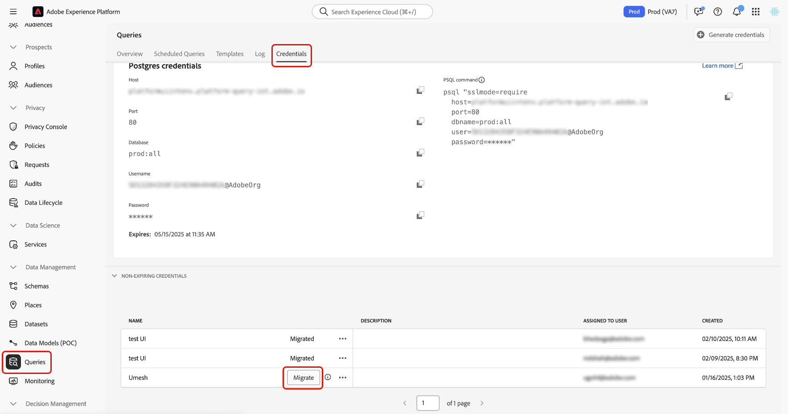

# Migrazione da JWT a credenziali server-to-server OAuth

>[!IMPORTANT]
>
>Adobe ha dichiarato obsoleto il supporto per le credenziali dell’account di servizio (JWT) utilizzate da Query Service. Dopo il 30 giugno 2025, le credenziali senza scadenza basate su JWT non aggiorneranno o autenticheranno più le richieste API. Per evitare interruzioni del servizio, è necessario migrare ogni credenziale idonea all’autenticazione server-to-server di OAuth.

Questa guida illustra come eseguire la migrazione delle credenziali JWT senza scadenza alle credenziali da server a server OAuth in Adobe Experience Platform. Il completamento di questo processo garantisce l’accesso ininterrotto a Query Service prima della scadenza del supporto per le credenziali JWT, il 30 giugno 2025.

Questo documento fornisce istruzioni dettagliate per eseguire la migrazione, comprendere l’impatto e verificare le credenziali aggiornate.

## Chi deve effettuare la migrazione {#who-needs-to-migrate}

Se in Query Service utilizzi credenziali senza scadenza, devi eseguire la migrazione di ognuna di esse. Ciò si applica alle credenziali utilizzate nei flussi di lavoro automatizzati, nelle query pianificate o nelle integrazioni API personalizzate.

Se trovi le credenziali elencate nella sezione **[!UICONTROL Credenziali senza scadenza]** della scheda **[!UICONTROL Credenziali]**, tali credenziali sono interessate.

## Come migrare una credenziale {#how-to-migrate}

Puoi eseguire la migrazione delle credenziali direttamente nell’interfaccia utente di Experience Platform. A tale scopo, passa a **[!UICONTROL Query]** nell&#39;area di navigazione a sinistra, quindi seleziona la scheda **[!UICONTROL Credenziali]**. Nella sezione **[!UICONTROL Credenziali senza scadenza]**, identifica una credenziale contrassegnata come idonea per la migrazione e seleziona **[!UICONTROL Esegui migrazione]** accanto a essa.

>[!NOTE]
>
>La migrazione richiede da 8 a 10 secondi e non può essere annullata una volta avviata.

Dopo la migrazione, il sistema aggiorna le credenziali per utilizzare l’autenticazione server-to-server OAuth. Il metodo basato su JWT viene ritirato automaticamente e lo stato viene aggiornato a **[!UICONTROL Migrato]**.

Non è richiesta alcuna riconfigurazione. I processi e le integrazioni esistenti continuano a funzionare senza interruzioni.

## Cosa succede dopo la migrazione {#after-migration}

Dopo aver completato la migrazione:

- Le credenziali continuano a funzionare senza interruzioni, pertanto non sono necessarie modifiche ai processi o alle integrazioni.
- Query Service utilizza automaticamente l’autenticazione server-to-server OAuth.
- Il metodo di autenticazione basato su JWT è stato ritirato e non è più in uso.

>[!IMPORTANT]
>
>Impossibile annullare questa modifica. Una volta effettuata la migrazione, le credenziali non possono essere ripristinate al formato JWT.

## Domande frequenti {#faq}

Queste domande affrontano problematiche comuni e consentono di garantire una migrazione senza interruzioni.

### Perché Adobe sta rendendo obsolete le credenziali JWT?

OAuth Server-to-Server è un metodo di autenticazione più sicuro e standardizzato. Offre una migliore gestione del ciclo di vita e supporta una maggiore coerenza della piattaforma.

### Cosa succede se non eseguo la migrazione entro il 30 giugno 2025?

Le credenziali JWT cesseranno di essere aggiornate e le integrazioni che si basano su di esse avranno esito negativo. Adobe non può eseguire la migrazione delle credenziali per tuo conto a meno che tu non avvii il processo.

### Come posso sapere se devo effettuare la migrazione?

Se nella scheda Credenziali viene visualizzata una credenziale nella sezione **[!UICONTROL Credenziali senza scadenza]**, è necessario eseguire la migrazione di tali credenziali.

### Devo aggiornare le mie integrazioni o riconfigurare qualcosa?

No. Dopo la migrazione, le credenziali OAuth assumono automaticamente il controllo. Non sono necessarie modifiche manuali nei processi o nelle integrazioni.

### È possibile eseguire la migrazione di tutte le credenziali contemporaneamente?

No. È necessario eseguire la migrazione di ogni credenziale singolarmente utilizzando il pulsante **[!UICONTROL Esegui migrazione]**.

### Posso continuare a utilizzare le credenziali in scadenza?

Sì.  Questa modifica non influisce sulle credenziali in scadenza. È necessario eseguire la migrazione solo delle credenziali JWT senza scadenza.

### Viene visualizzato un messaggio che indica &quot;[!UICONTROL Nessuna credenziale senza scadenza trovata.]&quot; Cosa significa? Devo intraprendere qualche azione?

Questo messaggio significa che non hai ancora creato credenziali senza scadenza, quindi non c&#39;è nulla da fare.

### Viene visualizzato un messaggio che indica &quot;[!UICONTROL Verifica dell&#39;amministratore AEP non riuscita]...&quot; Che cosa significa? Devo intraprendere qualche azione?

Questo messaggio indica che non sei un amministratore o non disponi delle autorizzazioni necessarie per creare credenziali senza scadenza.

- Se le autorizzazioni non sono state modificate di recente, significa che non hai mai avuto accesso alla creazione delle credenziali, quindi non è necessaria alcuna azione.
- Se le autorizzazioni sono state modificate di recente, contatta l’amministratore dell’organizzazione e chiedi di migrare le credenziali.

### È possibile eseguire la migrazione delle credenziali senza scadenza per un altro utente?

Sì, ma solo se sei un amministratore. Solo gli amministratori dispongono delle autorizzazioni necessarie per creare e migrare le credenziali senza scadenza per altri utenti, in modo da poter continuare a lavorare senza interruzioni.

## Passaggi successivi {#next-steps}

Rivedi tutte le credenziali senza scadenza nella scheda [!UICONTROL Credenziali] ed esegui la migrazione singolarmente prima del 30 giugno 2025. Per domande o supporto, contatta il rappresentante del tuo account Adobe.
