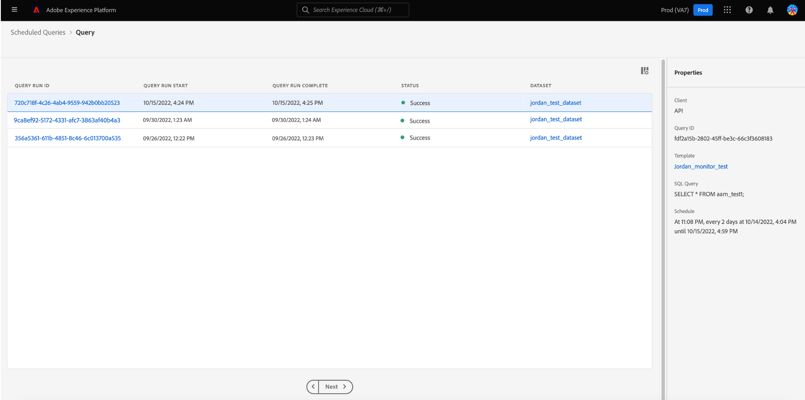

# Monitoraggio delle query pianificate

Adobe Experience Platform offre una migliore visibilità dello stato di tutti i processi di query tramite l’interfaccia utente. Da [!UICONTROL Query pianificate] è ora possibile trovare informazioni importanti sulle esecuzioni della query che includono lo stato, i dettagli della pianificazione e i messaggi/codici di errore in caso di errore. Puoi anche abbonarti agli avvisi per le query in base al loro stato tramite l’interfaccia utente per ognuna di queste query tramite [!UICONTROL Query pianificate] scheda .

## [!UICONTROL Query pianificate]

La [!UICONTROL Query pianificate] fornisce una panoramica di tutte le query CTAS e ITAS pianificate. È possibile trovare i dettagli di esecuzione per tutte le query pianificate, nonché i codici di errore e i messaggi per tutte le query non riuscite.

Per passare al [!UICONTROL Query pianificate] scheda , seleziona **[!UICONTROL Query]** dalla barra di navigazione a sinistra seguita da **[!UICONTROL Query pianificate]**

La tabella seguente descrive ogni colonna disponibile.

>[!NOTE]
>
>L’icona delle sottoscrizioni di avvisi è contenuta in ogni riga di una colonna senza titolo. Consulta la sezione [sottoscrizioni di avvisi](#alert-subscription) per ulteriori informazioni.

| Colonna | Descrizione |
|---|---|
| **[!UICONTROL Nome]** | Il campo nome è il nome del modello o i primi caratteri della query SQL. All’inizio viene denominato qualsiasi query creata tramite l’interfaccia utente con l’Editor query. Se la query è stata creata tramite l’API, il suo nome diventa uno snippet dell’SQL iniziale utilizzato per creare la query. Seleziona qualsiasi elemento dal [!UICONTROL Nome] per visualizzare un elenco di tutte le esecuzioni associate alla query. Per ulteriori informazioni, consulta la sezione [dettagli pianificazione esecuzione query](#query-runs) sezione . |
| **[!UICONTROL Modello]** | Nome del modello della query. Selezionare un nome di modello per passare all’Editor query. Il modello di query viene visualizzato nell’Editor query per comodità. Se non è presente un nome di modello, la riga viene contrassegnata con un trattino e non è possibile reindirizzare all’Editor query per visualizzare la query. |
| **[!UICONTROL SQL]** | Frammento della query SQL. |
| **[!UICONTROL Frequenza di esecuzione]** | Questa è la cadenza alla quale la query è impostata per essere eseguita. I valori disponibili sono `Run once` e `Scheduled`. Le query possono essere filtrate in base alla loro frequenza di esecuzione. |
| **[!UICONTROL Creato da]** | Nome dell’utente che ha creato la query. |
| **[!UICONTROL Creato]** | La marca temporale alla creazione della query, in formato UTC. |
| **[!UICONTROL Timestamp ultima esecuzione]** | La marca temporale più recente all’esecuzione della query. Questa colonna evidenzia se una query è stata eseguita in base alla pianificazione corrente. |
| **[!UICONTROL Stato dell&#39;ultima esecuzione]** | Lo stato dell’esecuzione della query più recente. I valori di stato sono: `Success`, `Failed`, `In progress`e `No runs`. |

>[!TIP]
>
>Se passi all’Editor query, puoi selezionare **[!UICONTROL Query]** per tornare al [!UICONTROL Modelli] scheda .

### Personalizzare le impostazioni della tabella per le query pianificate

È possibile regolare le colonne nel [!UICONTROL Query pianificate] in base alle tue esigenze. Seleziona l’icona delle impostazioni () per aprire [!UICONTROL Personalizzare la tabella] finestra di dialogo delle impostazioni e modifica le colonne disponibili.

Selezionare le caselle di controllo desiderate per rimuovere o aggiungere una colonna di tabella. Quindi, seleziona **[!UICONTROL Applica]** per confermare le scelte.

>[!NOTE]
>
>Qualsiasi query creata tramite l’interfaccia utente diventa un modello denominato come parte del processo di creazione. Il nome del modello viene visualizzato nella colonna del modello. Se la query è stata creata tramite l’API, la colonna del modello è vuota.

### Iscriviti agli avvisi {#alert-subscription}

Puoi abbonarti agli avvisi dal [!UICONTROL Query pianificate] scheda . Seleziona l’icona della notifica di avviso () accanto al nome di una query per aprire la [!UICONTROL Avvisi] finestra di dialogo. La [!UICONTROL Avvisi] La finestra di dialogo si abbona sia alle notifiche dell’interfaccia utente che agli avvisi e-mail. Gli avvisi si basano sullo stato della query. Sono disponibili tre opzioni: `start`, `success`e `failure`. Selezionare la casella o le caselle appropriate e selezionare **[!UICONTROL Salva]** per iscriversi.

Consulta la sezione [documentazione API per gli abbonamenti agli avvisi](../api/alert-subscriptions.md) per ulteriori informazioni.

### Filtrare le query {#filter}

È possibile filtrare le query in base alla frequenza di esecuzione. Da [!UICONTROL Query pianificate] , seleziona l’icona del filtro () per aprire la barra laterale del filtro.

Seleziona la **[!UICONTROL Pianificato]** o **[!UICONTROL Esegui una volta]** esegui le caselle di controllo filtro di frequenza per filtrare l’elenco di query.

>[!NOTE]
>
>Qualsiasi query eseguita ma non pianificata si qualifica come [!UICONTROL Esegui una volta].

Dopo aver abilitato i criteri di filtro, seleziona **[!UICONTROL Nascondi filtri]** per chiudere il pannello del filtro.

## Dettagli pianificazione esecuzione query {#query-runs}

Seleziona un nome di query per passare alla pagina dei dettagli della pianificazione. Questa visualizzazione fornisce un elenco di tutte le esecuzioni eseguite nell&#39;ambito di tale query pianificata. Le informazioni fornite includono l’ora di inizio e di fine, lo stato e il set di dati utilizzati.

Queste informazioni sono fornite in una tabella a cinque colonne. Ciascuna riga indica un’esecuzione della query.

| Nome colonna | Descrizione |
|---|---|
| **[!UICONTROL ID esecuzione query]** | ID di esecuzione della query per l&#39;esecuzione giornaliera. Seleziona la **[!UICONTROL ID esecuzione query]** per passare al [!UICONTROL Panoramica dell’esecuzione delle query]. |
| **[!UICONTROL Avvio esecuzione query]** | La marca temporale in cui è stata eseguita la query. Questo è in formato UTC. |
| **[!UICONTROL Esecuzione query completata]** | La marca temporale al completamento della query. Questo è in formato UTC. |
| **[!UICONTROL Stato]** | Lo stato dell’esecuzione della query più recente. I tre valori di stato sono: `successful` `failed` o `in progress`. |
| **[!UICONTROL Set di dati]** | Il set di dati coinvolto nell’esecuzione. |

I dettagli della query pianificata possono essere visualizzati nella [!UICONTROL Proprietà] pannello. Questo pannello include l&#39;ID della query iniziale, il tipo di client, il nome del modello, l&#39;SQL della query e la frequenza della pianificazione.

Seleziona un ID di esecuzione della query per passare alla pagina dei dettagli di esecuzione e visualizzare le informazioni sulla query.

## Panoramica dell’esecuzione delle query {#query-run-overview}

La [!UICONTROL Panoramica dell’esecuzione delle query] fornisce informazioni sulle singole esecuzioni per questa query pianificata e una suddivisione più dettagliata dello stato di esecuzione. Questa pagina include anche le informazioni sul client e i dettagli di eventuali errori che potrebbero aver causato il mancato funzionamento della query.

La sezione relativa allo stato della query fornisce il codice di errore e il messaggio di errore in caso di errore della query.

È possibile copiare l&#39;SQL della query negli Appunti da questa visualizzazione. Selezionare l&#39;icona di copia in alto a destra dello snippet SQL per copiare la query. Un messaggio popup conferma che il codice è stato copiato.

### (Versione limitata) Esegui i dettagli per le query con blocco anonimo {#anonymous-block-queries}

>[!IMPORTANT]
>
>La funzione di monitoraggio delle query che visualizza i dettagli di esecuzione per le query di blocco anonime è attualmente in una versione limitata e non è disponibile per tutti i clienti.

Le query che utilizzano blocchi anonimi per includere le relative istruzioni SQL sono separate nelle singole query. Questo ti consente di controllare i dettagli di esecuzione per ogni blocco di query singolarmente.

I blocchi anonimi sono indicati attraverso l&#39;uso di un `$$` prima della query. Consulta la sezione [documento a blocchi anonimi](../essential-concepts/anonymous-block.md) per ulteriori informazioni sui blocchi anonimi nel servizio query.

Le query di blocco anonime hanno schede a sinistra dello stato di esecuzione. Seleziona una scheda per visualizzare i dettagli dell’esecuzione.

Nel caso in cui una query di blocco anonimo non riesca, è possibile trovare il codice di errore per quel particolare blocco tramite questa interfaccia utente.

Seleziona **[!UICONTROL Query]** per tornare alla schermata dei dettagli della pianificazione, oppure **[!UICONTROL Query pianificate]** per tornare al [!UICONTROL Query pianificate] scheda .

