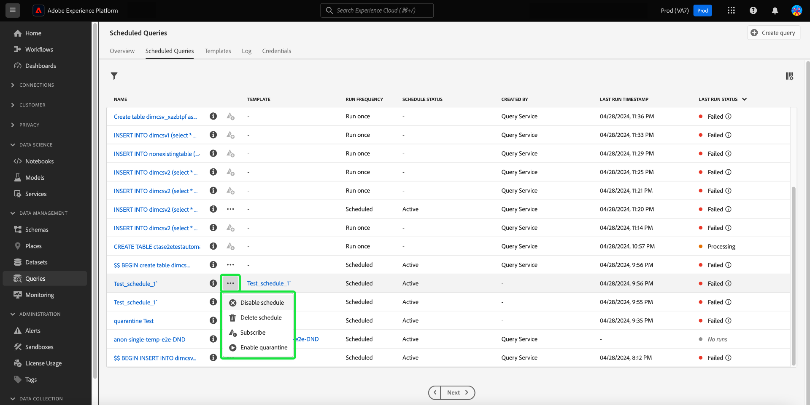

# Monitorare le query pianificate

Adobe Experience Platform fornisce una migliore visibilità dello stato di tutti i processi di query tramite l’interfaccia utente. Dalla scheda [!UICONTROL Query pianificate] è ora possibile trovare informazioni importanti sulle esecuzioni delle query, inclusi lo stato, i dettagli della pianificazione e i messaggi/codici di errore in caso di esito negativo. Puoi anche abbonarti agli avvisi per le query in base al loro stato tramite l&#39;interfaccia utente per una di queste query tramite la scheda [!UICONTROL Query pianificate].

## [!UICONTROL Query pianificate]

La scheda [!UICONTROL Query pianificate] fornisce una panoramica di tutte le query CTAS e ITAS pianificate. È possibile trovare i dettagli di esecuzione per tutte le query pianificate, nonché i codici di errore e i messaggi per eventuali query non riuscite.

Per passare alla scheda [!UICONTROL Query pianificate], seleziona **[!UICONTROL Query]** dalla barra di navigazione a sinistra, quindi **[!UICONTROL Query pianificate]**

La tabella seguente descrive ogni colonna disponibile.

>[!NOTE]
>
>Icona di notifica sottoscrizioni () è contenuto in ogni riga di una colonna senza titolo. Per ulteriori informazioni, consulta la sezione [iscrizioni agli avvisi](#alert-subscription).

| Colonna | Descrizione |
|---|---|
| **[!UICONTROL Nome]** | Il campo del nome corrisponde al nome del modello o ai primi caratteri della query SQL. Tutte le query create tramite l’interfaccia utente con l’editor delle query sono denominate all’inizio. Se la query è stata creata tramite l’API, il nome diventa un frammento dell’istruzione SQL iniziale utilizzata per creare la query. Per visualizzare un elenco di tutte le esecuzioni associate alla query, selezionare un elemento dalla colonna [!UICONTROL Nome]. Per ulteriori informazioni, vedere la sezione [query esegue dettagli pianificazione](#query-runs). |
| **[!UICONTROL Modello]** | Nome del modello della query. Selezionate un nome di modello per passare all&#39;editor di query. Il modello di query viene visualizzato nell’editor delle query per comodità. Se non è presente alcun nome di modello, la riga viene contrassegnata con un trattino e non è possibile reindirizzare all’editor delle query per visualizzare la query. |
| **[!UICONTROL SQL]** | Frammento della query SQL. |
| **[!UICONTROL Frequenza di esecuzione]** | La frequenza con cui la query è impostata per l&#39;esecuzione. I valori disponibili sono `Run once` e `Scheduled`. |
| **[!UICONTROL Creato da]** | Nome dell&#39;utente che ha creato la query. |
| **[!UICONTROL Creato]** | La marca temporale in formato UTC in cui è stata creata la query. |
| **[!UICONTROL Timestamp ultima esecuzione]** | Il timestamp più recente in cui è stata eseguita la query. In questa colonna viene evidenziato se una query è stata eseguita in base alla pianificazione corrente. |
| **[!UICONTROL Stato ultima esecuzione]** | Stato dell’esecuzione della query più recente. I valori di stato sono: `Success`, `Failed`, `In progress` e `No runs`. |
| **[!UICONTROL Stato pianificazione]** | Stato corrente della query pianificata. Sono disponibili sei valori potenziali: [!UICONTROL Registrazione], [!UICONTROL Attivo], [!UICONTROL Inattivo], [!UICONTROL Eliminato], un trattino e [!UICONTROL In quarantena].<ul><li>Lo stato **[!UICONTROL Registrazione]** indica che il sistema sta ancora elaborando la creazione della nuova pianificazione per la query. Non è possibile disattivare o eliminare una query pianificata durante la registrazione.</li><li>Lo stato **[!UICONTROL Attivo]** indica che la query pianificata ha **non ancora superato** la data e l&#39;ora di completamento.</li><li>Lo stato **[!UICONTROL Inattiva]** indica che la query pianificata ha **passato** la data e l&#39;ora di completamento o è stata contrassegnata da un utente come inattiva.</li><li>Lo stato **[!UICONTROL Eliminato]** indica che la pianificazione della query è stata eliminata.</li><li>Il trattino indica che la query pianificata è una query occasionale non ricorrente.</li><li>Lo stato **[!UICONTROL In quarantena]** indica che la query non è riuscita per dieci esecuzioni consecutive e richiede l&#39;intervento dell&#39;utente prima che possano essere eseguite ulteriori esecuzioni.</li></ul> |

>[!TIP]
>
>Se si passa all&#39;Editor query, è possibile selezionare **[!UICONTROL Query]** per tornare alla scheda [!UICONTROL Modelli].

## Personalizzare le impostazioni della tabella per le query pianificate {#customize-table}

È possibile modificare le colonne nella scheda [!UICONTROL Query pianificate] in base alle proprie esigenze. Per aprire la finestra di dialogo delle impostazioni di [!UICONTROL Personalizza tabella] e modificare le colonne disponibili, selezionare l&#39;icona delle impostazioni () in alto a destra nella schermata.

>[!NOTE]
>
>La colonna [!UICONTROL Creato] che fa riferimento alla data di creazione della pianificazione è nascosta per impostazione predefinita.

Per rimuovere o aggiungere una colonna di tabella, attiva o disattiva le caselle di controllo corrispondenti. Quindi, seleziona **[!UICONTROL Applica]** per confermare le scelte.

>[!NOTE]
>
>Qualsiasi query creata tramite l’interfaccia utente diventa un modello denominato come parte del processo di creazione. Il nome del modello viene visualizzato nella colonna del modello. Se la query è stata creata tramite l’API, la colonna del modello è vuota.

## Gestire le query pianificate con azioni in linea {#inline-actions}

La visualizzazione [!UICONTROL Query pianificate] offre diverse azioni in linea per gestire tutte le query pianificate da un&#39;unica posizione. Le azioni in linea sono indicate con puntini di sospensione in ogni riga. Selezionare i puntini di sospensione di una query pianificata che si desidera gestire per visualizzare le opzioni disponibili in un menu a comparsa. Le opzioni disponibili includono [[!UICONTROL Disabilita pianificazione]](#disable) o [!UICONTROL Abilita pianificazione], [[!UICONTROL Elimina pianificazione]](#delete), [[!UICONTROL Abbonati]](#alert-subscription) per eseguire query sugli avvisi e [Abilita o [!UICONTROL Disabilita quarantena]](#quarantined-queries).

### Disattivare o attivare una query pianificata {#disable}

Per disabilitare una query pianificata, selezionare i puntini di sospensione per la query pianificata che si desidera gestire, quindi selezionare **[!UICONTROL Disabilita pianificazione]** dalle opzioni del menu a comparsa. Viene visualizzata una finestra di dialogo per confermare l’azione. Seleziona **[!UICONTROL Disattiva]** per confermare l&#39;impostazione.

Dopo aver disabilitato una query pianificata, puoi abilitare la pianificazione attraverso lo stesso processo. Seleziona i puntini di sospensione, quindi seleziona **[!UICONTROL Abilita pianificazione]** tra le opzioni disponibili.

>[!NOTE]
>
>Se una query è stata messa in quarantena, è necessario esaminare l&#39;istruzione SQL del modello prima di abilitarne la pianificazione. In questo modo si evita lo spreco di ore di calcolo se la query del modello presenta ancora problemi.

### Eliminare una query pianificata {#delete}

Per eliminare una query pianificata, selezionare i puntini di sospensione per la query pianificata che si desidera gestire, quindi selezionare **[!UICONTROL Elimina pianificazione]** dalle opzioni del menu a comparsa. Viene visualizzata una finestra di dialogo per confermare l’azione. Seleziona **[!UICONTROL Elimina]** per confermare l&#39;impostazione.

Una volta eliminata, la query pianificata viene **non** rimossa dall&#39;elenco delle query pianificate. Le azioni in linea fornite dai puntini di sospensione vengono rimosse e sostituite dall’icona di aggiunta avviso disattivata. Non è possibile sottoscrivere avvisi per la pianificazione eliminata. La riga rimane nell’interfaccia utente per fornire informazioni sulle esecuzioni eseguite come parte della query pianificata.

Se si desidera pianificare le esecuzioni per tale modello di query, selezionare il nome del modello dalla riga appropriata per passare all&#39;editor di query, quindi seguire le [istruzioni per aggiungere una pianificazione a una query](./query-schedules.md#create-schedule) come descritto nella documentazione.

### Iscriversi agli avvisi {#alert-subscription}

Per sottoscrivere avvisi per l&#39;esecuzione di query pianificate, selezionare `...` (puntini di sospensione) o l&#39;icona di sottoscrizione avviso () per la query pianificata da gestire. Viene visualizzato il menu a discesa delle azioni in linea. Selezionare **[!UICONTROL Sottoscrivi]** tra le opzioni disponibili.

Viene visualizzata la finestra di dialogo [!UICONTROL Avvisi]. La finestra di dialogo [!UICONTROL Avvisi] ti sottoscrive sia alle notifiche dell&#39;interfaccia utente che agli avvisi e-mail. Sono disponibili diverse opzioni di sottoscrizione degli avvisi: `start`, `success`, `failure`, `quarantine` e `delay`. Seleziona la casella o le caselle appropriate e seleziona **[!UICONTROL Salva]** per iscriverti.

La tabella seguente spiega i tipi di avviso per le query supportati:

| Tipo di avviso | Descrizione |
|---|---|
| `start` | Questo avviso avvisa quando viene avviata o avviata l&#39;elaborazione di una query pianificata. |
| `success` | Questo avviso informa l&#39;utente quando una query pianificata viene eseguita correttamente, indicando che la query è stata eseguita senza errori. |
| `failed` | Questo avviso viene attivato quando una query pianificata viene eseguita con un errore o non viene eseguita correttamente. Consente di identificare e risolvere tempestivamente i problemi. |
| `quarantine` | Questo avviso viene attivato quando un’esecuzione di query pianificata viene messa in quarantena. Quando le query vengono registrate nella [funzionalità di quarantena](#quarantined-queries), qualsiasi query pianificata che non riesce a eseguire dieci esecuzioni consecutive viene automaticamente posta in stato [!UICONTROL Quarantined]. Quindi richiedono il tuo intervento prima che possano aver luogo ulteriori esecuzioni. |
| `delay` | Questo avviso notifica se si verifica un [ritardo nell&#39;esito di un&#39;esecuzione di una query](#query-run-delay) oltre la soglia specificata. È possibile impostare un&#39;ora personalizzata che attivi l&#39;avviso quando la query viene eseguita per tale durata senza completare o non riuscire. |

>[!NOTE]
>
>Per ricevere notifiche sulle esecuzioni delle query in quarantena, è necessario innanzitutto registrare le esecuzioni delle query pianificate nella [funzionalità di quarantena](#quarantined-queries).

Per ulteriori informazioni, consulta la [documentazione sulle sottoscrizioni di avvisi](../api/alert-subscriptions.md).

### Visualizzare i dettagli della query {#query-details}

Selezionare l&#39;icona delle informazioni () per visualizzare il pannello dei dettagli della query. Il pannello dei dettagli contiene tutte le informazioni rilevanti sulla query oltre ai fatti inclusi nella tabella delle query pianificate. Le informazioni aggiuntive includono l’ID della query, la data dell’ultima modifica, l’SQL della query, l’ID della pianificazione e la pianificazione del set corrente.

## Query in quarantena {#quarantined-queries}

>[!NOTE]
>
>L’avviso di quarantena non è disponibile per le query ad hoc &quot;run-once&quot;. L’avviso di quarantena è applicabile solo per le query batch pianificate (CTAS e ITAS).

Quando ci si iscrive alla funzione di quarantena, qualsiasi query pianificata che non supera dieci esecuzioni consecutive viene automaticamente messa in [!UICONTROL quarantena]. Una query con questo stato diventa inattiva e non viene eseguita alla frequenza pianificata. Quindi richiede il tuo intervento prima che possano aver luogo ulteriori esecuzioni. In questo modo vengono salvaguardate le risorse di sistema in quanto è necessario esaminare e correggere i problemi con l’SQL prima di eseguire ulteriori esecuzioni.

Per abilitare una query pianificata per la funzionalità di quarantena, selezionare i puntini di sospensione (`...`) seguiti da [!UICONTROL Attiva quarantena] dal menu a discesa visualizzato.

È inoltre possibile registrare le query nella funzione di quarantena durante il processo di creazione della pianificazione. Per ulteriori informazioni, consulta la [documentazione sulle pianificazioni delle query](./query-schedules.md#quarantine).

## Ritardo esecuzione query {#query-run-delay}

Tieni sotto controllo le ore di calcolo impostando avvisi per i ritardi nelle query. Puoi monitorare le prestazioni delle query e ricevere notifiche se lo stato di una query rimane invariato dopo un determinato periodo. Utilizzare l&#39;avviso &#39;[!UICONTROL Ritardo esecuzione query]&#39; per ricevere una notifica se una query continua a essere elaborata dopo un periodo di tempo specifico senza essere stata completata.

Quando [sottoscrivi avvisi](#alert-subscription) per le esecuzioni pianificate delle query, uno degli avvisi disponibili è [!UICONTROL Ritardo esecuzione query]. Questo avviso richiede di impostare una soglia per il tempo di esecuzione, nel qual caso viene inviata una notifica del ritardo nell’elaborazione.

Per scegliere una durata di soglia che attivi la notifica, immettere un numero nel campo di immissione testo o utilizzare le frecce su e giù per aumentare di un minuto. Poiché la soglia è impostata in minuti, la durata massima per osservare un ritardo di esecuzione di una query è di 1440 minuti (24 ore). Il periodo di tempo predefinito per un ritardo di esecuzione è di 150 minuti.

>[!NOTE]
>
>Un&#39;esecuzione di una query può avere un solo ritardo. Se modifichi la soglia di ritardo, questa viene modificata per l’utente abbonato all’avviso e per l’intera organizzazione.

Consulta la sezione abbonamento agli avvisi per scoprire come [abbonarti agli avvisi [!UICONTROL Ritardo esecuzione query]](#alert-subscription).

## Filtrare le query {#filter}

Puoi filtrare le query in base alla frequenza di esecuzione. Dalla scheda [!UICONTROL Query pianificate], seleziona l&#39;icona del filtro () per aprire la barra laterale del filtro.

Per filtrare l&#39;elenco delle query in base alla frequenza di esecuzione, selezionare le caselle di controllo filtro **[!UICONTROL Pianificato]** o **[!UICONTROL Esegui una volta]**.

>[!NOTE]
>
>Qualsiasi query eseguita ma non pianificata può essere eseguita [!UICONTROL una volta].

Dopo aver abilitato i criteri di filtro, seleziona **[!UICONTROL Nascondi filtri]** per chiudere il pannello dei filtri.

## La query esegue i dettagli della pianificazione {#query-runs}

Per aprire la pagina dei dettagli della pianificazione, selezionare un nome di query dalla scheda [!UICONTROL Query pianificate]. Questa vista fornisce un elenco di tutte le esecuzioni eseguite come parte della query pianificata. Le informazioni fornite includono l’ora di inizio e di fine, lo stato e il set di dati utilizzati.

Queste informazioni sono fornite in una tabella a cinque colonne. Ogni riga indica un’esecuzione di query.

| Nome colonna | Descrizione |
|---|---|
| **[!UICONTROL ID esecuzione query]** | ID esecuzione query per l’esecuzione giornaliera. Selezionare **[!UICONTROL ID esecuzione query]** per passare alla [!UICONTROL Panoramica esecuzione query]. |
| **[!UICONTROL Inizio esecuzione query]** | Il timestamp in cui è stata eseguita la query. Il timestamp è in formato UTC. |
| **[!UICONTROL Esecuzione query completata]** | La marca temporale in cui è stata completata la query. Il timestamp è in formato UTC. |
| **[!UICONTROL Stato]** | Stato dell’esecuzione della query più recente. I valori di stato sono: `Success`, `Failed`, `In progress` o `Quarantined`. |
| **[!UICONTROL Set di dati]** | Il set di dati coinvolto nell’esecuzione. |

I dettagli della query pianificata sono visibili nel pannello [!UICONTROL Proprietà]. Questo pannello include l’ID della query iniziale, il tipo di client, il nome del modello, l’SQL della query e la frequenza della pianificazione.

Selezionare un ID esecuzione query per passare alla pagina dei dettagli esecuzione e visualizzare le informazioni sulla query.

## Panoramica dell’esecuzione delle query {#query-run-overview}

La [!UICONTROL Panoramica sull&#39;esecuzione delle query] fornisce informazioni sulle singole esecuzioni per questa query pianificata e un raggruppamento più dettagliato dello stato di esecuzione. Questa pagina include anche le informazioni sul client e i dettagli di eventuali errori che potrebbero aver causato l’esito negativo della query.

La sezione sullo stato della query fornisce il codice di errore e il messaggio di errore in caso di errore della query.

Da questa vista è possibile copiare l&#39;istruzione SQL per query negli Appunti. Per copiare la query, selezionare l&#39;icona Copia in alto a destra del frammento SQL. Un messaggio a comparsa conferma che il codice è stato copiato.

### Eseguire i dettagli per le query con blocco anonimo {#anonymous-block-queries}

Le query che utilizzano blocchi anonimi per comporre le istruzioni SQL vengono separate nelle singole sottoquery. La separazione in sottoquery consente di esaminare singolarmente i dettagli di esecuzione per ogni blocco di query.

>[!NOTE]
>
>I dettagli di esecuzione di un blocco anonimo che utilizza il comando DROP **not** verranno segnalati come sottoquery separata. Sono disponibili dettagli di esecuzione separati per le query CTAS, le query ITAS e le istruzioni COPY utilizzate come sottoquery di blocco anonime. I dettagli di esecuzione del comando DROP non sono attualmente supportati.

I blocchi anonimi vengono identificati tramite l&#39;utilizzo di un prefisso `$$` prima della query. Per ulteriori informazioni sui blocchi anonimi nel servizio query, vedere il [documento blocco anonimo](../key-concepts/anonymous-block.md).

Le sottoquery di blocco anonime dispongono di schede a sinistra dello stato di esecuzione. Selezionare una scheda per visualizzare i dettagli dell&#39;esecuzione.

Nel caso in cui una query di blocco anonimo non riesca, puoi trovare il codice di errore per quel particolare blocco tramite questa interfaccia utente.

Seleziona **[!UICONTROL Query]** per tornare alla schermata dei dettagli della pianificazione oppure **[!UICONTROL Query pianificate]** per tornare alla scheda [!UICONTROL Query pianificate].

