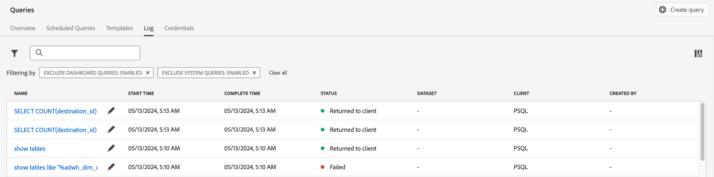

# [!DNL Query Service] guida

Adobe Experience Platform [!DNL Query Service] fornisce un’interfaccia utente che può essere utilizzata per scrivere ed eseguire query, visualizzare query eseguite in precedenza e accedere alle query salvate dagli utenti all’interno dell’organizzazione IMS. Per accedere all’interfaccia in [Adobe Experience Platform](https://platform.adobe.com), seleziona **[!UICONTROL Query]** nella navigazione a sinistra.

## [!DNL Query Editor]

La [!DNL Query Editor] consente di scrivere ed eseguire query senza utilizzare un client esterno. Seleziona **[!UICONTROL Crea query]** per aprire [!DNL Query Editor] e crea una nuova query. Puoi anche accedere al [!DNL Query Editor] selezionando una query dal **[!UICONTROL Registro]** o **[!UICONTROL Sfoglia]** schede. Quando si seleziona una query eseguita o salvata in precedenza, viene aperta la [!DNL Query Editor] e visualizza l&#39;istruzione SQL per la query selezionata.

[!DNL Query Editor] fornisce uno spazio di modifica in cui iniziare a digitare una query. Mentre si digita, l&#39;editor completa automaticamente le parole riservate SQL, le tabelle e i nomi di campo all&#39;interno delle tabelle. Al termine della scrittura della query, seleziona la **Play** per eseguire la query. La **[!UICONTROL Console]** la scheda sotto l’editor mostra cosa [!DNL Query Service] è in corso, per indicare quando è stata restituita una query. La **[!UICONTROL Risultato]** accanto alla console vengono visualizzati i risultati delle query. Consulta la sezione [Guida all’editor delle query](./user-guide.md) per ulteriori informazioni sull&#39;utilizzo di [!DNL Query Editor].

## Sfogliare {#browse}

La **[!UICONTROL Sfoglia]** mostra le query salvate dagli utenti dell’organizzazione. È utile considerarli come progetti di query, in quanto le query salvate qui potrebbero essere ancora in costruzione. Query visualizzate nel **[!UICONTROL Sfoglia]** viene visualizzata anche come query di esecuzione nella scheda **[!UICONTROL Registro]** se sono stati eseguiti in precedenza da [!DNL Query Service].

| Colonna | Descrizione |
| --- | --- |
| Nome | Nome della query creata dall&#39;utente. Puoi selezionare il nome per aprire la query nella [!DNL Query Editor]. È inoltre possibile utilizzare la barra di ricerca per cercare il Nome di una query. Le ricerche sono sensibili all’uso di maiuscole e minuscole. |
| SQL | I primi caratteri della query SQL. Passando il puntatore del mouse sul codice viene visualizzata la query completa. |
| Modificato da | Ultimo utente che ha modificato la query. Qualsiasi utente della tua organizzazione con accesso a [!DNL Query Service] può modificare le query. |
| Ultima modifica | La data e l’ora dell’ultima modifica alla query, nel fuso orario del browser. |

## Registro

La **[!UICONTROL Registro]** fornisce un elenco delle query che sono state eseguite in precedenza. Per impostazione predefinita, il registro elenca le query nella cronologia inversa.

| Colonna | Descrizione |
| --- | --- |
| **[!UICONTROL Nome]** | Nome della query, costituito dai primi caratteri della query SQL. Selezionando il nome si apre la [!DNL Query Editor], che consente di modificare la query. È possibile utilizzare la barra di ricerca per cercare il nome di una query. Le ricerche sono sensibili all’uso di maiuscole e minuscole. |
| **[!UICONTROL Creato da]** | Nome della persona che ha creato la query. |
| **[!UICONTROL Client]** | Client utilizzato per la query. |
| **[!UICONTROL Set di dati]** | Il set di dati di input utilizzato dalla query. Seleziona il set di dati da passare alla schermata dei dettagli del set di dati di input. |
| **[!UICONTROL Stato]** | Lo stato corrente della query. |
| **[!UICONTROL Ultima esecuzione]** | Quando la query è stata eseguita per ultima. Puoi ordinare l’elenco in ordine crescente o decrescente selezionando la freccia su questa colonna. |
| **[!UICONTROL Tempo di esecuzione]** | Il tempo necessario per eseguire la query. |

## Credenziali

La **[!UICONTROL Credenziali]** visualizza le credenziali in scadenza e non in scadenza. Per ulteriori informazioni su come utilizzare queste credenziali per la connessione con client esterni, leggere il [guida alle credenziali](../clients/overview.md).

## Passaggi successivi

Ora che hai familiarità con [!DNL Query Service] interfaccia utente attiva [!DNL Platform], puoi accedere a [!DNL Query Editor] per iniziare a creare progetti di query personalizzati da condividere con altri utenti dell’organizzazione. Per ulteriori informazioni sull’authoring e l’esecuzione di query in [!DNL Query Editor], vedi [Guida utente dell’editor delle query](./user-guide.md).