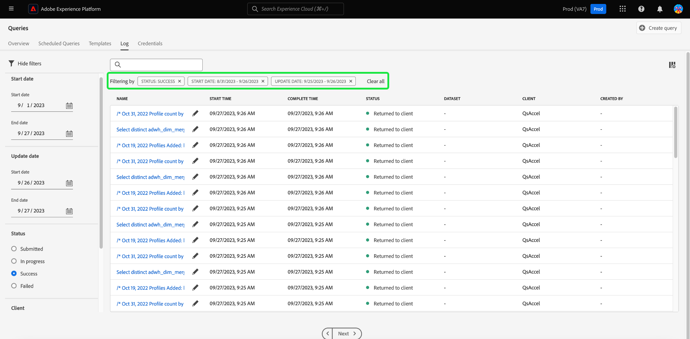

# Registri query

>[!IMPORTANT]
>
>Alcune funzioni dei registri di query sono attualmente in una versione limitata e non sono disponibili per tutti i clienti. L’interfaccia utente potrebbe apparire leggermente diversa senza un’icona di modifica. È inoltre possibile che il processo di selezione di un nome di query passi all&#39;editor query anziché alla visualizzazione [!UICONTROL Dettagli registro query].

Adobe Experience Platform mantiene un registro di tutti gli eventi di query che si verificano sia tramite l’API che tramite l’interfaccia utente. Queste informazioni sono disponibili nell&#39;interfaccia utente di Query Service dalla scheda [!UICONTROL Registri].

I file di registro vengono generati automaticamente da qualsiasi evento di query e contengono informazioni quali l&#39;istruzione SQL utilizzata, lo stato della query, il tempo impiegato e l&#39;ultima esecuzione. È possibile utilizzare i dati di registro delle query come strumento potente per la risoluzione di problemi inefficienti o di query con problemi. Informazioni di registro più complete vengono conservate come parte della funzione del registro di controllo e sono disponibili nella [documentazione del registro di controllo](../../landing/governance-privacy-security/audit-logs/overview.md).

## Controllare i registri query {#check-query-logs}

Per controllare i registri delle query, selezionare [!UICONTROL Query] per passare all&#39;area di lavoro del servizio query e selezionare [!UICONTROL Registro] tra le opzioni disponibili.

>[!NOTE]
>
>Per impostazione predefinita, sono escluse sia le query di sistema che le query del dashboard. Consulta la sezione [filters](#filter-logs) per informazioni su come perfezionare i registri visualizzati in base alle impostazioni.

## Personalizza ed esegui ricerche {#customize-and-search}

I registri di Query Service vengono presentati in un formato di tabella personalizzabile. Per personalizzare le colonne della tabella, selezionare l&#39;icona Impostazioni () a destra dello schermo. Viene visualizzata una finestra di dialogo [!UICONTROL Personalizza tabella] in cui è possibile deselezionare ogni colonna.

Puoi anche cercare i registri relativi a modelli di query specifici digitando il nome del modello nel campo di ricerca.

Nella sezione Log della panoramica di Query Service è disponibile una [descrizione per ogni colonna della tabella di log](./overview.md#log).

## Esplorare i dati di registro

Ogni riga rappresenta i dati di registro per un&#39;esecuzione di query associata a un modello di query. Seleziona una riga della tabella per inserire nella barra laterale a destra i dati di registro per l’esecuzione.

Nel pannello dei dettagli del registro, potete eseguire diverse azioni. È possibile eseguire la query come CTAS, che crea un nuovo set di dati di output, visualizzare o copiare la query SQL completa utilizzata nell&#39;esecuzione oppure eliminare la query.

>[!NOTE]
>
>L&#39;opzione [!UICONTROL Esegui come CTAS] è disponibile solo per una query SELECT.

>[!IMPORTANT]
>
>Alcune funzioni dei registri di query sono attualmente in una versione limitata e non sono disponibili per tutti i clienti.

È inoltre possibile selezionare il nome di un modello di query dalla colonna [!UICONTROL Nome] per passare direttamente alla visualizzazione [!UICONTROL Dettagli registro query].

>[!NOTE]
>
>Se la query è stata creata utilizzando l’API e non è stato fornito alcun nome di modello durante l’inizializzazione, vengono invece visualizzati i primi decine di caratteri della query SQL.

## Modifica registri {#edit-logs}

Accanto al nome del modello di ogni riga o al frammento SQL è presente l&#39;icona di una matita () da utilizzare per passare all&#39;editor di query. La query viene quindi precompilata nell’editor per la modifica.

## Filtra registri {#filter-logs}

Puoi filtrare l’elenco dei registri di query in base a diverse impostazioni. Selezionare l&#39;icona filtro () in alto a sinistra nell&#39;area di lavoro per aprire un set di opzioni filtro nella barra a sinistra.

Viene visualizzato l’elenco dei filtri disponibili.

Nella tabella seguente viene fornita una descrizione di ogni filtro.

| Filtro | Descrizione |
| ------ | ----------- |
| [!UICONTROL Escludi query dashboard] | Questa casella di controllo è attivata per impostazione predefinita ed esclude i registri generati dalle query utilizzate per generare le informazioni. Queste query sono generate dal sistema e nascondono i record dei registri generati dagli utenti e necessari per il monitoraggio, l’amministrazione e la risoluzione dei problemi. Per visualizzare i registri generati dal sistema, deseleziona la casella di controllo. |
| [!UICONTROL Escludi query di sistema] | Questa casella di controllo è attivata per impostazione predefinita ed esclude i registri generati dal sistema. Le query generate dal sistema spesso includono attività in background o operazioni di manutenzione che potrebbero non essere rilevanti per il monitoraggio degli utenti, l’amministrazione o la risoluzione dei problemi. Se devi controllare i registri generati dal sistema, deseleziona questa casella di controllo per includerli nella vista del registro. |
| [!UICONTROL Data di inizio] | Per filtrare i registri per le query create durante un periodo specifico, impostare le date [!UICONTROL Inizio] e [!UICONTROL Fine] nella sezione [!UICONTROL Data inizio]. |
| [!UICONTROL Data completamento] | Per filtrare i registri per le query completate durante un periodo specifico, impostare le date [!UICONTROL Inizio] e [!UICONTROL Fine] nella sezione [!UICONTROL Data completata]. |
| [!UICONTROL Stato] | Per filtrare i registri in base allo [!UICONTROL Stato] della query, selezionare il pulsante di opzione appropriato. Le opzioni disponibili includono [!UICONTROL Inviato], [!UICONTROL In corso], [!UICONTROL Completato] e [!UICONTROL Non riuscito]. Puoi filtrare i registri solo in base a una condizione di stato alla volta. |
| [!UICONTROL Client] | Per filtrare i registri in base al client di query utilizzato, immettere uno dei seguenti valori accettati nel campo di testo libero: `API`, `Adobe Query Service UI` o `QsAccel`. |
| [!UICONTROL Le mie query] | Utilizza l&#39;interruttore [!UICONTROL Query personali] per filtrare i registri delle query eseguite da te. |
| [!UICONTROL ID registro query] | Per filtrare in base all’ID registro univoco di una query, immetti l’ID registro nel campo di testo libero. Queste informazioni sono disponibili in [!UICONTROL Dettagli registro]. |

Tutti i filtri applicati vengono visualizzati sopra i risultati del registro filtrato.

## Passaggi successivi

La lettura di questo documento consente di comprendere meglio come i registri delle query vengono utilizzati e accessibili nell’interfaccia utente di Query Service.

Per ulteriori informazioni sulle funzionalità di Query Service, consulta la [Panoramica dell&#39;interfaccia utente](./overview.md) o la [Guida API di Query Service](../api/getting-started.md).

Per informazioni su come Query Service migliora la visibilità delle esecuzioni pianificate delle query, consulta il [documento sulle query di monitoraggio](./monitor-queries.md).
