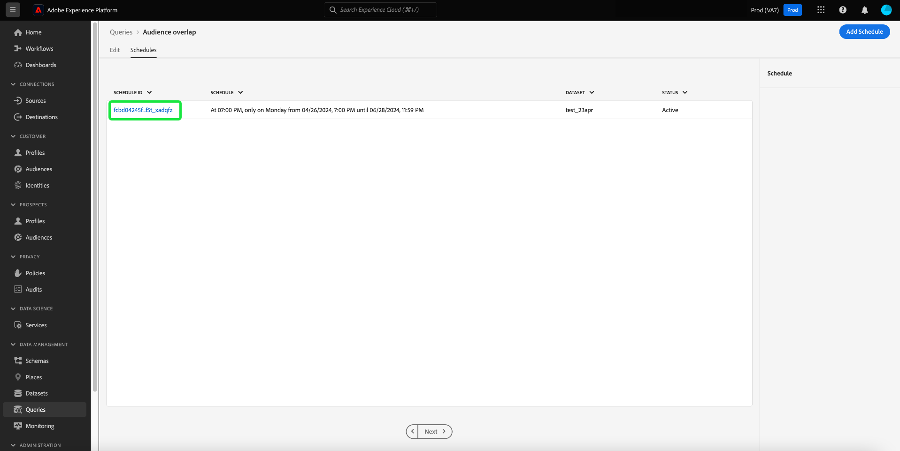
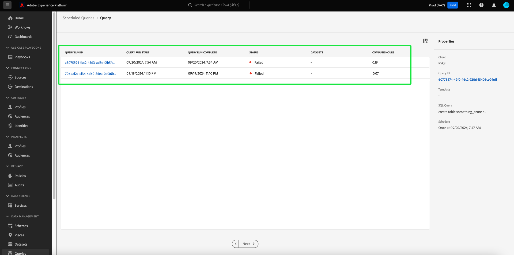

# Pianificazioni query

Puoi automatizzare l’esecuzione delle query creando pianificazioni di query. Le query pianificate vengono eseguite su una frequenza personalizzata per gestire i dati in base a frequenza, data e ora. Se necessario, puoi anche scegliere un set di dati di output per i risultati. Le query salvate come modello possono essere pianificate dall&#39;Editor query.

>[!IMPORTANT]
>
>È possibile aggiungere una pianificazione solo a una query già creata e salvata.

Tutte le query pianificate vengono aggiunte all&#39;elenco nella scheda [!UICONTROL Query pianificate]. Da tale area di lavoro è possibile monitorare lo stato di tutti i processi di query pianificati tramite l’interfaccia utente. Nella scheda [!UICONTROL Query pianificate] puoi trovare informazioni importanti sull&#39;esecuzione della query e iscriverti agli avvisi. Le informazioni disponibili includono lo stato, i dettagli della pianificazione e i messaggi/codici di errore in caso di errore di esecuzione. Per ulteriori informazioni, vedere il documento [Monitorare le query pianificate](./monitor-queries.md).

Questo flusso di lavoro descrive il processo di pianificazione nell’interfaccia utente di Query Service. Per informazioni su come aggiungere pianificazioni utilizzando l&#39;API, leggere la [guida dell&#39;endpoint per le query pianificate](../api/scheduled-queries.md).

## Creare una pianificazione di query {#create-schedule}

Per pianificare una query, selezionare un modello di query dalla scheda [!UICONTROL Modelli] o dalla colonna [!UICONTROL Modello] della scheda [!UICONTROL Query pianificate]. Selezionando il nome del modello si passa all&#39;editor di query.

Se si accede a una query salvata dall&#39;Editor query, è possibile creare una pianificazione per la query o visualizzarne la pianificazione dal pannello dei dettagli.

>[!TIP]
>
>Selezionare **[!UICONTROL Visualizza pianificazione]** per passare all&#39;area di lavoro pianificazioni e visualizzare immediatamente qualsiasi query pianificata eseguita.

![Editor query con [!UICONTROL Visualizza pianificazione] e [!UICONTROL Aggiungi pianificazione] evidenziati.](../images/ui/query-schedules/view-add-schedule.png)

Seleziona **[!UICONTROL Aggiungi pianificazione]** per passare alla [pagina dettagli pianificazione](#schedule-details).

In alternativa, selezionare la scheda **[!UICONTROL Schedules]** sotto il nome della query.

Verrà visualizzata l&#39;area di lavoro pianificazioni. Nell’interfaccia utente viene visualizzato un elenco delle esecuzioni pianificate a cui è associato il modello. Seleziona **[!UICONTROL Aggiungi pianificazione]** per creare una pianificazione.

### Aggiungi dettagli pianificazione {#schedule-details}

Viene visualizzata la pagina dei dettagli della pianificazione. In questa pagina è possibile modificare una serie di dettagli per la query pianificata. I dettagli includono [frequenza e giorno feriale dell&#39;esecuzione pianificata della query](#scheduled-query-frequency), la data di inizio e di fine, il set di dati in cui esportare i risultati e [avvisi sullo stato della query](#alerts-for-query-status).

#### Frequenza query pianificata {#scheduled-query-frequency}

Puoi scegliere le seguenti opzioni per **[!UICONTROL Frequenza]**:

- **[!UICONTROL Oraria]**: la query pianificata verrà eseguita ogni ora per il periodo di date selezionato.
- **[!UICONTROL Giornaliero]**: la query pianificata verrà eseguita ogni X giorni alla data e all&#39;ora selezionate. L&#39;ora selezionata è tra **UTC** e non il tuo fuso orario locale.
- **[!UICONTROL Settimanale]**: la query selezionata verrà eseguita nei giorni della settimana, dell&#39;ora e del periodo selezionato. L&#39;ora selezionata è tra **UTC** e non il tuo fuso orario locale.
- **[!UICONTROL Mensile]**: la query selezionata verrà eseguita ogni mese al giorno, all&#39;ora e al periodo di data selezionati. L&#39;ora selezionata è tra **UTC** e non il tuo fuso orario locale.
- **[!UICONTROL Annuale]**: la query selezionata verrà eseguita ogni anno al giorno, al mese, all&#39;ora e al periodo di data selezionati. L&#39;ora selezionata è tra **UTC** e non il tuo fuso orario locale.

### Fornisci dettagli set di dati {#dataset-details}

Gestisci i risultati della query aggiungendo i dati a un set di dati esistente o creando un nuovo set di dati e aggiungendo i dati a esso.

Selezionare **[!UICONTROL Crea e aggiungi al nuovo set di dati]** per creare un set di dati quando si esegue una query per la prima volta. Le esecuzioni successive continuano a inserire dati in tale set di dati. Infine, fornisci un nome e una descrizione per il set di dati.

>[!IMPORTANT]
>
> Poiché si sta utilizzando un set di dati esistente o creando un nuovo set di dati, **non** deve includere `INSERT INTO` o `CREATE TABLE AS SELECT` come parte della query, poiché i set di dati sono già impostati. L&#39;inclusione di `INSERT INTO` o `CREATE TABLE AS SELECT` come parte delle query pianificate genererà un errore.

![Il pannello Dettagli pianificazione con i dettagli del set di dati e le opzioni [!UICONTROL Crea e aggiungi al nuovo set di dati] sono evidenziati.](../images/ui/query-schedules/dataset-details-create-and-append.png)

In alternativa, selezionare **[!UICONTROL Aggiungi al set di dati esistente]** seguito dall&#39;icona del set di dati ().

Viene visualizzata la finestra di dialogo **[!UICONTROL Seleziona set di dati di output]**.

Quindi, sfoglia i set di dati esistenti o utilizza il campo di ricerca per filtrare le opzioni. Seleziona la riga del set di dati da utilizzare. I dettagli del set di dati vengono visualizzati nel pannello a destra. Seleziona **[!UICONTROL Fine]** per confermare la scelta.

### Quarantena le query in caso di errore continuo {#quarantine}

Durante la creazione di una pianificazione, puoi registrare la query nella funzione di quarantena per proteggere le risorse di sistema e prevenire potenziali interruzioni. La funzionalità di quarantena identifica e isola automaticamente le query che hanno ripetutamente esito negativo inserendole in uno stato [!UICONTROL In quarantena]. Mettendo in quarantena le query dopo dieci errori consecutivi, puoi intervenire, rivedere e rettificare i problemi prima di consentire ulteriori esecuzioni. In questo modo è possibile mantenere l&#39;efficienza operativa e l&#39;integrità dei dati.

![Area di lavoro Pianificazioni query con [!UICONTROL Quarantena query] evidenziata e Sì selezionata.](../images/ui/query-schedules/quarantine-enroll.png)

Dopo aver registrato una query per la funzione di quarantena, puoi attivare gli avvisi per questa modifica dello stato della query. Se una query pianificata non è registrata in quarantena, non viene visualizzata come opzione nella [finestra di dialogo Avvisi](./monitor-queries.md#alert-subscription).

È inoltre possibile registrare una query pianificata nella funzionalità di quarantena dalle azioni in linea della scheda [!UICONTROL Query pianificate]. Per ulteriori dettagli, consulta la [documentazione delle query di monitoraggio](./monitor-queries.md#alert-subscription).

### Impostare gli avvisi per uno stato di query pianificata {#alerts-for-query-status}

È inoltre possibile abbonarsi agli avvisi di query come parte delle impostazioni di query pianificate. Puoi configurare le impostazioni per ricevere notifiche per una serie di situazioni. Gli avvisi possono essere impostati per uno stato di quarantena, ritardi nell’elaborazione delle query o una modifica dello stato della query. Le opzioni di avviso dello stato della query disponibili includono avvio, operazione riuscita ed errore. Gli avvisi possono essere ricevuti come notifiche pop-up o e-mail. Selezionare la casella di controllo per sottoscrivere gli avvisi relativi allo stato della query pianificata.

La tabella seguente spiega i tipi di avviso per le query supportati:

| Tipo di avviso | Descrizione |
|---|---|
| `start` | Questo avviso avvisa quando viene avviata o avviata l&#39;elaborazione di una query pianificata. |
| `success` | Questo avviso informa l&#39;utente quando una query pianificata viene eseguita correttamente, indicando che la query è stata eseguita senza errori. |
| `failed` | Questo avviso viene attivato quando una query pianificata viene eseguita con un errore o non viene eseguita correttamente. Consente di identificare e risolvere tempestivamente i problemi. |
| `quarantine` | Questo avviso viene attivato quando un’esecuzione di query pianificata viene messa in quarantena. Una volta che una query è [registrata nella funzionalità di quarantena](#quarantine), qualsiasi query pianificata che non riesce a eseguire dieci esecuzioni consecutive viene automaticamente posta in uno stato [!UICONTROL In quarantena]. Una query in quarantena richiede quindi l’intervento dell’utente prima di poter eseguire ulteriori esecuzioni. Nota: per poter sottoscrivere avvisi di quarantena, è necessario registrare le query per la funzione di quarantena. |
| `delay` | Questo avviso notifica se si verifica un [ritardo nell&#39;esito di un&#39;esecuzione di una query pianificata](./monitor-queries.md#query-run-delay) oltre la soglia specificata. È possibile impostare un&#39;ora personalizzata che attivi l&#39;avviso quando la query viene eseguita per tale durata senza completare o non riuscire. Il comportamento predefinito imposta un avviso per 150 minuti dopo l’inizio dell’elaborazione della query. |

>[!NOTE]
>
>Se scegli di impostare un avviso di [!UICONTROL Ritardo esecuzione query], devi impostare il tempo di ritardo desiderato in minuti nell&#39;interfaccia utente di Platform. Immetti la durata in minuti. Il ritardo massimo è di 24 ore (1440 minuti).

Per una panoramica degli avvisi in Adobe Experience Platform, inclusa la struttura della definizione delle regole di avviso, vedere la [panoramica degli avvisi](../../observability/alerts/overview.md). Per informazioni sulla gestione degli avvisi e delle regole di avviso nell&#39;interfaccia utente di Adobe Experience Platform, vedere la [guida dell&#39;interfaccia utente degli avvisi](../../observability/alerts/ui.md).

### Impostare i parametri per una query con parametri pianificata {#set-parameters}

>[!IMPORTANT]
>
>La funzionalità dell&#39;interfaccia utente per query con parametri è attualmente disponibile solo in una **versione limitata** e non è disponibile per tutti i clienti. Se non hai accesso alle query con parametri, continua con la sezione [elimina o disabilita una pianificazione](#delete-schedule).

Se si crea una query pianificata per una query con parametri, è necessario impostare i valori dei parametri per queste esecuzioni della query.

Dopo aver confermato i dettagli della pianificazione, seleziona **[!UICONTROL Salva]** per creare una pianificazione. Viene visualizzata di nuovo la scheda Pianificazioni del modello. In questa area di lavoro vengono visualizzati i dettagli della pianificazione appena creata, inclusi l’ID pianificazione, la pianificazione stessa e il set di dati di output della pianificazione.

## Visualizza esecuzioni query pianificate {#scheduled-query-runs}

Dalla scheda [!UICONTROL Schedules] del modello, seleziona l&#39;ID pianificazione per passare all&#39;elenco delle query eseguite per la query appena pianificata.

In alternativa, per visualizzare un elenco delle esecuzioni pianificate di un modello di query, passare alla scheda **[!UICONTROL Query pianificate]** e selezionare un nome di modello dall&#39;elenco disponibile.

Viene visualizzato l&#39;elenco delle query eseguite per la query pianificata.

Per informazioni complete su come monitorare lo stato di tutti i processi di query tramite l&#39;interfaccia utente, vedere la [guida monitoraggi pianificati per query](./monitor-queries.md#inline-actions).

Selezionare un **[!UICONTROL ID esecuzione query]** dall&#39;elenco per passare alla panoramica esecuzione query. Per un&#39;analisi completa delle informazioni disponibili nella [panoramica sull&#39;esecuzione delle query](./monitor-queries.md#query-run-overview), vedere la documentazione relativa al monitoraggio delle query pianificate.

Per monitorare le query pianificate tramite l&#39;API Query Service, vedere la [guida degli endpoint per l&#39;esecuzione pianificata delle query](../api/runs-scheduled-queries.md).

## Abilitare, disabilitare o eliminare una pianificazione {#delete-schedule}

È possibile abilitare, disabilitare o eliminare una pianificazione dall&#39;area di lavoro pianificazioni di una determinata query o dall&#39;area di lavoro [!UICONTROL Query pianificate] in cui sono elencate tutte le query pianificate.

Per accedere alla scheda [!UICONTROL Schedules] della query scelta, è necessario selezionare il nome di un modello di query dalla scheda [!UICONTROL Templates] o dalla scheda [!UICONTROL Scheduled Queries]. Consente di passare all&#39;editor delle query per la query. Dall&#39;editor delle query, selezionare **[!UICONTROL Schedules]** per accedere all&#39;area di lavoro delle pianificazioni.

Seleziona una pianificazione dalle righe delle pianificazioni disponibili per popolare il pannello dei dettagli. Utilizza l’interruttore per disabilitare (o abilitare) la query pianificata.

### Eliminare le query disabilitate

>[!IMPORTANT]
>
>È necessario disattivare la pianificazione prima di eliminare una pianificazione per una query.

Viene visualizzata una finestra di dialogo di conferma. Seleziona **[!UICONTROL Disattiva]** per confermare l&#39;azione.

Selezionare **[!UICONTROL Elimina una pianificazione]** per eliminare la pianificazione disabilitata.

In alternativa, la scheda [!UICONTROL Query pianificate] offre una raccolta di azioni in linea per ogni query pianificata. Le azioni in linea disponibili includono [!UICONTROL Disabilita pianificazione] o [!UICONTROL Abilita pianificazione], [!UICONTROL Elimina pianificazione] e [!UICONTROL Abbonati] agli avvisi per la query pianificata. Per istruzioni complete su come eliminare o disabilitare una query pianificata tramite la scheda Query pianificate, vedere la [guida Monitoraggio query pianificate](./monitor-queries.md#inline-actions).
