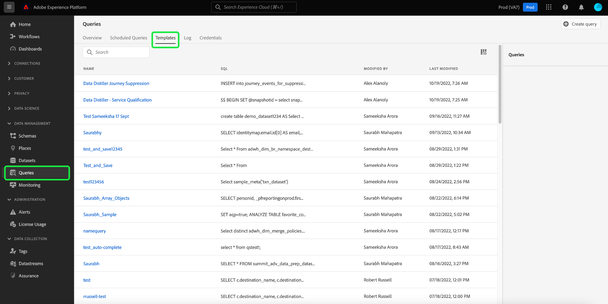

# Modelli di query

Adobe Experience Platform Query Service consente di salvare e riutilizzare il codice SQL sotto forma di modelli di query. I modelli consentono di risparmiare tempo evitando la ripetizione delle attività più comuni. È possibile condividere modelli all&#39;interno dell&#39;organizzazione e modificare facilmente i valori della query senza dover accedere o comprendere il SQL sottostante.

Questo documento fornisce le informazioni necessarie per creare modelli di query in Query Service.

## Prerequisiti

Devi avere la [!UICONTROL Gestire le query] l’autorizzazione è abilitata per accedere all’editor delle query e visualizzare il dashboard delle query nell’interfaccia utente di Platform. L’autorizzazione viene abilitata tramite l’Adobe [Admin Console](https://adminconsole.adobe.com/). Se non disponi dei privilegi di amministratore per abilitare questa autorizzazione, contatta l’amministratore della tua organizzazione. Consulta la documentazione sul controllo degli accessi per [istruzioni complete sull&#39;aggiunta di autorizzazioni tramite Admin Console](../../access-control/home.md).

## Creare un modello di query

È possibile creare modelli di query tramite due metodi, sia effettuando una richiesta di POST all’API del servizio query `query-templates` o scrivendo, denominando e salvando una query tramite l’editor delle query.

### Utilizza l’editor delle query per creare e salvare una query come modello

Consulta la documentazione per le istruzioni su come utilizzare l’editor delle query per [scrivere](./user-guide.md#query-authoring) e [salvare le query](./user-guide.md#saving-queries). Dopo aver denominato e salvato la query, questa può essere riutilizzata come modello di query dal [!UICONTROL Sfoglia] scheda .

Dall’area di lavoro Query dell’interfaccia utente della piattaforma, seleziona **[!UICONTROL Sfoglia]** per visualizzare l&#39;elenco delle query salvate disponibili.

Per trovare informazioni rilevanti sul modello, seleziona un modello di query dall’elenco disponibile per aprire il pannello dei dettagli.

### Utilizza l’API del servizio query per creare un modello

Consulta la documentazione per le istruzioni su [come creare un modello di query](../api/query-templates.md#create-a-query-template) utilizzando l’API del servizio query. I dettagli di un modello di query appena creato sono contenuti nel corpo della risposta.

>[!NOTE]
>
>I modelli creati utilizzando l’API sono visibili anche nella scheda Sfoglia del servizio query dell’interfaccia utente di Platform.

## Passaggi successivi

Leggendo questo documento, ora è possibile comprendere meglio come creare modelli di query in Query Service. Consulta la sezione [Panoramica dell’interfaccia utente](./overview.md)o [Guida all’API del servizio query](../api/getting-started.md) per ulteriori informazioni sulle funzionalità di Query Service.

Consulta la sezione [guida all’endpoint delle query pianificate](../api/scheduled-queries.md) per scoprire come pianificare le query utilizzando l’API, o [Guida all’editor delle query](./user-guide.md#scheduled-queries) per l’interfaccia utente.
