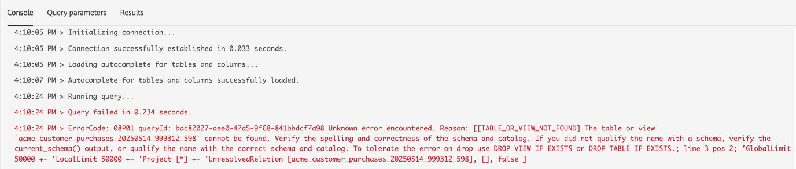
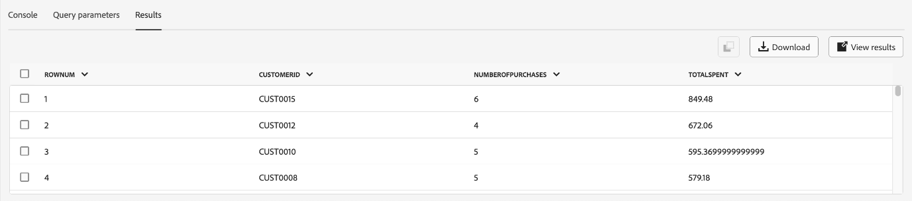

# [!DNL Query Editor] Guida all’interfaccia utente

[!DNL Query Editor] è uno strumento interattivo fornito da Adobe Experience Platform [!DNL Query Service], che consente di scrivere, convalidare ed eseguire query per i dati sulla customer experience in [!DNL Experience Platform] dell&#39;utente. [!DNL Query Editor] supporta lo sviluppo di query per l’analisi e l’esplorazione dei dati e consente di eseguire query interattive a scopo di sviluppo, nonché query non interattive per popolare i set di dati in [!DNL Experience Platform].

Per ulteriori informazioni sui concetti e le funzionalità di [!DNL Query Service], vedere [Panoramica di Query Service](../home.md). Per ulteriori informazioni su come navigare nell’interfaccia utente di Query Service su [!DNL Platform], vedere [Panoramica dell’interfaccia utente di Query Service](./overview.md).

## Introduzione {#getting-started}

[!DNL Query Editor] fornisce un’esecuzione flessibile delle query tramite la connessione a [!DNL Query Service]Le query, e vengono eseguite solo quando la connessione è attiva.

### Connessione a [!DNL Query Service] {#connecting-to-query-service}

[!DNL Query Editor] richiede alcuni secondi per l&#39;inizializzazione e la connessione [!DNL Query Service] quando viene aperto. La console indica quando è collegata, come illustrato di seguito. Se tenti di eseguire una query prima che l’editor si sia connesso, l’esecuzione viene rimandata fino al completamento della connessione.

### Esecuzione delle query da [!DNL Query Editor] {#run-a-query}

Query eseguite da [!DNL Query Editor] esegui in modo interattivo, il che significa che se chiudi il browser o esci, la query viene annullata. Lo stesso vale per le query eseguite per generare set di dati dagli output delle query.

## Creazione di query tramite [!DNL Query Editor] {#query-authoring}

Utilizzo di [!DNL Query Editor], puoi scrivere, eseguire e salvare query per i dati sull’esperienza del cliente. Tutte le query eseguite o salvate in [!DNL Query Editor] sono disponibili per tutti gli utenti dell’organizzazione con accesso a [!DNL Query Service].

### Accesso [!DNL Query Editor] {#accessing-query-editor}

In [!DNL Experience Platform] UI, seleziona **[!UICONTROL Query]** nel menu di navigazione sinistro per aprire [!DNL Query Service] Workspace. Quindi, per iniziare a scrivere le query, seleziona **[!UICONTROL Crea query]** in alto a destra. Questo collegamento è disponibile da una qualsiasi delle pagine di [!DNL Query Service] Workspace.

### Attivazione/disattivazione editor di query avanzato {#enhanced-editor-toggle}

>[!CONTEXTUALHELP]
>id="platform_queryService_queryEditor_enhancedEditorToggle"
>title="Attivazione/disattivazione editor avanzato"
>abstract="Consente di passare dalla versione precedente a quella avanzata dell’editor di query. La versione precedente è abilitata per impostazione predefinita, anche se la versione migliorata fornisce una migliore accessibilità e il supporto a più temi. Per ulteriori informazioni su queste modifiche, consulta la documentazione."

Un interruttore dell’interfaccia utente consente di passare dalla versione legacy alla versione avanzata dell’editor di query. La versione precedente è abilitata per impostazione predefinita, anche se la versione migliorata fornisce una migliore accessibilità e il supporto a più temi. Abilita la versione avanzata per accedere alle impostazioni dell’editor di query.

Attivando l’interruttore, l’editor diventa leggero e migliora la leggibilità della sintassi. Sopra il campo di input dell’editor di query viene visualizzata un’icona delle impostazioni che incorpora l’interruttore di completamento automatico. Dall’icona delle impostazioni, puoi abilitare il tema scuro o disabilitare/abilitare il completamento automatico.

>[!TIP]
>
>L’editor di query avanzato consente di: [!UICONTROL Disabilita completamento automatico sintassi] durante l’authoring di una query senza perdere l’avanzamento. In genere, se si disattiva la funzione di completamento automatico durante la modifica, tutte le modifiche apportate alla query andranno perse.

Per attivare i temi scuri o chiari, selezionare l&#39;icona delle impostazioni () seguito dall&#39;opzione nel menu a discesa visualizzato.

### Scrittura delle query {#writing-queries}

[!UICONTROL Editor query] è organizzato in modo da rendere la scrittura delle query il più semplice possibile. La schermata seguente mostra come viene visualizzato l’editor nell’interfaccia utente, con il campo di immissione SQL e **Play** evidenziato.

Per ridurre al minimo il tempo di sviluppo, ti consigliamo di sviluppare le query con limiti per le righe restituite. Ad esempio, `SELECT fields FROM table WHERE conditions LIMIT number_of_rows`. Dopo aver verificato che la query produca l’output previsto, rimuovi i limiti ed esegui la query con `CREATE TABLE tablename AS SELECT` per generare un set di dati con l’output.

### Strumenti di scrittura in [!DNL Query Editor] {#writing-tools}

- **Evidenziazione automatica della sintassi:** Semplifica la lettura e l&#39;organizzazione di SQL.

- **Completamento automatico parola chiave SQL:** Inizia a digitare la query, quindi utilizza i tasti freccia per passare al termine desiderato e premi **Invio**.

- **Completamento automatico tabella e campo:** Inizia a digitare il nome della tabella che desideri `SELECT` da, quindi utilizzare i tasti freccia per passare alla tabella desiderata e premere **Invio**. Dopo aver selezionato una tabella, il completamento automatico riconosce i campi della tabella.

### Attivazione/disattivazione della configurazione dell’interfaccia utente a completamento automatico {#auto-complete}

Il [!DNL Query Editor] suggerisce automaticamente parole chiave SQL potenziali insieme ai dettagli di tabella o colonna per la query durante la scrittura. La funzione di completamento automatico è abilitata per impostazione predefinita e può essere disabilitata o abilitata in qualsiasi momento selezionando [!UICONTROL Completamento automatico della sintassi] passa in alto a destra nell’editor di query.

L’impostazione di configurazione del completamento automatico è per utente e viene memorizzata per gli accessi consecutivi per tale utente.

La disattivazione di questa funzione interrompe l’elaborazione di diversi comandi di metadati e fornisce consigli che in genere migliorano la velocità dell’autore durante la modifica delle query.

Quando si utilizza l’interruttore per abilitare la funzione di completamento automatico, dopo una breve pausa diventano disponibili i suggerimenti consigliati per i nomi di tabelle e colonne e le parole chiave SQL. Un messaggio di operazione riuscita nella console sotto l’editor di query indica che la funzione è attiva.

Se disattivate la funzione di completamento automatico, è necessario aggiornare la pagina per rendere effettiva la funzione. Viene visualizzata una finestra di dialogo di conferma con tre opzioni quando disattivi il [!UICONTROL Completamento automatico della sintassi] toggle:

- [!UICONTROL Annulla]
- [!UICONTROL Salva modifiche e aggiorna]
- [!UICONTROL Aggiorna senza salvare le modifiche]

>[!IMPORTANT]
>
>Se si sta scrivendo o modificando una query quando si disabilita questa funzione, è necessario salvare le modifiche apportate alla query prima di aggiornare la pagina. In caso contrario, tutto l&#39;avanzamento andrà perduto.

Per disattivare la funzione di completamento automatico, selezionare l&#39;opzione di conferma appropriata.

### Rilevamento di errori {#error-detection}

[!DNL Query Editor] convalida automaticamente una query durante la scrittura, fornendo una convalida SQL generica e una convalida di esecuzione specifica. Se sotto la query viene visualizzata una sottolineatura rossa (come illustrato nell&#39;immagine riportata di seguito), si verifica un errore all&#39;interno della query.

Quando vengono rilevati errori, è possibile visualizzare i messaggi di errore specifici passando il puntatore del mouse sul codice SQL.

### Dettagli query {#query-details}

Per visualizzare una query nell’editor delle query, seleziona un modello salvato dall’ [!UICONTROL Modelli] scheda. Il pannello Dettagli query fornisce ulteriori informazioni e strumenti per gestire la query selezionata.

Questo pannello consente di generare un set di dati di output direttamente dall’interfaccia utente, eliminare o denominare la query visualizzata e aggiungere una pianificazione alla query.

Questo pannello mostra anche metadati utili, come l’ultima volta che la query è stata modificata e chi l’ha modificata, se applicabile. Per generare un set di dati, seleziona **[!UICONTROL Set di dati di output]**. Il **[!UICONTROL Set di dati di output]** viene visualizzata. Inserisci un nome e una descrizione, quindi seleziona **[!UICONTROL Esegui query]**. Il nuovo set di dati viene visualizzato in **[!UICONTROL Set di dati]** scheda della [!DNL Query Service] interfaccia utente su [!DNL Platform].

### Query pianificate {#scheduled-queries}

Le query salvate come modello possono essere pianificate dall&#39;Editor query. La pianificazione delle query consente di automatizzare l’esecuzione delle query su una cadenza personalizzata. Puoi pianificare le query in base a frequenza, data e ora e, se necessario, scegliere anche un set di dati di output per i risultati. Le pianificazioni delle query possono anche essere disabilitate o eliminate tramite l’interfaccia utente.

Le pianificazioni vengono impostate nell&#39;editor delle query. Quando si utilizza l&#39;editor delle query, è possibile aggiungere una pianificazione solo a una query già creata, salvata ed eseguita. La stessa limitazione non si applica al [!DNL Query Service] API:

Consulta la documentazione sulle pianificazioni delle query per scoprire come [creare pianificazioni di query nell’interfaccia utente](./query-schedules.md). In alternativa, per scoprire come aggiungere pianificazioni utilizzando l’API, leggi [guida dell’endpoint &quot;scheduled queries&quot;](../api/scheduled-queries.md).

Tutte le query pianificate vengono aggiunte all’elenco in [!UICONTROL Query pianificate] scheda. Da tale area di lavoro è possibile monitorare lo stato di tutti i processi di query pianificati tramite l’interfaccia utente. Il giorno [!UICONTROL Query pianificate] , puoi trovare informazioni importanti sull’esecuzione della query e abbonarti agli avvisi. Le informazioni disponibili includono lo stato, i dettagli della pianificazione e i messaggi/codici di errore in caso di esecuzione non riuscita. Consulta la [Monitorare il documento delle query pianificate](./monitor-queries.md) per ulteriori informazioni.

### Salvataggio delle query {#saving-queries}

Il [!DNL Query Editor] fornisce una funzione di salvataggio che consente di salvare una query e lavorarci in un secondo momento. Per salvare una query, seleziona **[!UICONTROL Salva]** nell’angolo in alto a destra di [!DNL Query Editor]. Prima di poter salvare una query, è necessario specificarne il nome utilizzando **[!UICONTROL Dettagli query]** pannello.

>[!NOTE]
>
>Le query denominate e salvate in mediante l&#39;Editor query sono disponibili come modelli nel dashboard Query [!UICONTROL Modelli] scheda. Consulta la [documentazione sui modelli](./query-templates.md) per ulteriori informazioni.

### Come trovare le query precedenti {#previous-queries}

Tutte le query eseguite da [!DNL Query Editor] vengono acquisiti nella tabella Log. È possibile utilizzare la funzionalità di ricerca in **[!UICONTROL Log]** per trovare le esecuzioni della query. Le query salvate sono elencate in **[!UICONTROL Modelli]** scheda.

Se è stata pianificata una query, il [!UICONTROL Query pianificate] fornisce una migliore visibilità tramite l’interfaccia utente per tali processi di query. Consulta la [documentazione sul monitoraggio delle query](./monitor-queries.md) per ulteriori informazioni.

>[!NOTE]
>
>Le query non eseguite non vengono salvate dal registro. Affinché la query sia disponibile in [!DNL Query Service], deve essere eseguito o salvato in [!DNL Query Editor].

## Esecuzione di query tramite Editor query {#executing-queries}

Per eseguire una query in [!DNL Query Editor], è possibile immettere le istruzioni SQL nell&#39;editor o caricare una query precedente dal **[!UICONTROL Log]** o **[!UICONTROL Modelli]** e seleziona **Play**. Lo stato dell’esecuzione della query viene visualizzato nel **[!UICONTROL Console]** e i dati di output sono visualizzati nella scheda **[!UICONTROL Risultati]** scheda.

### Console {#console}

La console fornisce informazioni sullo stato e sul funzionamento di [!DNL Query Service]. Nella console viene visualizzato lo stato della connessione a [!DNL Query Service], le operazioni di query in esecuzione ed eventuali messaggi di errore derivanti da tali query.

>[!NOTE]
>
>La console mostra solo gli errori derivanti dall’esecuzione di una query. Non mostra gli errori di convalida della query che si verificano prima dell’esecuzione di una query.

### Risultati della query {#query-results}

Al termine di una query, i risultati vengono visualizzati nella **[!UICONTROL Risultati]** accanto alla scheda **[!UICONTROL Console]** scheda. Questa vista mostra l’output tabulare della query, visualizzando fino a 100 righe. Questa vista consente di verificare che la query produca l’output previsto. Per generare un set di dati con la query, rimuovi i limiti sulle righe restituite ed esegui la query con `CREATE TABLE tablename AS SELECT` per generare un set di dati con l’output. Consulta la [esercitazione sulla generazione di set di dati](./create-datasets.md) per istruzioni su come generare un set di dati dai risultati della query in [!DNL Query Editor].

## Eseguire query con [!DNL Query Service] video tutorial {#query-tutorial-video}

Il video seguente illustra come eseguire query nell’interfaccia di Adobe Experience Platform e in un client PSQL. Il video illustra inoltre l’utilizzo di singole proprietà in un oggetto XDM, di funzioni definite dall’Adobe e di query CREATE TABLE AS SELECT (CTAS).

>[!VIDEO](https://video.tv.adobe.com/v/29796?quality=12&learn=on)

## Passaggi successivi

Ora che sai quali funzioni sono disponibili in [!DNL Query Editor] e come esplorare l’applicazione, puoi iniziare a creare query personalizzate direttamente in [!DNL Platform]. Per ulteriori informazioni sull’esecuzione di query SQL sui set di dati in [!DNL Data Lake], consulta la guida [esecuzione di query](../best-practices/writing-queries.md).
