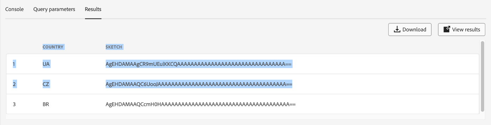

# Guida dell’interfaccia utente di Query Editor

Query Editor è uno strumento interattivo fornito da Adobe Experience Platform Query Service che consente di scrivere, convalidare ed eseguire query per i dati sull&#39;esperienza del cliente nell&#39;interfaccia utente [!DNL Experience Platform]. L&#39;editor delle query supporta lo sviluppo di query per l&#39;analisi e l&#39;esplorazione dei dati e consente di eseguire query interattive a scopo di sviluppo e query non interattive per popolare i set di dati in [!DNL Experience Platform].

Per ulteriori informazioni sui concetti e le funzionalità di Query Service, vedere [Panoramica di Query Service](../home.md). Per ulteriori informazioni su come esplorare l&#39;interfaccia utente di Query Service su [!DNL Experience Platform], vedere [Panoramica dell&#39;interfaccia utente di Query Service](./overview.md).

## Introduzione {#getting-started}

L’editor delle query fornisce un’esecuzione flessibile delle query tramite la connessione a Query Service e le query vengono eseguite solo quando la connessione è attiva.

## Accesso all’editor delle query {#accessing-query-editor}

Nell&#39;interfaccia utente [!DNL Experience Platform], selezionare **[!UICONTROL Query]** nel menu di navigazione sinistro per aprire l&#39;area di lavoro Servizio query. Quindi, per iniziare a scrivere le query, seleziona **[!UICONTROL Crea query]** in alto a destra dello schermo. Questo collegamento è disponibile da una qualsiasi delle pagine dell’area di lavoro Servizio query.

### Connessione a Query Service {#connecting-to-query-service}

L’editor delle query impiega alcuni secondi per inizializzare e connettersi a Query Service quando viene aperto. La console indica quando è collegata, come illustrato di seguito. Se tenti di eseguire una query prima che l’editor si sia connesso, l’esecuzione viene rimandata fino al completamento della connessione.

### Esecuzione delle query dall’editor delle query {#run-a-query}

Le query eseguite dall’editor delle query vengono eseguite in modo interattivo, il che significa che se chiudi il browser o esci, la query viene annullata. Lo stesso vale per le query eseguite per generare set di dati dagli output delle query.

## Creazione di query tramite l’Editor di query avanzato {#query-authoring}

Utilizzando l’editor delle query, puoi scrivere, eseguire e salvare query per i dati sull’esperienza del cliente. Tutte le query eseguite o salvate nell’editor delle query sono disponibili per tutti gli utenti dell’organizzazione che hanno accesso a Query Service.

### Selettore database {#database-selector}

Selezionare un database per la query dal menu a discesa in alto a destra dell&#39;editor di query. Il database selezionato viene visualizzato nel menu a discesa.

### Impostazioni {#settings}

Un&#39;icona delle impostazioni sopra il campo di input di Query Editor include opzioni per abilitare/disabilitare il tema scuro o disabilitare/abilitare il completamento automatico.

>[!TIP]
>
>È possibile [!UICONTROL Disattivare il completamento automatico della sintassi] durante la creazione di una query senza perdere l&#39;avanzamento.

Per attivare i temi scuri o chiari, selezionare l&#39;icona delle impostazioni () seguita dall&#39;opzione visualizzata nel menu a discesa.

#### Completamento automatico {#auto-complete}

L&#39;editor delle query suggerisce automaticamente parole chiave SQL potenziali insieme ai dettagli di tabella o colonna per la query durante la scrittura. La funzione di completamento automatico è attivata per impostazione predefinita e può essere disattivata o attivata in qualsiasi momento dalle impostazioni dell’editor delle query.

L’impostazione di configurazione del completamento automatico è per utente e viene memorizzata per gli accessi consecutivi per tale utente. La disattivazione di questa funzione interrompe l’elaborazione di diversi comandi di metadati e fornisce consigli che in genere migliorano la velocità dell’autore durante la modifica delle query.

### Eseguire più query sequenziali {#execute-multiple-sequential-queries}

Utilizza l’Editor query avanzato per scrivere più di una query ed eseguire tutte le query in modo sequenziale. L’esecuzione di più query in una sequenza genera ciascuna una voce di registro. Tuttavia, solo i risultati della prima query vengono visualizzati nella console dell’editor delle query. Se hai la necessità di risolvere i problemi o confermare le query eseguite, controlla il registro delle query. Per ulteriori informazioni, consulta la [documentazione dei registri di query](./query-logs.md).

>[!NOTE]
> 
>Se una query CTAS viene eseguita dopo la prima query nell’editor delle query, viene comunque creata una tabella, ma non è presente alcun output nella console dell’editor delle query.

### Esegui query selezionata {#execute-selected-query}

Se hai scritto più query ma devi eseguirne una sola, puoi evidenziare la query scelta e selezionare la
[!UICONTROL Icona Esegui query selezionata]. Questa icona è disattivata per impostazione predefinita finché non selezioni la sintassi della query all’interno dell’editor.

![Editor query con l&#39;icona [!UICONTROL Esegui query selezionata] evidenziata.](../images/ui/query-editor/run-selected-query.png)

### Annulla sessione editor query {#cancel-query}

Controlla l’esecuzione delle query e migliora la produttività annullando le query con tempi di esecuzione lunghi. Questa azione cancella l&#39;Editor query durante l&#39;esecuzione di una query. Tieni presente che la query continua a essere eseguita in background. Se si tratta di una query CTAS, verrà comunque generato un set di dati di output. Per annullare l&#39;esecuzione nell&#39;editor e continuare a comporre un&#39;istruzione SQL, selezionare **[!UICONTROL Annulla query]** dopo aver eseguito una query.

![Editor query con [!UICONTROL Annulla query] evidenziato.](../images/ui/query-editor/cancel-query-run.png)

Viene visualizzata una finestra di dialogo di conferma. Selezionare **[!UICONTROL Conferma]** per annullare l&#39;esecuzione della query.

### Conteggio risultati {#result-count}

L’editor delle query può contenere un massimo di 50.000 righe. Puoi scegliere il numero di righe da visualizzare contemporaneamente nella console dell’editor delle query. Per modificare il numero di righe visualizzate nella console, seleziona l&#39;elenco a discesa **[!UICONTROL Numero risultati]** e le opzioni 50, 100, 150, 300, 500 e 1000.

>[!NOTE]
>
>Poiché l’interfaccia utente di Experience Platform può supportare fino a 1000 righe, il passaggio di un valore LIMIT superiore a 1000 viene ignorato.

## Scrittura delle query {#writing-queries}

[!UICONTROL L&#39;editor di query] è organizzato in modo da semplificare al massimo la scrittura delle query. La schermata seguente mostra come viene visualizzato l&#39;editor nell&#39;interfaccia utente, con il campo di immissione SQL e **Riproduci** evidenziati.

Per ridurre al minimo il tempo di sviluppo, ti consigliamo di sviluppare le query con limiti al numero di righe restituite. Ad esempio, `SELECT fields FROM table WHERE conditions LIMIT number_of_rows`. Dopo aver verificato che la query produca l&#39;output previsto, rimuovere i limiti ed eseguire la query con `CREATE TABLE tablename AS SELECT` per generare un set di dati con l&#39;output.

## Strumenti di scrittura nell’editor delle query {#writing-tools}

Utilizza gli strumenti di scrittura dell’editor delle query per migliorare il processo di creazione delle query. Le funzionalità includono opzioni per la formattazione del testo, la copia delle istruzioni SQL, la gestione dei dettagli delle query e il salvataggio o la pianificazione del lavoro in corso.

### Formatta testo {#format-text}

La funzionalità [!UICONTROL Formatta testo] rende la query più leggibile aggiungendo uno stile di sintassi standardizzato. Selezionare **[!UICONTROL Formato testo]** per standardizzare tutto il testo nell&#39;editor di query.

>[!NOTE]
>
>La funzionalità [!UICONTROL Formatta testo] non funziona con blocchi anonimi. Per informazioni su come concatenare una o più istruzioni SQL in sequenza, vedere la [documentazione sui blocchi anonimi](../key-concepts/anonymous-block.md).

![Editor query con [!UICONTROL Formato testo] e istruzioni SQL evidenziate.](../images/ui/query-editor/format-text.png)

<!-- ### Undo text {#undo-text}

If you format your SQL in the Query Editor, you can undo the formatting applied by the [!UICONTROL Format text] feature. To return your SQL back to its original form, select **[!UICONTROL Undo text]**.

![The Query Editor with [!UICONTROL Undo text] and the SQL statements highlighted.](../images/ui/query-editor/undo-text.png) -->

### Copia SQL {#copy-sql}

Selezionare l&#39;icona Copia per copiare SQL dall&#39;editor di query negli Appunti. Questa funzione di copia è disponibile sia per i modelli di query che per le query appena create nell’Editor query.

### Dettagli query {#query-details}

Per visualizzare una query nell&#39;editor delle query, selezionare un modello salvato dalla scheda [!UICONTROL Modelli]. Il pannello Dettagli query fornisce ulteriori informazioni e strumenti per gestire la query selezionata. Mostra inoltre metadati utili, ad esempio l’ultima volta che la query è stata modificata e chi l’ha modificata, se applicabile.

>[!NOTE]
>
>Le opzioni [!UICONTROL Visualizza pianificazione], [!UICONTROL Aggiungi pianificazione] e [!UICONTROL Elimina query] sono disponibili solo dopo il salvataggio della query come modello. L&#39;opzione [!UICONTROL Aggiungi pianificazione] consente di accedere direttamente al generatore di pianificazioni dall&#39;editor di query. L&#39;opzione [!UICONTROL Visualizza pianificazione] consente di accedere direttamente all&#39;inventario pianificazioni per tale query. Consulta la documentazione sulle pianificazioni delle query per scoprire come [creare pianificazioni delle query nell&#39;interfaccia utente](./query-schedules.md#create-schedule).

Dal pannello dei dettagli puoi generare un set di dati di output direttamente dall’interfaccia utente, eliminare o denominare la query visualizzata, visualizzare la pianificazione di esecuzione della query e aggiungere la query a una pianificazione.

Per generare un set di dati di output, selezionare **[!UICONTROL Esegui come CTAS]**. Viene visualizzata la finestra di dialogo **[!UICONTROL Immettere i dettagli del set di dati di output]**. Immettere un nome e una descrizione, quindi selezionare **[!UICONTROL Esegui come CTAS]**. Il nuovo set di dati viene visualizzato nella scheda Sfoglia di **[!UICONTROL Set di dati]**. Per ulteriori informazioni sui set di dati disponibili per la tua organizzazione, consulta [la documentazione sulla visualizzazione dei set di dati](../../catalog/datasets/user-guide.md#view-datasets).

>[!NOTE]
>
>L&#39;opzione [!UICONTROL Esegui come CTAS] è disponibile solo se la query è stata **non** pianificata.

![Finestra di dialogo [!UICONTROL Inserisci i dettagli del set di dati di output].](../images/ui/query-editor/output-dataset-details.png)

Dopo aver eseguito l&#39;azione **[!UICONTROL Esegui come CTAS]**, viene visualizzato un messaggio di conferma per segnalare l&#39;azione riuscita. Questo messaggio a comparsa contiene un collegamento che consente di accedere facilmente all’area di lavoro dei registri delle query. Per ulteriori informazioni sui registri query, consulta la [documentazione dei registri query](./query-logs.md).

### Salvataggio delle query {#saving-queries}

L’editor delle query fornisce una funzione di salvataggio che consente di salvare una query e lavorarci in un secondo momento. Per salvare una query, seleziona **[!UICONTROL Salva]** nell&#39;angolo superiore destro dell&#39;editor di query. Prima di salvare una query, è necessario specificare un nome per la query utilizzando il pannello **[!UICONTROL Dettagli query]**.

>[!NOTE]
>
>Le query denominate e salvate in utilizzando l&#39;Editor query sono disponibili come modelli nella scheda [!UICONTROL Modelli] del dashboard query. Per ulteriori informazioni, consulta la [documentazione dei modelli](./query-templates.md).

Quando salvi una query nell’editor delle query, viene visualizzato un messaggio di conferma per informarti dell’azione riuscita. Questo messaggio a comparsa contiene un collegamento che consente di accedere facilmente all’area di lavoro di pianificazione delle query. Per informazioni su come eseguire query su una cadenza personalizzata, consulta la [documentazione sulle query di pianificazione](./query-schedules.md).

### Query pianificate {#scheduled-queries}

Le query salvate come modello possono essere pianificate dall&#39;Editor query. La pianificazione delle query consente di automatizzare l’esecuzione delle query su una cadenza personalizzata. Puoi pianificare le query in base a frequenza, data e ora e, se necessario, scegliere anche un set di dati di output per i risultati. Le pianificazioni delle query possono anche essere disabilitate o eliminate tramite l’interfaccia utente.

Le pianificazioni vengono impostate nell&#39;editor delle query. Quando si utilizza l&#39;editor delle query, è possibile aggiungere una pianificazione solo a una query già creata e salvata. La stessa limitazione non si applica all’API Query Service.

>[!NOTE]
>
>Le query pianificate che non vanno a buon fine per dieci esecuzioni consecutive vengono automaticamente messe in [!UICONTROL quarantena]. Una query con questo stato richiede l’intervento dell’utente prima di poter eseguire ulteriori esecuzioni. Per ulteriori dettagli, consulta la documentazione sulle [query in quarantena](./monitor-queries.md#quarantined-queries).

Consulta la documentazione sulle pianificazioni delle query per scoprire come [creare pianificazioni delle query nell&#39;interfaccia utente](./query-schedules.md). In alternativa, per scoprire come aggiungere pianificazioni utilizzando l&#39;API, consulta la [guida dell&#39;endpoint &quot;scheduled queries&quot;](../api/scheduled-queries.md).

Tutte le query pianificate vengono aggiunte all&#39;elenco nella scheda [!UICONTROL Query pianificate]. Da tale area di lavoro è possibile monitorare lo stato di tutti i processi di query pianificati tramite l’interfaccia utente. Nella scheda [!UICONTROL Query pianificate] puoi trovare informazioni importanti sull&#39;esecuzione della query e iscriverti agli avvisi. Le informazioni disponibili includono lo stato, i dettagli della pianificazione e i messaggi/codici di errore in caso di esecuzione non riuscita. Per ulteriori informazioni, vedere il documento [Monitorare le query pianificate](./monitor-queries.md).

### Come trovare le query precedenti {#previous-queries}

Tutte le query eseguite dall&#39;editor di query vengono acquisite nella tabella Registro. È possibile utilizzare la funzionalità di ricerca nella scheda **[!UICONTROL Registro]** per trovare le esecuzioni delle query. Le query salvate sono elencate nella scheda **[!UICONTROL Modelli]**.

Se è stata pianificata una query, la scheda [!UICONTROL Query pianificate] fornisce una migliore visibilità tramite l&#39;interfaccia utente per tali processi di query. Per ulteriori informazioni, vedere la [documentazione sul monitoraggio delle query](./monitor-queries.md).

>[!NOTE]
>
>Le query non eseguite non vengono salvate dal registro. Affinché la query sia disponibile in Query Service, deve essere eseguita o salvata in Query Editor.

### Visualizzatore oggetti {#object-browser}

Utilizza il browser oggetti per cercare e filtrare facilmente i set di dati. Il browser oggetti riduce il tempo impiegato per la ricerca di tabelle e set di dati in ambienti di grandi dimensioni con numerosi set di dati. Grazie all’accesso semplificato ai dati e ai metadati rilevanti, puoi concentrarti di più sull’authoring delle query e meno sulla navigazione.

Per spostarsi nel database con il browser oggetti, immettere un nome di tabella nel campo di ricerca oppure selezionare **[!UICONTROL Tabelle]** per espandere l&#39;elenco dei set di dati e delle tabelle disponibili. Quando si utilizza il campo di ricerca, l’elenco delle tabelle disponibili viene filtrato in modo dinamico in base all’input.

Ogni set di dati contenuto nel [database selezionato](#database-dropdown) è elencato in una barra di spostamento a sinistra dell&#39;editor di query.

Lo schema visualizzato nel browser oggetti è uno schema osservabile. Ciò significa che puoi utilizzarlo per monitorare le modifiche e gli aggiornamenti in tempo reale, man mano che le modifiche sono immediatamente visibili. Gli schemi osservabili consentono di garantire la sincronizzazione dei dati e supportano le attività di debug o di analisi.

#### Limitazione corrente {#current-limitation}

Il sistema elabora le query in sequenza, il che significa che è possibile eseguire una sola query alla volta. Quando una query è in corso, non è possibile accedere ad altre tabelle nel menu di navigazione a sinistra.

#### Accedere ai metadati della tabella {#table-metadata}

Oltre alle ricerche rapide, ora è possibile accedere facilmente ai metadati per qualsiasi tabella selezionando l’icona &quot;i&quot; accanto al nome della tabella. In questo modo vengono fornite informazioni dettagliate sulla tabella selezionata, che consentono di prendere decisioni informate durante la scrittura delle query.

#### Esplora tabelle secondarie

Per esplorare tabelle secondarie o collegate, seleziona la freccia a discesa accanto al nome di una tabella nell’elenco. In questo modo la tabella viene espansa per mostrare tutte le tabelle figlio associate e viene fornita una chiara visualizzazione della struttura dei dati e vengono consentite costruzioni di query più complesse. L’icona accanto al nome del campo indica il tipo di dati della colonna, per facilitarne l’identificazione durante query complesse.

## Esecuzione di query tramite Editor query {#executing-queries}

Per eseguire una query in Query Editor, è possibile immettere SQL nell&#39;editor o caricare una query precedente dalla scheda **[!UICONTROL Registro]** o **[!UICONTROL Modelli]** e selezionare **Riproduci**. Lo stato dell&#39;esecuzione della query viene visualizzato nella scheda **[!UICONTROL Console]** e i dati di output vengono visualizzati nella scheda **[!UICONTROL Risultati]**.

### Console {#console}

La console fornisce informazioni sullo stato e sul funzionamento di Query Service. Nella console vengono visualizzati lo stato della connessione a Query Service, le operazioni di query in esecuzione ed eventuali messaggi di errore derivanti da tali query.

>[!NOTE]
>
>La console mostra solo gli errori derivanti dall’esecuzione di una query. Non mostra gli errori di convalida della query che si verificano prima dell’esecuzione di una query.

## Risultati della query {#query-results}

Al termine di una query, i risultati vengono visualizzati nella scheda **[!UICONTROL Risultati]**, accanto alla scheda **[!UICONTROL Console]**. Questa visualizzazione mostra l&#39;output tabulare della query, visualizzando tra 50 e 1000 righe di risultati a seconda del [conteggio dei risultati](#result-count) scelto. Questa vista consente di verificare che la query produca l’output previsto. Per generare un set di dati con la query, rimuovere i limiti sulle righe restituite ed eseguire la query con `CREATE TABLE tablename AS SELECT` per generare un set di dati con l&#39;output. Per istruzioni su come generare un set di dati dai risultati delle query in Query Editor, consulta l&#39;[esercitazione sulla generazione di set di dati](./create-datasets.md).

### Scarica risultati query {#download-query-results}

>[!AVAILABILITY]
>
>Le funzionalità di download sono disponibili solo per i clienti che dispongono del componente aggiuntivo Data Distiller. Per ulteriori informazioni su Data Distiller, contatta il tuo rappresentante Adobe.

Dopo aver eseguito una query corretta, scarica i risultati in formato CSV, XLSX o JSON da utilizzare nei flussi di lavoro di analisi, reporting o fogli di calcolo offline. Questa funzionalità semplifica i flussi di lavoro per i team di marketing e analisi consentendo l’accesso immediato ai risultati delle query per l’analisi offline, il reporting e i processi basati su Excel.

Per scaricare i risultati della query, seleziona **[!UICONTROL Scarica]** nell&#39;angolo superiore destro della scheda **[!UICONTROL Risultato]** di Query Editor. Quindi scegli **[!UICONTROL CSV]**, **[!UICONTROL XLSX]** o **[!UICONTROL JSON]** dal menu a discesa. Il file viene scaricato automaticamente nel computer locale. Scegli il formato adatto al tuo caso d’uso: CSV per esportazioni leggere, XLSX per fogli di calcolo formattati o JSON per la gestione di dati strutturati.

>[!NOTE]
>
>Se manca il pulsante **[!UICONTROL Scarica]**, controlla i risultati della query. Il pulsante viene visualizzato solo quando vengono restituiti record. Se non viene restituito alcun record, nella scheda **[!UICONTROL Risultato]** viene visualizzato il messaggio &#39;Nessun risultato&#39; e l&#39;opzione di download è disabilitata.

>[!NOTE]
>
>Quando si apre un file CSV in Excel, è possibile che venga visualizzato il seguente avviso: &quot;Possibile perdita di dati. Se si salva la cartella di lavoro nel formato delimitato da virgole (csv), alcune caratteristiche potrebbero andare perse. Per mantenere queste funzioni, salvatele in un formato di file Excel.&quot; Tenere inoltre presente che la formattazione della data e dell&#39;ora può variare in base al tipo di file. I file CSV mantengono il formato mostrato nei risultati della query, mentre i file XLSX possono applicare automaticamente la formattazione localizzata in Excel. Se viene visualizzato questo avviso, è possibile continuare in modo sicuro. Per mantenere la formattazione specifica di Excel, salvare il file come XLSX.

### Visualizza risultati a schermo intero {#view-results}

Dopo aver eseguito una query corretta, seleziona **[!UICONTROL Visualizza risultati]** nella scheda **[!UICONTROL Risultato]** per aprire una visualizzazione a schermo intero tabulata dei risultati.

Utilizza l’anteprima a schermo intero per scansionare facilmente tabelle ampie e controllare i dettagli a livello di riga senza scorrimento orizzontale. La visualizzazione a schermo intero mostra l’output in una griglia ridimensionabile, semplificando la revisione di set di dati di grandi dimensioni e l’analisi tra colonne.

>[!NOTE]
>
>L’anteprima è di sola lettura e non modifica la query o il set di dati.

### Copia risultati {#copy-results}

Utilizza la funzione di copia avanzata nell’editor delle query per copiare i risultati delle query come valori separati da virgole (CSV) e incollarli in strumenti per fogli di calcolo come Excel per la convalida o la generazione di rapporti immediati. Questa funzionalità migliora la leggibilità, mantiene la formattazione e semplifica i flussi di lavoro senza ricorrere a strumenti di terze parti.

È possibile copiare i risultati della query dalla scheda [!UICONTROL Risultato] o dall&#39;anteprima dei risultati a schermo intero. Dalla scheda **[!UICONTROL Risultato]**, selezionare l&#39;icona Copia () per copiare tutti i risultati della query negli Appunti. Per abilitare l’icona Copia, seleziona innanzitutto una riga. Puoi selezionare singole righe o utilizzare la casella di controllo nella parte superiore per selezionare tutte le righe contemporaneamente.

In alternativa, selezionare **[!UICONTROL Visualizza risultati]** per aprire l&#39;anteprima a schermo intero. In questa finestra di dialogo, selezionare singole righe o utilizzare la casella di controllo nell&#39;angolo superiore sinistro per selezionare tutte le righe, quindi selezionare l&#39;icona Copia () per copiare i dati selezionati.

### Tabella dei risultati legacy (disponibilità limitata) {#legacy-results-table}

>[!AVAILABILITY]
>
>La tabella dei risultati legacy è disponibile solo per alcuni utenti mediante un flag di funzione e potrebbe non essere visualizzata nell’esperienza dell’editor di query corrente. Se il tuo team utilizza flussi di lavoro basati sul trascinamento per selezionare, contatta il rappresentante Adobe per richiedere l’accesso.

La versione precedente dell’editor delle query è destinata agli utenti che si basano su flussi di lavoro dei dati flessibili e manuali, come il controllo qualità o la revisione basata su fogli di calcolo.

Supporta la selezione di trascinamento nativa basata su browser, in modo da poter evidenziare e copiare qualsiasi parte dell’output, incluse singole celle o blocchi, utilizzando il comportamento di selezione standard. Questo è in contrasto con la tabella avanzata, che utilizza la selezione di righe strutturate e azioni di copia dedicate.

I dati copiati sono delimitati da tabulazioni, pertanto quando li incollate in strumenti come Excel, le colonne rimangono allineate e leggibili. Le intestazioni di colonna sono incluse anche quando si trascina la selezione sulla riga di intestazione.

## Esempi {#examples}

Query Service offre soluzioni per una varietà di casi d’uso in diversi settori e scenari aziendali. Questi esempi dimostrano la flessibilità e l&#39;impatto del servizio nel soddisfare le diverse esigenze. Per [scoprire in che modo Query Service può apportare valore alle tue esigenze aziendali specifiche](../use-cases/overview.md), esplora la raccolta completa di documenti relativi ai casi d&#39;uso. Scopri come utilizzare Query Service per fornire informazioni approfondite e soluzioni per migliorare l’efficienza operativa e il successo aziendale.

<!-- This video is from 2019. The logic is sounds but the workflow is too outdated. -->

## Video tutorial sull’esecuzione di query con Query Service {#query-tutorial-video}

Il video seguente illustra come eseguire query nell’interfaccia di Adobe Experience Platform e in un client PSQL. Il video illustra inoltre l’utilizzo di singole proprietà in un oggetto XDM, di funzioni definite da Adobe e di query CREATE TABLE AS SELECT (CTAS).

>[!NOTE]
>
>L’interfaccia utente rappresentata nel video è obsoleta, ma la logica utilizzata nel flusso di lavoro rimane la stessa.

>[!VIDEO](https://video.tv.adobe.com/v/39842?quality=12&learn=on&captions=ita)

## Passaggi successivi

Ora che si conoscono le funzionalità disponibili nell&#39;editor delle query e si conosce come esplorare l&#39;applicazione, è possibile iniziare a creare query personalizzate direttamente in [!DNL Experience Platform]. Per ulteriori informazioni sull&#39;esecuzione di query SQL sui set di dati in [!DNL Data Lake], vedere la guida in [esecuzione di query](../best-practices/writing-queries.md).
