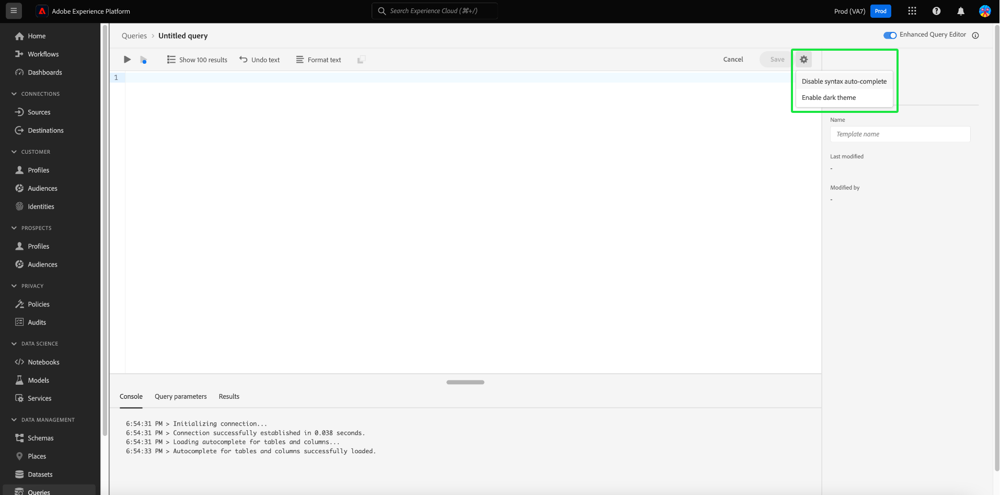

# Guida dell’interfaccia utente di Query Editor

>[!NOTE]
>
>L’editor legacy è stato dichiarato obsoleto il 24 maggio 2024. Non è più accessibile per l’uso. Ora puoi utilizzare la [Editor query avanzato](#enhanced-editor-toggle) per scrivere, convalidare ed eseguire le query

Query Editor è uno strumento interattivo fornito da Adobe Experience Platform Query Service che consente di scrivere, convalidare ed eseguire query per i dati sull’esperienza del cliente all’interno di [!DNL Experience Platform] dell&#39;utente. Query Editor supporta lo sviluppo di query per l’analisi e l’esplorazione dei dati e consente di eseguire query interattive a scopo di sviluppo, nonché query non interattive per popolare i set di dati in [!DNL Experience Platform].

Per ulteriori informazioni sui concetti e le funzionalità di Query Service, vedi [Panoramica di Query Service](../home.md). Per ulteriori informazioni su come navigare nell’interfaccia utente di Query Service su [!DNL Platform], vedere [Panoramica dell’interfaccia utente di Query Service](./overview.md).

## Introduzione {#getting-started}

L’editor delle query fornisce un’esecuzione flessibile delle query tramite la connessione a Query Service e le query vengono eseguite solo quando la connessione è attiva.

## Accesso all’editor delle query {#accessing-query-editor}

In [!DNL Experience Platform] UI, seleziona **[!UICONTROL Query]** nel menu di navigazione sinistro per aprire l’area di lavoro Servizio query. Quindi, per iniziare a scrivere le query, seleziona **[!UICONTROL Crea query]** in alto a destra. Questo collegamento è disponibile da una qualsiasi delle pagine dell’area di lavoro Servizio query.

### Connessione a Query Service {#connecting-to-query-service}

L’editor delle query impiega alcuni secondi per inizializzare e connettersi a Query Service quando viene aperto. La console indica quando è collegata, come illustrato di seguito. Se tenti di eseguire una query prima che l’editor si sia connesso, l’esecuzione viene rimandata fino al completamento della connessione.

### Esecuzione delle query dall’editor delle query {#run-a-query}

Le query eseguite dall’editor delle query vengono eseguite in modo interattivo, il che significa che se chiudi il browser o esci, la query viene annullata. Lo stesso vale per le query eseguite per generare set di dati dagli output delle query.

## Creazione di query tramite l’Editor di query avanzato {#query-authoring}

>[!NOTE]
>
>L’editor legacy è stato dichiarato obsoleto il 24 maggio 2024. Non è più accessibile per l’uso. Ora puoi utilizzare l’Editor query avanzato per scrivere, convalidare ed eseguire le query.

Utilizzando l’editor delle query, puoi scrivere, eseguire e salvare query per i dati sull’esperienza del cliente. Tutte le query eseguite o salvate nell’editor delle query sono disponibili per tutti gli utenti dell’organizzazione che hanno accesso a Query Service.

### Impostazioni {#settings}

Un&#39;icona delle impostazioni sopra il campo di input di Query Editor include opzioni per abilitare/disabilitare il tema scuro o disabilitare/abilitare il completamento automatico.

>[!TIP]
>
>È possibile [!UICONTROL Disabilita completamento automatico sintassi] durante l’authoring di una query senza perdere l’avanzamento.

Per attivare i temi scuri o chiari, selezionare l&#39;icona delle impostazioni () seguito dall&#39;opzione nel menu a discesa visualizzato.

#### Completamento automatico {#auto-complete}

L&#39;editor delle query suggerisce automaticamente parole chiave SQL potenziali insieme ai dettagli di tabella o colonna per la query durante la scrittura. La funzione di completamento automatico è attivata per impostazione predefinita e può essere disattivata o attivata in qualsiasi momento dalle impostazioni dell’editor delle query.

L’impostazione di configurazione del completamento automatico è per utente e viene memorizzata per gli accessi consecutivi per tale utente. La disattivazione di questa funzione interrompe l’elaborazione di diversi comandi di metadati e fornisce consigli che in genere migliorano la velocità dell’autore durante la modifica delle query.

<!-- Currently editing the auto complete setting info. -->

### Eseguire più query sequenziali {#execute-multiple-sequential-queries}

Utilizza l’Editor query avanzato per scrivere più di una query ed eseguire tutte le query in modo sequenziale. L’esecuzione di più query in una sequenza genera ciascuna una voce di registro. Tuttavia, solo i risultati della prima query vengono visualizzati nella console dell’editor delle query. Se hai la necessità di risolvere i problemi o confermare le query eseguite, controlla il registro delle query. Consulta la [documentazione dei registri di query](./query-logs.md) per ulteriori informazioni.

>[!NOTE]
> 
>Se una query CTAS viene eseguita dopo la prima query nell’editor delle query, viene comunque creata una tabella, ma non è presente alcun output nella console dell’editor delle query.

### Esegui query selezionata {#execute-selected-query}

Se hai scritto più query ma devi eseguirne una sola, puoi evidenziare la query scelta e selezionare la
[!UICONTROL Esegui query selezionata] icona. Questa icona è disattivata per impostazione predefinita finché non selezioni la sintassi della query all’interno dell’editor.

![L’editor delle query con [!UICONTROL Esegui query selezionata] icona evidenziata.](../images/ui/query-editor/run-selected-query.png)

### Annulla sessione editor query {#cancel-query}

Controlla l’esecuzione delle query e migliora la produttività annullando le query con tempi di esecuzione lunghi. Questa azione cancella l&#39;Editor query durante l&#39;esecuzione di una query. Tieni presente che la query continua a essere eseguita in background. Se si tratta di una query CTAS, verrà comunque generato un set di dati di output. Per annullare l&#39;esecuzione nell&#39;editor e continuare a comporre un&#39;istruzione SQL, selezionare **[!UICONTROL Annulla query]** dopo l’esecuzione di una query.

![Editor query con [!UICONTROL Annulla query] evidenziato.](../images/ui/query-editor/cancel-query-run.png)

Viene visualizzata una finestra di dialogo di conferma. Seleziona **[!UICONTROL Conferma]** per annullare l&#39;esecuzione della query.

### Conteggio risultati {#result-count}

L’editor delle query può contenere un massimo di 50.000 righe. Puoi scegliere il numero di righe da visualizzare contemporaneamente nella console dell’editor delle query. Per modificare il numero di righe visualizzate nella console, seleziona la **[!UICONTROL Conteggio risultati]** e selezionare tra le opzioni 50, 100, 150, 300 e 500.

## Scrittura delle query {#writing-queries}

[!UICONTROL Editor query] è organizzato in modo da rendere la scrittura delle query il più semplice possibile. La schermata seguente mostra come viene visualizzato l’editor nell’interfaccia utente, con il campo di immissione SQL e **Play** evidenziato.

Per ridurre al minimo il tempo di sviluppo, ti consigliamo di sviluppare le query con limiti al numero di righe restituite. Ad esempio, `SELECT fields FROM table WHERE conditions LIMIT number_of_rows`. Dopo aver verificato che la query produca l’output previsto, rimuovi i limiti ed esegui la query con `CREATE TABLE tablename AS SELECT` per generare un set di dati con l’output.

## Strumenti di scrittura nell’editor delle query {#writing-tools}

- **Evidenziazione automatica della sintassi:** Semplifica la lettura e l&#39;organizzazione di SQL.

- **Completamento automatico parola chiave SQL:** Inizia a digitare la query, quindi utilizza i tasti freccia per passare al termine desiderato e premi **Invio**.

- **Completamento automatico tabella e campo:** Inizia a digitare il nome della tabella che desideri `SELECT` da, quindi utilizzare i tasti freccia per passare alla tabella desiderata e premere **Invio**. Dopo aver selezionato una tabella, il completamento automatico riconosce i campi della tabella.

### Formatta il testo {#format-text}

Il [!UICONTROL Formato testo] rende la query più leggibile aggiungendo uno stile di sintassi standardizzato. Seleziona **[!UICONTROL Formato testo]** per standardizzare tutto il testo all&#39;interno dell&#39;editor di query.

>[!NOTE]
>
>Il [!UICONTROL Formato testo] La funzionalità non funziona con blocchi anonimi. Per informazioni su come concatenare una o più istruzioni SQL in sequenza, vedere [documentazione di blocco anonimo](../key-concepts/anonymous-block.md).

![Editor query con [!UICONTROL Formato testo] e le istruzioni SQL evidenziate.](../images/ui/query-editor/format-text.png)

<!-- ### Undo text {#undo-text}

If you format your SQL in the Query Editor, you can undo the formatting applied by the [!UICONTROL Format text] feature. To return your SQL back to its original form, select **[!UICONTROL Undo text]**.

![The Query Editor with [!UICONTROL Undo text] and the SQL statements highlighted.](../images/ui/query-editor/undo-text.png) -->

### Copia SQL {#copy-sql}

Selezionare l&#39;icona Copia per copiare SQL dall&#39;editor di query negli Appunti. Questa funzione di copia è disponibile sia per i modelli di query che per le query appena create nell’Editor query.

### Dettagli query {#query-details}

Per visualizzare una query nell’editor delle query, seleziona un modello salvato dall’ [!UICONTROL Modelli] scheda. Il pannello Dettagli query fornisce ulteriori informazioni e strumenti per gestire la query selezionata. Mostra inoltre metadati utili, ad esempio l’ultima volta che la query è stata modificata e chi l’ha modificata, se applicabile.

>[!NOTE]
>
>Il [!UICONTROL Visualizza pianificazione], [!UICONTROL Aggiungi pianificazione] e [!UICONTROL Elimina query] le opzioni sono disponibili solo dopo il salvataggio della query come modello. Il [!UICONTROL Aggiungi pianificazione] consente di accedere direttamente al generatore di pianificazione dall’editor di query. Il [!UICONTROL Visualizza pianificazione] consente di passare direttamente all&#39;inventario di programmazione per tale query. Consulta la documentazione sulle pianificazioni delle query per scoprire come [creare pianificazioni di query nell’interfaccia utente](./query-schedules.md#create-schedule).

Dal pannello dei dettagli puoi generare un set di dati di output direttamente dall’interfaccia utente, eliminare o denominare la query visualizzata, visualizzare la pianificazione di esecuzione della query e aggiungere la query a una pianificazione.

Per generare un set di dati di output, seleziona **[!UICONTROL Esegui come CTAS]**. Il **[!UICONTROL Immetti i dettagli del set di dati di output]** viene visualizzata. Inserisci un nome e una descrizione, quindi seleziona **[!UICONTROL Esegui come CTAS]**. Il nuovo set di dati viene visualizzato in **[!UICONTROL Set di dati]** Scheda Sfoglia. Consulta [la documentazione visualizza set di dati](../../catalog/datasets/user-guide.md#view-datasets) per ulteriori informazioni sui set di dati disponibili per la tua organizzazione.

>[!NOTE]
>
>Il [!UICONTROL Esegui come CTAS] è disponibile solo se la query ha **non** pianificata.

![Il [!UICONTROL Immetti i dettagli del set di dati di output] .](../images/ui/query-editor/output-dataset-details.png)

Dopo aver eseguito **[!UICONTROL Esegui come CTAS]** azione, viene visualizzato un messaggio di conferma per avvisarti dell’azione riuscita. Questo messaggio a comparsa contiene un collegamento che consente di accedere facilmente all’area di lavoro dei registri delle query. Consulta la [documentazione dei registri di query](./query-logs.md) per ulteriori informazioni sui registri delle query.

### Salvataggio delle query {#saving-queries}

L’editor delle query fornisce una funzione di salvataggio che consente di salvare una query e lavorarci in un secondo momento. Per salvare una query, seleziona **[!UICONTROL Salva]** nell’angolo in alto a destra di Query Editor. Prima di poter salvare una query, è necessario specificarne il nome utilizzando **[!UICONTROL Dettagli query]** pannello.

>[!NOTE]
>
>Le query denominate e salvate in mediante l&#39;Editor query sono disponibili come modelli nel dashboard Query [!UICONTROL Modelli] scheda. Consulta la [documentazione sui modelli](./query-templates.md) per ulteriori informazioni.

Quando salvi una query nell’editor delle query, viene visualizzato un messaggio di conferma per informarti dell’azione riuscita. Questo messaggio a comparsa contiene un collegamento che consente di accedere facilmente all’area di lavoro di pianificazione delle query. Consulta la [documentazione sulle query di pianificazione](./query-schedules.md) per scoprire come eseguire query su una cadenza personalizzata.

### Query pianificate {#scheduled-queries}

Le query salvate come modello possono essere pianificate dall&#39;Editor query. La pianificazione delle query consente di automatizzare l’esecuzione delle query su una cadenza personalizzata. Puoi pianificare le query in base a frequenza, data e ora e, se necessario, scegliere anche un set di dati di output per i risultati. Le pianificazioni delle query possono anche essere disabilitate o eliminate tramite l’interfaccia utente.

Le pianificazioni vengono impostate nell&#39;editor delle query. Quando si utilizza l&#39;editor delle query, è possibile aggiungere una pianificazione solo a una query già creata e salvata. La stessa limitazione non si applica all’API Query Service.

>[!NOTE]
>
>Le query pianificate che non superano dieci esecuzioni consecutive vengono inserite automaticamente in un [!UICONTROL In quarantena] stato. Una query con questo stato richiede l’intervento dell’utente prima di poter eseguire ulteriori esecuzioni. Consulta la [query in quarantena](./monitor-queries.md#quarantined-queries) per ulteriori dettagli.

Consulta la documentazione sulle pianificazioni delle query per scoprire come [creare pianificazioni di query nell’interfaccia utente](./query-schedules.md). In alternativa, per scoprire come aggiungere pianificazioni utilizzando l’API, leggi [guida dell’endpoint &quot;scheduled queries&quot;](../api/scheduled-queries.md).

Tutte le query pianificate vengono aggiunte all’elenco in [!UICONTROL Query pianificate] scheda. Da tale area di lavoro è possibile monitorare lo stato di tutti i processi di query pianificati tramite l’interfaccia utente. Il giorno [!UICONTROL Query pianificate] , puoi trovare informazioni importanti sull’esecuzione della query e abbonarti agli avvisi. Le informazioni disponibili includono lo stato, i dettagli della pianificazione e i messaggi/codici di errore in caso di esecuzione non riuscita. Consulta la [Monitorare il documento delle query pianificate](./monitor-queries.md) per ulteriori informazioni.

### Come trovare le query precedenti {#previous-queries}

Tutte le query eseguite dall&#39;editor di query vengono acquisite nella tabella Registro. È possibile utilizzare la funzionalità di ricerca in **[!UICONTROL Log]** per trovare le esecuzioni della query. Le query salvate sono elencate in **[!UICONTROL Modelli]** scheda.

Se è stata pianificata una query, il [!UICONTROL Query pianificate] fornisce una migliore visibilità tramite l’interfaccia utente per tali processi di query. Consulta la [documentazione sul monitoraggio delle query](./monitor-queries.md) per ulteriori informazioni.

>[!NOTE]
>
>Le query non eseguite non vengono salvate dal registro. Affinché la query sia disponibile in Query Service, deve essere eseguita o salvata in Query Editor.

## Esecuzione di query tramite Editor query {#executing-queries}

Per eseguire una query nell&#39;editor delle query, è possibile immettere SQL nell&#39;editor o caricare una query precedente dal **[!UICONTROL Log]** o **[!UICONTROL Modelli]** e seleziona **Play**. Lo stato dell’esecuzione della query viene visualizzato nel **[!UICONTROL Console]** e i dati di output sono visualizzati nella scheda **[!UICONTROL Risultati]** scheda.

### Console {#console}

La console fornisce informazioni sullo stato e sul funzionamento di Query Service. Nella console vengono visualizzati lo stato della connessione a Query Service, le operazioni di query in esecuzione ed eventuali messaggi di errore derivanti da tali query.

>[!NOTE]
>
>La console mostra solo gli errori derivanti dall’esecuzione di una query. Non mostra gli errori di convalida della query che si verificano prima dell’esecuzione di una query.

### Risultati della query {#query-results}

Al termine di una query, i risultati vengono visualizzati nella **[!UICONTROL Risultati]** accanto alla scheda **[!UICONTROL Console]** scheda. Questa vista mostra l’output tabulare della query, visualizzando tra 50 e 500 righe di risultati a seconda della scelta [conteggio dei risultati](#result-count). Questa vista consente di verificare che la query produca l’output previsto. Per generare un set di dati con la query, rimuovi i limiti sulle righe restituite ed esegui la query con `CREATE TABLE tablename AS SELECT` per generare un set di dati con l’output. Consulta la [esercitazione sulla generazione di set di dati](./create-datasets.md) per istruzioni su come generare un set di dati dai risultati delle query in Editor query.

## Casi d’uso {#use-cases}

Query Service offre soluzioni per una varietà di casi d’uso in diversi settori e scenari aziendali. Questi esempi pratici dimostrano la flessibilità e l&#39;impatto del servizio nel soddisfare le diverse esigenze. A [scopri in che modo Query Service può apportare valore alle tue esigenze aziendali specifiche](../use-cases/overview.md), esplora la raccolta completa dei documenti dei casi d’uso. Scopri come utilizzare Query Service per fornire informazioni approfondite e soluzioni per migliorare l’efficienza operativa e il successo aziendale.

<!-- This video is from 2019. The logic is sounds but the workflow is too outdated. -->

## Video tutorial sull’esecuzione di query con Query Service {#query-tutorial-video}

Il video seguente illustra come eseguire query nell’interfaccia di Adobe Experience Platform e in un client PSQL. Il video illustra inoltre l’utilizzo di singole proprietà in un oggetto XDM, di funzioni definite dall’Adobe e di query CREATE TABLE AS SELECT (CTAS).

>[!NOTE]
>
>L’interfaccia utente rappresentata nel video è obsoleta, ma la logica utilizzata nel flusso di lavoro rimane la stessa.

>[!VIDEO](https://video.tv.adobe.com/v/29796?quality=12&learn=on)

## Passaggi successivi

Ora che sai quali funzioni sono disponibili in Query Editor e come esplorare l’applicazione, puoi iniziare a creare query personalizzate direttamente in [!DNL Platform]. Per ulteriori informazioni sull’esecuzione di query SQL sui set di dati in [!DNL Data Lake], consulta la guida [esecuzione di query](../best-practices/writing-queries.md).
