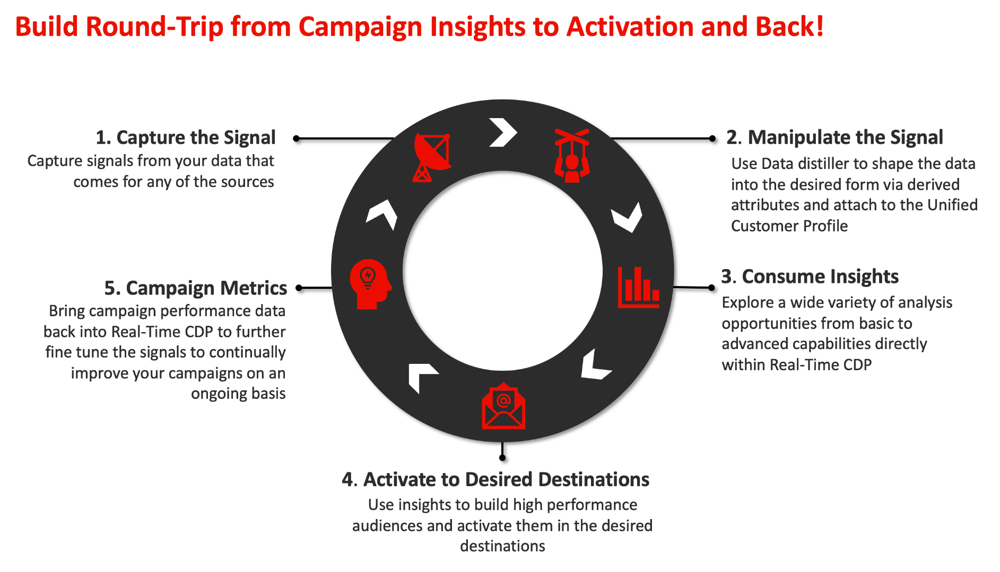
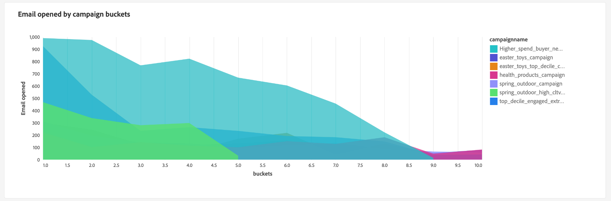

# Tracciare i segnali di dati per generare il valore del ciclo di vita del cliente

Puoi utilizzare Real-time Customer Data Platform per tenere traccia del valore del ciclo di vita del cliente (CLV) e visualizzare tale metrica con dashboard definiti dall’utente. Utilizzando Data Distiller e dashboard definiti dall’utente, puoi misurare quanto è prezioso un cliente per la tua azienda nell’intera relazione. Conoscere il CLV può aiutare a sviluppare le strategie aziendali per acquisire nuovi clienti mantenendo quelli esistenti e mantenendo i margini di profitto.

La seguente infografica illustra il ciclo di raccolta, manipolazione, analisi e attivazione dei dati, che genera dati ad alte prestazioni per migliorare le tue campagne di marketing.

Questo caso d’uso end-to-end dimostra come i segnali di dati possono essere acquisiti e modificati per calcolare l’attributo derivato dal valore del ciclo di vita del cliente. Questi attributi derivati possono quindi essere applicati ai dati del profilo Real-Time CDP e sono disponibili per l’utilizzo con dashboard definite dall’utente per creare una dashboard per l’analisi approfondita. Tramite Data Distiller puoi estendere il modello dati di Real-Time CDP insights e utilizzare gli attributi derivati da CLV e le informazioni sul dashboard per creare un nuovo segmento e attivarlo nella destinazione desiderata. Questi segmenti possono quindi essere utilizzati per creare tipi di pubblico ad alte prestazioni per alimentare la tua prossima campagna di marketing.

Questa guida è stata progettata per aiutarti a comprendere meglio la tua esperienza con i clienti misurando i segnali dei dati tra i punti di contatto chiave che guidano il sistema CLV e implementando un caso d’uso simile nel tuo ambiente. L&#39;intero processo viene riassunto nell&#39;immagine seguente.

## Introduzione {#getting-started}

Questa guida richiede una buona comprensione dei seguenti componenti di Adobe Experience Platform:

* [Servizio query](../home.md): Fornisce un&#39;interfaccia utente e un&#39;API RESTful in cui è possibile utilizzare le query SQL per analizzare e arricchire i dati.
* [Servizio di segmentazione](../../segmentation/home.md): Consente di creare segmenti e generare tipi di pubblico dai dati del profilo cliente in tempo reale.

## Prerequisiti

Questa guida richiede l’utilizzo di [Distiller dati](../data-distiller/overview.md) SKU come parte dell&#39;offerta di pacchetto. Se non sei sicuro di averlo, contatta il tuo rappresentante di Adobe Service.

## Creare un attributo derivato {#create-derived-attribute}

Il primo passo per stabilire il CLV è quello di creare un attributo derivato dai segnali di dati acquisiti dalle azioni dell&#39;utente. Questo caso d’uso specifico è ripreso in un documento separato relativo a uno schema di fidelizzazione delle compagnie aeree. Consulta la guida per scoprire come [utilizza Query Service per creare attributi derivati basati su decile da utilizzare con i dati del profilo](./deciles-use-case.md). Esempi completi e spiegazioni sono fornite nel documento che illustrano i seguenti passaggi:

* Crea uno schema per consentire la divisione in blocchi di decile.
* Utilizza Query Service per creare i decili.
* Genera set di dati a decile.
* Abilita lo schema da utilizzare nel profilo cliente in tempo reale.
* Crea uno spazio dei nomi di identità e contrassegnalo come identificatore principale.
* Crea una query per calcolare i decili in un periodo di lookback.

## Ampliare il modello dati di insights e pianificare gli aggiornamenti {#extend-data-model-and-set-refresh-schedule}

Successivamente, devi creare un modello dati personalizzato o estendere un modello dati Adobe Real-Time CDP esistente per interagire con le informazioni di reporting del tuo CLV. Consulta la documentazione per scoprire come [creazione di un modello dati insights per la generazione di rapporti tramite Query Service per l’utilizzo con dati di archivio accelerati e dashboard definiti dall’utente](../data-distiller/query-accelerated-store/reporting-insights-data-model.md#build-a-reporting-insights-data-model). L’esercitazione descrive i seguenti passaggi:

* Crea un modello per la creazione di rapporti approfonditi con Data Distiller.
* Creazione di tabelle, relazioni e compilazione di dati.
* Eseguire una query sul modello dati di approfondimento del reporting.
* Estendi il tuo modello dati con il modello dati Real-Time CDP insights .
* Crea tabelle di dimensioni per estendere il modello di informazioni sui rapporti.
* Eseguire query sul modello dati approfonditi per la generazione di rapporti accelerati più ampi

Per informazioni su come consultare la documentazione sul modello dati di Real-time Customer Data Platform Insights [personalizzare i modelli di query SQL per creare rapporti Real-Time CDP per i casi di utilizzo di marketing e indicatori prestazioni chiave (KPI, Key Performance Indicator)](../../dashboards/cdp-insights-data-model.md).

Assicurati di impostare una pianificazione per aggiornare il modello dati personalizzato su cadenza regolare. In questo modo i dati vengono restituiti come parte della pipeline di acquisizione in base alle esigenze e vengono compilati i dashboard definiti dall’utente. Consulta la sezione [guida alla pianificazione delle query](../ui/query-schedules.md#create-schedule) per scoprire come impostare la pianificazione.

## Creare un dashboard per acquisire informazioni {#build-a-custom-dashboard}

Dopo aver creato il modello dati personalizzato, puoi visualizzare i dati con query personalizzate e dashboard definiti dall’utente. Consulta la panoramica delle dashboard definite dall’utente per informazioni dettagliate su come [creare un dashboard personalizzato](../../dashboards/user-defined-dashboards.md). La guida all’interfaccia utente include dettagli su:

* Come creare un widget.
* Come utilizzare il compositore di widget.

Di seguito sono riportati alcuni esempi di widget CLV personalizzati che utilizzano bucket decile.

## Creazione e attivazione di segmenti per generare tipi di pubblico ad alte prestazioni {#create-and-activate-segments}

Il passaggio successivo consiste nel generare segmenti e tipi di pubblico dai dati del profilo cliente in tempo reale. Per informazioni su come utilizzare la guida all’interfaccia utente del Generatore di segmenti, [creare e attivare segmenti in Platform](../../segmentation/ui/segment-builder.md). La guida fornisce sezioni su come:

* Crea definizioni di segmenti utilizzando una combinazione di attributi, eventi e tipi di pubblico esistenti come blocchi predefiniti.
* Utilizza l’area di lavoro e i contenitori del generatore di regole per controllare l’ordine in cui vengono eseguite le regole del segmento.
* Visualizza le stime del pubblico potenziale, che consentono di regolare le definizioni dei segmenti in base alle esigenze.
* Abilita tutte le definizioni dei segmenti per la segmentazione pianificata.
* Abilita definizioni di segmenti specifiche per la segmentazione in streaming.

In alternativa, esiste anche un [tutorial video su segment builder](https://experienceleague.adobe.com/docs/platform-learn/tutorials/segments/create-segments.html) disponibile per ulteriori informazioni.

## Attiva il segmento per una campagna e-mail {#activate-segment-for-campaign}

Dopo aver creato il segmento, puoi attivarlo in una destinazione. Platform supporta diversi provider di servizi e-mail (ESP) che consentono di gestire le attività di marketing relative alle e-mail, ad esempio l’invio di campagne e-mail promozionali.

Controlla la [panoramica delle destinazioni di e-mail marketing](https://experienceleague.adobe.com/docs/experience-platform/destinations/catalog/email-marketing/overview.html?lang=en#connect-destination) per un elenco delle destinazioni supportate in cui desideri esportare i dati (ad esempio, il [Oracle Eloqua](https://experienceleague.adobe.com/docs/experience-platform/destinations/catalog/email-marketing/oracle-eloqua-api.html?lang=en) page).

## Vedi i dati di analisi restituiti dalla campagna {#post-campaign-data-analysis}

I dati provenienti dalle origini ora possono essere [elaborati in modo incrementale](../essential-concepts/incremental-load.md) come parte di un aggiornamento pianificato del modello dati nell’archivio dati accelerato. Qualsiasi evento di risposta dei clienti può essere acquisito in Adobe Experience Platform mentre si verifica o in batch. Il modello dati può essere aggiornato una volta o più volte al giorno a seconda delle impostazioni o dei connettori sorgente. Consulta la sezione [panoramica dell’API per l’acquisizione batch](../../ingestion/batch-ingestion/api-overview.md) o [panoramica sull’acquisizione in streaming](../../ingestion/streaming-ingestion/overview.md) per ulteriori informazioni.

Una volta aggiornato il modello dati, i widget dashboard personalizzati forniscono segnali significativi che ti consentono di misurare e visualizzare il valore del ciclo di vita del cliente.

Per l’analisi personalizzata sono disponibili diverse opzioni di visualizzazione.

Queste informazioni possono a loro volta aiutarti a sviluppare strategie aziendali per le campagne successive.

## Passaggi successivi

Leggendo questo documento dovresti avere una migliore comprensione di come utilizzare Real-time Customer Data Platform per monitorare e visualizzare la metrica del valore del ciclo di vita del cliente (CLV). Per ulteriori informazioni sui molti casi d’uso aziendali trattati tramite Query Service e Experience Platform, si consiglia di leggere i seguenti documenti:

* [Un esempio end-to-end di un caso di utilizzo di ricerca abbandonato che dimostra la versatilità e i vantaggi di Query Service.](./abandoned-browse.md)
* [Come utilizzare Query Service e machine learning per determinare e filtrare l’attività bot dal traffico dei visitatori del sito web online autentico](./bot-filtering.md)
* [Come eseguire una corrispondenza sui dati di Platform che combini i risultati di più set di dati facendo corrispondere approssimativamente una stringa di tua scelta.](./fuzzy-match.md)

<!-- "Data signals are actions taken by consumers while online that offer clues about intent that can be acted upon. This includes anything from visiting a website to filling out a change of address or clicking an ad."  -->

<!-- "Customer touchpoints are your brand's points of customer contact, from start to finish." -->
