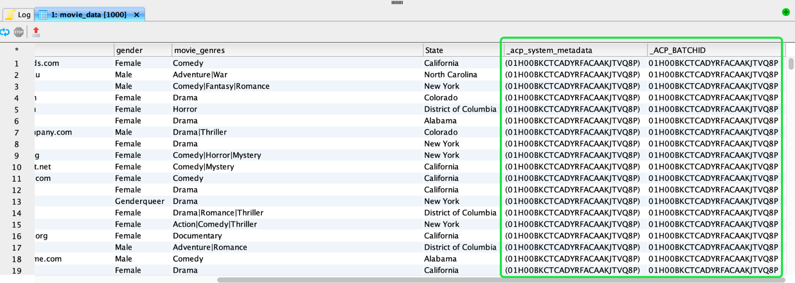
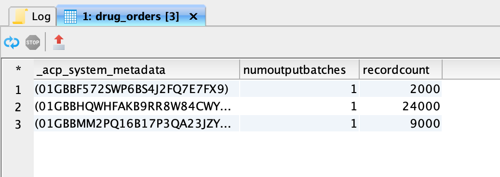
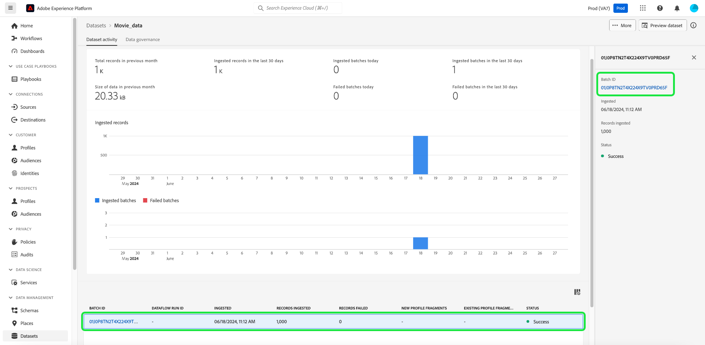

# Esplorare, risolvere e verificare l’acquisizione batch con SQL

Questo documento spiega come verificare e convalidare i record in batch acquisiti con SQL. Questo documento illustra come:

- Accedere ai metadati batch del set di dati
- Risolvere i problemi e garantire l&#39;integrità dei dati eseguendo query sui batch

>[!NOTE]
>
>Alcune schermate di questa guida sono state scattate da [!DNL DBVisualizer]. Per informazioni su come [connettere Query Service con DBVisualizer](../clients/dbvisulaizer.md) o altri [strumenti di BI di terze parti](../clients/overview.md), vedere la documentazione collegata.

## Prerequisiti

Per facilitare la comprensione dei concetti descritti in questo documento, è necessario conoscere i seguenti argomenti:

- **Acquisizione dei dati**: consulta la [panoramica sull&#39;acquisizione dei dati](../../ingestion/home.md) per scoprire le nozioni di base sull&#39;acquisizione dei dati in Platform, inclusi i diversi metodi e processi coinvolti.
- **Acquisizione batch**: consulta la [panoramica dell&#39;API di acquisizione batch](../../ingestion/batch-ingestion/overview.md) per scoprire i concetti di base dell&#39;acquisizione batch. In particolare, cos’è un &quot;batch&quot; e come funziona all’interno del processo di acquisizione dei dati di Platform.
- **Metadati di sistema nei set di dati**: consulta la [Panoramica di Catalog Service](../../catalog/home.md) per scoprire come i campi dei metadati di sistema vengono utilizzati per monitorare ed eseguire query sui dati acquisiti.
- **Experience Data Model (XDM)**: consulta la [panoramica dell&#39;interfaccia utente degli schemi](../../xdm/ui/overview.md) e le [&#39;nozioni di base sulla composizione dello schema&#39;](../../xdm/schema/composition.md) per scoprire gli schemi XDM e come rappresentano e convalidano la struttura e il formato dei dati acquisiti in Platform.

## Accedere ai metadati batch del set di dati {#access-dataset-batch-metadata}

Per assicurarsi che le colonne di sistema (colonne di metadati) siano incluse nei risultati della query, utilizzare il comando SQL `set drop_system_columns=false` nell&#39;editor delle query. Consente di configurare il comportamento della sessione di query SQL. Questo input deve essere ripetuto se avvii una nuova sessione.

Quindi, per visualizzare i campi di sistema del set di dati, eseguire un&#39;istruzione SELECT all per visualizzare i risultati del set di dati, ad esempio `select * from movie_data`. I risultati includono due nuove colonne sul lato destro `_acp_system_metadata` e `_ACP_BATCHID`. Le colonne di metadati `_acp_system_metadata` e `_ACP_BATCHID` consentono di identificare le partizioni logiche e fisiche dei dati acquisiti.



Quando i dati vengono acquisiti in Platform, a quest’ultima viene assegnata una partizione logica basata sui dati in arrivo. Questa partizione logica è rappresentata da `_acp_system_metadata.sourceBatchId`. Questo ID consente di raggruppare e identificare logicamente i batch di dati prima che vengano elaborati e memorizzati.

Dopo l&#39;elaborazione e l&#39;acquisizione dei dati nel data lake, viene assegnata una partizione fisica rappresentata da `_ACP_BATCHID`. Questo ID riflette la partizione di archiviazione effettiva nel data lake in cui si trovano i dati acquisiti.

### Utilizzare SQL per comprendere le partizioni logiche e fisiche {#understand-partitions}

Per comprendere il modo in cui i dati vengono raggruppati e distribuiti dopo l&#39;acquisizione, utilizzare la query seguente per contare il numero di partizioni fisiche distinte (`_ACP_BATCHID`) per ogni partizione logica (`_acp_system_metadata.sourceBatchId`).

```SQL
SELECT  _acp_system_metadata, COUNT(DISTINCT _ACP_BATCHID) FROM movie_data
GROUP BY _acp_system_metadata
```

I risultati di questa query sono mostrati nell’immagine seguente.


Questi risultati dimostrano che il numero di batch di input non corrisponde necessariamente al numero di batch di output, in quanto il sistema determina il modo più efficiente per eseguire il batch e memorizzare i dati nel data lake.

Ai fini di questo esempio, si presume che tu abbia acquisito un file CSV in Platform e creato un set di dati denominato `drug_checkout_data`.

Il file `drug_checkout_data` è un set profondamente nidificato di 35.000 record. Utilizzare l&#39;istruzione SQL `SELECT * FROM drug_orders;` per visualizzare in anteprima il primo set di record nel set di dati `drug_orders` basato su JSON.

L’immagine seguente mostra un’anteprima del file e dei relativi record.


### Utilizza SQL per generare informazioni approfondite sul processo di acquisizione batch {#sql-insights-on-batch-ingestion}

Utilizza l’istruzione SQL seguente per fornire informazioni approfondite sul modo in cui il processo di acquisizione dei dati ha raggruppato ed elaborato i record di input in batch.

```sql
SELECT _acp_system_metadata,
       Count(DISTINCT _acp_batchid) AS numoutputbatches,
       Count(_acp_batchid)          AS recordcount
FROM   drug_orders
GROUP  BY _acp_system_metadata 
```

I risultati della query sono visualizzati nell’immagine seguente.



I risultati dimostrano l’efficienza e il comportamento del processo di acquisizione dei dati. Anche se sono stati creati tre batch di input, ciascuno contenente 2000, 24000 e 9000 record, quando i record sono stati combinati e deduplicati, ne è rimasto solo uno univoco.

>[!NOTE]
>
>Tutti i record visibili all’interno di un set di dati sono quelli che sono stati acquisiti correttamente. Una corretta acquisizione in batch non significa che siano presenti tutti i record inviati dall’input di origine. È necessario verificare la presenza di errori di acquisizione dei dati per trovare i batch/record che non sono stati inseriti.

## Convalidare un batch con SQL {#validate-a-batch-with-SQL}

Quindi, convalida e verifica i record acquisiti nel set di dati con SQL.

>[!TIP]
>
>Per recuperare l’ID batch e i record di query associati a tale ID batch, devi innanzitutto creare un batch in Platform. Se desideri testare il processo autonomamente, puoi acquisire i dati CSV in Platform. Leggi la guida su come [mappare un file CSV su uno schema XDM esistente utilizzando i consigli generati dall&#39;intelligenza artificiale](../../ingestion/tutorials/map-csv/recommendations.md).

Dopo aver acquisito un batch, devi passare alla scheda dell&#39;attività [!UICONTROL Set di dati] per il set di dati in cui hai acquisito i dati.

Nell&#39;interfaccia utente di Experience Platform, seleziona **[!UICONTROL Set di dati]** nell&#39;area di navigazione a sinistra per aprire il dashboard [!UICONTROL Set di dati]. Quindi, seleziona il nome del set di dati dalla scheda [!UICONTROL Sfoglia] per accedere alla schermata [!UICONTROL Attività set di dati].


Viene visualizzata la visualizzazione [!UICONTROL Attività set di dati]. Questa visualizzazione contiene i dettagli del set di dati selezionato. Include tutti i batch acquisiti che vengono visualizzati in formato tabella.

Selezionare un batch dall&#39;elenco dei batch disponibili e copiare l&#39;[!UICONTROL ID batch] dal pannello dei dettagli a destra.



Quindi, utilizza la seguente query per recuperare tutti i record inclusi nel set di dati come parte di quel batch:

```sql
SELECT * FROM movie_data
WHERE  _acp_batchid='01H00BKCTCADYRFACAAKJTVQ8P' 
LIMIT 1;
```

Parola chiave `_ACP_BATCHID` utilizzata per filtrare l&#39;ID [!UICONTROL batch].

>[!TIP]
>
>La clausola `LIMIT` è utile se si desidera limitare il numero di righe visualizzate, ma è preferibile una condizione di filtro.

Quando esegui questa query nell’editor delle query, i risultati vengono troncati a 100 righe. L’editor delle query è progettato per consentire anteprime e indagini rapide. Per recuperare fino a 50.000 righe, puoi utilizzare uno strumento di terze parti come DBVisualizer o DBeaver.

## Passaggi successivi {#next-steps}

Leggendo questo documento hai imparato le nozioni di base sulla verifica e la convalida dei record in batch acquisiti come parte del processo di acquisizione dei dati. Sono state inoltre acquisite informazioni sull’accesso ai metadati dei batch di set di dati, sulle partizioni logiche e fisiche e sull’esecuzione di query su batch specifici mediante comandi SQL. Questa conoscenza può aiutarti a garantire l’integrità dei dati e a ottimizzare lo storage dei dati su Platform.

Successivamente, devi esercitarti nell’acquisizione dei dati per applicare i concetti appresi. Acquisisci un set di dati di esempio in Platform con i file di esempio forniti o con i tuoi dati. Se non lo hai già fatto, leggi l&#39;esercitazione su come [acquisire dati in Adobe Experience Platform](../../ingestion/tutorials/ingest-batch-data.md).

In alternativa, puoi imparare a [connettersi e verificare Query Service con una serie di applicazioni client desktop](../clients/overview.md) per migliorare le funzionalità di analisi dei dati.
