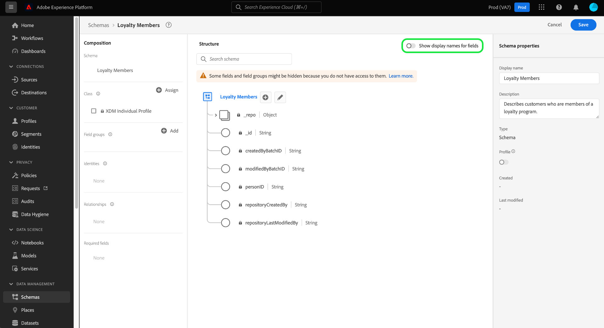

# Note sulla versione di Adobe Experience Platform

>[!IMPORTANT]
>
>A partire dal 15 maggio 2023, la `Existing` Lo stato verrà rimosso dalla mappa di appartenenza al segmento per rimuovere la ridondanza nel ciclo di vita dell’appartenenza al segmento. Dopo questa modifica, i profili qualificati in un segmento verranno rappresentati come `Realized` e i profili non qualificati continueranno a essere rappresentati come `Exited`. Per ulteriori dettagli su questa modifica, leggere la [Sezione Servizio di segmentazione](#segmentation).

**Data di rilascio: 26 aprile 2023**

Aggiornamenti alle funzioni esistenti in Adobe Experience Platform:

- [Dashboard](#dashboards)
- [Preparazione dei dati](#data-prep)
- [Raccolta dati](#data-collection)
- [Destinazioni](#destinations)
- [Experience Data Model](#xdm)
- [Real-Time Customer Data Platform](#rtcdp)
- [Profilo cliente in tempo reale](#profile)
- [Servizio di segmentazione](#segmentation)
- [Origini](#sources)

## Dashboard {#dashboards}

Adobe Experience Platform fornisce più dashboard attraverso i quali è possibile visualizzare informazioni importanti sui dati dell’organizzazione, acquisite durante le istantanee giornaliere.

**Funzioni nuove o aggiornate** {#dashboards-new-updated-features}

| Funzione | Descrizione |
| --- | --- |
| Dashboard definiti dall&#39;utente | Ora puoi **filtrare i dati storici** dalle informazioni sul widget e utilizza dati recenti o un periodo di analisi personalizzato. Consulta la [guida alle dashboard definite dall’utente](../../dashboards/user-defined-dashboards.md#filter-historical-data) per ulteriori informazioni. Ora puoi anche **duplicare i widget esistenti**. Personalizzando un duplicato e modificandone gli attributi, puoi evitare il riavvio dall’inizio durante la creazione di un nuovo widget univoco. Leggi le [guida alla duplicazione dei widget](../../dashboards/user-defined-dashboards.md#duplicate-a-widget) per ulteriori informazioni. |

{style="table-layout:auto"}

Per ulteriori informazioni sulle dashboard, tra cui come concedere le autorizzazioni di accesso e creare widget personalizzati, leggi [panoramica delle dashboard](../../dashboards/home.md).

## Preparazione dei dati {#data-prep}

La preparazione dati consente ai data engineer di mappare, trasformare e convalidare i dati da e verso Experience Data Model (XDM).

**Funzioni aggiornate**

| Funzione | Descrizione |
| --- | --- |
| Aggiornamenti al periodo di backfill per Adobe Analytics nelle sandbox non di produzione | Il periodo di backfill per Adobe Analytics nelle sandbox non di produzione è stato ridotto a tre mesi. Il backfill per le sandbox di produzione rimane lo stesso a 13 mesi. Questa modifica si applica solo ai nuovi flussi e non influirà sui flussi esistenti. Per ulteriori informazioni, leggere [Panoramica di Adobe Analytics](../../sources/connectors/adobe-applications/analytics.md). |
| Nuova funzione di mappatura per convertire le stringhe FPID in ECID | Utilizza il `fpid_to_ecid` funzione per convertire stringhe FPID in ECID per l’utilizzo in applicazioni Experience Platform e Experience Cloud. Per ulteriori informazioni, leggere [Guida alle funzioni della preparazione dati](../../data-prep/functions.md). |

{style="table-layout:auto"}

Per ulteriori informazioni sulla preparazione dati, consulta [Panoramica sulla preparazione dati](../../data-prep/home.md).

## Raccolta dati {#data-collection}

Adobe Experience Platform fornisce una suite di tecnologie che consente di raccogliere i dati sull’esperienza del cliente lato client e inviarli alla rete Edge di Adobe Experience Platform, per arricchirli, trasformarli e distribuirli a destinazioni Adobe o non Adobe.

**Funzioni nuove o aggiornate**

| Funzione | Descrizione |
| --- | --- |
| Offuscamento dell’indirizzo IP per gli stream di dati | Ora puoi definire opzioni di offuscamento IP a livello di stream di dati parziale o completo in [interfaccia utente per la configurazione dello stream di dati](../../edge/datastreams/configure.md).   L’impostazione di offuscamento dell’IP a livello di flusso di dati ha la precedenza su qualsiasi offuscamento dell’IP configurato in Adobe Target e Audience Manager.   I dati inviati ad Adobe Analytics non sono influenzati dal livello di flusso di dati [!UICONTROL Offuscamento IP] impostazione. Adobe Analytics attualmente riceve indirizzi IP non offuscati. Affinché Analytics possa ricevere indirizzi IP offuscati, devi configurare l’offuscamento dell’IP separatamente in Adobe Analytics. Questo comportamento verrà aggiornato nelle versioni future.   Per ulteriori dettagli sull’offuscamento dell’IP e istruzioni su come configurarlo, vedi la [documentazione sulla configurazione dello stream di dati](../../edge/datastreams/configure.md#advanced-options). |
| [Override della configurazione dello stream di dati](../../edge/datastreams/overrides.md) | Ora puoi definire opzioni di configurazione aggiuntive per i flussi di dati, che puoi utilizzare per ignorare impostazioni specifiche, ad esempio set di dati evento, token di proprietà Target, contenitori di sincronizzazione ID e suite di rapporti Analytics.   L’override delle configurazioni dello stream di dati è un processo in due fasi: <ol><li>Innanzitutto, devi definire le sostituzioni della configurazione dello stream di dati in [pagina di configurazione dello stream di dati](../../edge/datastreams/configure.md).</li><li>Quindi, devi inviare le sostituzioni alla rete Edge tramite un comando Web SDK o utilizzando Web SDK [estensione tag](../../tags/extensions/client/web-sdk/web-sdk-extension-configuration.md).</li></ol> |
| Segreto JWT OAuth  | Il [Segreto JWT OAuth](https://experienceleague.adobe.com/docs/experience-platform/tags/event-forwarding/secrets.html?lang=en) consente ai clienti di utilizzare i token di servizio Adobe e Google per supportare le interazioni server-to-server nell’inoltro degli eventi. |
| Estensione [!DNL Pinterest Conversions API] | Il [[!DNL Pinterest Conversions API]](https://experienceleague.adobe.com/docs/experience-platform/tags/extensions/server/pinterest/overview.html) l’estensione per l’inoltro degli eventi consente di sfruttare i dati acquisiti in Adobe Experience Platform Edge Network e di inviarli a [!DNL Pinterest] sotto forma di eventi lato server che utilizzano [!DNL Pinterest Conversions API]. |

{style="table-layout:auto"}

## Destinazioni {#destinations}

[!DNL Destinations] sono integrazioni predefinite con piattaforme di destinazione che consentono l’attivazione diretta dei dati da Adobe Experience Platform. Puoi utilizzare le destinazioni per attivare i dati noti e sconosciuti per campagne di marketing cross-channel, campagne e-mail, pubblicità mirata e molti altri casi d’uso.

**Nuove destinazioni** {#new-destinations}

| Destinazione | Descrizione |
| ----------- | ----------- |
| [[!DNL Salesforce Marketing Cloud Account Engagement] connessione](../../destinations/catalog/email-marketing/salesforce-marketing-cloud-account-engagement.md) | Utilizza la destinazione Salesforce Marketing Cloud Account Engagement (precedentemente nota come Pardot) per acquisire, tracciare, valutare e valutare i lead. Utilizza questa destinazione per i casi d’uso B2B che coinvolgono più dipartimenti e decision maker e che richiedono cicli di vendita e decisionali più lunghi. |

{style="table-layout:auto"}

**Funzionalità nuove o aggiornate** {#destinations-new-updated-functionality}

| Funzionalità | Descrizione |
| ----------- | ----------- |
| Monitoraggio del flusso di dati per [!DNL Custom Personalization] e [!DNL Adobe Commerce] destinazioni | 
 Ora puoi vedere le metriche di attivazione per [Adobe Commerce](/help/destinations/catalog/personalization/adobe-commerce.md), [Personalizzazione personalizzata](../../destinations/catalog/personalization/custom-personalization.md) e [Personalizzazione Personalizzata Con Attributi](../../destinations/catalog/personalization/custom-personalization.md) connessioni. 
 
{width="100" zoomable="yes"}
  Consulta [Monitorare i flussi di dati nell’area di lavoro Destinazioni](../../dataflows/ui/monitor-destinations.md#monitor-dataflows-in-the-destinations-workspace) per ulteriori dettagli. |
| Nuovo **[!UICONTROL Aggiungi ID segmento al nome del segmento]** campo per [!DNL Google Ad Manager] e [!DNL Google Ad Manager 360] destinazioni | 
Ora puoi avere il nome del segmento in [[!DNL Google Ad Manager]](/help/destinations/catalog/advertising/google-ad-manager.md#parameters) e [[!DNL Google Ad Manager 360]](/help/destinations/catalog/advertising/google-ad-manager-360-connection.md#destination-details) includi l’ID segmento dall’Experience Platform, come segue: `Segment Name (Segment ID)`.

{width="100" zoomable="yes"}
 |
| Retrocompilazione pianificata del pubblico | 
Per [[!DNL Google Display & Video 360]](/help/destinations/catalog/advertising/google-dv360.md#specifics) destinazione, l’attivazione dei backfill del pubblico alla destinazione è programmata per 24-48 ore dopo che un segmento è stato mappato per la prima volta a una connessione di destinazione. Questo aggiornamento risponde alla politica di Google di attendere 24 ore prima dell’acquisizione dei dati e migliorerà le percentuali di corrispondenza tra Real-time CDP e [!DNL Google Display & Video 360].
 
Tieni presente che si tratta di una configurazione back-end applicabile solo a questa destinazione e che non è correlata ad alcuna opzione di pianificazione configurabile dal cliente nell’interfaccia utente di.
 |

{style="table-layout:auto"}

**Correzioni di problemi e miglioramenti** {#destinations-fixes-and-enhancements}

- È stato risolto un problema in **Identità escluse** metriche di reporting per esportazioni di destinazioni basate su file. I clienti ricevevano tutti gli ID esportati dall’esportazione attivata come previsto. Tuttavia, il **Identità escluse** la metrica di reporting nell’interfaccia utente mostrava erroneamente un numero elevato di identità escluse a causa di un conteggio errato di identità che non dovevano mai essere esportate. (PLAT-149774)
- È stato risolto un problema in **Pianificazione** passaggio del flusso di lavoro di attivazione. Per le destinazioni che richiedono un ID di mappatura, i clienti non sono stati in grado di aggiungere un ID di mappatura per i segmenti aggiunti alle connessioni di destinazione esistenti. (PLAT-148808)

<!--
- We have fixed an issue with the beta SFTP destination where the port number was previously hardcoded to 22. The port is now configurable for this destination. 

-->

Per informazioni più generali sulle destinazioni, consulta [panoramica sulle destinazioni](../../destinations/home.md).

## Experience Data Model (XDM) {#xdm}

XDM è una specifica open-source che fornisce strutture e definizioni comuni (schemi) per i dati inseriti in Adobe Experience Platform. Aderendo agli standard XDM, tutti i dati sulla customer experience possono essere incorporati in una rappresentazione comune per fornire informazioni in modo più rapido e integrato. Puoi ottenere informazioni preziose dalle azioni dei clienti, definire i tipi di pubblico dei clienti attraverso i segmenti e utilizzare gli attributi dei clienti a scopo di personalizzazione.

**Funzioni aggiornate**

| Funzione | Descrizione |
| --- | --- |
| Attiva/disattiva nomi visualizzati | L’Editor di schema ora fornisce un’opzione per passare dai nomi di campo originali a quelli più leggibili dall’utente. {width="100" zoomable="yes"} Questa flessibilità consente di migliorare la reperibilità sul campo e la modifica degli schemi. I nomi visualizzati per i gruppi di campi standard sono generati dal sistema, ma possono anche essere personalizzati tramite l’interfaccia utente, se necessario. Leggi le [documentazione di attivazione/disattivazione nome visualizzato](https://experienceleague.adobe.com/docs/experience-platform/xdm/ui/resources/schemas.html#display-name-toggle) per ulteriori informazioni. |

{style="table-layout:auto"}

**Nuovi componenti XDM**

| Tipo di componente | Nome | Descrizione |
| --- | --- | --- |
| Schema | [[!UICONTROL Campi di classificazione Adobe Target]](https://github.com/adobe/xdm/pull/1719/files) | Un nuovo schema XDM per i set di dati di classificazione di Target contenente un set di campi di metadati per classificare le attività ed esperienze di Target. |

{style="table-layout:auto"}

**Componenti XDM aggiornati**

| Tipo di componente | Nome | Descrizione |
| --- | --- | --- |
| Gruppo di campi | [[!UICONTROL Adobe di estensione dell’unione degli account del servizio profili unificato]](https://github.com/adobe/xdm/pull/1696/files) | È stato aggiunto un gruppo di campi di estensione account per Real-Time Customer Profile che consente agli utenti di aggiungere l’iscrizione al segmento nell’unione account. |
| Schema | [[!UICONTROL Schema di sistema per attributi calcolati]](https://github.com/adobe/xdm/pull/1696/files) | Il gruppo di campi Attributi calcolati utilizzato da Real-Time Customer Profile è stato aggiornato a uno schema globale di sola lettura del sistema. |
| Gruppo di campi | Più | Sono stati aggiunti diversi eventi come campi per [[!UICONTROL Schema della serie temporale]](https://github.com/adobe/xdm/pull/1718/files). |
| Gruppo di campi | Dettagli fedeltà profilo | [È stato corretto il titolo](https://github.com/adobe/xdm/pull/1717/files) per `xdm:upgradeDate` da &quot;Nome programma&quot; a &quot;Data aggiornamento&quot;. |
| Gruppo di campi | Più | Diversi campi da [[!UICONTROL Elemento decisione]](https://github.com/adobe/xdm/pull/1714/files) sono stati aggiornati per rimuovere la doppia gerarchia nidificata. |

{style="table-layout:auto"}

Per ulteriori informazioni su XDM in Platform, consulta [Panoramica del sistema XDM](../../xdm/home.md).

## Real-Time Customer Data Platform

Basato su Experience Platform, Real-time Customer Data Platform ([!DNL Real-Time CDP]) consente alle aziende di unire dati noti e sconosciuti per attivare i profili dei clienti con decisioni intelligenti in tutto il percorso del cliente. [!DNL Real-Time CDP] combina più origini dati aziendali per creare profili cliente in tempo reale. I segmenti generati da questi profili possono quindi essere inviati alle destinazioni a valle per fornire esperienze cliente personalizzate uno a uno su tutti i canali e i dispositivi.

**Nuove funzioni**

| Funzione | Descrizione |
| ------- | ----------- |
| Pagina Home di Real-Time CDP migliorata | Il [Home page di Real-Time CDP](https://experience.adobe.com) è stato migliorato con un look aggiornato e prestazioni migliorate. La home page è ora in grado di riconoscere le autorizzazioni e presenterà widget relativi alle funzioni a cui hai accesso. Per ulteriori informazioni, leggere [Panoramica del dashboard della home page di Real-Time CDP](../../rtcdp/home-page-dashboards.md). |
| Sondaggio di auto-identificazione | Il sondaggio di auto-identificazione è un breve questionario presentato nella home page dell’interfaccia utente di Adobe Experience Platform. Utilizza il sondaggio di auto-identificazione per creare il tuo profilo personale Experience Platform e ricevere linee guida personalizzate in base alle tue selezioni. Per ulteriori informazioni, leggere [panoramica del sondaggio di auto-identificazione](../../landing/self-identification.md). |

Per ulteriori informazioni su [!DNL Real-Time CDP], vedere [[!DNL Real-Time CDP] panoramica](../../rtcdp/overview.md).

## Profilo cliente in tempo reale {#profile}

Adobe Experience Platform ti consente di offrire ai tuoi clienti esperienze coordinate, coerenti e pertinenti, indipendentemente da dove e quando interagiscono con il tuo marchio. Con Real-Time Customer Profile puoi visualizzare una visualizzazione olistica di ogni singolo cliente che combina dati provenienti da più canali, inclusi dati online, offline, del sistema CRM e di terze parti. Il profilo ti consente di consolidare i dati dei clienti in una visualizzazione unificata che offre un account utilizzabile e con marca temporale per ogni interazione con il cliente.

**Funzioni aggiornate**

| Funzione | Descrizione |
| ------- | ----------- |
| Scadenza dati profilo pseudonimo | La scadenza dei dati del profilo pseudonimo è ora generalmente disponibile. Una volta abilitata, questa versione rimuoverà continuamente i profili pseudonimi non aggiornati dall’istanza Experience Platform. Per ulteriori informazioni su questa funzione e sui profili pseudonimi, consulta [Guida alla scadenza dei dati del profilo pseudonimo](../../profile/pseudonymous-profiles.md). |

{style="table-layout:auto"}

## Servizio di segmentazione {#segmentation}

[!DNL Segmentation Service] definisce un particolare sottoinsieme di profili descrivendo i criteri che distinguono un gruppo commerciabile di persone all’interno della tua base clienti. I segmenti possono essere basati su dati record (ad esempio informazioni demografiche) o su eventi di serie temporali che rappresentano le interazioni dei clienti con il tuo marchio.

**Funzioni nuove o aggiornate**

| Funzione | Descrizione |
| ------- | ----------- |
| Mappa di iscrizione al segmento | In seguito al precedente annuncio di febbraio, il 15 maggio 2023 la `Existing` Lo stato verrà rimosso dalla mappa di appartenenza al segmento per rimuovere la ridondanza nel ciclo di vita dell’appartenenza al segmento. Dopo questa modifica, i profili qualificati in un segmento verranno rappresentati come `Realized` e i profili non qualificati continueranno a essere rappresentati come `Exited`.   Questa modifica potrebbe interessarti se, utilizzi [destinazioni enterprise](../../destinations/destination-types.md#streaming-profile-export) (Amazon Kinesis, Azure Event Hub, API HTTP) e potrebbero disporre di processi downstream automatizzati basati su `Existing` stato. In questo caso, rivedi le integrazioni a valle. Se ti interessa identificare profili nuovi e qualificati oltre un certo periodo di tempo, puoi utilizzare una combinazione di `Realized` stato e `lastQualificationTime` nella mappa di iscrizione al segmento. Per ulteriori informazioni, contatta il rappresentante del tuo Adobe. |

{style="table-layout:auto"}

Per ulteriori informazioni su [!DNL Segmentation Service], consultare il [Panoramica sulla segmentazione](../../segmentation/home.md).

## Origini {#sources}

Adobe Experience Platform può acquisire dati da origini esterne e consente di strutturarli, etichettarli e migliorarli utilizzando i servizi di Platform. Puoi acquisire dati da diverse origini, ad esempio applicazioni Adobe, archiviazione basata su cloud, software di terze parti e sistema CRM.

Experience Platform fornisce un’API RESTful e un’interfaccia utente interattiva per impostare facilmente le connessioni di origine per vari provider di dati. Queste connessioni di origine consentono di autenticarti e connetterti a sistemi di archiviazione esterni e servizi di gestione delle relazioni con i clienti, impostare i tempi per le esecuzioni dell’acquisizione e gestire la velocità effettiva di acquisizione dei dati.

**Funzioni aggiornate**

| Funzione | Descrizione |
| --- | --- |
| Supporto API per filtrare i dati a livello di riga per l’origine del sistema CRM Salesforce. | Utilizza gli operatori logici e di confronto per filtrare i dati a livello di riga per l’origine del sistema CRM Salesforce. Leggi la guida su [filtrare i dati per un’origine utilizzando l’API](../../sources/tutorials/api/filter.md) per ulteriori informazioni. |
| Disponibilità beta di Shopify Streaming | Il [Shopify Streaming source](../../sources/connectors/ecommerce/shopify-streaming.md) è ora disponibile in versione beta. Utilizza la sorgente di streaming di Shopify per inviare dati dall’account dei partner di Shopify all’Experience Platform. |
| Disponibilità generale dell&#39;integrazione di OneTrust | Il [Origine dell&#39;integrazione OneTrust](../../sources/connectors/consent-and-preferences/onetrust.md) è ora GA. Utilizza l&#39;origine dell&#39;integrazione di OneTrust per portare all&#39;Experience Platform i dati di consenso e preferenze dall&#39;account dell&#39;integrazione di OneTrust. |
| Disponibilità generale di Oracle Service Cloud | Il [Origine Oracle Service Cloud](../../sources/connectors/customer-success/oracle-service-cloud.md) è ora GA. Utilizza l’origine Oracle Service Cloud per portare all’Experience Platform i dati Oracle Service Cloud. |

{style="table-layout:auto"}

Per ulteriori informazioni sulle origini, leggi la [panoramica sulle origini](../../sources/home.md).