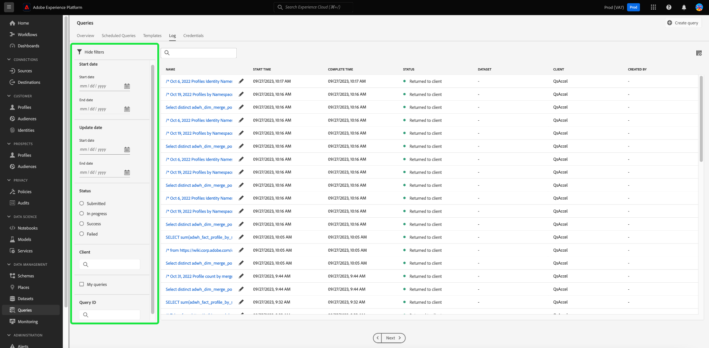

# Note sulla versione di Adobe Experience Platform

**Data di rilascio: venerdì 28 settembre 2023**

Nuove funzioni di Adobe Experience Platform:

- [Attributi calcolati](#computed-attributes)

Aggiornamenti alle funzioni esistenti in Experience Platform:

- [Avvisi](#alerts)
- [Dashboard](#dashboards)
- [Raccolta dati](#data-collection)
- [Governance dei dati](#data-governance)
- [Igiene dei dati](#hygiene)
- [Destinazioni](#destinations)
- [Experience Data Model (XDM)](#xdm)
- [Identity Service](#identity-service)
- [Servizio query](#query-service)
- [Servizio di segmentazione](#segmentation)
- [Origini](#sources)

## Attributi calcolati {#computed-attributes}

Gli attributi calcolati consentono di riepilogare facilmente i dati dell’evento negli attributi del profilo tramite un’interfaccia utente intuitiva per migliorare la segmentazione, la personalizzazione e l’attivazione basate sul comportamento. Con questa funzione, puoi creare attributi calcolati in modo autonomo, gestirli e utilizzarli in segmentazione, destinazioni Real-Time CDP o Adobe Journey Optimizer. Inoltre, gli attributi calcolati semplificano la segmentazione e i flussi di lavoro di percorso per aiutarti a fornire esperienze rilevanti in modo semplice. Per ulteriori informazioni sugli attributi calcolati, leggere la [panoramica sugli attributi calcolati](../../profile/computed-attributes/overview.md).

## Avvisi {#alerts}

Un Experience Platform consente di abbonarti agli avvisi basati su eventi per varie attività di Platform. Puoi abbonarti a diverse regole di avviso tramite la scheda [!UICONTROL Avvisi] nell&#39;interfaccia utente di Platform e scegliere di ricevere messaggi di avviso all&#39;interno dell&#39;interfaccia utente stessa o tramite notifiche e-mail.

**Funzioni nuove o aggiornate**

| Funzione | Descrizione |
| --- | --- |
| Scheda Cronologia avvisi | La scheda Avvisi [!UICONTROL Cronologia] includerà ora tutti gli eventi, inclusi ritardi, avvii, operazioni riuscite ed errori. Per ulteriori informazioni sulla scheda della cronologia, leggere la [documentazione dell&#39;interfaccia utente degli avvisi](../../observability/alerts/ui.md). |

{style="table-layout:auto"}

Per ulteriori informazioni sugli avvisi, leggere la [[!DNL Observability Insights] panoramica](../../observability/home.md).

## Dashboard {#dashboards}

In Adobe Experience Platform sono disponibili più [!DNL dashboards] tramite i quali è possibile visualizzare informazioni importanti sui dati dell&#39;organizzazione, acquisite durante gli snapshot giornalieri.

| Funzione | Descrizione |
| --- | --- |
| [Miglioramento dashboard utilizzo licenze](../../dashboards/guides/license-usage.md) | Mantenere il controllo dei contratti di licenza con rapporti migliorati e visualizzazioni delle metriche chiave relative all’utilizzo delle licenze della tua organizzazione. Questi miglioramenti forniscono un elevato grado di granularità sulle metriche di utilizzo della licenza per tutti i prodotti di Experience Platform acquistati. |

{style="table-layout:auto"}

Per ulteriori informazioni sul dashboard di utilizzo delle licenze, vedere la [panoramica del dashboard di utilizzo delle licenze](../../dashboards/guides/destinations.md).

## Raccolta dati {#data-collection}

Adobe Experience Platform fornisce una suite di tecnologie che consente di raccogliere i dati sull’esperienza del cliente lato client e inviarli alla rete Edge di Adobe Experience Platform, per arricchirli, trasformarli e distribuirli a destinazioni Adobe o non Adobe.

**Funzioni nuove o aggiornate**

| Tipo | Funzione | Descrizione |
| --- | --- | --- |
| Stream di dati | Supporto per la ricerca del dispositivo | Durante la configurazione di un flusso di dati, ora puoi selezionare il livello di informazioni di ricerca del dispositivo da raccogliere. Le informazioni sulla ricerca del dispositivo includono dati sul dispositivo, sull’hardware, sul sistema operativo e sul browser utilizzati per interagire con la pagina. Impossibile raccogliere le informazioni di ricerca del dispositivo   insieme agli hint dell&#39;agente utente e del client. La scelta di raccogliere informazioni sul dispositivo disabiliterà la raccolta di hint dell’agente utente e del client e viceversa. Tutte le informazioni di ricerca del dispositivo sono memorizzate nel gruppo di campi `xdm:device`. Ulteriori informazioni sono disponibili nella documentazione su [configurazione degli stream di dati](../../datastreams/configure.md#geolocation-device-lookup). |
| Estensioni | Estensione API per [!DNL TikTok] eventi Web | L&#39;estensione [[!DNL TikTok] Web Events API](https://exchange.adobe.com/apps/ec/109834/tiktok-web-events-api) consente di sfruttare i dati acquisiti nell&#39;Edge Network di Adobe Experience Platform e di inviarli a [!DNL TikTok] sotto forma di eventi lato server utilizzando l&#39;API [!DNL TikTok] Web Events. |

{style="table-layout:auto"}

Per ulteriori informazioni sulla raccolta dati, leggere la [panoramica sulla raccolta dati](../../tags/home.md).

## Governance dei dati {#data-governance}

La governance dei dati di Adobe Experience Platform è una serie di strategie e tecnologie utilizzate per gestire i dati della clientela e garantire la conformità a normative, restrizioni e criteri applicabili all’utilizzo dei dati. Svolge un ruolo chiave all’interno di Experience Platform a vari livelli, tra cui catalogazione, derivazione dei dati, etichettatura dell’utilizzo dei dati, criteri di accesso ai dati e controllo degli accessi ai dati per le azioni di marketing.

**Nuove funzioni**

| Funzione | Descrizione |
| --- | --- |
| Nuove etichette per ecosistemi partner per dati di terze parti | Sono disponibili nuove etichette di utilizzo dei dati per l’arricchimento e la ricerca di terze parti. Per ulteriori informazioni, consulta la [documentazione sulle etichette dell&#39;ecosistema partner](../../data-governance/labels/reference.md#partner). |

{style="table-layout:auto"}

Per ulteriori informazioni sulla governance dei dati, consulta la [panoramica sulla governance dei dati](../../data-governance/home.md).

## Igiene dei dati {#hygiene}

Experience Platform fornisce una suite di funzionalità di igiene dei dati che consente di gestire i dati memorizzati tramite l’eliminazione programmatica di record e set di dati consumer. Utilizzando l&#39;area di lavoro [!UICONTROL Ciclo di vita dei dati] nell&#39;interfaccia utente o tramite chiamate all&#39;API di igiene dei dati, puoi gestire in modo efficace gli archivi di dati. Utilizza queste funzionalità per garantire che le informazioni vengano utilizzate come previsto, aggiornate quando è necessario correggere i dati errati e eliminate quando i criteri organizzativi lo ritengono necessario.

**Nuove funzioni**

| Funzione | Descrizione |
| --- | --- |
| Eliminazione record [!BADGE Beta]{type=Informative} (versione limitata) | Gestisci il ciclo di vita dei dati in tutti gli archivi dati per rispettare gli impegni dei clienti e i contratti di licenza con le funzioni di Advanced Data Lifecycle Management in Adobe Experience Platform: scadenza automatizzata del set di dati ed eliminazione dei record. Con la scadenza automatica del set di dati è possibile eliminare interi set di dati e impostare una data e un&#39;ora per l&#39;eliminazione del set di dati. Eliminazione record consente di eliminare singoli profili di consumatori eseguendo il targeting delle loro identità primarie. Puoi fornire le identità primarie singolarmente tramite l’interfaccia utente o tramite il caricamento di file CSV/JSON. Per ulteriori informazioni, consulta la [documentazione sull&#39;eliminazione dei record](../../hygiene/ui/record-delete.md) |
| Scadenze dei set di dati | Riduci al minimo i dati e tieni sotto controllo i contratti di licenza con Scadenza set di dati automatica. Riduci i volumi di dati eliminando interi set di dati e imposta una data e un’ora per l’eliminazione del set di dati. Per ulteriori informazioni, consulta la [documentazione sulle scadenze dei set di dati](../../hygiene/ui/dataset-expiration.md). |

{style="table-layout:auto"}

Per ulteriori informazioni sulle funzionalità di igiene dei dati di Platform, consulta la [panoramica sull&#39;igiene dei dati](../../hygiene/home.md).

## Destinazioni {#destinations}

[!DNL Destinations] sono integrazioni predefinite con piattaforme di destinazione che consentono l’attivazione diretta dei dati da Adobe Experience Platform. Puoi utilizzare le destinazioni per attivare i dati noti e sconosciuti per campagne di marketing cross-channel, campagne e-mail, pubblicità mirata e molti altri casi d’uso.

**Destinazioni nuove o aggiornate** {#new-updated-destinations}

| Destinazione | Nuova o aggiornata | Descrizione |
| ----------- |----------------|----------- |
| [[!DNL LiveRamp - Distribution]](../../destinations/catalog/advertising/liveramp-distribution.md) | Nuova | Attiva i tipi di pubblico precedentemente integrati in [!DNL LiveRamp] per gli editori premium su media mobili, web, display e TV connesse.   Dopo aver effettuato l&#39;onboarding dei tipi di pubblico nell&#39;account [!DNL LiveRamp] tramite la connessione [LiveRamp - Onboarding](../../destinations/catalog/advertising/liveramp-onboarding.md), utilizza la nuova connessione [[!DNL LiveRamp - Distribution]](../../destinations/catalog/advertising/liveramp-distribution.md) per attivare i tipi di pubblico nelle destinazioni a valle. |
| [[!DNL HubSpot]](../../destinations/catalog/crm/hubspot.md) | Nuova | [[!DNL HubSpot]](https://www.hubspot.com) è una piattaforma CRM con tutti i software, le integrazioni e le risorse necessarie per collegare marketing, vendite, content management e servizio clienti. Ti consente di collegare dati, team e clienti su un’unica piattaforma di gestione delle relazioni con i clienti. |
| [[!DNL Microsoft Dynamics 365]](../../destinations/catalog/crm/microsoft-dynamics-365.md) | Aggiornata | È stato aggiunto il supporto per [!DNL Dynamics 365] prefissi di campi personalizzati per campi personalizzati non creati nella soluzione predefinita in [!DNL Dynamics 365]. Nel passaggio [Compila i dettagli della destinazione](#destination-details) è stato aggiunto il nuovo campo di input **[!UICONTROL Prefisso personalizzazione]**. |
| [[!DNL Experience Cloud Audiences]](../../destinations/catalog/adobe/experience-cloud-audiences.md) | Aggiornata | La destinazione Tipi di pubblico di Experience Cloud è ora generalmente disponibile. Utilizza questa destinazione per attivare i tipi di pubblico da Real-Time CDP ad Audience Manager e Adobe Analytics. È necessaria una licenza Audience Manager per inviare tipi di pubblico ad Adobe Analytics. |

{style="table-layout:auto"}

<!-- 

Add these to release notes as they go out

| [[!DNL Qualtrics]] | New | Use the aggregation of multiple sources of operational data in Adobe Experience Platform as an input in Qualtrics Experience ID to better understand your customers and enable targeted outreach to close the gap when it comes to understanding intent, emotion and experience drivers. | 

-->

**Funzionalità nuove o aggiornate** {#destinations-new-updated-functionality}

| Funzionalità | Descrizione |
| ----------- | ----------- |
| Esportazioni di dati in Real-Time CDP | La funzionalità [esportazione set di dati](../../destinations/ui/export-datasets.md) è ora generalmente disponibile. Vedi [quali set di dati puoi esportare in base all&#39;app Experience Platform](../../destinations/ui/export-datasets.md#datasets-to-export) che hai acquistato e controlla [guardrail per l&#39;esportazione dei set di dati](/help/destinations/guardrails.md#dataset-exports). |
| (Beta) Supporto per l&#39;esportazione di oggetti di tipo array | Esporta array di valori primitivi (valori stringa, int o booleani) come file di schema flat nelle destinazioni di archiviazione cloud. Ulteriori informazioni sulle funzionalità sono disponibili nella [documentazione](../../destinations/ui/export-arrays-calculated-fields.md). |
| Selettori dinamici a discesa nella Destination SDK | Durante la creazione di una destinazione tramite Destination SDK, è ora possibile utilizzare [selettori a discesa dinamici](../../destinations/destination-sdk/functionality/destination-configuration/customer-data-fields.md#dynamic-dropdown-selectors) per popolare i campi di un selettore a discesa con i valori recuperati da un&#39;API. |

**Correzioni di problemi e miglioramenti** {#destinations-fixes-and-enhancements}

- Utilizza [monitoraggio della trasparenza](../../dataflows/ui/monitor-destinations.md#dataflow-runs-for-streaming-destinations) ora disponibile per le destinazioni enterprise ([API HTTP](../../destinations/catalog/streaming/http-destination.md), [Amazon Kinesis](../../destinations/catalog/cloud-storage/amazon-kinesis.md) e [Azure Event Hubs](../../destinations/catalog/cloud-storage/azure-event-hubs.md)) a livello di esecuzione del flusso di dati per monitorare le metriche di attivazione e lo stato nella [visualizzazione dettagli flusso di dati](../../dataflows/ui/monitor-destinations.md#dataflow-run-details-page), con informazioni aggiuntive tramite codici di errore e messaggi per la risoluzione dei problemi.
- Quando aggiorni il nome dei tipi di pubblico mappati a [Google Ad Manager](../../destinations/catalog/advertising/google-ad-manager.md), [Google Display &amp; Video 360](../../destinations/catalog/advertising/google-dv360.md) e altre destinazioni che utilizzano [modelli di aggiornamento del pubblico](../../destinations/destination-sdk/metadata-api/update-audience-template.md), queste modifiche al nome vengono ora applicate a valle nella destinazione.

Per informazioni più generali sulle destinazioni, consulta la [panoramica sulle destinazioni](../../destinations/home.md).

## Experience Data Model (XDM) {#xdm}

XDM è una specifica open-source che fornisce strutture e definizioni comuni (schemi) per i dati inseriti in Adobe Experience Platform. Aderendo agli standard XDM, tutti i dati sull’esperienza cliente possono essere incorporati in una rappresentazione comune per fornire approfondimenti in modo più rapido e integrato. Puoi ottenere approfondimenti importanti dalle azioni della clientela, definire i tipi di pubblico della clientela attraverso i segmenti e utilizzare gli attributi della clientela a scopo di personalizzazione.

**Nuove funzioni**

| Funzione | Descrizione |
| --- | --- |
| Azioni rapide aggiunte all’Editor di schema | Sono state aggiunte nuove azioni rapide all’area di lavoro dell’editor di schemi. Ora puoi copiare la struttura JSON o eliminare lo schema direttamente dall’editor. {width="100" zoomable="yes"} |
| Filtrare le risorse XDM per creatore personalizzato o standard | Gli elenchi di schemi, gruppi di campi, tipi di dati e classi disponibili ora sono prefiltrati in base al loro metodo di creazione. Questo consente di filtrare le risorse in base al fatto che siano state create o create dall’Adobe. {width="100" zoomable="yes"}   Per ulteriori informazioni, vedere la [documentazione relativa alla creazione e alla modifica delle risorse](../../xdm/ui/resources/classes.md#filter.md). |

**Funzioni aggiornate**

| Funzione | Descrizione |
| --- | --- |
| È stato aggiornato il flusso di lavoro per la creazione dello schema | È stato implementato un nuovo flusso di lavoro per la creazione di schemi per semplificare il processo.   {width="100" zoomable="yes"}   Per ulteriori informazioni, consulta la [documentazione per la creazione dello schema](../../xdm/ui/resources/schemas.md#create). |

**Nuovi componenti XDM**

| Tipo di componente | Nome | Descrizione |
| --- | --- | --- |
| Tipo di dati | [[!UICONTROL Ritorno]](https://github.com/adobe/xdm/pull/1773/files) | RMA (Return Merchandise Authorization) rilasciato. |
| Tipo di dati | [[!UICONTROL Elemento restituito]](https://github.com/adobe/xdm/pull/1773/files) | Le informazioni sull&#39;articolo restituito all&#39;interno di RMA (Return Merchandise Authorization). |

{style="table-layout:auto"}

**Componenti XDM aggiornati**

| Tipo di componente | Nome | Descrizione aggiornamento |
| --- | --- | --- |
| Estensione | [!UICONTROL Campi entità AJO] | Il flag [[!UICONTROL per più varianti]](https://github.com/adobe/xdm/pull/1774/files) è stato aggiunto ai [!UICONTROL campi di entità AJO] per identificare se la variante è multivariante o meno. |
| Tipo di dati | [!UICONTROL Voce elenco prodotti] | [[!UICONTROL Elemento restituito]](https://github.com/adobe/xdm/pull/1773/files) aggiunto per includere le informazioni di autorizzazione restituzione merce. |
| Tipo di dati | Ordine | [[!UICONTROL Informazioni sulla restituzione]](https://github.com/adobe/xdm/pull/1773/files) è stato aggiunto per includere la RMA (Return Merchandise Authorization) rilasciata. |

{style="table-layout:auto"}

Per ulteriori informazioni su XDM in Platform, consulta la [Panoramica sul sistema XDM](../../xdm/home.md)

## Identity Service {#identity-service}

Adobe Experience Platform Identity Service offre una panoramica completa della clientela e del relativo comportamento, collegando le identità attraverso diversi dispositivi e sistemi e consentendo di offrire esperienze digitali personali ed efficaci in tempo reale.

**Funzioni nuove o aggiornate**

| Funzione | Descrizione |
| --- | --- |
| Miglioramenti dell’interfaccia utente di Identity Service | Utilizza lo strumento di creazione dello spazio dei nomi personalizzato migliorato nell’interfaccia utente di Experience Platform per gestire meglio gli spazi dei nomi personalizzati e i corrispondenti tipi di identità. L’interfaccia utente avanzata del servizio Identity offre: <ul><li>Esperienza contestuale: suggerimenti visivi, chiarezza e contesto per definire lo spazio dei nomi e i tipi di identità.</li><li>Precisione: è stata migliorata la gestione degli errori, senza più nomi di identità duplicati.</li><li>Discoverability: accesso alla documentazione da una finestra di dialogo interna al prodotto.</li></ul> Per ulteriori informazioni, consulta la guida su [creazione di spazi dei nomi personalizzati](../../identity-service/features/namespaces.md#create-namespaces). |
| Modifiche ai limiti del grafo delle identità | Il limite del grafico delle identità è cambiato da 150 a 50. Quando una nuova identità viene acquisita in un grafico completo, l’identità meno recente in base alla marca temporale e al tipo di identità dell’acquisizione viene eliminata. Ai tipi di identità dei cookie viene assegnata una priorità per l’eliminazione. Contatta il team dell’account Adobe per richiedere una modifica nel tipo di identità se la sandbox di produzione contiene: <ul><li>uno spazio dei nomi personalizzato in cui gli identificatori della persona (come gli ID del sistema di gestione delle relazioni con i clienti) sono configurati come tipo di identità cookie/dispositivo.</li><li>uno spazio dei nomi personalizzato in cui gli identificatori cookie/dispositivo sono configurati come tipo di identità tra dispositivi.</li></ul> Queste richieste verranno elaborate manualmente da Adobe Engineering. Per ulteriori informazioni, leggere [guardrail per i dati del servizio Identity](../../identity-service/guardrails.md) e la guida sulle [best practice per l&#39;adesione alle licenze di gestione dati](../../landing/license-usage-and-guardrails/data-management-best-practices.md). |

{style="table-layout:auto"}

Per ulteriori informazioni su Identity Service, consulta la [panoramica del servizio Identity](../../identity-service/home.md).

## Servizio query {#query-service}

Il Servizio query consente di utilizzare SQL standard per eseguire query sui dati in Adobe Experience Platform.[!DNL Data Lake] È possibile unire qualsiasi set di dati da [!DNL Data Lake] e acquisire i risultati della query come nuovo set di dati da utilizzare nel reporting, in Data Science Workspace o per l&#39;acquisizione in Real-Time Customer Profile.

**Funzioni aggiornate**

| Funzione | Descrizione |
| --- | --- |
| Registra aggiornamenti interfaccia utente filtro | Il filtro migliorato dei registri di query migliora la visibilità dei registri generati dagli utenti per il monitoraggio, l’amministrazione e la risoluzione dei problemi. Puoi filtrare l’elenco dei registri di query in base a diverse impostazioni.   {width="100" zoomable="yes"}   Per ulteriori informazioni, consulta la [documentazione dei registri di query](../../query-service/ui/query-logs.md#filter-logs). |
| Più aggiornamenti dell’interfaccia utente dell’editor delle query | È ora possibile eseguire più query sequenziali nell’editor delle query oppure scrivere più query ed eseguire tutte le query in modo sequenziale. Per aggiungere maggiore flessibilità all’esecuzione della query, puoi evidenziare la query scelta e selezionare quella specifica query da eseguire indipendentemente dalle altre. Per ulteriori informazioni, vedere la [Guida dell&#39;interfaccia utente di Query Editor](../../query-service/ui/user-guide.md#execute-multiple-sequential-queries). |

{style="table-layout:auto"}

Per ulteriori informazioni sul Servizio query, consulta la [Panoramica sul servizio query](../../query-service/home.md).

## Servizio di segmentazione {#segmentation}

[!DNL Segmentation Service] consente di segmentare i dati memorizzati in [!DNL Experience Platform] che si riferiscono ai singoli utenti (come clienti, potenziali clienti, utenti o organizzazioni) in tipi di pubblico. Puoi creare tipi di pubblico tramite definizioni di segmenti o altre origini dai tuoi dati di [!DNL Real-Time Customer Profile]. Questi tipi di pubblico sono configurati e gestiti centralmente in [!DNL Platform] e sono facilmente accessibili da qualsiasi soluzione Adobe.

**Funzioni nuove o aggiornate**

| Funzione | Descrizione |
| ------- | ----------- |
| Colonne personalizzabili | Ora puoi personalizzare il layout di Audience Portal con colonne ridimensionabili. Per ulteriori informazioni su questa funzione, leggere la [Panoramica di Audience Portal](../../segmentation/ui/audience-portal.md#customize). |
| Aggiorna raggruppamento frequenza | Ora puoi visualizzare un raggruppamento delle frequenze di aggiornamento dei tipi di pubblico nell’organizzazione. Per ulteriori informazioni su questa funzione, consulta la [guida dell&#39;interfaccia utente di segmentazione](../../segmentation/ui/overview.md#browse). |

Per ulteriori informazioni sul servizio di segmentazione, leggere la [Panoramica del servizio di segmentazione](../../segmentation/home.md).

## Origini {#sources}

Experience Platform fornisce un’API RESTful e un’interfaccia utente interattiva per impostare facilmente le connessioni di origine per vari provider di dati. Queste connessioni di origine consentono di autenticarti e connetterti a sistemi di archiviazione esterni e servizi di gestione delle relazioni con i clienti, impostare i tempi per le esecuzioni dell’acquisizione e gestire la velocità effettiva di acquisizione dei dati.

**Funzioni nuove o aggiornate**

| Funzione | Descrizione |
| --- | --- |
| Nuovi parametri per la paginazione `offset` nelle origini self-service (SDK batch) | È ora possibile specificare `endConditionName` e `endConditionValue` per l&#39;origine quando si utilizza la paginazione `offset`. Questi parametri ti consentono di indicare la condizione che terminerà il ciclo di paginazione nella successiva richiesta HTTP. Per ulteriori informazioni, leggere la [guida all&#39;impaginazione per Self-Serve Sources (Batch SDK)](../../sources/sources-sdk/config/sourcespec.md#pagination). |

{style="table-layout:auto"}

Per ulteriori informazioni sulle origini, leggere la [panoramica delle origini](../../sources/home.md).
