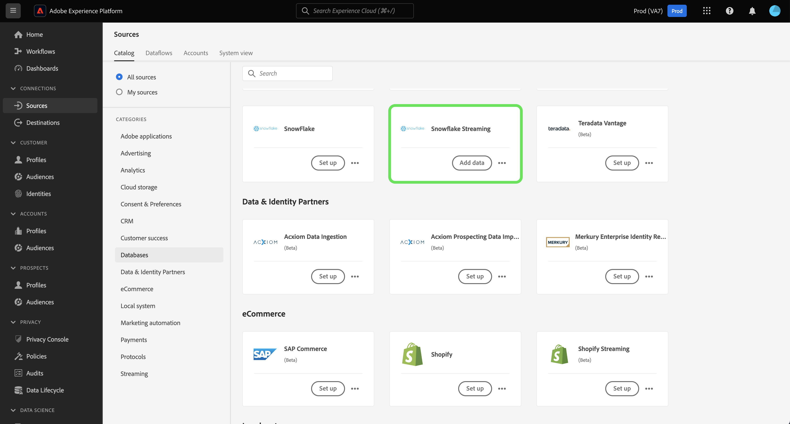

# Note sulla versione di Adobe Experience Platform

**Data di rilascio: mercoledì 19 marzo 2024**

>[!TIP]
>
>Utilizza il [Glossario di Adobe Experience Platform](/help/landing/glossary.md) per acquisire familiarità con la terminologia utilizzata in Real-time Customer Data Platform e Adobe Experience Platform. Se non riesci a trovare un termine specifico che stai cercando, utilizza le opzioni di feedback nella pagina per richiedere che nuovi termini vengano aggiunti al glossario.

Aggiornamenti alle funzioni esistenti in Experienci Platform:

- [Servizio catalogo](#catalog-service)
- [Raccolta dati](#data-collection)
- [Preparazione dei dati](#data-prep)
- [Destinazioni](#destinations)
- [Experience Data Model (XDM)](#xdm)
- [Servizio di segmentazione](#segmentation)
- [Origini](#sources)

## Servizio catalogo {#catalog-service}

Catalog Service è il sistema di registrazione per la posizione e la derivazione dei dati in Adobe Experience Platform. Mentre tutti i dati acquisiti in Experienci Platform vengono memorizzati nel data lake come file e directory, Catalog contiene i metadati e le descrizioni di tali file e directory a scopo di ricerca e monitoraggio.

>[!NOTE]
>
>Siamo a conoscenza e stiamo lavorando alla risoluzione di un problema di visualizzazione in cui viene eseguito il rendering della sintassi non necessaria accanto alle immagini nelle tabelle.

| Funzione | Descrizione |
| --- | --- |
| Altre azioni | Per rendere più flessibili le operazioni e facilitare la gestione dei dati, ora puoi utilizzare la funzione &quot;Altre azioni&quot; dalla vista dei dettagli per eseguire attività aggiuntive su un set di dati. Puoi eliminare il set di dati o abilitarlo per l’utilizzo con Real-Time Customer Profile dalla pagina dei dettagli di un set di dati selezionato. **Nota:** se abiliti un set di dati per l’acquisizione del profilo, lo schema del set di dati deve essere compatibile con Real-Time Customer Profile. ![L’area di lavoro Set di dati con [!UICONTROL ... Altro] menu a discesa evidenziato.](../2024/assets/march/more-actions.png "Nell’area di lavoro Set di dati è evidenziato il menu a discesa Altro."){width="100" zoomable="yes"}. Leggi le [guida utente sui set di dati](../../catalog/datasets/user-guide.md) per ulteriori informazioni. |

{style="table-layout:auto"}

Per ulteriori informazioni sul Servizio catalogo, consulta la [Panoramica sul servizio catalogo](../../catalog/home.md).

## Raccolta dati {#data-collection}

Adobe Experience Platform fornisce una suite di tecnologie che consente di raccogliere i dati sull’esperienza del cliente lato client e inviarli alla rete Edge di Adobe Experience Platform, per arricchirli, trasformarli e distribuirli a destinazioni Adobe o non Adobe.

**Nuove funzioni**

| Tipo | Funzione | Descrizione |
| --- | --- | --- |
| Estensioni | [!DNL Merkury] Estensione tag | Il [[!DNL Merkury] estensione tag](https://exchange.adobe.com/apps/ec/600027/merkury-tag) fornisce percentuali di corrispondenza leader di settore per i visitatori anonimi di siti web a [!DNL Merkury] ID I brand possono sfruttare la potenza del [!DNL Merkury] tag ed Adobi per fornire esperienze personalizzate in tempo reale ai siti web. Inoltre, il [!DNL Merkury] tag consente la crescita di dati digitali di prime parti insieme ai profili cliente online e offline connessi. |

{style="table-layout:auto"}

Per ulteriori informazioni sulla raccolta dei dati, consulta [panoramica sulla raccolta dati](../../tags/home.md).

## Preparazione dei dati {#data-prep}

La preparazione dei dati consente ai data engineer di mappare, trasformare e convalidare i dati da e per Experience Data Model (XDM).

**Funzioni nuove o aggiornate**

| Funzione | Descrizione |
| --- | --- |
| Nuove funzioni di mappatura per Adobe Analytics | Ora puoi utilizzare le seguenti funzioni per estrarre i dati evento da Adobe Analytics: <ul><li>`aa_get_event_id`</li><li>`aa_get_event_value`</li><li>`aa_get_product_categories`</li><li>`aa_get_product_names`</li><li>`aa_get_product_quantities`</li><li>`aa_get_product_prices`</li><li>`aa_get_product_event_values`</li><li>`aa_get_product_evars`</li></ul> Per ulteriori informazioni su queste funzioni, leggere [Guida alle funzioni della preparazione dati](../../data-prep/functions.md#analytics-functions) |

{style="table-layout:auto"}

Per ulteriori informazioni sulla preparazione dati, consulta [Panoramica sulla preparazione dati](../../data-prep/home.md).

## Destinazioni {#destinations}

[!DNL Destinations] sono integrazioni predefinite con piattaforme di destinazione che consentono l’attivazione diretta dei dati da Adobe Experience Platform. Puoi utilizzare le destinazioni per attivare i dati noti e sconosciuti per campagne di marketing cross-channel, campagne e-mail, pubblicità mirata e molti altri casi d’uso.

**Destinazioni nuove e aggiornate** {#new-updated-destinations}

| Destinazione | Tipo | Descrizione |
| ----------- | --------- | ----------- |
| [(Beta) Connessione di Acxiom Data Enhancement](../../destinations/catalog/data-partner/acxiom-data-enhancement.md) | Nuova | Utilizza questo connettore per attivare profili di prime parti da Real-Time CDP ad Acxiom per l’arricchimento dei dati e l’utilizzo tra i canali di marketing. Puoi quindi utilizzare l’origine Acxiom per importare i profili con dati migliorati e lavorarci in Real-Time CDP. |
| [(Beta) Connessione di eliminazione di Acxiom Prospect](../../destinations/catalog/data-partner/acxiom-prospect-suppression.md) | Nuova | Esporta i tipi di pubblico di prime parti nella destinazione Acxiom, per consentire ad Acxiom di eliminare i clienti noti o convertiti. Quindi, utilizza [Importazione dati di ricerca di Acxiom](../../sources/connectors/data-partners/acxiom-prospecting-data-import.md) connettore di origine per acquisire e attivare gli elenchi di potenziali clienti da Acxiom, con i clienti noti o convertiti rimossi. |
| [Connessione Amazon Ads](../../destinations/catalog/advertising/amazon-ads.md) | Aggiornamento | Durante l’esportazione dei dati nella destinazione Amazon Ads, ora è possibile indirizzare i dati all’DSP di Amazon o al Marketing Cloud Amazon (nuovo). |

{style="table-layout:auto"}

<!--

**New or updated functionality** {#destinations-new-updated-functionality}

-->

Per informazioni più generali sulle destinazioni, consulta la [panoramica sulle destinazioni](../../destinations/home.md).

## Experience Data Model (XDM) {#xdm}

XDM è una specifica open-source che fornisce strutture e definizioni comuni (schemi) per i dati inseriti in Adobe Experience Platform. Aderendo agli standard XDM, tutti i dati sull’esperienza cliente possono essere incorporati in una rappresentazione comune per fornire approfondimenti in modo più rapido e integrato. Puoi ottenere approfondimenti importanti dalle azioni della clientela, definire i tipi di pubblico della clientela attraverso i segmenti e utilizzare gli attributi della clientela a scopo di personalizzazione.

**Nuove funzioni**

| Funzione | Descrizione |
| --- | --- |
| Supporto del tipo di dati per la mappa dell’interfaccia utente di Experienci Platform | Personalizza ulteriormente la struttura dati Experience Data Model (XDM) definendo i campi mappa nell’interfaccia utente di Platform. Ora puoi creare campi mappa nell’Editor schema per modellare strutture di dati flessibili o archiviare in modo efficiente coppie chiave-valore. Seleziona &quot;Mappa&quot; dal menu a discesa Tipo quando definisci un nuovo campo per configurare i sottocampi e assegnarli ai gruppi di campi. I tipi di valore di mappa supportati sono string e integer. {width="100" zoomable="yes"}  Per scoprire come [definire i campi mappa nell’interfaccia utente](../../xdm/ui/fields/map.md), consulta la guida dell’interfaccia utente. |

{style="table-layout:auto"}

Per ulteriori informazioni su XDM in Platform, consulta la [Panoramica sul sistema XDM](../../xdm/home.md).

## Servizio di segmentazione {#segmentation}

[!DNL Segmentation Service] consente di segmentare i dati memorizzati in [!DNL Experience Platform] che si riferiscono ai singoli utenti (come clienti, potenziali clienti, utenti o organizzazioni) in tipi di pubblico. Puoi creare tipi di pubblico tramite definizioni di segmenti o altre origini dai tuoi dati di [!DNL Real-Time Customer Profile]. Questi tipi di pubblico sono configurati e gestiti centralmente in [!DNL Platform] e sono facilmente accessibili da qualsiasi soluzione Adobe.

**Nuova funzionalità**

| Funzione | Descrizione |
| ------- | ----------- |
| Azioni in blocco | L’inventario del pubblico ora supporta azioni in blocco. Utilizzando le azioni collettive, puoi selezionare rapidamente più tipi di pubblico per spostarli in una cartella, applicarvi i tag, applicare le etichette di accesso o eliminarli.   {width="100" zoomable="yes"}  Per ulteriori informazioni su questa funzione, leggere [Guida dell’interfaccia utente di Segmentation Service](../../segmentation/ui/overview.md#bulk-actions). |

{style="table-layout:auto"}

Per ulteriori informazioni sul servizio di segmentazione, consulta [Panoramica del servizio di segmentazione](../../segmentation/home.md).

## Origini {#sources}

Experience Platform fornisce un’API RESTful e un’interfaccia utente interattiva per impostare facilmente le connessioni di origine per vari provider di dati. Queste connessioni di origine consentono di autenticarti e connetterti a sistemi di archiviazione esterni e servizi di gestione delle relazioni con i clienti, impostare i tempi per le esecuzioni dell’acquisizione e gestire la velocità effettiva di acquisizione dei dati.

**Fonti nuove e aggiornate**

| Funzione | Tipo | Descrizione |
| --- | --- | --- |
| [!BADGE Beta]{type=Informative} [!DNL Acxiom Data Ingestion] | Nuova | Utilizza il [[!DNL Acxiom Data Ingestion] sorgente](../../sources/tutorials/ui/create/data-partners/acxiom-data-ingestion.md) per acquisire [!DNL Acxiom] Real-time Customer Data Platform e arricchire i profili di prime parti. Quindi, puoi utilizzare il [!DNL Acxiom]: profili di prime parti arricchiti per migliorare i tipi di pubblico e attivarli tra i canali di marketing.   {width="100" zoomable="yes"}   Leggi le [[!DNL Acxiom Data Ingestion] panoramica](../../sources/connectors/data-partners/acxiom-data-ingestion.md) per informazioni su come iniziare. |
| [!BADGE Beta]{type=Informative} [!DNL Stripe] | Nuova | Utilizza il [[!DNL Stripe] sorgente](../../sources/connectors/payments/stripe.md) acquisire in Experienci Platform i dati acquisiti durante il flusso di acquisto dai clienti. Una volta acquisiti, puoi utilizzare questi dati per creare offerte personalizzate e sfruttare informazioni aziendali più approfondite.   {width="100" zoomable="yes"}   Leggi le [[!DNL Stripe] panoramica](../../sources/connectors/payments/stripe.md) per informazioni su come iniziare. |
| Supporto dell’interfaccia utente per [!DNL Snowflake Streaming] | Nuova | Ora puoi utilizzare la [[!DNL Snowflake Streaming] sorgente](../../sources/tutorials/ui/create/databases/snowflake-streaming.md) nell’interfaccia utente di Experienci Platform, per eseguire lo streaming dei dati dal [!DNL Snowflake] database.   {width="100" zoomable="yes"}   Leggi le [[!DNL Snowflake Streaming] panoramica](../../sources/connectors/databases/snowflake-streaming.md) per informazioni su come iniziare. |

{style="table-layout:auto"}

Per ulteriori informazioni sulle origini, leggere [panoramica sulle origini](../../sources/home.md).

