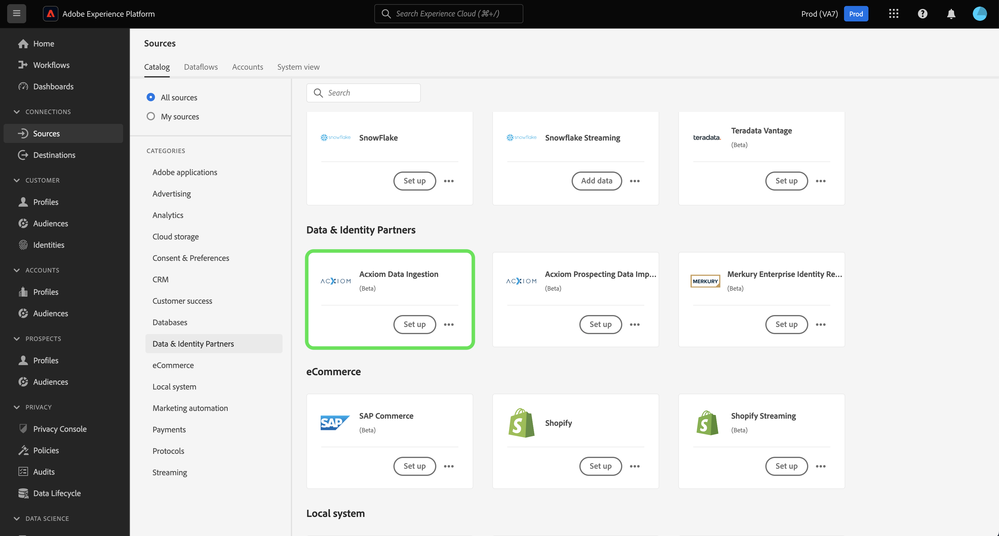

# Note sulla versione di Adobe Experience Platform

**Data di rilascio: 19 marzo 2024**

>[!TIP]
>
>Utilizza il [glossario di Adobe Experience Platform](/help/landing/glossary.md) per acquisire familiarità con la terminologia utilizzata in Real-time Customer Data Platform e Adobe Experience Platform. Se non trovi un termine specifico, utilizza le opzioni di feedback nella pagina per richiedere che nuovi termini vengano aggiunti al glossario.

Aggiornamenti alle funzioni esistenti in Adobe Experience Platform:

- [Servizio catalogo](#catalog-service)
- [Raccolta dati](#data-collection)
- [Preparazione dei dati](#data-prep)
- [Destinazioni](#destinations)
- [Experience Data Model (XDM)](#xdm)
- [Servizio di segmentazione](#segmentation)
- [Origini](#sources)

## Servizio catalogo {#catalog-service}

Il servizio catalogo è il sistema di registrazione per la posizione e la derivazione dei dati in Adobe Experience Platform. Tutti i dati acquisiti in Experience Platform vengono memorizzati nel data lake come file e directory. Il servizio catalogo, invece, contiene i metadati e le descrizioni di tali file e directory a scopo di ricerca e monitoraggio.

| Funzione | Descrizione |
| --- | --- |
| Altre azioni | Per rendere più flessibili le operazioni e facilitare la gestione dei dati, ora puoi utilizzare la funzione “Altre azioni” nella vista dei dettagli per eseguire attività aggiuntive su un set di dati. Dalla pagina dei dettagli di un set di dati selezionato, puoi eliminare il set di dati o abilitarlo affinché possa essere utilizzato con il profilo cliente in tempo reale. **Nota:** se abiliti un set di dati per l’acquisizione nel profilo, lo schema del set di dati deve essere compatibile con il profilo cliente in tempo reale. ![Area di lavoro Set di dati in cui è evidenziato il menu a discesa [!UICONTROL ... Altro].](../2024/assets/march/more-actions.png "Area di lavoro Set di dati in cui è evidenziato il menu a discesa Altro."){width="100" zoomable="yes"}. Per ulteriori informazioni, consulta la [guida utente per i set di dati](../../catalog/datasets/user-guide.md). |

{style="table-layout:auto"}

Per ulteriori informazioni sul Servizio catalogo, consulta la [Panoramica sul servizio catalogo](../../catalog/home.md).

## Preparazione dei dati {#data-prep}

La preparazione dei dati consente ai data engineer di mappare, trasformare e convalidare i dati da e per Experience Data Model (XDM).

**Funzioni nuove o aggiornate**

| Funzione | Descrizione |
| --- | --- |
| Nuove funzioni di mappatura per Adobe Analytics | Ora puoi utilizzare le seguenti funzioni per estrarre i dati evento da Adobe Analytics: <ul><li>`aa_get_event_id`</li><li>`aa_get_event_value`</li><li>`aa_get_product_categories`</li><li>`aa_get_product_names`</li><li>`aa_get_product_quantities`</li><li>`aa_get_product_prices`</li><li>`aa_get_product_event_values`</li><li>`aa_get_product_evars`</li></ul> Per ulteriori informazioni, consulta la [guida alle funzioni di preparazione dati](../../data-prep/functions.md#analytics-functions). |

{style="table-layout:auto"}

Per ulteriori informazioni sulla preparazione dati, consulta la [Panoramica sulla preparazione dati](../../data-prep/home.md).

## Raccolta dati {#data-collection}

Adobe Experience Platform fornisce una suite di tecnologie che consente di raccogliere i dati sull’esperienza del cliente lato client e inviarli alla rete Edge di Adobe Experience Platform, per arricchirli, trasformarli e distribuirli a destinazioni Adobe o non Adobe.

**Nuove funzioni**

| Tipo | Funzione | Descrizione |
| --- | --- | --- |
| Estensioni | Estensione [!DNL Merkury] Tag | L’estensione [[!DNL Merkury]  Tag](https://exchange.adobe.com/apps/ec/600027/merkury-tag) fornisce tassi di corrispondenza leader di settore per i visitatori anonimi di siti web a un ID [!DNL Merkury]. I brand possono sfruttare la potenza di [!DNL Merkury] Tag e di Adobe per fornire esperienze personalizzate in tempo reale ai siti web. Inoltre, [!DNL Merkury] Tag consente la crescita dei dati digitali di prime parti insieme ai profili cliente online e offline connessi. |

{style="table-layout:auto"}

Per ulteriori informazioni sulla raccolta dati, consulta la [panoramica sulla raccolta dati](../../tags/home.md).

## Destinazioni {#destinations}

[!DNL Destinations] sono integrazioni predefinite con piattaforme di destinazione che consentono l’attivazione diretta dei dati da Adobe Experience Platform. Puoi utilizzare le destinazioni per attivare i dati noti e sconosciuti per campagne di marketing cross-channel, campagne e-mail, pubblicità mirata e molti altri casi d’uso.

**Destinazioni nuove e aggiornate** {#new-updated-destinations}

| Destinazione | Tipo | Descrizione |
| ----------- | --------- | ----------- |
| [Connessione Acxiom Data Enhancement (Beta)](../../destinations/catalog/data-partner/acxiom-data-enhancement.md) | Nuova | Utilizza questo connettore per attivare profili di prima parte da Real-Time CDP ad Acxiom per l’arricchimento dei dati e l’utilizzo tra più canali di marketing. Puoi quindi usare l’origine Acxiom per importare profili con dati ottimizzati e utilizzarli in Real-Time CDP. |
| [Connessione Acxiom Prospect Suppression (Beta)](../../destinations/catalog/data-partner/acxiom-prospect-suppression.md) | Nuova | Esporta il pubblico di prima parte verso la destinazione Acxiom per consentire ad Acxiom di escludere i clienti noti o convertiti. Quindi, utilizza il connettore di origine [Acxiom Prospecting Data Import](../../sources/connectors/data-partners/acxiom-prospecting-data-import.md) per acquisire e attivare gli elenchi di potenziali clienti da Acxiom, rimuovendo i clienti già noti o convertiti. |
| [Connessione Amazon Ads](../../destinations/catalog/advertising/amazon-ads.md) | Aggiornamento | Durante l’esportazione dei dati verso la destinazione Amazon Ads, ora è possibile indirizzare i dati alla DSP di Amazon o al Marketing Cloud Amazon (novità). |
| [Connessione LiveRamp Onboarding](../../destinations/catalog/advertising/liveramp-onboarding.md) | Aggiornamento | La destinazione LiveRamp Onboarding ora supporta le consegne alle istanze [!DNL SFTP] di [!DNL LiveRamp] per Europa e Australia. Anche la dimensione massima del file esportato è stata aumentata a 10 milioni di righe (rispetto ai 5 milioni precedenti). |

{style="table-layout:auto"}

<!--

**New or updated functionality** {#destinations-new-updated-functionality}

-->

Per informazioni più generali sulle destinazioni, consulta la [panoramica sulle destinazioni](../../destinations/home.md).

## Experience Data Model (XDM) {#xdm}

XDM è una specifica open-source che fornisce strutture e definizioni comuni (schemi) per i dati inseriti in Adobe Experience Platform. Aderendo agli standard XDM, tutti i dati sull’esperienza cliente possono essere incorporati in una rappresentazione comune per fornire approfondimenti in modo più rapido e integrato. Puoi ottenere approfondimenti importanti dalle azioni della clientela, definire i tipi di pubblico della clientela attraverso i segmenti e utilizzare gli attributi della clientela a scopo di personalizzazione.

**Nuove funzioni**

| Funzione | Descrizione |
| --- | --- |
| Supporto del tipo di dati per la mappa dell’interfaccia utente di Experience Platform | Personalizza ulteriormente la struttura dati Experience Data Model (XDM) definendo i campi della mappa nell’interfaccia utente di Platform. Ora puoi creare campi mappa nell’editor di schemi per modellare strutture di dati flessibili o archiviare in modo efficiente coppie chiave-valore. Seleziona “Mappa” dal menu a discesa Tipo quando definisci un nuovo campo per configurare i sottocampi e assegnarli ai gruppi di campo. I tipi di valori mappa supportati sono stringa e nemero intero. {width="100" zoomable="yes"}  Per sapere come [definire i campi mappa nell’interfaccia utente](../../xdm/ui/fields/map.md), consulta la guida dell’interfaccia utente. |

{style="table-layout:auto"}

Per ulteriori informazioni su XDM in Platform, consulta la [Panoramica sul sistema XDM](../../xdm/home.md).

## Servizio di segmentazione {#segmentation}

[!DNL Segmentation Service] consente di segmentare i dati memorizzati in [!DNL Experience Platform] che si riferiscono ai singoli utenti (come clienti, potenziali clienti, utenti o organizzazioni) in tipi di pubblico. Puoi creare tipi di pubblico tramite definizioni di segmenti o altre origini dai tuoi dati di [!DNL Real-Time Customer Profile]. Questi tipi di pubblico sono configurati e gestiti centralmente in [!DNL Platform] e sono facilmente accessibili da qualsiasi soluzione Adobe.

**Nuova funzione**

| Funzione | Descrizione |
| ------- | ----------- |
| Azioni in blocco | L’inventario del pubblico ora supporta azioni in blocco. Utilizzando le azioni in blocco, puoi selezionare rapidamente più tipi di pubblico per spostarli in una cartella, applicarvi i tag, applicare le etichette di accesso o eliminarli.   {width="100" zoomable="yes"}  Per ulteriori informazioni su questa funzione, consulta la [panoramica su Audience Portal](../../segmentation/ui/audience-portal.md#bulk-actions). |

{style="table-layout:auto"}

Per ulteriori informazioni sul servizio di segmentazione, consulta la [panoramica sul servizio di segmentazione](../../segmentation/home.md).

## Origini {#sources}

Experience Platform fornisce un’API RESTful e un’interfaccia utente interattiva per impostare facilmente le connessioni di origine per vari provider di dati. Queste connessioni di origine consentono di autenticarti e connetterti a sistemi di archiviazione esterni e servizi di gestione delle relazioni con i clienti, impostare i tempi per le esecuzioni dell’acquisizione e gestire la velocità effettiva di acquisizione dei dati.

**Origini nuove e aggiornate**

| Funzione | Tipo | Descrizione |
| --- | --- | --- |
| [!BADGE Beta]{type=Informative} [!DNL Acxiom Data Ingestion] | Nuova | Utilizza l’origine [[!DNL Acxiom Data Ingestion] ](../../sources/tutorials/ui/create/data-partners/acxiom-data-ingestion.md)per acquisire i dati [!DNL Acxiom] in Real-time Customer Data Platform e arricchire i profili di prime parti. Puoi quindi utilizzare i profili di prime parti arricchiti da [!DNL Acxiom] per migliorare i tipi di pubblico e attivarli per vari canali di marketing.   {width="100" zoomable="yes"}   Per informazioni su come iniziare, consulta la panoramica su [[!DNL Acxiom Data Ingestion] ](../../sources/connectors/data-partners/acxiom-data-ingestion.md). |
| [!BADGE Beta]{type=Informative} [!DNL Stripe] | Nuova | Utilizza l’origine [[!DNL Stripe] ](../../sources/connectors/payments/stripe.md)per acquisire i dati ottenuti durante il flusso di acquisto dalla clientela in Experience Platform. Una volta acquisiti, puoi utilizzare questi dati per creare offerte personalizzate e attingere a informazioni di business più approfondite.   {width="100" zoomable="yes"}   Per informazioni su come iniziare, consulta la panoramica su [[!DNL Stripe] ](../../sources/connectors/payments/stripe.md). |
| Supporto di [!DNL Snowflake Streaming] nell’interfaccia utente | Nuova | È ora possibile utilizzare l’origine [[!DNL Snowflake Streaming] ](../../sources/tutorials/ui/create/databases/snowflake-streaming.md)nell’interfaccia utente di Experience Platform per eseguire lo streaming dei dati dal database [!DNL Snowflake].   {width="100" zoomable="yes"}   Per informazioni su come iniziare, consulta la panoramica su [[!DNL Snowflake Streaming] ](../../sources/connectors/databases/snowflake-streaming.md). |

{style="table-layout:auto"}

Per ulteriori informazioni sulle origini, consulta la [panoramica sulle origini](../../sources/home.md).
