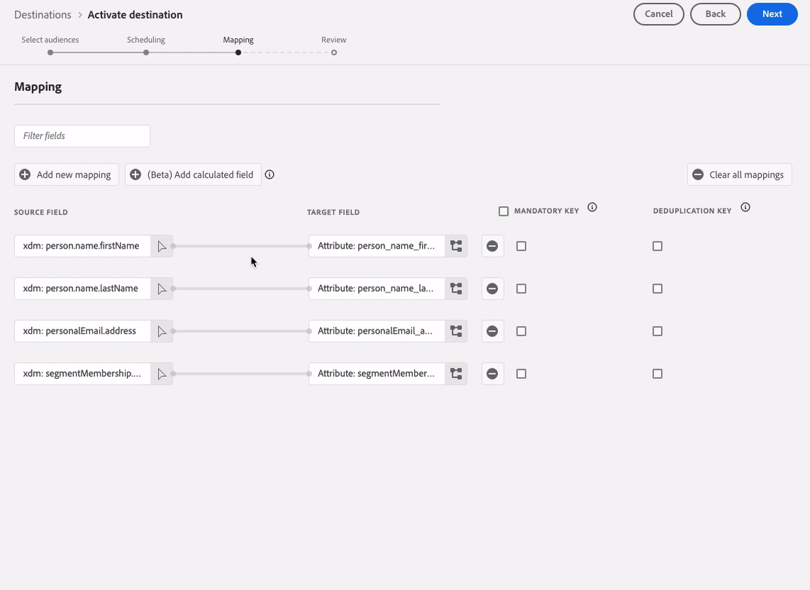
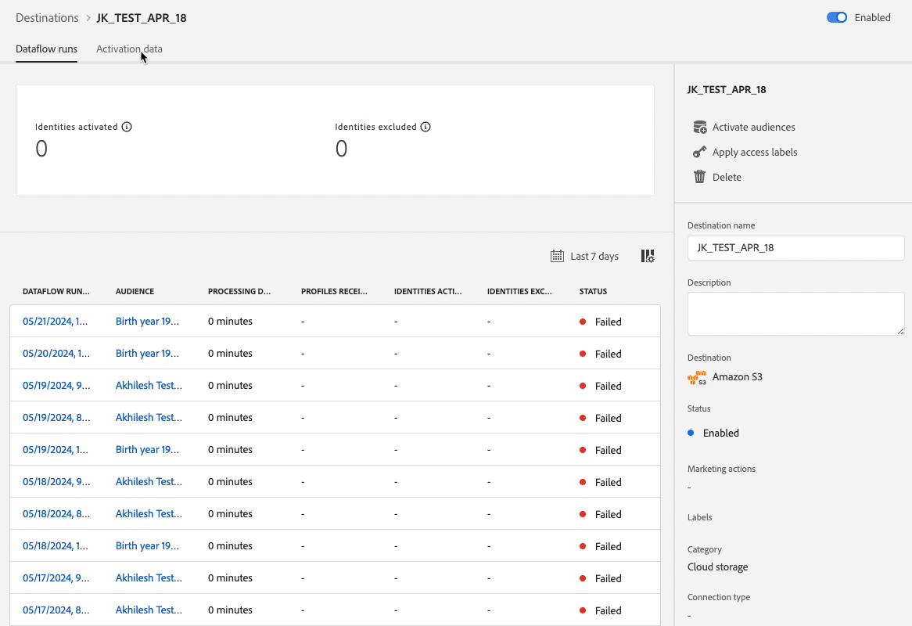

# Note sulla versione di Adobe Experience Platform

**Data di rilascio: mercoledì 21 maggio 2024**

>[!TIP]
>
>La [documentazione Experience Platform API](https://developer.adobe.com/experience-platform-apis/) è ora interattiva. Esplora gli endpoint API direttamente dalle pagine della documentazione per ottenere un feedback immediato e velocizzare l’implementazione tecnica. [Ulteriori informazioni](#interactive-api-documentation) sulla nuova funzionalità.

Aggiornamenti alle funzioni esistenti in Experience Platform:

- [Servizio catalogo](#catalog-service)
- [Dashboard](#dashboards)
- [Governance dei dati](#governance)
- [Destinazioni](#destinations)
- [Servizio query](#query-service)
- [Servizio di segmentazione](#segmentation)
- [Origini](#sources)

Altri aggiornamenti in Adobe Experience Platform:

- [Aggiornamenti alla documentazione](#documentation-updates)

## Servizio catalogo {#catalog-service}

Catalog Service è il sistema di registrazione per la posizione e la derivazione dei dati in Adobe Experience Platform. Mentre tutti i dati acquisiti in Experience Platform vengono memorizzati nel data lake come file e directory, Catalog contiene i metadati e le descrizioni di tali file e directory a scopo di ricerca e monitoraggio.

**Funzioni nuove o aggiornate**

| Funzione | Descrizione |
| --- | --- |
| Azioni in blocco | L’inventario dei set di dati ora supporta azioni in blocco. Semplifica i processi di gestione dei dati e assicurati la gestione efficiente dei set di dati con azioni in blocco. Utilizza le azioni in blocco per risparmiare tempo eseguendo più azioni contemporaneamente su numerosi set di dati.  Le azioni in blocco includono [Sposta nella cartella](../../catalog/datasets/user-guide.md#move-to-folders), [Modifica tag](../../catalog/datasets/user-guide.md#manage-tags) e [Elimina](../../catalog/datasets/user-guide.md#delete) set di dati.   {width="100" zoomable="yes"}   Per ulteriori informazioni su questa funzionalità, leggere la [Guida dell&#39;interfaccia utente dei set di dati](../../catalog/datasets/user-guide.md#bulk-actions). |

{style="table-layout:auto"}

## Dashboard {#dashboards}

Adobe Experience Platform fornisce più dashboard attraverso le quali è possibile visualizzare approfondimenti importanti sui dati della tua organizzazione, acquisiti durante le istantanee giornaliere.

**Funzioni nuove o aggiornate**

| Funzione | Descrizione |
| --- | --- |
| Informazioni SQL per il reporting esteso delle app | [transizione perfetta dell&#39;output di analisi SQL in formati visivi comprensibili e intuitivi](../../dashboards/data-distiller/sql-insights/overview.md). Utilizza query SQL personalizzate per una manipolazione precisa dei dati e la creazione di grafici dinamici da diversi set di dati strutturati. È possibile utilizzare la modalità query pro per eseguire analisi complesse con SQL e quindi condividere questa analisi con utenti non tecnici tramite grafici nel dashboard personalizzato o esportarli in file CSV. |

{style="table-layout:auto"}

## Governance dei dati {#governance}

La governance dei dati di Adobe Experience Platform è una serie di strategie e tecnologie utilizzate per gestire i dati della clientela e garantire la conformità a normative, restrizioni e criteri applicabili all’utilizzo dei dati. Svolge un ruolo chiave all&#39;interno di [!DNL Experience Platform] a vari livelli, tra cui catalogazione, derivazione dati, etichettatura di utilizzo dati, criteri di accesso ai dati e controllo degli accessi ai dati per le azioni di marketing.

**Nuove funzioni**

| Funzione | Descrizione |
| --- | --- |
| Supporto mTLS per destinazioni API HTTP e azioni personalizzate Adobe Journey Optimizer | Rafforzare la fiducia dei clienti con le misure di sicurezza rafforzate del protocollo Mutual Transport Layer Security (mTLS). La [destinazione API HTTP Experience Platform](../../destinations/catalog/streaming/http-destination.md#mtls-protocol-support) e le [azioni personalizzate Adobe Journey Optimizer](https://experienceleague.adobe.com/en/docs/journey-optimizer/using/orchestrate-journeys/about-journey-building/using-custom-actions) ora supportano il protocollo mTLS per l&#39;invio di dati agli endpoint configurati. Per attivare mTLS non è necessaria alcuna configurazione aggiuntiva nella destinazione dell’azione personalizzata o dell’API HTTP. Questo processo si verifica automaticamente quando viene rilevato un endpoint abilitato per mTLS. Puoi [scaricare il certificato pubblico di Adobe Journey Optimizer qui](../../landing/governance-privacy-security/encryption.md#download-certificates) e il certificato pubblico del servizio [Destinations qui](../../landing/governance-privacy-security/encryption.md#download-certificates). Consulta la [documentazione Experience Platform sulla crittografia dei dati](../../landing/governance-privacy-security/encryption.md#mtls-protocol-support) per ulteriori informazioni sui protocolli di connessione di rete durante l&#39;esportazione di dati in sistemi di terze parti. |

{style="table-layout:auto"}

## Destinazioni {#destinations}

[!DNL Destinations] sono integrazioni predefinite con piattaforme di destinazione che consentono l’attivazione diretta dei dati da Adobe Experience Platform. Puoi utilizzare le destinazioni per attivare i dati noti e sconosciuti per campagne di marketing cross-channel, campagne e-mail, pubblicità mirata e molti altri casi d’uso.

**Funzionalità nuove o aggiornate** {#destinations-new-updated-functionality}

| Funzionalità | Descrizione |
| ----------- | ----------- |
| Riordina i campi di mappatura per le destinazioni batch | Ora puoi modificare l&#39;ordine delle colonne nelle esportazioni CSV trascinando i campi di mappatura nel [passaggio di mappatura](../../destinations/ui/activate-batch-profile-destinations.md#mapping). L’ordine dei campi mappati nell’interfaccia utente si riflette nell’ordine delle colonne nel file CSV esportato, dall’alto verso il basso, con la riga in alto che corrisponde alla colonna più a sinistra nel file CSV.   {width="100" zoomable="yes"} |
| Programmi di esportazione predefiniti preselezionati per le destinazioni batch | Experience Platform ora imposta automaticamente una pianificazione predefinita per ogni esportazione di file. Per informazioni su come modificare la pianificazione predefinita, consulta la documentazione sulla [pianificazione delle esportazioni del pubblico](../../destinations/ui/activate-batch-profile-destinations.md#scheduling). |
| Modificare più pianificazioni di attivazione del pubblico per le destinazioni batch | È ora possibile modificare la pianificazione di attivazione per più tipi di pubblico esportati nella destinazione batch (basata su file) dalla scheda **[!UICONTROL Dati attivazione]** della [pagina dei dettagli della destinazione](../../destinations/ui/destination-details-page.md#bulk-edit-schedule).   {width="100" zoomable="yes"} |
| Esportare più tipi di pubblico on-demand in destinazioni batch | Ora puoi selezionare ed esportare più tipi di pubblico in destinazioni batch tramite la funzionalità [esporta file on-demand](../../destinations/ui/export-file-now.md). |

{style="table-layout:auto"}

Per informazioni più generali sulle destinazioni, consulta [panoramica sulle destinazioni](../../destinations/home.md).

## Servizio query {#query-service}

Il Servizio query consente di utilizzare SQL standard per eseguire query sui dati in Adobe Experience Platform.[!DNL Data Lake] È possibile unire qualsiasi set di dati da [!DNL Data Lake] e acquisire i risultati della query come nuovo set di dati da utilizzare nel reporting, in Data Science Workspace o per l&#39;acquisizione in Real-Time Customer Profile.

**Funzioni aggiornate**

| Funzione | Descrizione |
| --- | --- |
| Editor legacy obsoleto | L’editor legacy è obsoleto e non è più accessibile per l’utilizzo. Al suo posto, puoi utilizzare le [funzionalità avanzate dell&#39;editor di query](../../query-service/ui/user-guide.md#query-authoring) per scrivere, convalidare ed eseguire le query. |
| Ritardo esecuzione query | Tieni sotto controllo le ore di calcolo impostando avvisi per eventuali ritardi nell’esecuzione delle query. È possibile scegliere di ricevere avvisi se lo stato di una query non cambia dopo un determinato periodo di tempo. È sufficiente impostare il tempo di ritardo desiderato nell’interfaccia utente di Platform per rimanere informati sull’avanzamento della query. Per informazioni su come impostare questo avviso nell&#39;interfaccia utente, consulta la [documentazione sulle pianificazioni delle query](../../query-service/ui/query-schedules.md#alerts-for-query-status) o la [guida alle azioni query in linea](../../query-service/ui/monitor-queries.md#query-run-delay). |
| Inventario semplificato dei registri di query | È ora possibile utilizzare una maggiore efficienza nella risoluzione dei problemi e nel monitoraggio delle attività con [interfaccia utente dei registri di query semplificata](../../query-service/ui/query-logs.md#filter-logs): <ul><li> Per impostazione predefinita, l’interfaccia utente di Platform ora esclude tutte le &quot;Query di sistema&quot; dalla scheda dei registri. </li><li> Visualizzare le query di sistema deselezionando **Escludi query di sistema**. </li></ul>   {width="100" zoomable="yes"}   Utilizza l&#39;interfaccia utente semplificata dei registri di query per una visualizzazione più mirata che consente di identificare e analizzare rapidamente i registri rilevanti. |
| Selettore database | Utilizza il nuovo menu a discesa del selettore del database per [accedere comodamente alle visualizzazioni dati di Customer Journey Analytics da Power BI o Tableau](../../query-service/ui/credentials.md#connect-to-customer-journey-analytics). Ora puoi selezionare il database desiderato direttamente dall’interfaccia utente di Platform per un’integrazione più semplice degli strumenti di business intelligence.   {width="100" zoomable="yes"}   |

{style="table-layout:auto"}

## Servizio di segmentazione {#segmentation}

[!DNL Segmentation Service] consente di segmentare i dati memorizzati in [!DNL Experience Platform] che si riferiscono ai singoli utenti (come clienti, potenziali clienti, utenti o organizzazioni) in tipi di pubblico. Puoi creare tipi di pubblico tramite definizioni di segmenti o altre origini dai tuoi dati di [!DNL Real-Time Customer Profile]. Questi tipi di pubblico sono configurati e gestiti centralmente in [!DNL Platform] e sono facilmente accessibili da qualsiasi soluzione Adobe.

**Funzione aggiornata**

| Funzione | Descrizione |
| --- | --- |
| Importare tipi di pubblico generati esternamente | L’importazione di tipi di pubblico generati esternamente ora richiede l’autorizzazione &quot;Import audience&quot; (Importa pubblico). Per ulteriori informazioni sulle autorizzazioni, consulta la [guida dell&#39;interfaccia utente delle autorizzazioni](../../access-control/home.md#permissions). |

{style="table-layout:auto"}

## Origini {#sources}

Experience Platform fornisce un’API RESTful e un’interfaccia utente interattiva per impostare facilmente le connessioni di origine per vari provider di dati. Queste connessioni di origine consentono di autenticarti e connetterti a sistemi di archiviazione esterni e servizi di gestione delle relazioni con i clienti, impostare i tempi per le esecuzioni dell’acquisizione e gestire la velocità effettiva di acquisizione dei dati.

Utilizza le origini in Experience Platform per acquisire dati da un’applicazione Adobe o da un’origine dati di terze parti.

**Funzioni nuove o aggiornate**

| Funzione | Descrizione |
| --- | --- |
| Autenticazione credenziali client OAuth2 per l&#39;origine [!DNL Salesforce] | È ora possibile utilizzare le credenziali client OAuth2 per autenticare l&#39;account [!DNL Salesforce] in Experience Platform. Per ulteriori informazioni, leggere la [guida API](../../sources/tutorials/api/create/crm/salesforce.md) di origine [!DNL Salesforce] e la [guida interfaccia utente](../../sources/tutorials/ui/create/crm/salesforce.md). |
| Supporto per il flusso di dati di esempio per l&#39;origine [!DNL Marketo Engage] | L&#39;origine [!DNL Marketo Engage] ora supporta i flussi di dati di esempio. Abilita la configurazione del flusso di dati di esempio per limitare il tasso di acquisizione, quindi prova le funzioni di Experience Platform senza dover acquisire grandi quantità di dati. Per ulteriori informazioni, consulta la guida su [creazione di un flusso di dati per [!DNL Marketo Engage] nell&#39;interfaccia utente](../../sources/tutorials/ui/create/adobe-applications/marketo.md). |
| Aggiornamenti all’elenco consentiti dell’indirizzo IP | A seconda della posizione, è necessario aggiungere un set di nuovi indirizzi IP all’elenco consentiti per utilizzare correttamente le origini di streaming. Per un elenco completo dei nuovi indirizzi IP, leggere la [guida di elenco consentiti dell&#39;indirizzo IP](../../sources/ip-address-allow-list.md). |

{style="table-layout:auto"}

**Documentazione nuova o aggiornata**

| Documentazione aggiornata | Descrizione |
| --- | --- |
| Aggiornamenti alla documentazione per [!DNL Google PubSub] | La documentazione di origine di [!DNL Google PubSub] è stata aggiornata con una guida completa ai prerequisiti. Utilizzare la nuova sezione dei prerequisiti per scoprire come creare l&#39;account di servizio, concedere le autorizzazioni a livello di argomento o di sottoscrizione e impostare le configurazioni per ottimizzare l&#39;utilizzo dell&#39;origine [!DNL Google PubSub]. Per ulteriori informazioni, leggere la [[!DNL Google PubSub] panoramica](../../sources/connectors/cloud-storage/google-pubsub.md). |

{style="table-layout:auto"}

Per ulteriori informazioni sulle origini, leggere la [panoramica delle origini](../../sources/home.md).

## Aggiornamenti alla documentazione {#documentation-updates}

### Documentazione API di Experience Platform interattivo {#interactive-api-documentation}

La [documentazione Experience Platform API](https://developer.adobe.com/experience-platform-apis/) è ora interattiva. Tutte le pagine di riferimento API ora dispongono di una funzionalità **Prova** che puoi utilizzare per testare le chiamate API direttamente nella pagina del sito Web della documentazione. [Ottieni le credenziali di autenticazione richieste](/help/landing/api-authentication.md) e inizia a utilizzare la funzionalità per esplorare gli endpoint API.

Utilizza questa nuova funzionalità per esplorare le richieste e le risposte dagli endpoint API, per ottenere feedback immediati e velocizzare l’implementazione tecnica. Ad esempio, visita l&#39;[API del servizio Identity](https://developer.adobe.com/experience-platform-apis/references/identity-service/) o gli endpoint dell&#39;[API del registro dello schema](https://developer.adobe.com/experience-platform-apis/references/schema-registry/) per esplorare la nuova funzionalità **Prova** nella barra corretta.

>[!CAUTION]
>
>Tieni presente che utilizzando la funzionalità API interattiva nelle pagine della documentazione, stai effettuando chiamate API reali agli endpoint. Tieni presente questo aspetto durante la sperimentazione con le sandbox di produzione.

### Approfondimenti personalizzati e coinvolgimento {#personalized-insights-engagement}

È ora disponibile una nuova pagina della documentazione del caso d&#39;uso end-to-end per [l&#39;evoluzione del valore una tantum nel valore del ciclo di vita](/help/rtcdp/use-case-guides/evolve-one-time-value-lifetime-value/evolve-one-time-value-to-lifetime-value.md). Leggi questa documentazione per scoprire come utilizzare Real-Time CDP e Adobe Journey Optimizer per convertire i visitatori sporadici nelle tue proprietà web ai clienti fedeli.
