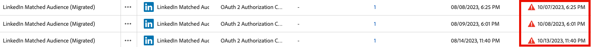

# Note sulla versione di Adobe Experience Platform

>[!TIP]
>
>Per le note sulla versione di altre applicazioni Adobe Experience Platform, consulta la seguente documentazione:
>
>- [Adobe Journey Optimizer](https://experienceleague.adobe.com/it/docs/journey-optimizer/using/whats-new/release-notes)
>- [Adobe Journey Optimizer B2B](https://experienceleague.adobe.com/it/docs/journey-optimizer-b2b/user/release-notes)
>- [Customer Journey Analytics](https://experienceleague.adobe.com/it/docs/analytics-platform/using/releases/pre-release-notes)
>- [Composizione di pubblico federato](https://experienceleague.adobe.com/it/docs/federated-audience-composition/using/e-release-notes)
>- [Real-Time CDP Collaboration](https://experienceleague.adobe.com/it/docs/real-time-cdp-collaboration/using/latest)

**Data di rilascio: 23 settembre 2025**

Nuove funzioni e aggiornamenti alle funzioni esistenti in Adobe Experience Platform:

- [Agent Orchestrator](#agent-orchestrator)
- [Avvisi](#alerts)
- [Destinazioni](#destinations)
- [Experience Data Model (XDM)](#xdm)
- [Profilo cliente in tempo reale](#profile)
- [Servizio di segmentazione](#segmentation-service)
- [Origini](#sources)

## Agent Orchestrator {#agent-orchestrator}

Agent Orchestrator di Adobe Experience Platform è il nuovo livello di agente in Adobe Experience Platform.

**Nuove funzioni**

| Funzione | Descrizione |
| --- | --- |
| Agent Orchestrator | Agent Orchestrator di Adobe Experience Platform è il nuovo livello di agente in Adobe Experience Platform. Progettato per sfruttare la ricca disponibilità di dati e le conoscenze della clientela della piattaforma, Agent Orchestrator di Experience Platform potenzia le informazioni e il ragionamento alla base degli Agenti esperti di Adobe Experience Platform appositamente creati, consentendo loro di eseguire complesse attività decisionali e di risoluzione dei problemi in modo rapido e su larga scala, sempre con intervento umano. Quando poni domande o richiedi assistenza tramite il linguaggio naturale in un’interfaccia conversazionale come l’Assistente IA, Agent Orchestrator richiama automaticamente ad agenti specializzati per ottenere le risposte giuste. Agent Orchestrator ricorda la cronologia delle conversazioni consentendoti di fare riferimento alle domande precedenti in modo naturale, senza dover ripetere il contesto, e combina gli insight provenienti da più agenti per fornire risposte chiare e unificate. Per ulteriori informazioni, consulta la [documentazione su Agent Orchestrator](https://experienceleague.adobe.com/it/docs/experience-cloud-ai/experience-cloud-ai/agents/agent-orchestrator). |
| Agente Audience | Agente Audience consente di visualizzare gli insight sui tipi di pubblico, tra cui il rilevamento di modifiche significative nelle dimensioni, il rilevamento di duplicati, l’esplorazione dell’inventario e il recupero delle dimensioni. Per ulteriori informazioni, consulta la [documentazione su Agente Audience](https://experienceleague.adobe.com/it/docs/experience-cloud-ai/experience-cloud-ai/agents/audience). |

Per ulteriori informazioni, consulta la [documentazione su Agent Orchestrator](https://experienceleague.adobe.com/it/docs/experience-cloud-ai/experience-cloud-ai/home).

## Avvisi {#alerts}

Experience Platform consente di iscriverti agli avvisi basati su eventi per varie attività di Experience Platform. Puoi iscriverti a diverse regole di avviso tramite la scheda [!UICONTROL Avvisi] nell’interfaccia utente di Experience Platform e scegliere di ricevere messaggi di avviso nell’interfaccia stessa o tramite notifiche e-mail.

**Nuove funzioni**

| Funzione | Descrizione |
| --- | --- |
| Avvisi di acquisizione del profilo di streaming | Ora puoi iscriverti a due nuovi avvisi per l’acquisizione in streaming a livello di flusso di dati: <ul><li>Tasso di acquisizione in streaming errata superato</li><li>Tasso di acquisizione in streaming ignorata superato</li></ul> Gli avvisi e-mail o nella piattaforma ti informeranno quando vengono superati i limiti per la soglia predefinita o personalizzata da te definita. Per ulteriori informazioni, consulta la guida [Avvisi del profilo](../../observability/alerts/rules.md#profile). |

{style="table-layout:auto"}

Per ulteriori informazioni sugli avvisi, consulta la [[!DNL Observability Insights] panoramica](../../observability/home.md).

## Destinazioni {#destinations}

[!DNL Destinations] sono integrazioni predefinite con piattaforme di destinazione che consentono l’attivazione diretta dei dati da Experience Platform. Puoi utilizzare le destinazioni per attivare i dati noti e sconosciuti per campagne di marketing cross-channel, campagne e-mail, pubblicità mirata e molti altri casi d’uso.

**Destinazioni nuove o aggiornate**

| Destinazione | Descrizione |
| --- | --- |
| Connettore [[!DNL Snowflake Batch]](../../destinations/catalog/cloud-storage/snowflake-batch.md) [!BADGE Beta]{type=Informative} | È ora disponibile un nuovo connettore [!DNL Snowflake Batch] che fornisce un’alternativa al connettore di streaming per casi d’uso specifici. |
| Supporto crittografia [[!DNL Data Landing Zone]](../../destinations/catalog/cloud-storage/data-landing-zone.md) | È ora possibile allegare chiavi pubbliche con formattazione RSA per crittografare i file esportati, garantendo lo stesso livello di sicurezza fornito da altre destinazioni di archiviazione cloud per le informazioni sensibili. |
| Dettagli sulla scadenza dell’autenticazione per destinazioni [[!DNL Pinterest]](../../destinations/catalog/advertising/pinterest.md) | Le informazioni sulla scadenza dell’autenticazione per le destinazioni [!DNL Pinterest] sono ora visibili direttamente nell’interfaccia di Experience Platform, per consentirti di visualizzare quando scadrà l’autenticazione e di rinnovarla prima che causi interruzioni nei flussi di dati. Puoi monitorare le date di scadenza del token dalla colonna **[!UICONTROL Data di scadenza account]** nelle schede **[[!UICONTROL Account]](../../destinations/ui/destinations-workspace.md#accounts)** o **[[!UICONTROL Sfoglia]](../../destinations/ui/destinations-workspace.md#browse)**. |

**Funzionalità nuove o aggiornate**

| Funzione | Descrizione |
| --- | --- |
| Funzionalità di gestione delle destinazioni migliorate nell’interfaccia utente di Experience Platform | Migliora il flusso di lavoro di gestione della destinazione con le nuove funzionalità di ricerca nelle schede [[!UICONTROL Sfoglia]](../../destinations/ui/destinations-workspace.md#browse) e [[!UICONTROL Account]](../../destinations/ui/destinations-workspace.md#accounts). Ora puoi anche visualizzare un indicatore visivo quando l’autenticazione dell’account sta per scadere.   {width="100" zoomable="yes"} |
| Impostazioni della larghezza delle colonne persistenti | Le impostazioni della larghezza delle colonne ora persistono quando esci da una pagina e ci toni successivamente. Ad esempio, se modifichi la larghezza di una colonna nella scheda [[!UICONTROL Sfoglia]](../../destinations/ui/destinations-workspace.md#browse), la larghezza personalizzata della colonna rimarrà invariata quando esci e torni in quella scheda. |

Per ulteriori informazioni, consulta la [panoramica sulle destinazioni](../../destinations/home.md).

## Experience Data Model (XDM) {#xdm}

XDM è una specifica open-source che fornisce strutture e definizioni comuni (schemi) per i dati inseriti in Adobe Experience Platform. Aderendo agli standard XDM, tutti i dati sull’esperienza cliente possono essere incorporati in una rappresentazione comune per fornire approfondimenti in modo più rapido e integrato. Puoi ottenere approfondimenti importanti dalle azioni della clientela, definire i tipi di pubblico della clientela attraverso i segmenti e utilizzare gli attributi della clientela a scopo di personalizzazione.

**Nuove funzioni**

| Funzione | Descrizione |
| ------- | ----------- |
| Schemi basati su modelli | Semplifica la modellazione dei dati con schemi basati su modelli. Ora puoi creare gli schemi più facilmente con esempi e indicazioni completi. Questa funzione è attualmente disponibile per i titolari di licenze di orchestrazione della campagna e verrà estesa in disponibilità generale alla clientela di Data Distiller, rendendo la modellazione dei dati più accessibile ed efficiente. Questa funzione include il supporto per i dati della serie temporale e le funzionalità di acquisizione dei dati di modifica. |

Per ulteriori informazioni, consulta la [panoramica su XDM](../../xdm/home.md).

<!--

| Data Mirror | Ingest row-level changes from cloud data warehouses (e.g., Snowflake, Databricks, BigQuery) into Adobe Experience Platform using model-based schemas. Data Mirror eliminates upstream ETL and preserves relationships, versioning, and deletions by mirroring existing database structures directly into the data lake. Time-series and record event schema behavior with change data capture capabilities are all supported. This feature is currently available for Campaign Orchestration license holders and will expand through this limited release, also including Customer Journey Analytics customers. See the [Data Mirror documentation](../../xdm/data-mirror/overview.md) for more details. Contact your Adobe representative for access. |
-->

## Profilo cliente in tempo reale {#profile}

Adobe Experience Platform ti consente di promuovere esperienze coordinate, coerenti e pertinenti per la tua clientela, indipendentemente da dove e quando interagisce con il tuo marchio. Con il Profilo cliente in tempo reale puoi avere una visione completa di ogni singolo cliente combinando dati provenienti da più canali, inclusi online, offline, CRM e di terze parti. Il profilo ti consente di consolidare i dati clienti in una visualizzazione unificata che offre un account utilizzabile e dotato di marca temporale per ogni interazione con il cliente.

**Funzioni aggiornate**

| Funzione | Descrizione |
| ------- | ----------- |
| [!BADGE Alpha]{type=Informative} Questa funzione è attualmente in Alpha. Miglioramenti al visualizzatore del profilo | La versione di settembre 2025 include i seguenti miglioramenti al visualizzatore del profilo. <ul><li>**Vista combinata**: attributo, eventi e insight sono stati combinati in un’unica vista.</li><li>**Insight generati dall’IA**: la pagina dei dettagli del profilo ora mostra gli insight generati dall’IA, permettendoti di conoscere i dettagli generati dal profilo. Questi insight possono includere informazioni quali i punteggi di propensione e l’analisi delle tendenze.</li><li>**Aggiornamento dello stile**: la pagina dei dettagli del profilo è stata aggiornata visivamente.</li><li>**Sfoglia**: ora puoi esplorare i profili tramite un carosello interattivo basato su schede con funzionalità di ricerca e personalizzazione.</li></ul> |

**Aggiornamenti importanti**

| Aggiornamento | Descrizione |
| ------ | ----------- |
| API di eliminazione profilo obsoleta | L&#39;API di eliminazione del profilo [&#128279;](/help/profile/api/entities.md#delete-entity) diventerà obsoleta entro la fine di ottobre 2025. Se desideri eseguire operazioni di eliminazione dei record, puoi utilizzare il [flusso di lavoro API di eliminazione dei record del ciclo di vita dei dati](/help/hygiene/api/workorder.md) o il [flusso di lavoro interfaccia utente di eliminazione dei record del ciclo di vita dei dati](/help/hygiene/ui/record-delete.md). I flussi di lavoro del ciclo di vita dei dati forniscono il tracciamento del ciclo di vita end-to-end, nonché le quote mensili che è possibile visualizzare e gestire.   Dopo che l&#39;endpoint è stato dichiarato obsoleto, tutti gli utenti che lo utilizzano continueranno ad avere accesso a questo endpoint. La fine del ciclo di vita di questo evento sarà annunciata separatamente. In caso di domande, contatta l’Assistenza clienti Adobe. |

Per ulteriori informazioni, consulta la [panoramica sul profilo cliente in tempo reale](../../profile/home.md).

## Servizio di segmentazione {#segmentation-service}

[!DNL Segmentation Service] definisce un particolare sottoinsieme di profili descrivendo i criteri che distinguono un gruppo di persone commerciabile all’interno della tua clientela. I tipi di pubblico possono essere basati su dati dei record (ad esempio informazioni demografiche) o su eventi della serie temporale che rappresentano le interazioni della clientela con il tuo brand.

**Funzioni nuove o aggiornate**

| Funzione | Descrizione |
| ------- | ----------- |
| Tipi di pubblico dell’account con funzione obsoleta degli eventi esperienza | Dopo l’aggiornamento dell’architettura B2B, i tipi di pubblico dell’account con eventi esperienza non sono più supportati. Utilizza, invece, il nuovo approccio ai segmenti: crea un pubblico Persone con eventi esperienza, quindi fai riferimento a tale pubblico Persone durante la creazione di un pubblico dell’account. Questo fornisce un approccio più flessibile e gestibile alla creazione di tipi di pubblico B2B. |

**Aggiornamenti importanti**

| Aggiornamento | Descrizione |
| ------- | ----------- |
| Annullamento dell’aggiornamento automatico delle stime del pubblico | Il miglioramento dell’aggiornamento automatico per le stime del pubblico è stato annullato. Le stime del pubblico continueranno a essere generate nel Generatore dei segmenti, ma la funzionalità di aggiornamento automatico è stata rimossa. |
| Pubblico esterno | A partire dal 30 settembre, i tipi di pubblico esterno verranno recuperati tramite la Ricerca unificata nel Generatore di segmenti. Se utilizzi la corrispondenza dei segmenti, puoi abilitare l’esperienza precedente nel Generatore dei segmenti. |

Per ulteriori informazioni, consulta la [[!DNL Segmentation Service] panoramica](../../segmentation/home.md).

## Origini {#sources}

Experience Platform fornisce un’API RESTful e un’interfaccia utente interattiva per impostare facilmente le connessioni di origine per vari provider di dati. Queste connessioni di origine consentono di autenticarti e connetterti a sistemi di archiviazione esterni e servizi di gestione delle relazioni con i clienti, impostare i tempi per le esecuzioni dell’acquisizione e gestire la velocità effettiva di acquisizione dei dati.

**Funzioni nuove o aggiornate**

| Funzione | Descrizione |
| --- | --- |
| Nuove origini in disponibilità generale | Le seguenti origini sono ora in disponibilità generale. Diversi connettori di origine sono stati aggiornati dalla versione Beta a alla disponibilità generale: <ul><li>[Acquisizione di dati Acxiom](../../sources/connectors/data-partners/acxiom-data-ingestion.md)</li><li>[Acquisizione di dati di potenziali clienti Acxiom](../../sources/connectors/data-partners/acxiom-prospecting-data-import.md)</li><li>[Merkury Enterprise](../../sources/connectors/data-partners/merkury.md)</li><li>[SAP Commerce](../../sources/connectors/ecommerce/sap-commerce.md)</li></ul>. Queste origini sono ora completamente supportate e pronte per l’uso in produzione. |
| Supporto dell’autenticazione con coppia di chiavi [!DNL Snowflake] | Sicurezza avanzata per le connessioni Snowflake con supporto per l’autenticazione con coppia di chiavi. L’autenticazione di base (nome utente/password) diventerà obsoleta entro novembre 2025, pertanto la clientela è invitata a migrare all’autenticazione con coppia di chiavi per migliorare la sicurezza. Per ulteriori informazioni, consulta la [[!DNL Snowflake] documentazione](../../sources/connectors/databases/snowflake.md). |
| [!DNL Capillary Streaming Events] [!BADGE Beta]{type=Informative} | Utilizza l’origine [[!DNL Capillary Streaming Events]  &#x200B;](../../sources/connectors/loyalty/capillary.md) per inviare i dati di fidelizzazione dall’account [!DNL Capillary] ad Experience Platform. |
| [!DNL Relay Connector] [!BADGE Beta]{type=Informative} | Utilizza [[!DNL Relay Connector]](../../sources/tutorials/ui/create/marketing-automation/relay-connector.md) per eseguire lo streaming dei dati degli eventi dall&#39;integrazione di [!DNL Relay Network] in Experience Platform. |
| Disponibilità generale del supporto per collegamenti privati nelle origini | È ora possibile utilizzare **collegamenti privati** per un gruppo selezionato di origini. Utilizza questa funzione per creare un endpoint privato a cui l’origine può connettersi. Con gli endpoint privati, puoi configurare connessioni e flussi di dati che bypassano l’Internet pubblico, garantendo maggiore sicurezza e isolamento della rete per i dati sensibili. Il supporto per collegamenti privati è disponibile per le seguenti origini: <ul><li>[[!DNL Azure Blob Storage]](../../sources/connectors/cloud-storage/blob.md)</li><li>[[!DNL ADLS Gen2]](../../sources/connectors/cloud-storage/adls-gen2.md)</li><li>[[!DNL Azure File Storage]](../../sources/connectors/cloud-storage/azure-file-storage.md)</li></ul>. Per ulteriori informazioni, consulta le guide sulla creazione di collegamenti privati [nell’API](../../sources/tutorials/api/private-link.md) e [nell’interfaccia utente](../../sources/tutorials/ui/private-link.md). |

Per ulteriori informazioni, consulta la [panoramica sulle origini](../../sources/home.md).