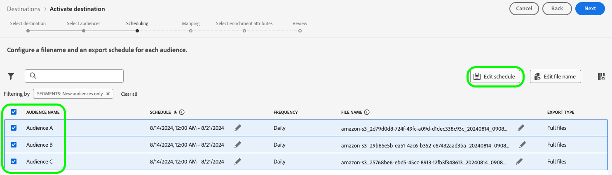

# Note sulla versione di Adobe Experience Platform

**Data di rilascio: 20 agosto 2024**

>[!TIP]
>
>Visualizza una [panoramica della documentazione sui casi d&#39;uso di esempio](https://experienceleague.adobe.com/en/docs/experience-platform/rtcdp/use-cases/overview) per scoprire vari casi d&#39;uso quali ricerca di potenziali clienti, acquisizione e altro ancora che la tua organizzazione può ottenere con Real-Time CDP.

Aggiornamenti alle funzioni e alla documentazione esistenti in Experience Platform:

- [Controllo degli accessi basato su attributi](#abac)
- [Destinazioni](#destinations)
- [Experience Data Model (XDM)](#xdm)
- [Identity Service](#identity-service)
- [Servizio di segmentazione](#segmentation)
- [Origini](#sources)

## Controllo degli accessi basato su attributi {#abac}

Il controllo degli accessi basato sugli attributi è una funzionalità di Adobe Experience Platform che offre ai brand attenti alla privacy una maggiore flessibilità per gestire l’accesso degli utenti. È possibile assegnare singoli oggetti, come campi e segmenti dello schema, ai ruoli utente. Questa funzione ti consente di concedere o revocare l’accesso a singoli oggetti per specifici utenti di Platform nella tua organizzazione.

Tramite il controllo dell’accesso basato su attributi, gli amministratori dell’organizzazione possono controllare l’accesso degli utenti ai dati personali sensibili (SPD), alle informazioni personali (PII) e ad altri tipi di dati personalizzati in tutti i flussi di lavoro e le risorse di Platform. Gli amministratori possono definire ruoli utente con accesso solo a campi e dati specifici che corrispondono a tali campi.

**Nuova funzionalità**

| Aggiornamento funzionalità | Descrizione |
| --- | --- |
| Nuova funzione di Gestione autorizzazioni | È ora possibile utilizzare [Gestione autorizzazioni](../../access-control/abac/permission-manager/overview.md) per generare report utilizzando query semplici, che consentiranno di comprendere la gestione degli accessi e risparmiare tempo nella verifica delle autorizzazioni di accesso in diversi flussi di lavoro e livelli di granularità. Per ulteriori informazioni sulla creazione di report per utenti e ruoli, vedere la [guida utente di Gestione autorizzazioni](../../access-control/abac/permission-manager/permissions.md). {width="250" align="center" zoomable="yes"} |

{style="table-layout:auto"}

Per ulteriori informazioni sul controllo degli accessi basato su attributi, vedere la [panoramica sul controllo degli accessi basato su attributi](../../access-control/abac/overview.md). Per una guida completa sul flusso di lavoro di controllo degli accessi basato su attributi, leggere la [guida end-to-end per il controllo degli accessi basato su attributi](../../access-control/abac/end-to-end-guide.md).

## Destinazioni {#destinations}

[!DNL Destinations] sono integrazioni predefinite con piattaforme di destinazione che consentono l’attivazione diretta dei dati da Adobe Experience Platform. Puoi utilizzare le destinazioni per attivare i dati noti e sconosciuti per campagne di marketing cross-channel, campagne e-mail, pubblicità mirata e molti altri casi d’uso.

**Destinazioni nuove o aggiornate** {#new-updated-destinations}

| Destinazione | Descrizione |
| ----------- | ----------- |
| [Braze](/help/destinations/catalog/mobile-engagement/braze.md) | [!UICONTROL Braze] gestisce una serie di istanze diverse per il dashboard e gli endpoint REST. I clienti [!UICONTROL Braze] devono utilizzare l&#39;endpoint REST corretto in base all&#39;istanza a cui è stato eseguito il provisioning. Questa versione aggiunge un nuovo endpoint US-07 che puoi selezionare quando ti connetti a [!UICONTROL Braze]. |

{style="table-layout:auto"}

**Funzionalità nuove o aggiornate** {#destinations-new-updated-functionality}

| Funzione | Descrizione |
| ----------- | ----------- |
| L’esportazione di file on-demand nelle destinazioni batch è ora generalmente disponibile. | L’opzione per esportare i file on-demand nelle destinazioni batch è ora disponibile per tutti i clienti. Per ulteriori dettagli, consulta la [documentazione dedicata](../../destinations/ui/export-file-now.md). |
| Modifica i programmi di esportazione per più tipi di pubblico esportati nel [passaggio di pianificazione](../../destinations/ui/activate-batch-profile-destinations.md#scheduling). | L’opzione per modificare i programmi di esportazione per più tipi di pubblico esportati direttamente dalla fase di pianificazione del flusso di lavoro di Audience Activation è ora disponibile per tutti i clienti. {width="250" align="center" zoomable="yes"} |
| Modificare i nomi dei file per più tipi di pubblico esportati nel [passaggio di pianificazione](../../destinations/ui/activate-batch-profile-destinations.md#scheduling). | L’opzione per modificare i nomi di più file esportati direttamente dalla fase di pianificazione del flusso di lavoro di Audience Activation è ora disponibile per tutti i clienti. {width="250" align="center" zoomable="yes"} |
| Rimuovi più tipi di pubblico da un flusso di dati dalla pagina [Dettagli destinazione](../../destinations/ui/destination-details-page.md#bulk-remove). | L&#39;opzione per rimuovere più tipi di pubblico dai flussi di dati esistenti dalla pagina **[!UICONTROL Dettagli destinazione]** è ora disponibile per tutti i clienti. {width="250" align="center" zoomable="yes"} |
| Esporta più file on-demand in destinazioni batch dalla pagina [Dettagli destinazione](../../destinations/ui/destination-details-page.md#bulk-export). | L&#39;opzione per esportare più file on-demand in destinazioni batch dalla pagina **[!UICONTROL Dettagli destinazione]** è ora disponibile per tutti i clienti. {width="250" align="center" zoomable="yes"} |
| Modifica i nomi dei file per più tipi di pubblico esportati dalla pagina [Dettagli destinazione](../../destinations/ui/destination-details-page.md#bulk-edit-file-names). | È ora possibile modificare i nomi di più file esportati direttamente dalla pagina **[!UICONTROL Dettagli destinazione]**. {width="250" align="center" zoomable="yes"} |
| Rimuovi più set di dati da un flusso di dati dalla pagina [Dettagli destinazione](../../destinations/ui/export-datasets.md#remove-dataset). | L’opzione per rimuovere più set di dati da un flusso di dati è ora disponibile per tutti i clienti. {width="250" align="center" zoomable="yes"} |

{style="table-layout:auto"}

Per ulteriori informazioni, leggere la [panoramica delle destinazioni](../../destinations/home.md).

## Experience Data Model (XDM) {#xdm}

XDM è una specifica open-source che fornisce strutture e definizioni comuni (schemi) per i dati inseriti in Adobe Experience Platform. Aderendo agli standard XDM, tutti i dati sull’esperienza cliente possono essere incorporati in una rappresentazione comune per fornire approfondimenti in modo più rapido e integrato. Puoi ottenere approfondimenti importanti dalle azioni della clientela, definire i tipi di pubblico della clientela attraverso i segmenti e utilizzare gli attributi della clientela a scopo di personalizzazione.

**Nuove funzioni**

| Funzione | Descrizione |
| --- | --- |
| Flusso di creazione schema assistito da apprendimento automatico | Utilizza algoritmi avanzati di apprendimento automatico per analizzare i file di dati di esempio e creare automaticamente schemi ottimizzati utilizzando campi standard e personalizzati. Caratteristiche principali: <ul><li>Creazione più rapida dello schema: genera schemi direttamente da file di dati di esempio utilizzando campi XDM consigliati e generati da XML.</li><li>Flexible Schema Evolution: consente di aggiungere o aggiornare facilmente i campi nello schema generato.</li><li>Integrazione perfetta: completamente integrato con il flusso di creazione dello schema di base nell’URL dello schema, per un’esperienza utente fluida e coesa.</li><li>Revisione e modifica efficienti: visualizza e aggiorna rapidamente lo schema utilizzando l’editor Flat View, rendendo il processo di creazione più efficiente e semplice da usare.</li></ul> Per ulteriori informazioni, consulta la [Guida al flusso di lavoro per la creazione di schemi assistiti da ML](../../xdm/ui/ml-assisted-schema-creation.md). |

{style="table-layout:auto"}

Per ulteriori informazioni su XDM in Platform, consulta la [Panoramica sul sistema XDM](../../xdm/home.md).

## Identity Service {#identity-service}

Utilizza il servizio Adobe Experience Platform Identity per creare una visione completa dei clienti e dei loro comportamenti, collegando le identità tra dispositivi e sistemi e consentendo di fornire esperienze digitali personali e di impatto in tempo reale.

**Documentazione aggiornata**

| Funzione | Descrizione |
| --- | --- |
| Guida alle configurazioni dei grafici | Leggi la [guida alle configurazioni del grafo](../../identity-service/identity-graph-linking-rules/example-configurations.md) per informazioni sugli scenari di grafo più comuni che potresti incontrare durante l&#39;utilizzo delle regole di collegamento del grafo delle identità e dei dati di identità. La guida alle configurazioni dei grafici fornisce esempi che vanno da semplici scenari di grafici per singola persona a scenari di grafici per più persone complessi e gerarchici. Puoi inoltre utilizzare la guida per esempi di eventi e configurazioni di algoritmi che puoi inserire nell&#39;[interfaccia utente di simulazione grafico](../../identity-service/identity-graph-linking-rules/graph-simulation.md), nonché per raggruppamenti della selezione delle identità primarie in determinati scenari di grafico. |

{style="table-layout:auto"}

Per ulteriori informazioni su Identity Service, leggere la [Panoramica di Identity Service](../../identity-service/home.md).

## Servizio di segmentazione {#segmentation}

[!DNL Segmentation Service] consente di segmentare i dati memorizzati in [!DNL Experience Platform] che si riferiscono ai singoli utenti (come clienti, potenziali clienti, utenti o organizzazioni) in tipi di pubblico. Puoi creare tipi di pubblico tramite definizioni di segmenti o altre origini dai tuoi dati di [!DNL Real-Time Customer Profile]. Questi tipi di pubblico sono configurati e gestiti centralmente in [!DNL Platform] e sono facilmente accessibili da qualsiasi soluzione Adobe.

**Funzioni aggiornate**

| Funzione | Descrizione |
| ------- | ----------- |
| Dettagli dell’acquisizione | Per i tipi di pubblico con origine di caricamento Personalizzata, puoi visualizzare in modo più completo i dettagli dell’acquisizione del pubblico nella pagina dei dettagli del pubblico. Inoltre, puoi applicare le etichette agli attributi del payload selezionando lo schema e selezionando gli attributi desiderati per l’etichettatura. Ulteriori informazioni sulla sezione dei dettagli di acquisizione sono disponibili nella [guida di Audience Portal](../../segmentation/ui/audience-portal.md#ingestion-details). |

{style="table-layout:auto"}

Per ulteriori informazioni su [!DNL Segmentation Service], consulta la [Panoramica sulla segmentazione](../../segmentation/home.md).

## Origini

Experience Platform fornisce un’API RESTful e un’interfaccia utente interattiva per impostare facilmente le connessioni di origine per vari provider di dati. Queste connessioni di origine consentono di autenticarti e connetterti a sistemi di archiviazione esterni e servizi di gestione delle relazioni con i clienti, impostare i tempi per le esecuzioni dell’acquisizione e gestire la velocità effettiva di acquisizione dei dati.

Utilizza le origini in Experience Platform per acquisire dati da un’applicazione Adobe o da un’origine dati di terze parti.

**Documentazione aggiornata**

| Documentazione aggiornata | Descrizione |
| --- | --- |
| Documentazione estesa sull’aggiornamento dei flussi di dati | La guida sull&#39;[aggiornamento dei flussi di dati di origine esistenti nell&#39;interfaccia utente](../../sources/tutorials/ui/update-dataflows.md) è stata aggiornata per fornire ulteriori informazioni sulle diverse configurazioni che è possibile apportare a un flusso di dati esistente. La guida è stata aggiornata anche per chiarire il comportamento previsto quando un flusso di dati disabilitato viene riabilitato. |

{style="table-layout:auto"}

Per ulteriori informazioni, leggere la [panoramica delle origini](../../sources/home.md).
