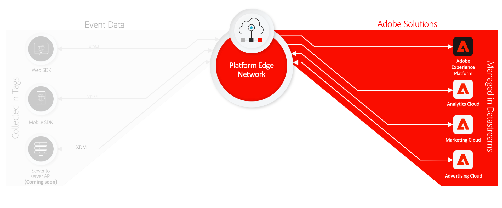

# Panoramica delle connessioni Real-time Customer Data Platform

Le connessioni Real-time Customer Data Platform (RTCDP) forniscono una suite di tecnologie che consentono di raccogliere i dati sull’esperienza del cliente da sorgenti lato client e di inviarli ad Adobe Experience Platform Edge Network dove possono essere arricchiti, trasformati e distribuiti in destinazioni Adobi o non Adobi in pochi secondi.

Le connessioni RTCDP sono supportate per le seguenti origini lato client:

* Applicazioni basate sul web
* Applicazioni mobili native
* Applicazioni OTT (Over-the-top)

Le connessioni RTCDP si concentrano sulla reperibilità e sull’accessibilità dei set di dati acquisiti, compresi i seguenti elementi:

* [Adobe Experience Platform Edge Network](https://experienceleague.adobe.com/docs/web-sdk-learn/tutorials/introduction-to-web-sdk-and-edge-network.html)
* [Tag](../tags/home.md)
* [Stream di dati](../edge/datastreams/overview.md)
* [Inoltro eventi](../tags/ui/event-forwarding/overview.md)
* [Adobe Experience Platform Web SDK](../edge/home.md)
* [Adobe Experience Platform Mobile SDK](https://aep-sdks.gitbook.io/docs/)
* [Debugger Adobe Experience Platform](https://chrome.google.com/webstore/detail/adobe-experience-platform/bfnnokhpnncpkdmbokanobigaccjkpob?hl=en)
* [Experience Data Model (XDM)](../xdm/home.md)
* [Servizio Adobe Experience Platform Identity](../identity-service/home.md)

Questa guida fornisce un’introduzione di alto livello sulle connessioni RTCDP e illustra come funziona per inviare dati ai prodotti Adobe Experience Cloud e alle applicazioni non Adobe tramite Platform Edge Network.

## Tag, SDK per web e SDK per dispositivi mobili

L’SDK per web di Platform e l’SDK per dispositivi mobili di Platform comprimono e comprimono tutte le librerie di prodotti Adobe in un unico kit di sviluppo rispettivamente per le piattaforme web e mobili. Questi possono essere implementati utilizzando codice non elaborato o utilizzando [tag](../tags/home.md) tramite l’interfaccia utente di raccolta dati.

La compressione di queste librerie velocizza la raccolta dei dati e consolida le operazioni in un unico flusso da dispositivi lato client a Platform Edge Network.

## Rete e datastreams di Platform Edge {#edge}

Platform Edge Network è una rete di server distribuita a livello globale, rapida e affidabile in grado di ricevere ed elaborare dati su vasta scala. Utilizzando i tag, puoi configurare [datastreams](../edge/datastreams/overview.md) per prodotti come Adobe Target, Adobe Audience Manager e Adobe Analytics, che consentono di attivare questi prodotti sul lato server senza modificare il codice lato client.

>[!NOTE]
>
>Per un’introduzione di alto livello a Platform Edge Network, consulta quanto segue [presentazione interattiva dei prodotti](https://adobe-ideacloud.forgedx.com/adobe-adobe-edge-collection/adobe-experience-edge/public/mx?SUID=hgb1a48ICSCpbM6MzBYHbxnsh9DgjUy1).

## Inoltro eventi

[Inoltro eventi](../tags/ui/event-forwarding/overview.md) può accedere a qualsiasi archivio dati di Experience Platform, consentendoti di trasformare, arricchire e inviare dati a qualsiasi destinazione non Adobe con latenza estremamente bassa e senza aggiungere codice di terze parti al dispositivo client.

>[!NOTE]
>
>L’inoltro degli eventi è una funzione a pagamento inclusa solo nell’offerta Real-time Customer Data Platform Connections.

## Passaggi successivi

Questo documento fornisce una panoramica di alto livello del funzionamento delle connessioni RTCDP per automatizzare il processo di invio dei dati raccolti sulla customer experience ai prodotti Adobe e alle destinazioni di terze parti.

Per ulteriori informazioni sul flusso di lavoro generale coinvolto nell’invio dei dati dell’evento tramite la rete Edge, consulta [panoramica completa](./e2e.md).
