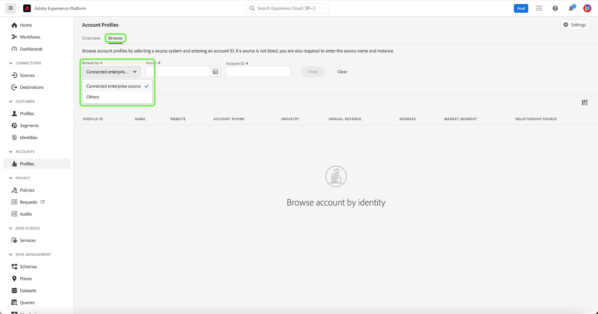
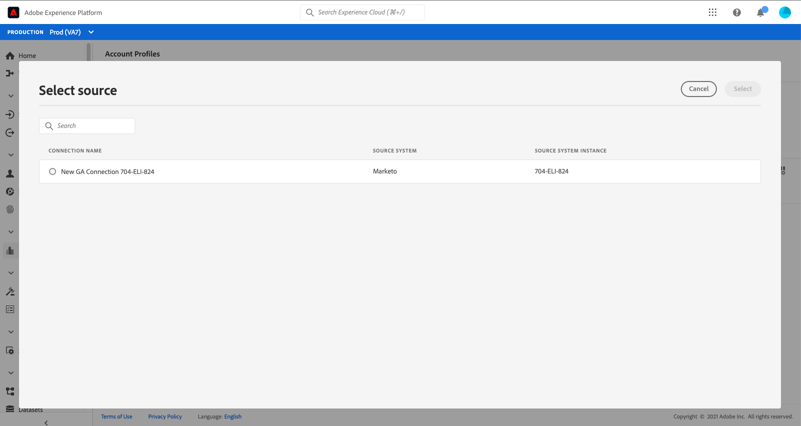

# Guida all’interfaccia utente del profilo account

>[!NOTE]
>
>I profili account sono disponibili solo per i clienti Real-time Customer Data Platform B2B Edition. Per ulteriori informazioni su Real-time CDP, incluse le funzioni e le funzionalità disponibili per ogni tipo di licenza, si prega di iniziare leggendo il [Panoramica di Real-time CDP](../overview.md).

I profili account ti consentono di unificare le informazioni dell’account da più sorgenti. Questa visualizzazione unificata di un account riunisce dati provenienti da diversi canali di marketing e dai diversi sistemi che la tua organizzazione sta attualmente utilizzando per memorizzare le informazioni sull’account del cliente. Questo documento fornisce una guida all’interazione con i profili account tramite le funzionalità Real-time CDP e B2B Edition disponibili nell’interfaccia utente di Adobe Experience Platform (UI).

Per ulteriori informazioni sulla modalità di creazione dei profili account nell’ambito del flusso di lavoro B2B, consulta la sezione [esercitazione end-to-end](../b2b-tutorial.md).

## Panoramica dei profili account {#account-profiles-overview}

Seleziona **[!UICONTROL Profili]** sotto [!UICONTROL Account] nella navigazione a sinistra per visualizzare la panoramica dei profili account. Sotto la [!UICONTROL Panoramica] il dashboard mostra un grafico o un grafico che mostra i widget in un singolo punto di ingresso.

Consulta la documentazione sul [[!UICONTROL Profili account]] ((../../dashboards/guides/account-profiles.md) dashboard per ulteriori informazioni.

## Sfoglia profili account {#browse-account-profiles}

Per sfogliare i profili di account, inizia selezionando **[!UICONTROL Profili]** sotto [!UICONTROL Account] nella navigazione a sinistra.

Sulla **[!UICONTROL Sfoglia]** è possibile esplorare i profili account utilizzando un ID account proveniente da un’origine enterprise connessa o immettendo direttamente i dettagli sorgente.

### Sfoglia per [!UICONTROL Origine enterprise connessa] {#browse-by-connected-enterprise-source}

Per sfogliare i profili account in base a un&#39;origine enterprise connessa, selezionare **[!UICONTROL Origine enterprise connessa]** dal **[!UICONTROL Sfoglia per]** a discesa, quindi scegli un’origine connessa utilizzando il pulsante di selezione accanto a **[!UICONTROL Origine]** campo .

Viene aperta la **[!UICONTROL Seleziona origine]** , che consente di selezionare un&#39;origine in base alle connessioni stabilite dall&#39;organizzazione.

>[!NOTE]
>
>L&#39;organizzazione può disporre di più origini configurate per lo stesso provider di servizi (ad esempio, Marketo), pertanto è importante rivedere il nome della connessione, il sistema di origine e l&#39;istanza del sistema di origine per assicurarsi che la ricerca venga eseguita dall&#39;istanza di origine corretta.

Per ulteriori informazioni sulla connessione delle origini aziendali, consulta [panoramica di origini](../sources/sources-overview.md).

È possibile scegliere un&#39;origine selezionando il pulsante di scelta accanto al nome della connessione, quindi utilizzare **[!UICONTROL Seleziona]** per tornare al [!UICONTROL Sfoglia] scheda .

Con un&#39;origine selezionata, è ora necessario immettere un **[!UICONTROL ID account]** relativo all&#39;origine. Ad esempio, la selezione di un’origine Salesforce richiede l’inserimento di un ID account dall’istanza Salesforce per visualizzare il profilo account associato a tale ID.

>[!NOTE]
>
>Per gli ID account Marketo, è possibile fare riferimento a due possibili tabelle account, pertanto devi utilizzare una sintassi specifica per assicurarti di visualizzare l’account corretto.
>
>La sintassi standard più comune è l&#39;ID account Marketo aggiunto da `.mkto_org` (ad esempio, `1234567.mkto_org`). I clienti Marketo Account-Based Marketing possono avere valori aggiuntivi che possono essere trovati utilizzando l’ID account Marketo aggiunto da `.mkto_account`. Se non sai con certezza quale sintassi utilizzare, rivolgiti al tuo amministratore Marketo.

### Sfoglia per [!UICONTROL Altro] {#browse-by-others}

Real-time CDP, B2B Edition supporta la possibilità di eseguire una ricerca diretta consentendo di inserire un **[!UICONTROL Nome origine]**, **[!UICONTROL Istanza sorgente]** e **[!UICONTROL ID account]** per un account da visualizzare. Inserendo direttamente il nome e l’istanza di origine, fornisci il contesto necessario per consentire ad Experience Platform la ricerca e la visualizzazione dei dati di profilo account corretti.

La capacità di eseguire una ricerca diretta è utile in circostanze in cui non è possibile una connessione sorgente diretta ai dati. Ad esempio, se la tua organizzazione dispone di criteri di governance dei dati che impediscono la connessione diretta a un sistema di gestione delle relazioni con i clienti, puoi esportare tali dati in un sistema di archiviazione cloud e quindi trasferirli in Experience Platform.

Un altro esempio potrebbe essere la trasformazione dei dati che si sta effettuando tra il momento in cui lascia un sistema ed entra in Platform. Puoi utilizzare la funzionalità di ricerca diretta per fornire contesto per i dati (ad esempio per specificare che si tratta di dati Marketo, nonostante provengano, ad esempio, da un bucket Amazon S3) in modo che il sistema sappia dove cercare e come eseguire correttamente il rendering dei dati.

Per iniziare una ricerca diretta, seleziona **[!UICONTROL Altro]** dal **[!UICONTROL Sfoglia per]** a discesa, quindi immetti un **[!UICONTROL Nome origine]**, **[!UICONTROL Istanza sorgente]** e **[!UICONTROL ID account]** per l’account che desideri visualizzare.

## Visualizza dettagli profilo account {#view-account-profile-details}

Dopo aver utilizzato **[!UICONTROL Sfoglia]** per individuare un profilo di account, seleziona la scheda **[!UICONTROL ID profilo]** apre **[!UICONTROL Dettaglio]** per il profilo dell’account. Le informazioni di profilo visualizzate nel **[!UICONTROL Dettaglio]** è stata unita una scheda da più frammenti di profilo per formare una singola vista del singolo account. Ciò include dettagli dell&#39;account come attributi di base e dati sui social media.

I campi predefiniti visualizzati possono essere modificati anche a livello organizzativo per visualizzare gli attributi di profilo dell’account preferiti.

>[!NOTE]
>
>Funzionalità simili sono disponibili per i profili dei clienti e è stata creata una guida dettagliata con istruzioni per aggiungere e rimuovere attributi, ridimensionare pannelli e così via. Per piacere, leggi le [guida alla personalizzazione dei dettagli del profilo](../../profile/ui/profile-customization.md) per saperne di più.

Puoi visualizzare ulteriori dettagli relativi all’account selezionando un’altra delle schede disponibili. Queste schede includono attributi, persone e la scheda opportunità che mostra opportunità aperte e chiuse correlate all’account nei sistemi aziendali. Per ulteriori informazioni su ciascuna scheda, consulta le sezioni seguenti.

## Scheda Attributi {#attributes-tab}

La **[!UICONTROL Attributi]** nella scheda vengono elencate tutte le informazioni record relative all&#39;account. Ciò include i dati attributo provenienti da più origini che sono stati uniti per formare una singola vista dell’account.

Oltre a poter visualizzare i dati in un elenco, puoi utilizzare la barra di ricerca per cercare attributi specifici o visualizzare i dati del record come JSON.

## Scheda Persone {#people-tab}

La **[!UICONTROL Persone]** fornisce un elenco di singole persone associate all’account. Queste persone possono essere contatti e lead da diversi sistemi aziendali gestiti da diversi team all&#39;interno della tua organizzazione, ma in Real-time CDP, B2B Edition sono presentati insieme come un unico elenco che ti permette di vedere una visione più olistica dei tuoi contatti del tuo account.

>[!NOTE]
>
>La [!UICONTROL Persone] visualizza un elenco di fino a 25 persone associate all’account. Per account con più di 25 persone associate, il sistema mostra un campionamento casuale di 25 record.

Oltre a mostrare un&#39;istantanea delle informazioni per il contatto, ogni persona elencata include anche un **[!UICONTROL ID profilo]**, collegamento selezionabile che consente di esplorare il Profilo del cliente in tempo reale per tale utente. Per ulteriori informazioni sulla visualizzazione dei profili dei singoli clienti relativi ai tuoi account, visita la guida per [profili di navigazione in Real-time CDP, B2B Edition](../profile/profile-browse.md).

## Scheda Opportunità {#opportunities-tab}

La **[!UICONTROL Opportunità]** tab fornisce informazioni sulle opportunità aperte e chiuse relative all’account. Queste opportunità possono essere acquisite in Experience Platform da più sorgenti, tuttavia Real-time CDP, B2B Edition rende facile per gli esperti di marketing vedere tutte queste opportunità insieme in un&#39;unica posizione.

>[!NOTE]
>
>La [!UICONTROL Opportunità] visualizza un elenco di fino a 25 opportunità associate all’account. Per account con più di 25 opportunità associate, il sistema mostra un campionamento casuale di 25 record.

Ogni opportunità include informazioni quali il nome dell’opportunità, la sua quantità, lo stadio e se l’opportunità è aperta, chiusa, vinta o persa.

## Scheda Account correlati {#related-accounts-tab}

La **[!UICONTROL Account correlati]** scheda fornisce informazioni su altri account che possono essere correlati all’account che stai navigando. Per informazioni approfondite sulla funzionalità, consulta la sezione [panoramica dei conti correlati](/help/rtcdp/b2b-ai-ml-services/related-accounts.md).

>[!NOTE]
>
>* Un gruppo di account correlati può avere al massimo 30 profili di account. Se sono stati trovati più di 30 profili di account correlati, questi vengono arbitrariamente suddivisi in più gruppi, ognuno dei quali non ha più di 30 membri. Il gruppo Account correlati di un profilo di account si include sempre.
>* La [!UICONTROL Account correlati] attualmente nella scheda viene visualizzato un elenco di fino a 25 account correlati associati all’account che si sta navigando. Si tratta di una limitazione che verrà affrontata in un aggiornamento futuro. Nonostante questa limitazione dell’interfaccia utente, quando utilizzi account correlati nelle definizioni dei segmenti, per gruppi di 30 profili account correlati tutti i profili vengono utilizzati per il targeting.

Ogni account correlato include informazioni quali l’ID e il nome del profilo dell’account, la chiave dell’origine dell’account e ulteriori informazioni relative alla home page, all’indirizzo, all’account padre, al telefono, all’industria e ai ricavi annuali.

Puoi utilizzare gli account correlati in questo elenco a scopo di segmentazione. Vedi [esempio di segmentazione](/help/rtcdp/segmentation/b2b.md#related-account) per comprendere come utilizzare account correlati per espandere la portata nelle definizioni dei segmenti.