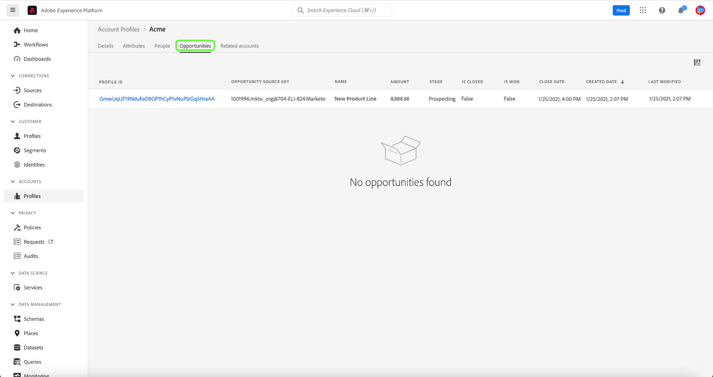

# Guida dell’interfaccia utente del profilo account

>[!NOTE]
>
>I profili account sono disponibili solo per i clienti di Real-time Customer Data Platform B2B Edition. Per ulteriori informazioni su Real-Time CDP, incluse le funzionalità disponibili per ogni tipo di licenza, leggere la [Panoramica di Real-Time CDP](../overview.md).

I profili account consentono di unificare le informazioni sull&#39;account provenienti da più origini. Questa visualizzazione unificata di un account riunisce i dati provenienti dai diversi canali di marketing e dai diversi sistemi attualmente utilizzati dalla tua organizzazione per archiviare le informazioni sull’account del cliente. Questo documento fornisce una guida all’interazione con i profili dell’account utilizzando le funzionalità di Real-Time CDP, B2B Edition disponibili nell’interfaccia utente di Adobe Experience Platform.

Per ulteriori informazioni sulla modalità di creazione dei profili account come parte del flusso di lavoro B2B, vedi [tutorial end-to-end](../b2b-tutorial.md).

## Panoramica dei profili account {#account-profiles-overview}

Seleziona **[!UICONTROL Profili]** in [!UICONTROL Account] nella barra di navigazione a sinistra per visualizzare la panoramica dei profili dell’account. Sotto [!UICONTROL Panoramica] , il dashboard mostra un grafico o un grafico che mostra i widget in un singolo punto di ingresso.

Consulta la documentazione su [[!UICONTROL Profili account]](../../dashboards/guides/account-profiles.md) dashboard per ulteriori informazioni. Consulta la documentazione su [Edizione B2B del modello dati di Real-time Customer Data Platform Insights](../../dashboards/data-models/cdp-insights-data-model-b2b.md) per ulteriori informazioni su come utilizzare i modelli dati insights per creare grafici personalizzati per le dashboard,

## Configurare la corrispondenza lead-account {#configure-lead-to-account-matching}

>[!IMPORTANT]
>
> Solo gli amministratori di IA B2B possono abilitare, disabilitare e configurare il lead per il servizio di corrispondenza account. Dopo aver disabilitato il servizio, i risultati corrispondenti verranno eliminati entro 24 ore.

Per configurare la corrispondenza lead-account, seleziona **[!UICONTROL Profili]** in [!UICONTROL Account] nel menu di navigazione a sinistra. Il giorno **[!UICONTROL Panoramica]** , seleziona **[!UICONTROL Impostazioni]** in alto a destra.

Il **[!UICONTROL Impostazioni account]** viene visualizzata una finestra di dialogo. Da qui, seleziona la **[!UICONTROL Abilita corrispondenza lead-account]** per abilitare la funzione. Utilizza il menu a discesa per selezionare **[!UICONTROL Giornaliero]** per **[!UICONTROL Cadenza corrispondente]** impostazione. Infine, seleziona la **[!UICONTROL Criteri di corrispondenza]** opzioni seguite da **[!UICONTROL Salva]** per confermare le impostazioni e tornare al **[!UICONTROL Profili account]** schermo.

>[!NOTE]
>
> L&#39;indirizzo non può essere utilizzato come unico criterio di corrispondenza. È necessario selezionare uno o più degli altri criteri di corrispondenza.

Per ulteriori informazioni sulla corrispondenza tra lead e account, consulta [Panoramica sulla corrispondenza dei lead con l’account in Real-Time CDP B2B](../../rtcdp/b2b-ai-ml-services/lead-to-account-matching.md).

## Sfogliare i profili account {#browse-account-profiles}

Per sfogliare i profili dell’account, inizia selezionando **[!UICONTROL Profili]** in [!UICONTROL Account] nel menu di navigazione a sinistra.

Il giorno **[!UICONTROL Sfoglia]** , è possibile esplorare i profili dell&#39;account utilizzando un ID account da un&#39;origine enterprise connessa oppure immettendo direttamente i dettagli dell&#39;origine.

### Sfoglia per [!UICONTROL Origine enterprise connessa] {#browse-by-connected-enterprise-source}

Per sfogliare i profili di account in base a un&#39;origine aziendale connessa, selezionare **[!UICONTROL Origine enterprise connessa]** dal **[!UICONTROL Sfoglia per]** , quindi scegliere un&#39;origine connessa utilizzando il pulsante di selezione accanto al **[!UICONTROL Sorgente]** campo.

Verrà aperto il **[!UICONTROL Seleziona origine]** , in cui è possibile selezionare un&#39;origine in base alle connessioni stabilite dall&#39;organizzazione.

>[!NOTE]
>
>È possibile che nell&#39;organizzazione siano configurate più origini per lo stesso provider di servizi (ad esempio, Marketo), pertanto è importante esaminare il nome della connessione, il sistema di origine e l&#39;istanza del sistema di origine per assicurarsi che la ricerca venga eseguita in base all&#39;istanza di origine corretta.

Per ulteriori informazioni sulla connessione delle origini aziendali, fare riferimento a [panoramica sulle origini](../sources/sources-overview.md).

È possibile scegliere un&#39;origine selezionando il pulsante di opzione accanto al nome della connessione e quindi utilizzare **[!UICONTROL Seleziona]** per tornare al [!UICONTROL Sfoglia] scheda.

Dopo aver selezionato un&#39;origine, è necessario immettere un **[!UICONTROL ID account]** relativo all’origine. Ad esempio, la selezione di un’origine Salesforce richiede l’immissione di un ID account dall’istanza Salesforce per visualizzare il profilo account associato a tale ID.

>[!NOTE]
>
>Per gli ID account Marketo, è possibile fare riferimento a due tabelle di account, pertanto è necessario utilizzare una sintassi specifica per assicurarsi di visualizzare l’account corretto.
>
>La sintassi standard più comune è l’ID account Marketo aggiunto da `.mkto_org` (ad esempio, `1234567.mkto_org`). I clienti Marketo Account-Based Marketing potrebbero disporre di valori aggiuntivi che possono essere trovati utilizzando l’ID account Marketo aggiunto da `.mkto_account`. Se non sai con certezza quale sintassi utilizzare, rivolgiti al tuo amministratore Marketo.

### Sfoglia per [!UICONTROL Altro] {#browse-by-others}

Real-Time CDP, B2B Edition consente di eseguire una ricerca diretta consentendo l&#39;immissione di **[!UICONTROL Nome origine]**, **[!UICONTROL Istanza sorgente]**, e **[!UICONTROL ID account]** per un account che desideri visualizzare. Immettendo direttamente il nome e l’istanza di origine, è possibile fornire il contesto necessario, ad Experience Platform per cercare e visualizzare i dati corretti del profilo dell’account.

La capacità di eseguire una ricerca diretta è utile in circostanze in cui non è possibile una connessione sorgente diretta ai dati. Ad esempio, se nell’organizzazione sono in vigore criteri di governance dei dati che impediscono la connessione diretta a un sistema di gestione delle relazioni con i clienti, puoi esportare i dati in un sistema di archiviazione cloud e quindi acquisirli in Experienci Platform.

Un altro esempio potrebbe essere che stai eseguendo una trasformazione sui dati tra il momento in cui esce da un sistema ed entra in Platform. Puoi utilizzare la funzionalità di ricerca diretta per fornire contesto per i dati (ad esempio per specificare che si tratta di dati di Marketo, nonostante il fatto che provengano da un bucket Amazon S3, ad esempio) in modo che il sistema sappia dove cercare i dati e come eseguirne correttamente il rendering.

Per avviare una ricerca diretta, selezionare **[!UICONTROL Altro]** dal **[!UICONTROL Sfoglia per]** a discesa, quindi inserisci un **[!UICONTROL Nome origine]**, **[!UICONTROL Istanza sorgente]**, e **[!UICONTROL ID account]** per l’account che desideri visualizzare.

## Visualizza dettagli profilo account {#view-account-profile-details}

Dopo aver utilizzato il **[!UICONTROL Sfoglia]** per individuare un profilo di account, selezionando la scheda **[!UICONTROL ID profilo]** apre il **[!UICONTROL Dettaglio]** per il profilo dell’account. Le informazioni di profilo visualizzate sul **[!UICONTROL Dettaglio]** La scheda è stata unita da più frammenti di profilo per formare un’unica vista del singolo account. Ciò include i dettagli dell’account come attributi di base e dati dei social media.

I campi predefiniti visualizzati possono anche essere modificati a livello di organizzazione per visualizzare gli attributi di profilo dell’account preferiti.

>[!NOTE]
>
>Funzionalità simili sono disponibili per i profili dei clienti ed è stata creata una guida dettagliata con istruzioni per l’aggiunta e la rimozione di attributi, il ridimensionamento di pannelli, ecc. Leggi le [guida alla personalizzazione dei dettagli del profilo](../../profile/ui/profile-customization.md) per ulteriori informazioni.

Puoi visualizzare ulteriori dettagli relativi all’account selezionando un’altra delle schede disponibili. Queste schede includono attributi, persone e la scheda opportunità che mostra le opportunità aperte e chiuse relative all’account nei sistemi aziendali. Per ulteriori informazioni su ciascuna scheda, consulta le sezioni seguenti.

## Scheda Attributi {#attributes-tab}

Il **[!UICONTROL Attributi]** Questa scheda elenca tutte le informazioni sui record correlate all&#39;account. Ciò include dati di attributi provenienti da più origini che sono state unite per formare un’unica vista dell’account.

Oltre a poter visualizzare i dati in un elenco, è possibile utilizzare la barra di ricerca per cercare attributi specifici o visualizzare i dati del record come JSON.

## Scheda Persone {#people-tab}

Il **[!UICONTROL Persone]** La scheda fornisce un elenco di singole persone associate all’account. Queste persone possono essere contatti e lead di diversi sistemi aziendali gestiti da diversi team all’interno della tua organizzazione, ma in Real-Time CDP, B2B Edition vengono presentate insieme come un unico elenco che ti consente di visualizzare una visione più olistica dei contatti del tuo account.

>[!NOTE]
>
>Il [!UICONTROL Persone] Questa scheda mostra un elenco di un massimo di 25 persone associate all’account. Per gli account con più di 25 persone associate, il sistema mostra un campionamento casuale di 25 record.

Oltre a mostrare un&#39;istantanea delle informazioni per il contatto, ogni persona elencata include anche un **[!UICONTROL ID profilo]**, che è un collegamento cliccabile che ti consente di esplorare il Profilo cliente in tempo reale per quella persona. Per ulteriori informazioni sulla visualizzazione dei profili dei singoli clienti relativi ai tuoi account, consulta la guida per [esplorazione dei profili in Real-Time CDP, edizione B2B](../profile/profile-browse.md).

## Scheda Opportunità {#opportunities-tab}

Il **[!UICONTROL Opportunità]** fornisce informazioni per le opportunità aperte e chiuse relative all’account. Queste opportunità possono essere acquisite in Experienci Platform da più origini, tuttavia Real-Time CDP, B2B Edition consente agli esperti di marketing di vedere tutte queste opportunità insieme in un’unica posizione.

>[!NOTE]
>
>Il [!UICONTROL Opportunità] Questa scheda mostra un elenco di un massimo di 25 opportunità associate all’account. Per gli account con più di 25 opportunità associate, il sistema mostra un campionamento casuale di 25 record.

Ogni opportunità include informazioni quali il nome, l&#39;importo, la fase e se l&#39;opportunità è aperta, chiusa, vinta o persa.

## Scheda Account correlati {#related-accounts-tab}

Il **[!UICONTROL Account correlati]** Questa scheda fornisce informazioni su altri account che possono essere correlati all&#39;account che stai esplorando. Per informazioni approfondite sulla funzionalità, leggi [panoramica account correlati](/help/rtcdp/b2b-ai-ml-services/related-accounts.md).

>[!NOTE]
>
>* Un gruppo di account correlati può avere un massimo di 30 profili di account. Se sono stati trovati più di 30 profili di account correlati, questi vengono arbitrariamente suddivisi in più gruppi, ciascuno dei quali non ha più di 30 membri. Il gruppo Account correlati di un profilo di account include sempre se stesso.
>* Il [!UICONTROL Account correlati] La scheda visualizza attualmente un elenco di un massimo di 25 account correlati associati all’account che stai esplorando. Si tratta di una limitazione che sarà affrontata in un aggiornamento futuro. Nonostante questo limite dell’interfaccia utente, quando utilizzi account correlati nelle definizioni dei segmenti, per gruppi di 30 profili di account correlati tutti i profili vengono utilizzati per il targeting.

Ogni account correlato include informazioni quali l’ID e il nome del profilo dell’account, la chiave di origine dell’account e ulteriori informazioni relative a home page, indirizzo, account principale, telefono, settore e ricavi annuali.

Puoi utilizzare gli account correlati in questo elenco a scopo di segmentazione. Vedi un [esempio di segmentazione](/help/rtcdp/segmentation/b2b.md#related-account) per scoprire come utilizzare gli account correlati per espandere la portata nelle definizioni dei segmenti.