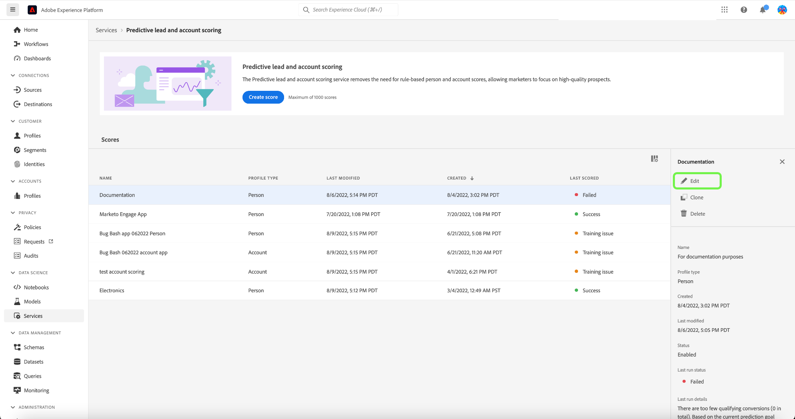
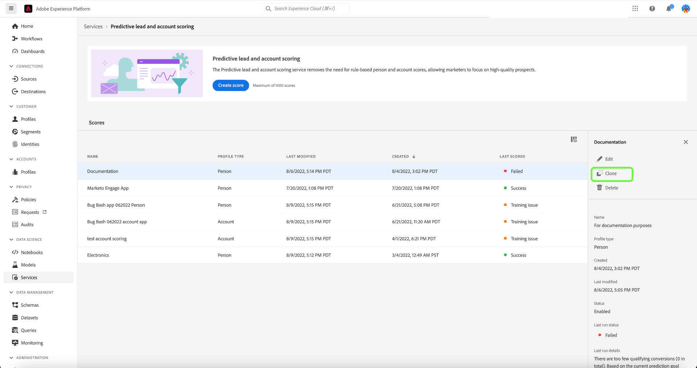
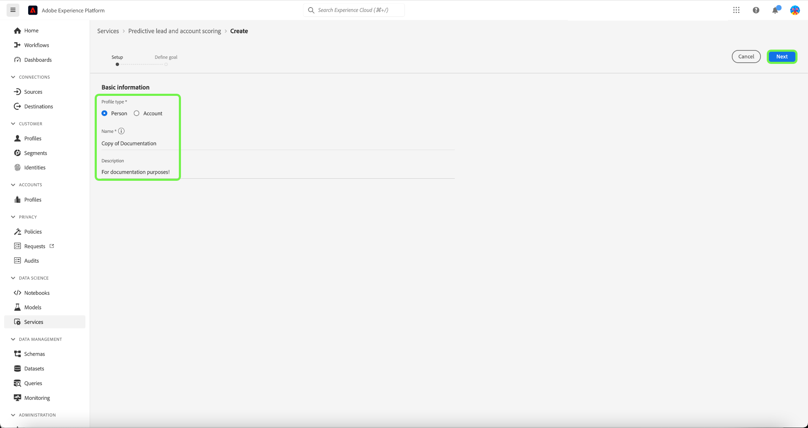

# Gestire il punteggio predittivo di lead e account in Adobe Real-time Customer Data Platform, edizione B2B

>[!NOTE]
>
>Solo gli utenti con l’autorizzazione di gestione dell’intelligenza artificiale B2B possono creare, modificare ed eliminare gli obiettivi di punteggio.

Questo tutorial illustra i passaggi necessari per gestire gli obiettivi di punteggio del servizio di valutazione predittiva di lead e account. Gli obiettivi del punteggio possono essere per il profilo persona o il profilo account

## Crea un nuovo punteggio

Per creare un nuovo punteggio, seleziona la **[!UICONTROL Servizi]** nella barra laterale e seleziona **[!UICONTROL Crea punteggio]**.

Il **[!UICONTROL Informazioni di base]** viene visualizzata una schermata che richiede di selezionare un tipo di profilo, immettere un nome e una descrizione facoltativa. Al termine, seleziona **[!UICONTROL Successivo]**.

Il **[!UICONTROL Definire l’obiettivo]** viene visualizzata la schermata. Seleziona la freccia a discesa, quindi seleziona un tipo di obiettivo dalla finestra a discesa che viene visualizzata.

Il **[!UICONTROL Specifiche dell’obiettivo]** viene visualizzata una finestra di dialogo. Selezionare la freccia a discesa, quindi selezionare il nome del campo obiettivo dalla finestra a discesa visualizzata.

Il **[!UICONTROL Condizioni obiettivo]** viene visualizzata la selezione. Seleziona la freccia a discesa, quindi seleziona condizione dalla finestra a discesa visualizzata.

Il **[!UICONTROL Valore obiettivo]** viene visualizzato. Quindi, configura il tuo [!UICONTROL Specifiche dell’obiettivo]. Seleziona la [!UICONTROL Immetti il valore del campo] e inserisci il valore dell&#39;obiettivo.

>[!NOTE]
>
>È possibile aggiungere più valori di obiettivo.

Per aggiungere altri campi, seleziona **[!UICONTROL Aggiungi campo]**.

Per configurare l’intervallo temporale di previsione, seleziona la freccia a discesa e quindi l’intervallo temporale desiderato.

Il criterio di unione selezionato determina la modalità di selezione dei valori dei campi di un profilo persona. Utilizzando la freccia a discesa, seleziona il criterio di unione desiderato, quindi fai clic su **[!UICONTROL Fine]**.

Il **[!UICONTROL Impostazione punteggio completata]** viene visualizzata una finestra di dialogo che conferma la creazione del nuovo punteggio. Seleziona **[!UICONTROL OK]**.

>[!NOTE]
>
>Il completamento di ogni processo di punteggio può richiedere fino a 24 ore.

Viene visualizzata di nuovo la **[!UICONTROL Servizi]** in cui puoi visualizzare il nuovo punteggio creato nell’elenco dei punteggi.

Seleziona il punteggio per visualizzare i dettagli e ulteriori informazioni sull’ultima esecuzione.

Per informazioni più dettagliate sui codici di errore che possono essere visualizzati nei dettagli dell’ultima esecuzione, consulta la sezione su [codici di errore della pipeline di IA dei lead](#leads-ai-pipeline-error-codes) in questo documento.

## Modificare un punteggio

Per modificare un punteggio, selezionalo da **[!UICONTROL Servizi]** e seleziona **[!UICONTROL Modifica]** nel pannello dettagli aggiuntivi sul lato destro dello schermo.

Il **[!UICONTROL Modifica istanza]** viene visualizzata la finestra di dialogo, in cui è possibile modificare la descrizione del punteggio. Apporta le modifiche e seleziona **[!UICONTROL Salva]**.

>[!NOTE]
>
>Non è possibile modificare la configurazione del punteggio perché questo attiverà la riqualificazione e il nuovo punteggio del modello. Equivale a eliminare il punteggio e crearne uno nuovo. Per modificare la configurazione del punteggio, dovrai clonarlo o crearne uno nuovo.

Viene visualizzata di nuovo la **[!UICONTROL Servizi]** scheda. Seleziona il punteggio per visualizzare i dettagli della descrizione aggiornata nel pannello dei dettagli aggiuntivi sul lato destro della schermata.

## Clona un punteggio

Per clonare un punteggio, seleziona un punteggio da **[!UICONTROL Servizi]** e seleziona **[!UICONTROL Clona]** nel pannello dettagli aggiuntivi sul lato destro dello schermo.

Il **[!UICONTROL Informazioni di base]** viene visualizzata la schermata. Il tipo di profilo, il nome e la descrizione vengono clonati dal punteggio originale. Modifica questi dettagli e seleziona **[!UICONTROL Successivo]**.

Il **[!UICONTROL Definire l’obiettivo]** viene visualizzata la schermata. Completa la sezione obiettivi come faresti quando crei un nuovo punteggio e seleziona **[!UICONTROL Fine]**.

Viene visualizzata di nuovo la **[!UICONTROL Servizi]** in cui puoi visualizzare il punteggio appena clonato nell’elenco.

>[!NOTE]
>
>Il **[!UICONTROL Definire l’obiettivo]** non viene clonata dal punteggio originale.

## Eliminare un punteggio

Per eliminare un punteggio, selezionalo da **[!UICONTROL Servizi]** e seleziona **[!UICONTROL Elimina]** nel pannello dettagli aggiuntivi sul lato destro dello schermo.

Il **[!UICONTROL Elimina documentazione]** viene visualizzata una finestra di dialogo di conferma. Seleziona **[!UICONTROL Elimina]**.

>[!NOTE]
>
>L’eliminazione della definizione del punteggio eliminerebbe anche tutti i punteggi previsti nel profilo persona o nel profilo account, ma non il gruppo di campi creato per la definizione del punteggio. Il gruppo di campi verrà lasciato &quot;orfano&quot; nel modello di dati.

Viene visualizzata di nuovo la **[!UICONTROL Servizi]** in cui non è più possibile visualizzare il punteggio nell’elenco.

## Codici di errore della pipeline di IA dei lead

| Codice errore | Messaggio di errore |
| --- | --- |
| 401 | ERRORE 401. Pipeline di IA per i lead interrotta: numero di account validi insufficiente per il punteggio dell’account. Numero di account: {}. |
| 402 | ERRORE 402. Pipeline di IA per i lead interrotta: numero di contatti validi insufficiente per il punteggio dei contatti. Numero di contatti: {}. |
| 403 | ERRORE 403. Pipeline di IA per i lead interrotta: volume di attività insufficiente per l’apprendimento del modello. Numero di eventi: {}. |
| 404 | ERRORE 404. Pipeline di IA per i lead interrotta: conversioni insufficienti per l’apprendimento del modello. Numero di conversioni: {}. |
| 405 | ERRORE 405. Pipeline di IA dei lead interrotta: attività troppo sparsa per un apprendimento del modello valido. Solo il {}% degli account ha attività. |
| 406 | ERRORE 406. Pipeline di IA dei lead interrotta: attività troppo sparsa per un apprendimento del modello valido. Solo il {}% dei contatti ha attività. |
| 407 | ERRORE 407. Pipeline di IA per i lead interrotta: i tipi di attività di dati per il punteggio non corrispondono ai dati di apprendimento. |
| 408 | ERRORE 408. Pipeline di IA dei lead interrotta: il tasso di mancanti è troppo alto per le funzioni dell’attività. Percentuale mancante: {}. |
| 409 | ERRORE 409. Pipeline di IA dei lead interrotta: auc di test troppo bassa. Test auc: {}. |
| 410 | ERRORE 410. Pipeline di IA dei lead interrotta: l’auc del test è troppo bassa dopo la regolazione dei parametri. Test auc: {}. |
| 411 | ERRORE 411. Pipeline di IA dei lead interrotta: i dati di apprendimento non hanno abbastanza conversioni per produrre un modello affidabile. Conversioni: {}. |
| 412 | ERRORE 412. Pipeline di IA dei lead interrotta: i dati del test non hanno alcuna conversione per calcolare l’AUC-ROC. |

| Codice di avvertenza/informazione | Messaggio |
| --- | --- |
| 100 | INFO 100. Controllo di qualità di IA per i lead: il numero di account è: {}. |
| 101 | INFO 101. Controllo di qualità dell’intelligenza artificiale dei lead: il numero di contatti è: {}. |
| 102 | INFO 102. Controllo di qualità dell’intelligenza artificiale dei lead: il conteggio delle opportunità è: {}. |
| 103 | INFO 103. Lead AI controllo qualità: l’auc di test è bassa. Avvia tuning dei parametri. Verifica dell&#39;auc: {}. |
| 200 | AVVISO 200. Controllo di qualità dell’intelligenza artificiale dei lead: il tasso di funzionalità firmografiche mancanti è: {}. |
| 201 | AVVISO 201. Controllo di qualità dell’intelligenza artificiale dei lead: il tasso di funzionalità attività mancanti è: {}. |

## Passaggi successivi

Seguendo questa esercitazione, ora puoi creare e gestire correttamente i punteggi. Per ulteriori informazioni, consulta i seguenti documenti:

* [Punteggio predittivo di lead e account](/help/rtcdp/b2b-ai-ml-services/predictive-lead-and-account-scoring.md)
* [Monitorare i processi predittivi di punteggio lead e account](/help/dataflows/ui/b2b/monitor-profile-enrichment.md)
