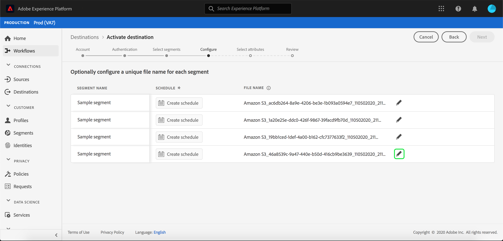

# Attivare profili e segmenti su una destinazione

Attiva i dati disponibili in Real-time Customer Data Platform mappando i segmenti alle destinazioni. A questo scopo, attenetevi alla procedura indicata di seguito.

## Prerequisiti   {#prerequisites}

Per attivare i dati sulle destinazioni, è necessario aver [collegato correttamente una destinazione](/help/rtcdp/destinations/connect-destination.md). Se non lo avete ancora fatto, andate al catalogo [delle](/help/rtcdp/destinations/destinations-catalog.md)destinazioni, sfogliate le destinazioni supportate e configurate una o più destinazioni.

## Attivare i dati {#activate-data}

I passaggi nel flusso di lavoro di attivazione variano leggermente tra i tipi di destinazione. Il flusso di lavoro completo per tutti i tipi di destinazione è descritto di seguito.

### Selezionare la destinazione a cui attivare i dati {#select-destination}

Si applica a: Tutte le destinazioni

Nell’interfaccia utente CDP in tempo reale, andate a **[!UICONTROL Destinations]** > **[!UICONTROL Browse]**, quindi selezionate la destinazione in cui desiderate attivare i segmenti.


Selezionate il nome della destinazione per passare al flusso di lavoro di attivazione.


Se esiste già un flusso di lavoro di attivazione per una destinazione, puoi vedere i segmenti attualmente attivati per la destinazione. Selezionate **[!UICONTROL Edit activation]** nella barra a destra e seguite i passaggi descritti di seguito per modificare i dettagli di attivazione.

Dopo aver selezionato una destinazione, selezionare **[!UICONTROL Activate]**.

### [!UICONTROL Select Segments] step {#select-segments}

Si applica a: Tutte le destinazioni


Nel **[!UICONTROL Activate destination]** flusso di lavoro, nella **[!UICONTROL Select Segments]** pagina, seleziona uno o più segmenti da attivare nella destinazione. Selezionate **[!UICONTROL Next]** per passare al passaggio successivo.


### [!UICONTROL Identity mapping] step {#identity-mapping}

Si applica a: destinazioni social e destinazione pubblicitaria di Google Customer Match


Per le destinazioni social, potete selezionare gli attributi di origine da mappare come identità di destinazione nella destinazione. Questo passaggio è facoltativo o obbligatorio, a seconda dell&#39;identità primaria utilizzata nello schema.

Se nello schema si utilizza l&#39;indirizzo e-mail come identità principale, è possibile ignorare il passaggio di mappatura identità, come illustrato di seguito:


Se state utilizzando un altro ID, ad esempio &quot;ID ricompensa&quot; o &quot;ID fedeltà&quot;, come identità principale nello schema, dovete mappare manualmente l&#39;indirizzo e-mail dallo schema di identità come identità di destinazione nella destinazione social, come illustrato di seguito:


Selezionate `Email_LC_SHA256` come identità di destinazione se avete hashing gli indirizzi e-mail dei clienti durante l&#39;inserimento di dati in Adobe Experience Platform, in base ai requisiti [!DNL Facebook] di hashing delle [](/help/rtcdp/destinations/facebook-destination.md#email-hashing-requirements)e-mail.

Selezionate `Email` come identità di destinazione se gli indirizzi e-mail utilizzati non sono crittografati. CDP in tempo reale eseguirà l&#39;hash degli indirizzi e-mail per soddisfare [!DNL Facebook] i requisiti.


### **[!UICONTROL Configure]** step {#configure}

Si applica a: Destinazioni di marketing e-mail e destinazioni di archiviazione cloud


Nel **[!UICONTROL Configure]** passaggio, puoi configurare la pianificazione e i nomi dei file per ciascun segmento da esportare. La configurazione della pianificazione è obbligatoria, ma la configurazione del nome del file è facoltativa.

Per aggiungere una pianificazione per il segmento, selezionare **[!UICONTROL Create schedule]**.


Viene visualizzato un profilo che mostra le opzioni per creare la pianificazione dei segmenti.

- **Esportazione** file: Potete esportare file completi o incrementali. Quando si esporta un file completo, viene pubblicata un’istantanea completa di tutti i profili idonei per tale segmento. Quando si esporta un file incrementale, viene pubblicato il delta di profili idonei per tale segmento dall’ultima esportazione.
- **Frequenza**: Se **[!UICONTROL Export full files]** è selezionata, è possibile esportare **[!UICONTROL Once]** o **[!UICONTROL Daily]**. Se **[!UICONTROL Export incremental files]** è selezionata, potete solo esportare **[!UICONTROL Daily]**. Quando si esporta un file **[!UICONTROL Once]** , il file viene esportato una volta. L’esportazione di un file **[!UICONTROL Daily]** esporta il file ogni giorno dalla data di inizio alla data di fine alle 12:00 UTC (7:00 PM EST) se sono selezionati file completi e alle 12:00 UTC (7:00 AM EST) se sono selezionati file incrementali.
- **Data**: Se **[!UICONTROL Once]** è selezionata, potete selezionare la data per l&#39;esportazione una tantum. Se **[!UICONTROL Daily]** è selezionata, è possibile selezionare le date di inizio e fine per le esportazioni.


I nomi di file predefiniti sono costituiti dal nome di destinazione, dall’ID segmento e da un indicatore di data e ora. Ad esempio, è possibile modificare i nomi dei file esportati per distinguere tra campagne diverse o per fare in modo che il tempo di esportazione dei dati venga aggiunto ai file.

Selezionate l’icona matita per aprire una finestra modale e modificare i nomi dei file. I nomi dei file possono contenere un massimo di 255 caratteri.



Nell’editor dei nomi file potete selezionare diversi componenti da aggiungere al nome file. Impossibile rimuovere il nome di destinazione e l&#39;ID del segmento dai nomi dei file. Oltre a questi, potete aggiungere quanto segue:

- **[!UICONTROL Segment name]**: Potete aggiungere il nome del segmento al nome del file.
- **[!UICONTROL Date and time]**: Selezionate tra l’aggiunta di un `MMDDYYYY_HHMMSS` formato o di una marca temporale Unix di 10 cifre relativa all’ora in cui i file vengono generati. Scegliete una di queste opzioni se desiderate che i file abbiano un nome file dinamico generato con ogni esportazione incrementale.
- **[!UICONTROL Custom text]**: Aggiungere testo personalizzato ai nomi dei file.

Select **[!UICONTROL Apply changes]** to confirm your selection.

>[!IMPORTANT]
> 
>Se non selezionate il **[!UICONTROL Date and Time]** componente, i nomi dei file saranno statici e il nuovo file esportato sovrascriverà il file precedente nel percorso di memorizzazione con ogni esportazione. Quando si esegue un processo di importazione periodico da una posizione di archiviazione in una piattaforma di e-mail marketing, questa è l&#39;opzione consigliata.


Dopo aver completato la configurazione di tutti i segmenti, seleziona **[!UICONTROL Next]** per continuare.

### **[!UICONTROL Segment schedule]** step {#segment-schedule}

Si applica a: destinazioni pubblicitarie, destinazioni social


Sulla **[!UICONTROL Segment schedule]** pagina è possibile impostare la data iniziale per l&#39;invio dei dati alla destinazione, nonché la frequenza di invio dei dati alla destinazione.

>[!IMPORTANT]
>
>Per le destinazioni social, devi selezionare l&#39;origine del pubblico in questo passaggio. Puoi passare al passaggio successivo solo dopo aver selezionato una delle opzioni nell’immagine sottostante.


### **[!UICONTROL Scheduling]** step {#scheduling}

Si applica a: destinazioni di e-mail marketing e archiviazione cloud


Sulla **[!UICONTROL Scheduling]** pagina è possibile visualizzare la data di inizio per l&#39;invio dei dati alla destinazione e la frequenza di invio dei dati alla destinazione. Questi valori non possono essere modificati.

### **[!UICONTROL Select attributes]** step {#select-attributes}

Si applica a: destinazioni di e-mail marketing e archiviazione cloud


Nella **[!UICONTROL Select attributes]** pagina, selezionate **[!UICONTROL Add new field]** e scegliete gli attributi che desiderate inviare alla destinazione.

>[!NOTE]
>
> CDP in tempo reale precompila la selezione con quattro attributi consigliati e comunemente utilizzati dallo schema: `person.name.firstName`, `person.name.lastName`, `personalEmail.address`, `segmentMembership.status`.

Le esportazioni di file variano nei seguenti modi, a seconda che `segmentMembership.status` sia selezionato o meno:
- Se il `segmentMembership.status` campo è selezionato, i file esportati includono **[!UICONTROL Active]** i membri nello snapshot completo iniziale e **[!UICONTROL Active]** i membri **[!UICONTROL Expired]** nelle esportazioni incrementali successive.
- Se il `segmentMembership.status` campo non è selezionato, i file esportati includono solo **[!UICONTROL Active]** i membri nello snapshot completo iniziale e nelle esportazioni incrementali successive.


Inoltre, potete contrassegnare attributi diversi come obbligatori. Se un attributo è contrassegnato come obbligatorio, viene impostato in modo che il segmento esportato contenga tale attributo. Di conseguenza, può essere utilizzato come ulteriore forma di filtro. Contrassegnare un attributo come obbligatorio **non** è necessario.

È consigliabile che uno degli attributi sia un identificatore [](/help/rtcdp/destinations/email-marketing-destinations.md#identity) univoco dello schema. Per ulteriori informazioni sugli attributi obbligatori, consulta la sezione relativa all’identità nella documentazione delle destinazioni [di marketing per e-](/help/rtcdp/destinations/email-marketing-destinations.md#identity) mail.

>[!NOTE]
> 
>Se sono state applicate etichette di utilizzo dei dati a determinati campi all’interno di un set di dati (anziché all’intero set di dati), l’applicazione di tali etichette a livello di campo all’attivazione avviene alle seguenti condizioni:
>- I campi vengono utilizzati nella definizione del segmento.
>- I campi sono configurati come attributi proiettati per la destinazione di destinazione.

>
> 
Ad esempio, se nel campo `person.name.firstName` sono presenti alcune etichette di utilizzo dei dati in conflitto con il caso di utilizzo marketing della destinazione, nel passaggio della revisione viene visualizzata una violazione del criterio di utilizzo dei dati. Per ulteriori informazioni, vedi [Governance dei dati in CDP](/help/rtcdp/privacy/data-governance-overview.md#destinations)in tempo reale.

### **[!UICONTROL Review]** step {#review}

Si applica a: tutte le destinazioni


Nella **[!UICONTROL Review]** pagina viene visualizzato un riepilogo della selezione. Selezionare **[!UICONTROL Cancel]** per interrompere il flusso, **[!UICONTROL Back]** modificare le impostazioni o **[!UICONTROL Finish]** per confermare la selezione e iniziare a inviare i dati alla destinazione.

>[!IMPORTANT]
>
>In questo passaggio, la funzione CDP in tempo reale verifica la presenza di violazioni dei criteri di utilizzo dei dati. Di seguito è riportato un esempio di violazione di un criterio. Non puoi completare il flusso di lavoro di attivazione del segmento finché non hai risolto la violazione. Per informazioni su come risolvere le violazioni dei criteri, consulta [Applicazione](/help/rtcdp/privacy/data-governance-overview.md#enforcement) dei criteri nella sezione relativa alla governance dei dati.


Se non sono state rilevate violazioni dei criteri, selezionate **[!UICONTROL Finish]** per confermare la selezione e iniziare a inviare i dati alla destinazione.


## Modifica attivazione {#edit-activation}

Per modificare i flussi di attivazione esistenti nel CDP in tempo reale, effettuate le seguenti operazioni:

1. Selezionate **[!UICONTROL Destinations]** nella barra di navigazione a sinistra, fate clic sulla **[!UICONTROL Browse]** scheda e quindi sul nome della destinazione.
2. Seleziona **[!UICONTROL Edit activation]** nella barra a destra per cambiare i segmenti da inviare alla destinazione.

## Verificare che l&#39;attivazione del segmento sia stata eseguita correttamente {#verify-activation}

### Destinazioni di marketing e-mail e destinazioni di archiviazione cloud {#esp-and-cloud-storage}

Per le destinazioni di e-mail marketing e di archiviazione cloud, in tempo reale CDP crea un `.csv` `.txt` file o un file delimitato da tabulazioni nel percorso di archiviazione specificato. È previsto che ogni giorno venga creato un nuovo file nel percorso di archiviazione. Il formato predefinito del file è:
`<destinationName>_segment<segmentID>_<timestamp-yyyymmddhhmmss>.csv|txt`

È possibile modificare il formato del file. Per ulteriori informazioni, vai al passaggio [Configura](/help/rtcdp/destinations/activate-destinations.md#configure) per le destinazioni di archiviazione cloud e di marketing e-mail.

Con il formato di file predefinito, i file che si riceverebbero per tre giorni consecutivi potrebbero essere simili al seguente:

```console
Salesforce_Marketing_Cloud_segment12341e18-abcd-49c2-836d-123c88e76c39_20200408061804.csv
Salesforce_Marketing_Cloud_segment12341e18-abcd-49c2-836d-123c88e76c39_20200409052200.csv
Salesforce_Marketing_Cloud_segment12341e18-abcd-49c2-836d-123c88e76c39_20200410061130.csv
```

La presenza di questi file nel percorso di memorizzazione conferma l’avvenuta riuscita dell’attivazione. Per comprendere la struttura dei file esportati, potete [scaricare un file](assets/sample_export_file_segment12341e18-abcd-49c2-836d-123c88e76c39_20200408061804.csv).csv di esempio. Questo file di esempio include gli attributi di profilo `person.firstname`, `person.lastname`, `person.gender`, `person.birthyear`e `personalEmail.address`.

### Destinazioni pubblicitarie

Controlla il tuo account nella rispettiva destinazione pubblicitaria a cui stai attivando i tuoi dati. Se l&#39;attivazione ha avuto esito positivo, i tipi di pubblico vengono popolati nella piattaforma pubblicitaria.

### Destinazioni social network

Ad [!DNL Facebook]esempio, un&#39;attivazione riuscita implica la creazione di un&#39;audience personalizzata a livello di programmazione in [!DNL Facebook] [[!UICONTROL Facebook Ads Manager]](https://www.facebook.com/adsmanager/manage/). L&#39;appartenenza al segmento nel pubblico viene aggiunta e rimossa man mano che gli utenti sono qualificati o non qualificati per i segmenti attivati.

>[!TIP]
>
>L&#39;integrazione tra il CDP in tempo reale e [!DNL Facebook] supporta le ricadute storiche del pubblico. Tutte le qualifiche del segmento storico vengono inviate a [!DNL Facebook] quando si attivano i segmenti alla destinazione.

## Disattiva attivazione {#disable-activation}

Per disattivare un flusso di attivazione esistente, effettuate le seguenti operazioni:

1. Selezionate **[!UICONTROL Destinations]** nella barra di navigazione a sinistra, fate clic sulla **[!UICONTROL Browse]** scheda e quindi sul nome della destinazione.
2. Fate clic sul **[!UICONTROL Enabled]** controllo nella barra a destra per modificare lo stato del flusso di attivazione.
3. Nella finestra **Aggiorna stato** flusso dati, selezionare **Conferma** per disattivare il flusso di attivazione.
