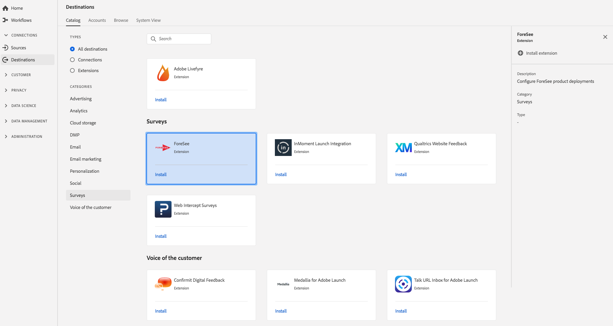

# [!DNL Foresee] estensione {#foresee-extension}

## Panoramica {#overview}

Configurare le distribuzioni [!DNL ForeSee] di prodotti utilizzando l&#39;Experience Platform Launch.

[!DNL Foresee] è un&#39;estensione del sondaggio in  Adobe Real-time Customer Data Platform. Per ulteriori informazioni sulla funzionalità di estensione, consultate la pagina dell&#39;estensione in [Adobe Exchange](https://exchange.adobe.com/experiencecloud.details.100164.html).

Questa destinazione è un&#39;estensione di Experience Platform Launch. Per ulteriori informazioni sul funzionamento delle estensioni Launch  Adobe CDP in tempo reale, vedere Panoramica [sulle estensioni](/help/rtcdp/destinations/experience-platform-launch-extensions.md)Experience Platform Launch.

## Prerequisiti  {#prerequisites}

Questa estensione è disponibile nel [!DNL Destinations] catalogo per tutti i clienti che hanno acquistato  Adobe CDP in tempo reale.

Per utilizzare questa estensione, è necessario accedere al Experience Platform Launch. Il Experience Platform Launch è offerto ai clienti Adobe Experience Cloud come una funzione inclusa a valore aggiunto. Contatta l’amministratore dell’organizzazione per ottenere l’accesso a Launch e chiedi loro di concederti l’ **[!UICONTROL manage_properties]** autorizzazione necessaria per installare le estensioni.

## Installa estensione {#install-extension}

Per installare l’ [!DNL Foresee] estensione:

1. Nell&#39;interfaccia CDP in tempo reale del [Adobe](http://platform.adobe.com/), passare a **[!UICONTROL Destinations]** > **[!UICONTROL Catalog]**.
2. Selezionate l’estensione dal catalogo o usate la barra di ricerca.
3. Fai clic sulla destinazione per evidenziarla, quindi selezionala **[!UICONTROL Configure]** nella barra a destra. Se il **[!UICONTROL Configure]** controllo è disattivato, manca l&#39; **[!UICONTROL manage_properties]** autorizzazione. Consultate [Prerequisiti](#prerequisites).
4. Nella **[!UICONTROL Select available Launch property]** finestra, selezionate la proprietà Launch in cui desiderate installare l&#39;estensione. È inoltre possibile creare una nuova proprietà in Launch. Una proprietà è una raccolta di regole, elementi di dati, estensioni configurate, ambienti e librerie. Ulteriori informazioni sulle proprietà sono disponibili nella sezione [della pagina](https://docs.adobe.com/content/help/en/launch/using/reference/admin/companies-and-properties.html#properties-page) Proprietà della documentazione di Launch.
5. Per completare l’installazione, passa a Launch.

Per informazioni sulle opzioni di configurazione dell&#39;estensione, consultate la pagina [dell&#39;estensione](https://exchange.adobe.com/experiencecloud.details.100164.html) Preesee in  Adobe Exchange.

Potete anche installare l’estensione direttamente nell’interfaccia [del](https://launch.adobe.com/)Experience Platform Launch. Consultate [Aggiungere una nuova estensione](https://docs.adobe.com/content/help/en/launch/using/reference/manage-resources/extensions/overview.html#add-a-new-extension) nella documentazione di Launch.

## Come utilizzare l&#39;estensione {#how-to-use}

Una volta installata l’estensione, potete avviare la configurazione delle relative regole direttamente in Launch.

In Launch, puoi impostare le regole per le estensioni installate per inviare i dati dell&#39;evento alla destinazione dell&#39;estensione solo in alcune situazioni. Per ulteriori informazioni sulla configurazione delle regole per le estensioni, consulta la documentazione [sulle](https://docs.adobe.com/help/it-IT/launch/using/reference/manage-resources/rules.html)regole.

## Configurare, aggiornare ed eliminare l&#39;estensione {#configure-upgrade-delete}

Puoi configurare, aggiornare ed eliminare le estensioni nell&#39;interfaccia Launch.

>[!TIP]
>
>Se l’estensione è già installata su una delle proprietà, l’interfaccia utente CDP in tempo reale del Adobe  continua a essere visualizzata **[!UICONTROL Install]** per l’estensione. Per accedere a Launch e configurare o eliminare l’estensione, scegli il flusso di lavoro di installazione come descritto in Estensione [di](#install-extension) installazione.

Per aggiornare l’estensione, consulta Aggiornamento  estensione nella documentazione di Launch.
