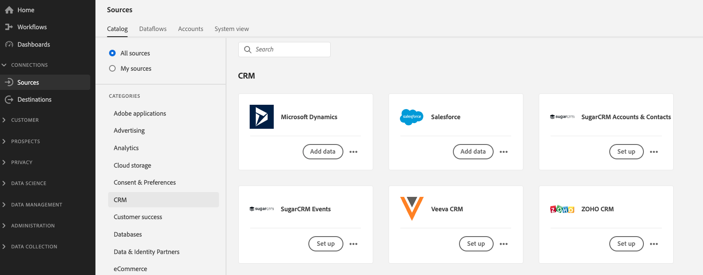

# Guida introduttiva a Real-time Customer Data Platform

Questa guida introduttiva illustra un esempio di implementazione di Real-time Customer Data Platform (Real-time CDP). Puoi usarlo come esempio durante la configurazione della tua implementazione. Anche se questa guida mostra esempi specifici, è collegata alle informazioni aggiuntive che puoi utilizzare durante la creazione della configurazione.

Questo esempio mostra la potenza di Real-time Customer Data Platform, fornita da Adobe Experience Platform, per:

* Acquisire dati da più origini
* Unirli in un unico [!DNL real-time customer profile]
* Offri un’esperienza coerente, pertinente e personalizzata tra i dispositivi.

## Caso d’uso

Luma, un&#39;azienda di abbigliamento atletico, cerca sempre di migliorare la loro esperienza con i clienti. Hanno una nuova iniziativa per aumentare le vendite relative ai regali. Vogliono anche ridurre la sovraesposizione, come annunci fastidiosi che seguono i clienti in giro.

Attualmente, spendono troppo sui media che si retargentano contro gli articoli che il visitatore non comprerà in futuro. Ad esempio, Luma non desidera eseguire il retargeting di un utente con un articolo destinato come acquisto una tantum per un altro utente.

Al momento, i dati di Luma sono dispersi tra più fonti. Di conseguenza, devono affrontare sfide significative:

* L’organizzazione marketing deve lavorare con diversi team che possiedono ciascuna un’origine dati, inclusi un sito web, un’app mobile, sistemi fedeltà, CRM e così via.
* Quando il team marketing accede ai dati, spesso non sono più aggiornati e non sono più rilevanti per la campagna che tiene conto del tempo.
* Devono unificare i dati in modo da indirizzare una persona, non i canali.

Di conseguenza, Luma ha i seguenti obiettivi aziendali:

* Crea una visione unica in tempo reale dei loro consumatori dalle loro diverse fonti di dati.
* Personalizza le campagne di marketing con messaggi pertinenti su diversi canali e dispositivi.

Per raggiungere questi obiettivi, il team marketing deve essere in grado di gestire i dati dei clienti su larga scala.

Con Real-time CDP, basato su Adobe Experience Platform, l’organizzazione di marketing di Luma può:

1. Raccogliere dati da piattaforme diverse e assicurarsi che siano disponibili a valle per altre attività di marketing.
1. Crea una visualizzazione unica e in tempo reale dei propri consumatori, indipendentemente da dove vengono generati i dati.
1. Crea un’esperienza coerente, pertinente e personalizzata in ogni punto di contatto.

## Passaggi

Questa esercitazione include i seguenti passaggi:

1. Crea [profilo cliente](#customer-profile).
1. [Personalizza](#personalizing-the-user-experience) l’esperienza utente.
1. Utilizzo [origini dati multiple](#using-multiple-data-sources).
1. [Configurare un’origine dati](#configuring-a-data-source).
1. [Raccogliere i dati](#bringing-the-data-together-for-a-specific-customer) per un cliente specifico.
1. Configurazione [segmenti](#segments).
1. Configurazione [destinazioni](#destinations).
1. [Stitch il profilo tra i dispositivi](#cross-device-identity-stitching).
1. [Analizzare il profilo](#analyzing-the-profile).

## Profilo del cliente

Quando i clienti visitano per la prima volta il tuo sito, non sai nulla di loro.


Durante la navigazione, i dati vengono acquisiti in tempo reale e inviati non solo a una suite di rapporti in Adobe Analytics, ma anche direttamente a Adobe Experience Platform. Man mano che i dati vengono raccolti, si inizia a formare una singola vista del consumatore, basata sui dati comportamentali in [!DNL Experience Platform's real-time customer profile].

Molti visitatori del sito web sono probabilmente clienti ripetuti che hanno precedentemente acquistato da Luma.  È importante che Luma personalizzi messaggi e offerte per indirizzare sia i visitatori nuovi che quelli ripetuti, sia i clienti noti.

### Prima visita del nuovo cliente

Ad esempio, un visitatore non identificato accede alla sezione Uomo del sito Luma e visualizza una coppia di felpe in esecuzione.


Quando il cliente si sposta per ulteriori informazioni su questi prodotti, queste visualizzazioni di prodotto vengono raccolte in Adobe Analytics e inviate a [!DNL Experience Platform].

<!---->

Luma può mappare il comportamento del visitatore a un profilo utente su Adobe Experience Platform e iniziare a assemblare una visione più ricca del comportamento del consumatore.

### Ottenere una visualizzazione più dettagliata del cliente

Mentre il cliente continua a interagire con il sito web, emerge un&#39;immagine più chiara. Ad esempio, supponiamo che il visitatore aggiunga un prodotto al carrello e acceda.

Quando il cliente effettua l&#39;accesso, si identifica come Sarah Rose.


Vengono unite due identità:

* Dati di navigazione anonimi
* I dati esistenti associati all&#39;account di Sarah Rose

Entrambe le identità sono combinate in un unico profilo in [!DNL Experience Platform]. Luma ha ora una visione unificata di questo consumatore.

In base al comportamento di navigazione del visitatore anonimo nella sezione Uomini del sito, si potrebbe supporre che il cliente fosse un uomo. Ora che ha effettuato l’accesso, Luma riconosce Sarah Rose. Luma utilizza il potere del [!DNL Real-time Customer Profile] per perfezionare i messaggi che le vengono inviati tra i diversi canali.

## Personalizzazione dell’esperienza utente

Sarah viene accolta con un messaggio di fedeltà e ringraziata per essere membro del Bronze con maggiori informazioni sui benefici e come aumentare il suo status e punti.

Passa alla home page per ulteriori informazioni.


Sarah riceve un’esperienza personalizzata sulla home page che viene consegnata in modo dinamico, in base a lei [!DNL Real-time Customer Profile] in Adobe Experience Platform.

Vede contenuti rilevanti, grazie alla personalizzazione basata su Adobe Sensei in Adobe Target, che tiene conto dei suoi acquisti e dell&#39;affinità con la gestione di abbigliamento e abbigliamento. Luma inoltre adatta il contenuto del catalogo maschile per gli uomini in base al suo ultimo navigatore.

Più in basso nella pagina, a Sarah vengono mostrati i prodotti in evidenza, così come una nuova barra delle raccomandazioni in base ai suoi ultimi articoli visualizzati.

Questo contenuto personalizzato aiuta Sarah a trovare rapidamente gli elementi rilevanti. Questo aumenta le conversioni e offre una customer experience più piacevole.

### Riportare il cliente

Sarah si distrae e lascia il sito, terminando la sessione. Luma può usare i suoi dati in Adobe Experience Platform per aiutarla a tornare al sito.

Real-time Customer Data Platform, basato su Adobe Experience Platform, è progettato per la gestione della customer experience. Consente alle organizzazioni di:

* Integrazione e attivazione dei dati semplificate
* Utilizzo dei dati noti e sconosciuti
* Accelerare i casi di utilizzo del marketing su larga scala

## Utilizzo di più origini dati

Il team di Luma dispone di tutti i dati comportamentali e dei clienti in un’unica posizione.


Possono acquisire dati da tutte le seguenti origini:

* Dati delle soluzioni Adobe Experience Cloud esistenti
* Fonti non Adobi, come il programma fedeltà di Luma, il call center e i dati del sistema dei punti vendita
* Dati in streaming in tempo reale da origini dati Luma
* Dati in tempo reale dalle soluzioni Adobe (non sono necessari nuovi tag)

Tutti questi dati provenienti da fonti diverse vengono uniti in un unico profilo cliente unificato.

## Configurazione di un’origine dati

Utilizzo [!DNL Real-time Customer Data Platform] portare nuove fonti di dati in Platform. Real-time CDP include un catalogo di origini dati che possono essere aggiunte rapidamente e facilmente al profilo.



Ad esempio, per acquisire i dati CRM di Luma, filtra il catalogo per *CRM* e tutti i connettori preconfigurati contenenti *CRM* sono elencati. Per aggiungere [!DNL Microsoft Dynamics CRM] dati:

1. Autorizzare la connessione.

   

1. Scegli cosa importare da un elenco consigliato di tabelle pre-mappate XDM.

   <!--     -->

   Ad esempio, seleziona **[!UICONTROL Contatti]**. Viene caricata automaticamente un&#39;anteprima dei dati dei contatti per verificare che tutto sia come previsto.

   Adobe Experience Platform trae molto del lavoro manuale da questo processo mappando automaticamente i campi standard al [!DNL Experience Data Model] (XDM) schema di profilo.

1. Esamina le mappature dei campi.

   <!--     -->

   Ad esempio, controlla che il campo e-mail per i contatti sia mappato correttamente.\
   Puoi visualizzare in anteprima i dati ed eseguire la mappatura avanzata.

1. Imposta una pianificazione.

   

È fatto. Hai appena aggiunto [!DNL Microsoft CRM] come origine dati in [!DNL Experience Platform].

### Etichettatura dei dati acquisiti per i criteri di utilizzo

Luma dispone di numerose politiche interne che limitano l’utilizzo di determinati tipi di informazioni raccolte e deve anche rispettare le preoccupazioni legali e relative alla privacy relative all’utilizzo dei dati. Utilizzando la governance dei dati di Adobe Experience Platform, le etichette di utilizzo dei dati predefinite possono essere applicate ai set di dati (e a campi specifici all’interno di tali set di dati), consentendo a Luma di categorizzare i propri dati in base a specifiche restrizioni di utilizzo.


Una volta applicate le etichette di utilizzo dei dati, Luma può quindi utilizzare la governance dei dati per creare criteri di utilizzo dei dati. I criteri di utilizzo dei dati sono regole che descrivono il tipo di azioni che è possibile eseguire sui dati che contengono determinate etichette. Quando si tenta di eseguire un&#39;azione in Real-time CDP che costituisce una violazione della politica, l&#39;azione viene impedita e viene dato un avviso per mostrare quale politica è stata violata e perché.

## Raggruppamento dei dati per un cliente specifico

In questo scenario, cerca profili per Sarah Rose. Viene visualizzato il suo profilo, con l&#39;e-mail che usava per effettuare l&#39;accesso.

<!--  -->

Tutte le informazioni sul profilo che Luma ha sui display di Sarah. Ciò include informazioni personali come indirizzo e numero di telefono, preferenze di comunicazione e i segmenti per i quali si qualifica.

| Categoria | Descrizione |
|---|---|
| Identità | Mostra le identità collegate tra loro in [!DNL Platform] dalle interazioni di Sarah con Luma su diversi canali e dispositivi. Viene visualizzato il suo ECID dal sito web. La sua identità include anche l’ECID dalla sua app mobile, il suo ID e-mail, un ID CRM dall’ID aggiunto di recente [!DNL Microsoft Dynamics] set di dati e un ID fedeltà trasmessi in Adobe Experience Platform dal sistema fedeltà Luma. |
| Eventi | Mostra tutti i dati di interazione di Sarah con il marchio Luma. Questo include l&#39;oggetto che ha appena visualizzato, tutto quello che ha visto in passato, le e-mail che ha ricevuto, le interazioni con il call center e il canale e il dispositivo su cui si sono verificate ciascuna di queste interazioni. |

Il profilo Real-time CDP riduce il flusso di lavoro del team di marketing Luma da settimane a minuti e sblocca le possibilità di personalizzazione in base a questa vista cliente a 360 gradi. Il profilo unisce i dati comportamentali da quando ha visitato il sito prima di effettuare l’accesso, con il suo profilo cliente esistente, creando una visione completa di Sarah.

Il team marketing può utilizzare questa funzionalità avanzata, [!DNL Real-time Customer Profile] personalizzare meglio l&#39;esperienza di Sarah e aumentare la sua fedeltà al marchio con Luma.

## Segmenti

Le potenti funzionalità di segmentazione di Adobe Experience Platform consentono agli addetti al marketing di combinare attributi, eventi e segmenti esistenti in base ai dati acquisiti in [!DNL Real-time Customer Profile].

<!--  -->

In questo scenario, le recenti interazioni di Sarah sul sito mostrano un comportamento diverso rispetto alle sue azioni passate. Di solito compra abbigliamento femminile. Tuttavia, l&#39;articolo nel suo carrello è una maglia grande uomo.

Il team Luma di data science ha creato modelli sulla propensione all&#39;acquisto. Un modello identifica un cambiamento improvviso nella categoria di abbigliamento (ad esempio uomini/donne) o nella dimensione per il consumatore esistente. Il cambiamento nel comportamento di acquisto di Sarah suggerisce che non sta facendo acquisti da sola.

<!--  -->

### Definizione di un segmento

Modifica o crea un segmento che rappresenta gli utenti che abbandonano il carrello che sembrano nel processo di acquisto di un regalo:

```sql
Profile: Category != Preferred Category 
AND 
Product Size != Preferred Size 
in last 7 days.  
AND 
Abandoned Cart 
AND 
Loyalty member 
```

<!-- -->

Dato che Sarah ha aggiunto un oggetto regalo apparente nel carrello e lo ha abbandonato, Luma può mirare con un&#39;offerta regalo-involucro gratuita.

## Destinazioni

Quando hai aggiunto il segmento &quot;Donare al carrello Abandoners&quot;, puoi vedere più o meno quante persone fanno parte di questo segmento. Puoi intervenire su di esso e renderlo disponibile per la personalizzazione tra i canali.

Seleziona **[!UICONTROL Invia a destinazioni]**.

In Real-time CDP, Luma può agire facilmente sui segmenti di pubblico per la personalizzazione.\
Di seguito sono elencate tutte le destinazioni disponibili per Luma per l’invio di questa destinazione a, sia per soluzioni di Adobe che per soluzioni non di Adobe:


### Selezione delle destinazioni

In questo scenario, Luma desidera effettuare il retargeting del pubblico con la personalizzazione tra queste destinazioni:

* Google, per la visualizzazione

   <!--* Facebook -->
* Adobe Campaign, per e-mail

<!--  -->

### Destinazioni di pianificazione

Puoi anche pianificare l’inizio o la fine del segmento in un determinato momento. Il segmento verrà pubblicato e aggiornato automaticamente nelle piattaforme configurate alle date pianificate.

>[!NOTE]
>
>Facoltativamente, se si seleziona il campo data, questo viene programmato automaticamente per 90 giorni.

Seleziona **[!UICONTROL Salva]** per passare alla pagina successiva.

Quando un cliente di questo pubblico effettua un acquisto, la sua iscrizione a questo pubblico viene soppressa in tempo reale. Non si qualificano più perché il loro stato è cambiato.

In questo modo, il direttore del team multimediale Luma risparmia centinaia di migliaia di dollari non utilizzando l’inventario per un pubblico non qualificato.

### Applicazione dei criteri di utilizzo dei dati per le destinazioni

Adobe Experience Platform include i controlli di privacy e sicurezza per determinare se un segmento è disponibile per essere attivato in una particolare destinazione. L’attivazione viene abilitata o limitata in base agli scopi di marketing assegnati alla destinazione al momento della creazione, nonché ai criteri di utilizzo dei dati definiti dall’organizzazione.

Se l’attività viola i criteri, viene visualizzato un avviso. Questo avviso contiene informazioni di derivazione dei dati che possono aiutarti a identificare il motivo della violazione dei criteri e le operazioni possibili per risolverla.

Con questi controlli, [!DNL Experience Platform] aiuta Luma a rispettare le normative e a commercializzare in modo responsabile. Questi controlli sono flessibili e possono essere modificati per soddisfare i requisiti dei team di sicurezza e governance di Luma, consentendo loro di soddisfare in modo sicuro i requisiti regionali e organizzativi per la gestione dei dati noti e sconosciuti dei clienti.

### Area di lavoro del flusso di dati

Quando salvi, un’area di flusso di dati visiva mostra il segmento mappato dal profilo unificato alle tre destinazioni selezionate.


## Unione delle identità tra più dispositivi

Sarah naviga su un sito di social media sul suo dispositivo mobile, e vede un annuncio Luma. Le ricorda l&#39;oggetto che ha lasciato nel carrello.

Successivamente, apre la sua e-mail e visualizza le e-mail reindirizzate. Seleziona un collegamento a Luma da un’e-mail.

Il collegamento porta Sarah alla home page mobile di Luma, dove vede un’esperienza altamente personalizzata basata su Adobe Target.

* Lei è accolta come membro del Bronzo.
* Vede il messaggio &quot;Regalo&quot;.
* Vede anche il messaggio &quot;Free Gift Wrap&quot;, che fa parte dei suoi vantaggi di iscrizione al Bronzo.
* È ancora nel mirino dell&#39;immagine protagonista in base alla sua affinità per la sua corsa.

Compra il maglione, aggiunge una confezione regalo e scrive una nota regalo. Ha anche la possibilità di ricordare questo evento e ottenere un promemoria l&#39;anno prossimo per ottenere in regalo in questo momento. Dice di sì, ed è programmato in una campagna e-mail l&#39;anno successivo per ricordarle di comprare un altro regalo.

Grazie alle capacità di soppressione del pubblico, Sarah non sarà presa di mira con il maglione di quell&#39;uomo che si muove avanti.

## Analisi del profilo

Gli esperti di marketing Luma utilizzano Adobe Experience Platform per guardare il segmento dei donatori nella dashboard CDP in tempo reale. Vedono i risultati di questa iniziativa nel tempo e vedono che sta crescendo. I clienti rispondono alle offerte e spendono più soldi.

Queste informazioni consentono agli esperti di marketing di intervenire su questo segnale, che è stato alimentato dalla disponibilità di tali dati in CDP e dall’associazione di clienti come Sarah al segmento.

Luma utilizza questi dati CDP per incrementare la fedeltà e la soddisfazione dei clienti.
