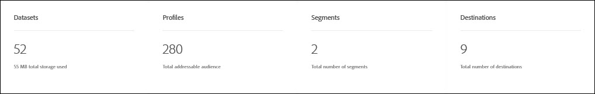

# [!DNL Real-time Customer Data Platform] panoramica delle metriche

La home page di Adobe Real-time Customer Data Platform (Real-time CDP), che include un dashboard delle metriche, viene visualizzata quando accedete a CDP in tempo reale.

La pagina principale è solo uno dei punti in cui vengono visualizzate le schede metriche. Il CDP in tempo reale fornisce schede metriche per tutta l&#39;esperienza. Queste metriche ti informano sui dati, il profilo e il pubblico del segmento nel sistema.

Se non sono presenti dati nel sistema al momento dell&#39;accesso a CDP in tempo reale, il dashboard nella pagina principale non viene visualizzato. In questo caso, la pagina principale fornisce materiale didattico per la prima esperienza utente. Quando i dati vengono raccolti, ovvero quando vengono creati <!--sources-->insiemi di dati, profili, segmenti e destinazioni e i dati fluiscono nel sistema, il dashboard si aggiorna automaticamente per visualizzare le informazioni su tali dati<!-- in metric cards-->.

## Visualizzazione dashboard pagina iniziale

<!--The dashboard shows information in several areas. Each category of information displays for the time range shown beneath the data.-->

Il dashboard è diviso in<!-- two areas.-->:

* **La classifica** si trova nella parte superiore del dashboard. La classifica mostra il numero di set di dati, profili, segmenti e destinazioni nel sistema.

   

<!-- * **Metric cards** display beneath the leaderboard. Metric cards show additional information, such as percentages or trends. Metric cards appear as data is collected.
    
Some information is shown in different ways on both the leaderboard and metric cards. -->
* **Gli elementi** recenti elencano i cinque set di dati, le origini, i segmenti e le destinazioni più recenti aggiunti al sistema.

   

Metriche aggiuntive, ad esempio per profili e segmenti, sono disponibili in altre parti dell&#39;Platform Real-time Customer Data.

### Set di dati

Il **[!UICONTROL Datasets]** contatore mostra il numero di set di dati nel sistema e la quantità di dati in [!DNL Platform]. Questo contatore viene aggiornato quando viene creato un set di dati.

Per ulteriori informazioni sui set di dati, vedere la panoramica [dei](../catalog/datasets/overview.md)set di dati.

### Profili

Il **[!UICONTROL Profiles]** conteggio mostra il numero totale di persone con i profili nel [!DNL Real-time Customer Profile]. Non include frammenti di profilo. Questa è la tua audience completa indirizzabile.

Questo conteggio utilizza il criterio [di](profile/merge-policies.md) unione predefinito impostato nella configurazione del criterio di unione nel profilo unificato.

Il numero di profili viene aggiornato una volta ogni 24 ore.

Per ulteriori informazioni sui profili, consulta [Una vista unificata del cliente in CDP](profile/profile-overview.md)in tempo reale.

### Segmenti

**[!UICONTROL Segments]** mostra il numero totale di segmenti creati per l&#39;organizzazione. Questo numero viene aggiornato al momento della creazione di nuovi segmenti.

Per ulteriori informazioni sui segmenti, consulta Panoramica [del servizio](segmentation/segmentation-overview.md)di segmentazione.

### Destinazioni

**[!UICONTROL Destinations]** mostra il numero totale di destinazioni create per l&#39;organizzazione. Questo numero viene aggiornato al momento della creazione di nuove destinazioni.

Per ulteriori informazioni sulle destinazioni, consulta Panoramica sulle [destinazioni](destinations/destinations-overview.md).

<!-- ### Successful profile records

In the leaderboard **[!UICONTROL Successful profile records]** shows the total number of records that have been successfully processed into the profile.

There is also a metric card that shows the percentage of successful records. Click **[!UICONTROL View datasets]** to see more details about the profile records. Hover over the colored area of the graph to see additional details:

The number of successful profile records is updated hourly. 

For more information about profiles, see [A unified view of your customer in Real-time CDP](profile/profile-overview.md).

### Total profile records

The **[!UICONTROL Total profile records]** metric card shows the total number of data records enabled to feed into the profiles, and the percentage that are successful, updated once per day. This does not include all data in the data lake, because some data might not be enabled to feed into the profiles.

 Hover over the colored area of the graph to see additional details about the successful profiles:

Click **[!UICONTROL View profiles]** to see more details about the profile records.

For more information about profiles, see [A unified view of your customer in Real-time CDP](profile/profile-overview.md).

For more information about viewing a specific profile, see [Profile viewer](profile/profile-viewer.md).

### Failed profile records

In the leaderboard, **[!UICONTROL Failed profile records]** counts the number of records that failed to process into the profile.

The **[!UICONTROL Failed profile records]** metric card shows this count, and includes a graphical representation that helps you see how failures have trended during the time shown below the graphic. This chart is updated hourly. Click **[!UICONTROL View datasets]** to see more details about the profile records.

The number of failed profile records is updated hourly. -->

### Set di dati recenti

La **[!UICONTROL Recent datasets]** scheda mostra i cinque set di dati più recenti creati all&#39;interno dell&#39;organizzazione. Questo elenco viene aggiornato al momento della creazione di un nuovo set di dati.

Fare clic su un dataset per visualizzare i dettagli dell&#39;elemento o **[!UICONTROL View all]** per visualizzare l&#39;elenco dei set di dati. Da qui potete fare clic su una sorgente specifica per i dettagli.

Per ulteriori informazioni sui set di dati, vedere la panoramica [dei](../catalog/datasets/overview.md)set di dati.

### Fonti recenti

La scheda **[!UICONTROL Recent sources]** metrica mostra le cinque origini più recenti create all&#39;interno dell&#39;organizzazione. Questo elenco viene aggiornato quando viene creata una nuova origine.

Fate clic su un&#39;origine per visualizzare i dettagli dell&#39;elemento o **[!UICONTROL View all]** per visualizzare l&#39;elenco delle origini. Da qui potete fare clic su una sorgente specifica per i dettagli.

Per ulteriori informazioni sulle origini, consulta [Panoramica](sources/sources-overview.md)delle origini.

### Segmenti recenti

La scheda **[!UICONTROL Recent segments]** metrica mostra i cinque segmenti più recenti creati all&#39;interno dell&#39;organizzazione. Questo elenco viene aggiornato al momento della creazione di un nuovo segmento.

Fai clic su un segmento per visualizzare i dettagli dell&#39;elemento o **[!UICONTROL View all]** per visualizzare informazioni su altri segmenti.

Per ulteriori informazioni sui segmenti, consulta Panoramica [del servizio](segmentation/segmentation-overview.md)di segmentazione.

### Destinazioni recenti

La scheda **[!UICONTROL Recent destinations]** metrica mostra le cinque destinazioni più recenti create all&#39;interno dell&#39;organizzazione. Questo elenco viene aggiornato al momento della creazione di una nuova destinazione.

Fate clic su una destinazione per visualizzare i dettagli dell’elemento o **[!UICONTROL View all]** per visualizzare informazioni su altre destinazioni.

Per ulteriori informazioni sulle destinazioni, consulta Panoramica sulle [destinazioni](destinations/destinations-overview.md).
