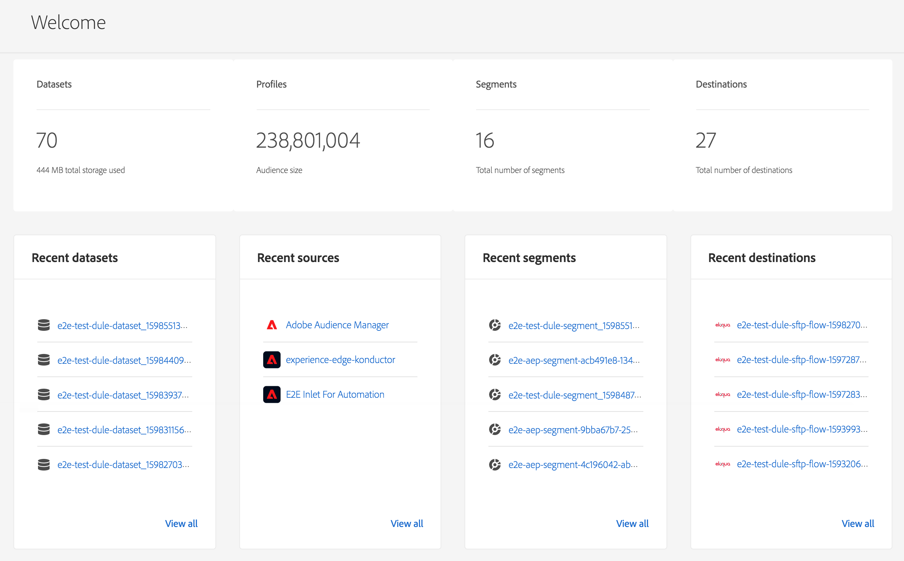

# [!DNL Real-time Customer Data Platform] home page e dashboard

La home page di Real-time Customer Data Platform (Real-time CDP), che include un dashboard delle metriche, viene visualizzata quando accedi a Real-time CDP.

La home page è solo una delle posizioni in cui vengono visualizzate le schede metriche. Real-time CDP fornisce schede metriche per tutta l’esperienza. Queste metriche ti informano sui dati, sul profilo e sui segmenti di pubblico nel sistema.

Se non sono presenti dati nel sistema quando si accede a Real-time CDP, il dashboard nella home page non viene visualizzato. In questo caso, la home page fornisce materiale di apprendimento per una prima esperienza utente. Come vengono raccolti i dati, in altre parole come <!--sources-->set di dati, profili, segmenti e destinazioni vengono creati e i dati scorrono nel sistema. Il dashboard si aggiorna automaticamente per visualizzare le informazioni relative a tali dati<!-- in metric cards-->.

## Vista dashboard della pagina Home

<!--The dashboard shows information in several areas. Each category of information displays for the time range shown beneath the data.-->

Il dashboard è diviso in<!-- two areas.-->:

* **La classifica** si trova nella parte superiore del dashboard. La classifica mostra il numero di set di dati, profili, segmenti e destinazioni nel sistema.

   

<!-- * **Metric cards** display beneath the leaderboard. Metric cards show additional information, such as percentages or trends. Metric cards appear as data is collected.
    
Some information is shown in different ways on both the leaderboard and metric cards. -->
* **Articoli recenti** elenca i cinque set di dati, le origini, i segmenti e le destinazioni più recenti aggiunti al sistema.

   

Metriche aggiuntive, ad esempio per profili e segmenti, sono disponibili in altre parti di Real-time Customer Data Platform.

### Set di dati

La **[!UICONTROL Set di dati]** contatore mostra il numero di set di dati nel sistema e la quantità di dati in [!DNL Platform]. Questo contatore viene aggiornato quando viene creato un set di dati.

Per ulteriori informazioni sui set di dati, consulta la sezione [panoramica dei set di dati](../catalog/datasets/overview.md).

### Profili

La **[!UICONTROL Profili]** count mostra il numero totale di persone con profili nel [!DNL Real-time Customer Profile]. Non include frammenti di profilo. Questo è il tuo pubblico totalmente indirizzabile.

Questo conteggio utilizza il valore predefinito [criterio di unione](profile/merge-policies.md) come impostato nella configurazione dei criteri di unione nel profilo unificato.

Il numero di profili viene aggiornato una volta ogni 24 ore.

Per ulteriori informazioni sui profili, consulta [Visualizzazione unificata del cliente in Real-time CDP](profile/profile-overview.md).

### Segmenti

**[!UICONTROL Segmenti]** mostra il numero totale di segmenti creati per l’organizzazione. Questo numero viene aggiornato quando vengono creati nuovi segmenti.

Per ulteriori informazioni sui segmenti, vedi [Panoramica del servizio di segmentazione](segmentation/segmentation-overview.md).

### Destinazioni

**[!UICONTROL Destinazioni]** mostra il numero totale di destinazioni create per l&#39;organizzazione. Questo numero viene aggiornato quando vengono create nuove destinazioni.

Per ulteriori informazioni sulle destinazioni, vedi [Panoramica sulle destinazioni](destinations/overview.md).

<!-- ### Successful profile records

In the leaderboard **[!UICONTROL Successful profile records]** shows the total number of records that have been successfully processed into the profile.

There is also a metric card that shows the percentage of successful records. Select **[!UICONTROL View datasets]** to see more details about the profile records. Hover over the colored area of the graph to see additional details:

The number of successful profile records is updated hourly. 

For more information about profiles, see [A unified view of your customer in Real-time CDP](profile/profile-overview.md).

### Total profile records

The **[!UICONTROL Total profile records]** metric card shows the total number of data records enabled to feed into the profiles, and the percentage that are successful, updated once per day. This does not include all data in the data lake, because some data might not be enabled to feed into the profiles.

 Hover over the colored area of the graph to see additional details about the successful profiles:

Select **[!UICONTROL View profiles]** to see more details about the profile records.

For more information about profiles, see [A unified view of your customer in Real-time CDP](profile/profile-overview.md).

For more information about viewing a specific profile, see [Profile viewer](profile/profile-viewer.md).

### Failed profile records

In the leaderboard, **[!UICONTROL Failed profile records]** counts the number of records that failed to process into the profile.

The **[!UICONTROL Failed profile records]** metric card shows this count, and includes a graphical representation that helps you see how failures have trended during the time shown below the graphic. This chart is updated hourly. Select **[!UICONTROL View datasets]** to see more details about the profile records.

The number of failed profile records is updated hourly. -->

### Set di dati recenti

La **[!UICONTROL Set di dati recenti]** la scheda mostra i cinque set di dati più recenti creati all’interno dell’organizzazione. Questo elenco viene aggiornato quando viene creato un nuovo set di dati.

Seleziona un set di dati per visualizzare i dettagli dell’elemento, oppure **[!UICONTROL Visualizza tutto]** per visualizzare l’elenco dei set di dati. Da qui puoi selezionare una sorgente specifica per i dettagli.

Per ulteriori informazioni sui set di dati, consulta la sezione [panoramica dei set di dati](../catalog/datasets/overview.md).

### Fonti recenti

La **[!UICONTROL Fonti recenti]** la scheda metrica mostra le cinque origini più recenti create all’interno dell’organizzazione. Questo elenco viene aggiornato al momento della creazione di una nuova origine.

Selezionare un&#39;origine per visualizzare i dettagli dell&#39;elemento, oppure **[!UICONTROL Visualizza tutto]** per visualizzare l&#39;elenco delle origini. Da qui puoi selezionare una sorgente specifica per i dettagli.

Per ulteriori informazioni sulle origini, consulta [Panoramica delle origini](sources/sources-overview.md).

### Segmenti recenti

La **[!UICONTROL Segmenti recenti]** la scheda metrica mostra i cinque segmenti più recenti creati all’interno dell’organizzazione. Questo elenco viene aggiornato al momento della creazione di un nuovo segmento.

Seleziona un segmento per visualizzare i dettagli dell’elemento, oppure **[!UICONTROL Visualizza tutto]** per visualizzare informazioni su più segmenti.

Per ulteriori informazioni sui segmenti, vedi [Panoramica del servizio di segmentazione](segmentation/segmentation-overview.md).

### Destinazioni recenti

La **[!UICONTROL Destinazioni recenti]** la scheda metrica mostra le cinque destinazioni più recenti create all’interno dell’organizzazione. Questo elenco viene aggiornato al momento della creazione di una nuova destinazione.

Selezionare una destinazione per visualizzare i dettagli dell&#39;elemento, oppure **[!UICONTROL Visualizza tutto]** per visualizzare informazioni su più destinazioni.

Per ulteriori informazioni sulle destinazioni, vedi [Panoramica sulle destinazioni](destinations/overview.md).
