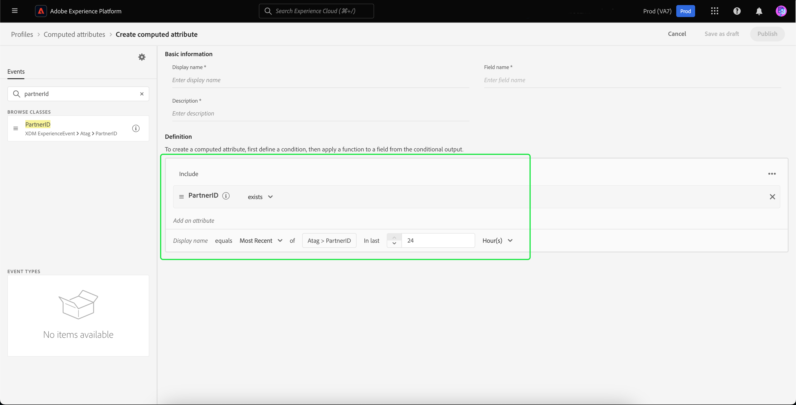

# Retargeting fuori sede dei visitatori non autenticati

>[!AVAILABILITY]
>
>Questa funzionalità è disponibile per i clienti che dispongono di una licenza per Real-Time CDP (App Service), Adobe Experience Platform Activation, Real-Time CDP, Real-Time CDP Prime, Real-Time CDP Ultimate. Ulteriori informazioni su questi pacchetti sono disponibili nelle [descrizioni dei prodotti](https://helpx.adobe.com/it/legal/product-descriptions.html). Contatta il tuo rappresentante Adobe per ulteriori informazioni.

Scopri come creare un pubblico di visitatori non autenticati ed effettuare il retargeting utilizzando gli ID duraturi forniti dai partner.

## Perché considerare questo caso d’uso {#why-use-case}

Con la graduale eliminazione dei cookie di terze parti, gli esperti di marketing digitale devono ridefinire le proprie strategie per coinvolgere di nuovo i visitatori anonimi. I brand che scelgono di integrarsi con i fornitori di identità per il riconoscimento dei visitatori in tempo reale possono anche sfruttare gli identificatori duraturi forniti dai partner per il retargeting dei contenuti multimediali a pagamento fuori dal sito.

Nonostante l’elevato volume di traffico, molti marchi riscontrano un calo significativo nella fase di conversione. I visitatori possono interagire con i contenuti e le demo dei prodotti, ma se ne vanno senza registrarsi o effettuare un acquisto.

Non solo puoi creare tipi di pubblico basati sul coinvolgimento nel sito per personalizzare i messaggi di marketing, ma puoi anche utilizzare il supporto di Adobe per gli ID partner per coinvolgere di nuovo i visitatori su destinazioni di media a pagamento.

## Prerequisiti e pianificazione {#prerequisites-and-planning}

Quando pianifichi il retargeting di visitatori non autenticati, tieni presente i seguenti prerequisiti durante il processo di pianificazione:

- Ho impostato gli ID partner con gli spazi dei nomi di identità corretti?

Inoltre, per implementare il caso d’uso, utilizzerai le seguenti funzionalità di Real-Time CDP ed elementi dell’interfaccia utente. Verificare di disporre delle autorizzazioni di controllo dell&#39;accesso basate su attributi necessarie per tutte queste aree o richiedere all&#39;amministratore di sistema di concedere le autorizzazioni necessarie.

- [Tipi di pubblico](../../segmentation/home.md)
- [Attributi calcolati](../../profile/computed-attributes/overview.md)
- [Destinazioni](../../destinations/home.md)
- [SDK per web](../../edge/home.md)

## Trasmettere i dati dei partner in Real-Time CDP {#get-data-in}

Per creare un pubblico di visitatori non autenticati, devi prima inserire i dati dei tuoi partner in Real-Time CDP.

Per informazioni su come importare in modo ottimale i dati in Real-Time CDP utilizzando Web SDK, leggi [sezioni di gestione dati e raccolta dati di eventi](./onsite-personalization.md#data-management) del caso di utilizzo di personalizzazione nel sito.

## Portare avanti gli ID forniti dal partner {#bring-partner-ids-forward}

Dopo aver importato gli ID forniti dal partner in un set di dati evento, devi inserire questi dati nei record del profilo. Per farlo, puoi utilizzare attributi calcolati.

Gli attributi calcolati consentono di convertire rapidamente i dati comportamentali del profilo in valori aggregati a livello di profilo. Di conseguenza, puoi utilizzare queste espressioni, ad esempio &quot;totale degli acquisti per tutta la durata&quot; nel profilo, consentendoti di utilizzare facilmente l’attributo calcolato all’interno dei tipi di pubblico. Ulteriori informazioni sugli attributi calcolati sono disponibili nella sezione [panoramica degli attributi calcolati](../../profile/computed-attributes/overview.md).

Per accedere agli attributi calcolati, seleziona **[!UICONTROL Profili]** seguito da **[!UICONTROL Attributi calcolati]** e **[!UICONTROL Crea attributo calcolato]**.

![Il [!UICONTROL Creare attributi calcolati] viene evidenziato oltre al [!UICONTROL Attributi calcolati] all&#39;interno del [!UICONTROL Profili] Workspace.](../assets/offsite-retargeting/create-ca.png)

Il **[!UICONTROL Crea attributo calcolato]** viene visualizzata. In questa pagina puoi utilizzare i componenti per creare l’attributo calcolato.

>[!NOTE]
>
>Per informazioni più dettagliate sulla creazione di attributi calcolati, consulta [guida dell’interfaccia utente per attributi calcolati](../../profile/computed-attributes/ui.md).

Per questo caso d’uso, puoi creare un attributo calcolato che, se esiste l’ID partner, ottiene il valore più recente dell’ID partner entro le ultime 24 ore.

Utilizzando la barra di ricerca, puoi individuare e aggiungere l’evento &quot;Partner ID&quot; all’area di lavoro degli attributi calcolati.

![Il [!UICONTROL Eventi] e la barra di ricerca.](../assets/offsite-retargeting/ca-add-partner-id.png)

Dopo aver aggiunto l’evento &quot;Partner ID&quot; alla definizione, imposta la condizione di filtro dell’evento su **[!UICONTROL Esiste]**, imposta la condizione di filtro degli eventi su **[!UICONTROL Più recente]** valore dell’ID partner aggiunto e con un periodo di lookback di 24 ore.

Assegna all’attributo calcolato un nome appropriato (ad esempio &quot;ID partner&quot;) e una descrizione, quindi seleziona **[!UICONTROL Pubblica]** per completare il processo di creazione degli attributi calcolati.

## Creare un pubblico utilizzando l’attributo calcolato {#create-audience}

Dopo aver creato l’attributo calcolato, puoi utilizzarlo per creare un pubblico. In questo esempio, creerai un pubblico composto da visitatori che hanno visitato il tuo sito web più di 5 volte nel corso del mese ma che non si sono ancora iscritti.

Per creare un pubblico, seleziona **[!UICONTROL Tipi di pubblico]**, seguito da **[!UICONTROL Creare un pubblico]**.

![Il [!UICONTROL Creare un pubblico] viene evidenziato.](../assets/offsite-retargeting/create-audience.png)

Viene visualizzata una finestra di dialogo in cui viene richiesto di scegliere tra [!UICONTROL Componi pubblico] e [!UICONTROL Genera regola]. Seleziona **[!UICONTROL Genera regola]** seguito da **[!UICONTROL Crea]**.

![Il [!UICONTROL Genera regola] viene evidenziato.](../assets/offsite-retargeting/select-build-rule.png)

Viene visualizzata la pagina Generatore di segmenti. In questa pagina puoi utilizzare i componenti per creare il pubblico.

>[!NOTE]
>
>Per informazioni più dettagliate sull’utilizzo del Generatore di segmenti, consulta la sezione [Guida dell’interfaccia utente di Segment Builder](../../segmentation/ui/segment-builder.md).

Per raggiungere l’obiettivo di trovare questi visitatori, devi prima aggiungere una **[!UICONTROL Visualizzazione pagina]** al pubblico. Seleziona la **[!UICONTROL Eventi]** scheda in **[!UICONTROL Campi]**, quindi trascina e rilascia la **[!UICONTROL Visualizzazione pagina]** e aggiungerlo all’area di lavoro della sezione eventi.

![Il [!UICONTROL Eventi] scheda in [!UICONTROL Campi] viene evidenziata durante la visualizzazione della sezione [!UICONTROL Visualizzazione pagina]evento.](../assets/offsite-retargeting/add-page-view.png)

Seleziona la nuova aggiunta **[!UICONTROL Visualizzazione pagina]** evento. Modifica il periodo di lookback da **[!UICONTROL In qualsiasi momento]** a **[!UICONTROL Questo mese]** e modificare la regola dell&#39;evento in modo da includere **Almeno 5**.

![Dettagli del [!UICONTROL Visualizzazione pagina] vengono visualizzati.](../assets/offsite-retargeting/edit-event.png)

Dopo aver aggiunto l’evento, devi aggiungere un attributo. Poiché stai lavorando con visitatori non autenticati, puoi aggiungere l’attributo calcolato appena creato. Questo attributo calcolato appena creato consente di collegare gli ID partner a un pubblico.

Per aggiungere l’attributo calcolato, in **[!UICONTROL Attributi]**, seleziona **[!UICONTROL Profilo individuale XDM]**, seguito da **[!UICONTROL _tag]**, **[!UICONTROL SystemComputedAttributes]**, e **[!UICONTROL PartnerID]**. Aggiungi ora il **[!UICONTROL Valore]** dell’attributo calcolato alla sezione attributes dell’area di lavoro.

Inoltre, cerca **[!UICONTROL E-mail personale]** e aggiungi **[!UICONTROL Indirizzo]** attributo sottostante **[!UICONTROL PartnerID]** nella sezione attributi dell’area di lavoro.

![Il [!UICONTROL PartnerID] attributo calcolato e [!UICONTROL Indirizzo e-mail personale] nell’area di lavoro del Generatore di segmenti.](../assets/offsite-retargeting/added-attributes.png)

Dopo aver aggiunto gli attributi, è necessario impostare i relativi criteri di valutazione. Per **[!UICONTROL PartnerID]**, imposta il criterio su **[!UICONTROL esiste]**, e per **[!UICONTROL Indirizzo]**, imposta il criterio su **[!UICONTROL non esiste]**.

Hai creato correttamente un pubblico che cerca visitatori ad alta intensità che dispongono di un ID fornito dal partner ma che non si sono ancora iscritti al tuo sito. Denomina il pubblico &quot;Retargeting di utenti non autenticati&quot; e seleziona **[!UICONTROL Salva]** per completare la creazione del pubblico.

## Attiva il pubblico {#activate-audience}

Dopo aver creato correttamente il pubblico, ora puoi attivarlo nelle destinazioni a valle. Seleziona **[!UICONTROL Tipi di pubblico]** nella barra di navigazione a sinistra, cerca il pubblico appena creato, seleziona l’icona con i puntini di sospensione, quindi seleziona **[!UICONTROL Attiva nella destinazione]**.

![Il [!UICONTROL Attiva nella destinazione] viene evidenziato.](../assets/offsite-retargeting/activate-to-destination.png)

>[!NOTE]
>
>Tutti i tipi di destinazione, comprese le destinazioni basate su file, supportano l’attivazione del pubblico con gli ID partner.
>
>Per ulteriori informazioni sull’attivazione di tipi di pubblico su una destinazione, consulta la sezione [panoramica sull’attivazione](../../destinations/ui/activation-overview.md).

Il **[!UICONTROL Attiva destinazione]** viene visualizzata. In questa pagina puoi selezionare la destinazione in cui desideri attivare la destinazione. Dopo aver selezionato la destinazione desiderata, seleziona **[!UICONTROL Successivo]**.

Il **[!UICONTROL Pianificazione]** viene visualizzata. In questa pagina puoi creare una pianificazione che determina la frequenza con cui desideri attivare il pubblico. Seleziona **[!UICONTROL Crea pianificazione]** per creare una pianificazione per l’attivazione del pubblico.

![Il [!UICONTROL Crea pianificazione] viene evidenziato.](../assets/offsite-retargeting/select-create-schedule.png)

Il [!UICONTROL Pianificazione] viene visualizzato popover. In questa pagina puoi creare la pianificazione per l’attivazione del pubblico. Dopo aver configurato la pianificazione, seleziona **[!UICONTROL Crea]** per continuare.

Dopo aver confermato i dettagli della pianificazione, seleziona **[!UICONTROL Successivo]**.

Il **[!UICONTROL Seleziona attributi]** viene visualizzata. In questa pagina puoi selezionare gli attributi da esportare insieme al pubblico attivato. Come minimo, includi l’ID partner, in quanto ti consentirà di identificare i visitatori di cui intendi effettuare il retargeting. Seleziona **[!UICONTROL Aggiungi nuova mappatura]** e cerca l’attributo calcolato. Dopo aver aggiunto gli attributi necessari, seleziona **[!UICONTROL Successivo]**.

![Entrambe [!UICONTROL Aggiungi nuova mappatura] e l&#39;attributo calcolato.](../assets/offsite-retargeting/add-new-mapping.png)

Il **[!UICONTROL Revisione]** viene visualizzata. In questa pagina puoi rivedere i dettagli dell’attivazione del pubblico. Se sei soddisfatto dei dettagli forniti, seleziona **[!UICONTROL Fine]**.

![Il [!UICONTROL Revisione] viene visualizzata una pagina che mostra i dettagli dell’attivazione del pubblico.](../assets/offsite-retargeting/review-destination-activation.png)

Ora hai attivato un pubblico di utenti non autenticati su una destinazione a valle per un ulteriore retargeting.

## Altri casi d’uso {#other-use-cases}

Puoi esplorare altri casi d’uso abilitati tramite il supporto dei dati dei partner in Real-Time CDP:

- [Coinvolgi e acquisisci nuovi clienti](./prospecting.md) utilizzando i dati dei partner.
- [Personalizzazione delle esperienze nel sito](./offsite-retargeting.md) con il riconoscimento dei visitatori supportato dai partner.
- [Integrare i profili di prime parti](./supplement-first-party-profiles.md) con attributi forniti dal partner.
