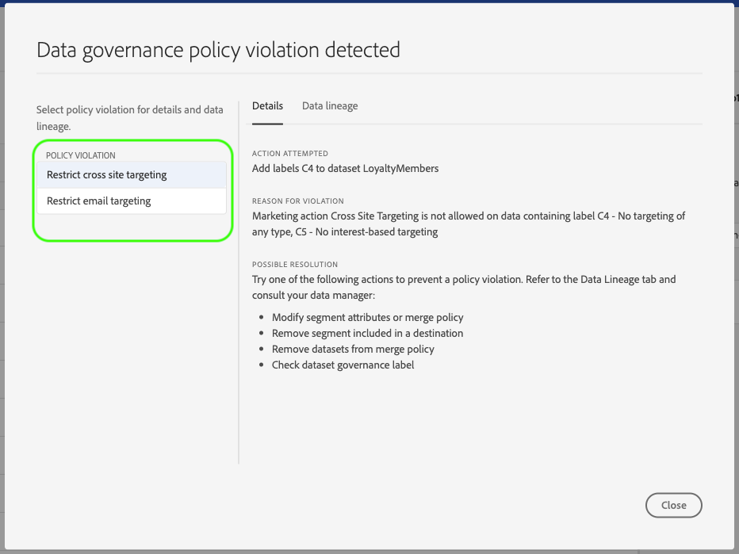

# [!DNL Data Governance] in CDP in tempo reale

[!DNL Real-time Customer Data Platform] (Real-time CDP) unisce i dati provenienti da più sistemi aziendali, consentendo agli esperti di marketing di identificare, comprendere e coinvolgere meglio i clienti. Questi dati possono essere soggetti a restrizioni d&#39;uso definite dalla tua organizzazione o dalle normative legali. Pertanto, è importante assicurarsi che la CDP in tempo reale sia conforme ai criteri di utilizzo quando si gestiscono i dati.

Adobe Experience Platform [!DNL Data Governance] consente di gestire i dati dei clienti e garantire la conformità a normative, restrizioni e criteri applicabili all&#39;uso dei dati. Questo svolge un ruolo chiave all’interno di CDP in tempo reale, consentendo di definire criteri di utilizzo, classificare i dati in base a tali criteri e verificare la presenza di violazioni dei criteri durante l’esecuzione di determinate azioni di marketing.

CDP in tempo reale è basato su Adobe Experience Platform, e la maggior parte delle [!DNL Data Governance] funzionalità sono descritte nella [!DNL Experience Platform] documentazione. Questo documento è destinato a completare la panoramica [sulla governance dei](../../data-governance/home.md) dati per [!DNL Experience Platform]e illustra le funzioni di governance disponibili in CDP in tempo reale. Vengono trattati i seguenti argomenti:

* [Applicazione di etichette di utilizzo ai dati](#labels)
* [Gestire i criteri di utilizzo dei dati](#policies)
* [Applica conformità all&#39;utilizzo dei dati](#enforce-data-usage-compliance)

## Applicazione di etichette di utilizzo ai dati {#labels}

[!DNL Data Governance] consente di applicare etichette di utilizzo ai dati, a livello di dataset o di campo dataset. Le etichette di utilizzo dei dati consentono di classificare i dati in base ai criteri di utilizzo applicati a tali dati.

Per informazioni dettagliate sull&#39;utilizzo delle etichette di utilizzo dei dati, vedere la guida [utente relativa alle etichette di uso](../../data-governance/labels/overview.md) dei dati per Adobe Experience Platform.

## Configurare i casi di utilizzo del marketing per le destinazioni {#destinations}

Puoi impostare le restrizioni di utilizzo dei dati su una destinazione definendo i casi di utilizzo del marketing (o azioni di marketing) per tale destinazione. Un caso di utilizzo marketing per una destinazione indica l&#39;intento dei dati che verranno esportati in quella destinazione.

>[!NOTE]
>
>Per ulteriori informazioni sulle azioni di marketing e il loro utilizzo nei criteri di utilizzo dei dati, consulta la panoramica [dei criteri di utilizzo](../../data-governance/policies/overview.md) dei dati nella [!DNL Experience Platform] documentazione.

La definizione dei casi di utilizzo del marketing sulle destinazioni consente di garantire che tutti i profili o i segmenti inviati a tali destinazioni siano conformi ai criteri di utilizzo dei dati. È quindi necessario aggiungere alle destinazioni i casi di utilizzo del marketing appropriati in base alle esigenze aziendali per applicare restrizioni all&#39;attivazione.

I casi di utilizzo del marketing possono essere selezionati solo quando si configura una destinazione per la prima volta. A seconda del tipo di destinazione con cui state lavorando, l’opportunità di configurare i casi di utilizzo del marketing verrà visualizzata in punti diversi del flusso di lavoro di configurazione. Consulta la documentazione [di](../destinations/destinations-overview.md) destinazione per i passaggi su come configurare una particolare destinazione.

## Gestire i criteri di utilizzo dei dati {#policies}

Affinché le etichette di utilizzo dei dati supportino efficacemente la conformità dei dati, è necessario definire e abilitare i criteri di utilizzo dei dati. I criteri di utilizzo dei dati sono regole che descrivono i tipi di azioni di marketing consentite o con cui è consentito eseguire attività sui dati all’interno di un CDP in tempo reale. Per ulteriori informazioni, consulta la sezione &quot;Criteri di utilizzo dei dati&quot; nella panoramica [!DNL Experience Platform] sulla governance dei  dati.

Adobe Experience Platform fornisce diversi criteri **** fondamentali per i casi di utilizzo più comuni dell&#39;esperienza cliente. Questi criteri possono essere visualizzati nell&#39;interfaccia utente accedendo all&#39;area di lavoro e selezionando la **[!UICONTROL Policies]** **[!UICONTROL Browse]** scheda. Per informazioni dettagliate sull&#39;utilizzo dei criteri nell&#39;interfaccia utente, consultate la guida [utente relativa ai](../../data-governance/policies/user-guide.md) criteri nella [!DNL Experience Platform] documentazione, inclusa la procedura per l&#39;elaborazione di criteri personalizzati.

## Applica conformità all&#39;utilizzo dei dati {#enforce-data-usage-compliance}

Una volta etichettati i dati e definiti i criteri di utilizzo, potete applicare la conformità dell&#39;utilizzo dei dati ai criteri. Quando si attivano segmenti di pubblico verso destinazioni in CDP in tempo reale, applica [!DNL Data Governance] automaticamente i criteri di utilizzo in caso di violazioni.

Il diagramma seguente illustra come l&#39;implementazione dei criteri è integrata nel flusso di dati dell&#39;attivazione dei segmenti:

Quando un segmento viene attivato per la prima volta, DULE [!DNL Policy Service] verifica la presenza di violazioni dei criteri in base ai seguenti fattori:

* Le etichette di utilizzo dei dati applicate ai campi e ai set di dati all’interno del segmento da attivare.
* Scopo di marketing della destinazione.

>[!NOTE]
>
>Se esistono etichette di utilizzo dei dati che sono state applicate solo a determinati campi all’interno di un set di dati (anziché all’intero set di dati), l’applicazione di tali etichette a livello di campo all’attivazione avviene solo alle seguenti condizioni:
>* I campi vengono utilizzati nella definizione del segmento.
>* I campi sono configurati come attributi proiettati per la destinazione di destinazione.

### Messaggi sulle violazioni dei criteri {#enforcement}

Se si verifica una violazione del criterio durante il tentativo di attivare un segmento (o di [apportare modifiche a un segmento](#policy-enforcement-for-activated-segments)già attivato), l&#39;azione viene impedita e viene visualizzato un puntatore che indica che sono stati violati uno o più criteri. Selezionate una violazione di criterio nella colonna a sinistra del puntatore per visualizzare i dettagli relativi a tale violazione.

La *[!UICONTROL Details]* scheda del puntatore indica l&#39;azione che ha attivato la violazione il motivo della violazione e fornisce suggerimenti per la possibile risoluzione del problema.

Fare clic **[!UICONTROL Data Lineage]** per tenere traccia delle destinazioni, dei segmenti, dei criteri di unione o dei set di dati le cui etichette dati hanno attivato la violazione.

Una volta attivata la violazione, il **[!UICONTROL Save]** pulsante viene disattivato per l&#39;attivazione fino a quando i componenti appropriati non vengono aggiornati in conformità ai criteri di utilizzo dei dati.

### Applicazione dei criteri per i segmenti attivati {#policy-enforcement-for-activated-segments}

L&#39;applicazione dei criteri continua a essere applicata ai segmenti dopo che questi sono stati attivati, limitando le modifiche a un segmento o alla sua destinazione che si tradurrebbero in una violazione dei criteri. A causa dei numerosi componenti coinvolti nell&#39;attivazione dei segmenti alle destinazioni, una delle seguenti azioni può potenzialmente determinare una violazione:

* Aggiornamento delle etichette di utilizzo dei dati
* Modifica dei set di dati per un segmento
* Modifica dei predicati dei segmenti
* Modifica delle configurazioni di destinazione

Se una delle azioni di cui sopra genera una violazione, tale azione non viene salvata e viene visualizzato un messaggio di violazione dei criteri, garantendo che i segmenti attivati continuino a rispettare i criteri di utilizzo dei dati quando vengono modificati.

## Passaggi successivi

Ora che hai introdotto le [!DNL Data Governance] funzionalità chiave su CDP in tempo reale e come [!DNL Experience Platform] le abilita, continua a consultare la [documentazione sulla governance dei dati su Adobe Experience Platform](../../data-governance/home.md). La documentazione fornisce panoramiche di [!DNL Data Governance] concetti essenziali, nonché flussi di lavoro dettagliati per la gestione di etichette e criteri di utilizzo dei dati.

Il seguente video fornisce una panoramica di CDP [!DNL Data Governance] in tempo reale, con l’utilizzo di casi di utilizzo del marketing su destinazioni e di flussi di lavoro di esempio per diversi scenari:

>[!VIDEO](https://video.tv.adobe.com/v/33631?quality=12&learn=on)