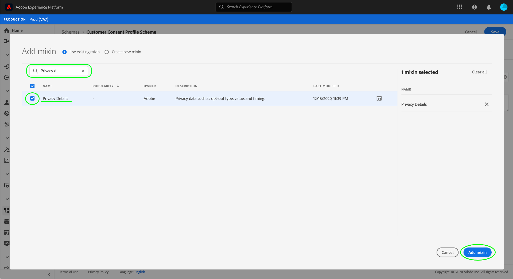
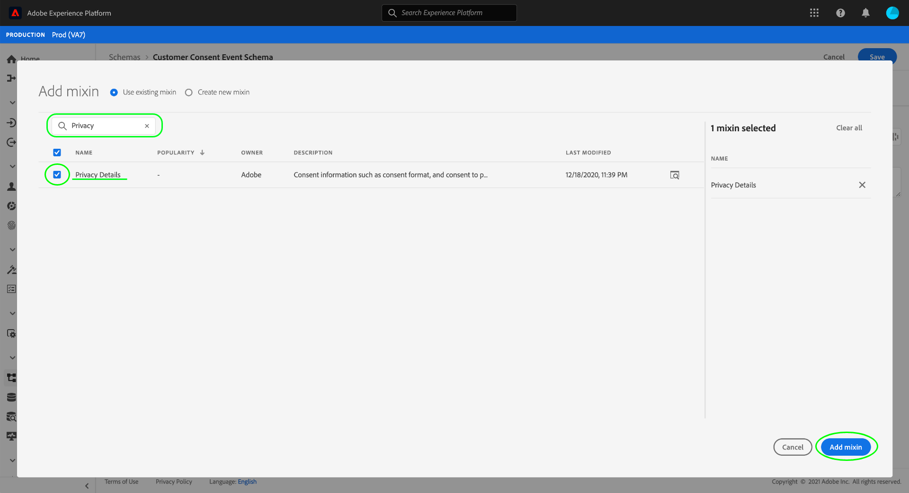

# Creazione di set di dati per l&#39;acquisizione dei dati di consenso IAB TCF 2.0

Per [!DNL Real-time Customer Data Platform] elaborare i dati di consenso dei clienti in conformità con lo IAB [!DNL Transparency & Consent Framework] (TCF) 2.0, tali dati devono essere inviati a insiemi di dati i cui schemi contengono campi di consenso TCF 2.0.

In particolare, per acquisire i dati di consenso di TCF 2.0 sono necessari due set di dati:

* Un dataset basato sulla [!DNL XDM Individual Profile] classe, abilitato per l&#39;uso in [!DNL Real-time Customer Profile].
* Un dataset basato sulla [!DNL XDM ExperienceEvent] classe.

Questo documento fornisce i passaggi per impostare questi due insiemi di dati per la raccolta dei dati di consenso IAB TCF 2.0. Per una panoramica del flusso di lavoro completo da configurare [!DNL Real-time CDP] per TCF 2.0, fare riferimento alla panoramica [sulla conformità](./overview.md)IAB TCF 2.0.

## Prerequisiti

Questa esercitazione richiede una buona conoscenza dei seguenti componenti di Adobe Experience Platform:

* [Experience Data Model (XDM)](../../../xdm/home.md): Il framework standard con cui [!DNL Experience Platform] organizzare i dati relativi all&#39;esperienza del cliente.
   * [Nozioni di base sulla composizione](../../../xdm/schema/composition.md)dello schema: Informazioni sui blocchi di base degli schemi XDM.
   * [Creare uno schema nell’interfaccia](../../../xdm/tutorials/create-schema-ui.md): Esercitazione sulle nozioni di base dell&#39;utilizzo dell&#39;Editor di schema.
* [Servizio](../../../identity-service/home.md)identità Adobe Experience Platform: Consente di collegare le identità dei clienti da origini dati diverse tra dispositivi e sistemi.
* [Profilo](../../../profile/home.md)cliente in tempo reale: Consente [!DNL Identity Service] di creare profili cliente dettagliati dai set di dati in tempo reale. [!DNL Real-time Customer Profile] estrae i dati dal Data Lake e persiste nei profili dei clienti nel proprio archivio dati separato.

## Struttura schema di consenso {#structure}

Esistono due mixaggi XDM che forniscono i campi di consenso dei clienti richiesti per il supporto di TCF 2.0: uno per i dati basati su record ([!DNL XDM Individual Profile]) e un altro per i dati basati su serie temporali ([!DNL XDM ExperienceEvent]):

| Schema | Descrizione |
| --- | --- |
| Mixaggio della privacy del profilo | Questo mixin acquisisce le preferenze di consenso correnti di un cliente. Se utilizzati in uno schema [!DNL Profile]abilitato, i valori forniti in questo mixin sono considerati come l&#39;origine di verità per quanto riguarda il modo in cui l&#39;applicazione del consenso dovrebbe applicarsi ai dati del cliente. |
| [!DNL Experience Event] miscelazione privacy | Questo mixin acquisisce le preferenze di consenso di un cliente in un dato momento. I dati acquisiti in questi campi possono essere utilizzati per tenere traccia delle modifiche nelle preferenze di consenso del cliente nel tempo. |

Anche se il caso di utilizzo di ciascun mixin è diverso, i campi specifici che forniscono sono più o meno gli stessi. Questi campi sono descritti più dettagliatamente nella sezione seguente.

### Consenso, campi misti {#privacy-mixin}

Anche se ogni mixin della privacy varia a seconda della struttura e dei tipi di campi che contiene, entrambi forniscono l&#39; `xdm:consentString` attributo, i cui sottocampi sono obbligatori per l&#39;applicazione di TCF 2.0. La struttura di questi campi è illustrata di seguito, insieme ai tipi di valori previsti:

```json
{
  "xdm:consentString": {
    "xdm:consentStandard": "IAB TCF",
    "xdm:consentStandardVersion": "2.0",
    "xdm:consentStringValue": "BObdrPUOevsguAfDqFENCNAAAAAmeAAA.PVAfDObdrA.DqFENCAmeAENCDA",
    "xdm:gdprApplies": true,
    "xdm:containsPersonalData": false
  }
}
```

| Proprietà | Descrizione |
| --- | --- |
| `xdm:consentString` | Contiene i dati di consenso aggiornati del cliente e altre informazioni contestuali. |
| `xdm:consentStandard` | Quadro di consenso a cui si applicano i dati. Per la conformità ai TCF, il valore deve essere &quot;IAB TCF&quot;. |
| `xdm:consentStandardVersion` | Numero di versione del quadro di riferimento per le autorizzazioni indicato da `xdm:consentStandard`. Per la conformità a TCF 2.0, il valore deve essere &quot;2.0&quot;. |
| `xdm:consentStringValue` | Stringa di consenso generata in base alle impostazioni di consenso selezionate del cliente. |
| `xdm:gdprApplies` | Un valore booleano che indica se il GDPR si applica o meno a questo cliente. Il valore deve essere impostato su &quot;true&quot; per consentire l&#39;applicazione di TCF 2.0. Il valore predefinito è &quot;false&quot; se non è incluso. |
| `xdm:containsPersonalData` | Valore booleano che indica se l&#39;aggiornamento del consenso contiene o meno dati personali. Il valore predefinito è &quot;false&quot; se non è incluso. |

## Creare schemi di consenso dei clienti {#create-schemas}

Nell’interfaccia utente della piattaforma, fate clic **[!UICONTROL Schemas]** nella barra di navigazione a sinistra per aprire l’ *[!UICONTROL Schemas]area di lavoro *. Da qui, seguite i passaggi descritti nelle sezioni seguenti per creare ogni schema richiesto.

>[!NOTE]
>
>Se disponete di schemi XDM esistenti che desiderate utilizzare per acquisire i dati di consenso, potete modificare tali schemi invece di crearne di nuovi. Tuttavia, quando modificate gli schemi esistenti, è importante seguire i [principi dell&#39;evoluzione](../../../xdm/schema/composition.md#evolution) dello schema per evitare di interrompere le modifiche.

### Creare uno schema di consenso basato su record {#profile-schema}

Dalla **[!UICONTROL Browse]** scheda dell&#39; *[!UICONTROL Schemas]area di lavoro *, creare un nuovo schema basato sulla**[!DNL XDM Individual Profile]classe **. Una volta aperto lo schema nell&#39;Editor schema, fare clic **[!UICONTROL Add]**sotto la *[!UICONTROL Mixins]*sezione sul lato sinistro del quadro.


Viene visualizzata *[!UICONTROL Add mixin]* la finestra di dialogo. Da qui, selezionare **[!UICONTROL Profile privacy]** dall&#39;elenco. Facoltativamente, potete utilizzare la barra di ricerca per limitare i risultati e individuare più facilmente il mixin. Dopo aver selezionato il mixin, fate clic su **[!UICONTROL Add mixin]**.



L&#39;Editor schema viene nuovamente visualizzato e consente di esaminare la struttura dei campi della stringa di consenso aggiunti.


Da qui, ripeti i passaggi indicati sopra per aggiungere allo schema i seguenti mixin aggiuntivi:

* [!UICONTROL IdentityMap]
* [!UICONTROL Data capture region for Profile]
* [!UICONTROL Profile person details]
* [!UICONTROL Profile personal details]


Se si sta modificando uno schema esistente che è già stato abilitato per l&#39;uso in [!DNL Real-time Customer Profile], fare clic **[!UICONTROL Save]** per confermare le modifiche prima di saltare alla sezione sulla [creazione di un dataset basato sullo schema](#dataset)di consenso. Se si sta creando un nuovo schema, continuare a seguire i passaggi descritti nella sottosezione seguente.

#### Abilita lo schema da utilizzare in [!DNL Real-time Customer Profile]

Per [!DNL Real-time CDP] associare i dati di consenso ricevuti a specifici profili cliente, lo schema di consenso deve essere abilitato per l&#39;uso in [!DNL Real-time Customer Profile].

>[!NOTE]
>
>Lo schema di esempio mostrato in questa sezione utilizza il relativo `identityMap` campo come identità primaria. Se desiderate impostare un altro campo come identità primaria, accertatevi di utilizzare un identificatore indiretto, come un ID cookie, e non un campo direttamente identificabile che non può essere utilizzato nella pubblicità basata sugli interessi, come un indirizzo e-mail. Consulta il tuo consulente legale se non sei sicuro di quali campi siano soggetti a restrizioni.
>
>Per informazioni su come impostare un campo di identità principale per uno schema, vedere l&#39;esercitazione [sulla creazione dello](../../../xdm/tutorials/create-schema-ui.md#identity-field)schema.

Per attivare lo schema per [!DNL Profile], fare clic sul nome dello schema nella barra a sinistra per aprire la finestra di *[!UICONTROL Schema properties]* dialogo nella barra a destra. Da qui, fate clic sul pulsante **[!UICONTROL Profile]** di attivazione/disattivazione.


Viene visualizzato un puntatore che indica un&#39;identità primaria mancante. Selezionate la casella di controllo per utilizzare un&#39;identità primaria alternativa, in quanto l&#39;identità principale sarà contenuta nel campo identityMap.

<br>

Infine, fate clic **[!UICONTROL Save]** per confermare le modifiche.


### Creare uno schema di consenso basato su serie temporali {#event-schema}

Dalla **[!UICONTROL Browse]** scheda dell&#39; *[!UICONTROL Schemas]area di lavoro *, creare un nuovo schema basato sulla**[!DNL XDM ExperienceEvent]classe **. Una volta aperto lo schema nell&#39;Editor schema, fare clic **[!UICONTROL Add]**sotto la *[!UICONTROL Mixins]*sezione sul lato sinistro del quadro.


Viene visualizzata *[!UICONTROL Add mixin]* la finestra di dialogo. Da qui, selezionare **[!UICONTROL Experience event privacy mixin]** dall&#39;elenco. Facoltativamente, potete utilizzare la barra di ricerca per limitare i risultati e individuare più facilmente il mixin. Dopo aver selezionato il mixin, fate clic su **[!UICONTROL Add mixin]**.



Nell&#39;Editor schema viene visualizzata di nuovo l&#39;area di lavoro con i campi della stringa di consenso aggiunti.


Da qui, ripeti i passaggi indicati sopra per aggiungere allo schema i seguenti mixin aggiuntivi:

* [!UICONTROL IdentityMap]
* [!UICONTROL ExperienceEvent environment details]
* [!UICONTROL ExperienceEvent web details]
* [!UICONTROL ExperienceEvent implementation details]

Una volta aggiunti i mixin, terminare facendo clic **[!UICONTROL Save]**.


## Creazione di set di dati basati sugli schemi di consenso {#datasets}

Per ciascuno degli schemi richiesti precedentemente descritti, è necessario creare un set di dati che acquisisca in ultima istanza i dati di consenso dei clienti. Il set di dati basato sullo [!DNL XDM Individual Profile] schema deve essere abilitato per [!DNL Real-time Customer Profile], mentre il set di dati basato sullo [!DNL XDM ExperienceEvent] schema non deve essere [!DNL Profile]abilitato.

Per iniziare, selezionate **[!UICONTROL Datasets]** nella navigazione a sinistra, quindi fate clic **[!UICONTROL Create dataset]** nell&#39;angolo in alto a destra.


Nella pagina successiva, selezionate **[!UICONTROL Create dataset from schema]**.


Viene _[!UICONTROL Create dataset from schema]_visualizzato il flusso di lavoro, a partire dal_[!UICONTROL Select schema]_ passaggio. Nell&#39;elenco fornito, individuare uno degli schemi di consenso creati in precedenza. Facoltativamente, è possibile utilizzare la ricerca per limitare i risultati e individuare più facilmente lo schema. Fare clic sul pulsante di scelta accanto allo schema per selezionarlo, quindi fare clic **[!UICONTROL Next]** per continuare.


Viene _[!UICONTROL Configure dataset]_visualizzato il passaggio. Specifica un nome e una descrizione univoci e facilmente identificabili per il dataset prima di fare clic su **[!UICONTROL Finish]**.


Viene visualizzata la pagina dei dettagli per il set di dati appena creato. Se il set di dati è basato sullo [!DNL XDM ExperienceEvent] schema, il processo è completo. Se il set di dati è basato sullo [!DNL XDM Individual Profile] schema, il passaggio finale del processo consiste nell&#39;abilitare il set di dati per l&#39;uso in [!DNL Real-time Customer Profile]. Nella barra a destra, fate clic sul pulsante di **[!UICONTROL Profile]** attivazione/disattivazione per attivare il set di dati.


Per creare l&#39;altro set di dati necessario per la conformità a TCF 2.0, eseguite nuovamente i passaggi indicati sopra.

## Passaggi successivi

Seguendo questa esercitazione, hai creato due set di dati che ora possono essere utilizzati per raccogliere i dati di consenso dei clienti:

* Un set di dati [!DNL Profile]abilitato basato sullo [!DNL XDM Individual Profile] schema.
* Un dataset basato sullo [!DNL XDM ExperienceEvent] schema per il quale non è abilitata [!DNL Profile].

È ora possibile tornare alla panoramica [](./overview.md#merge-policies) IAB TCF 2.0 per continuare il processo di configurazione [!DNL Real-time CDP] per la conformità a TCF 2.0.