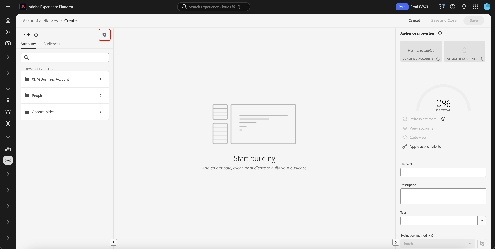
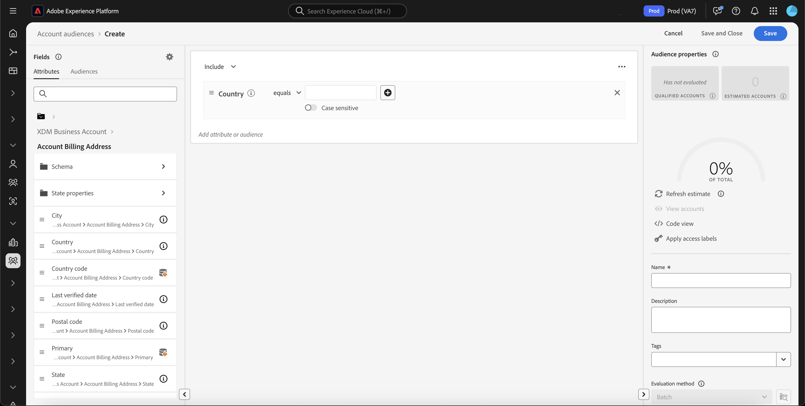
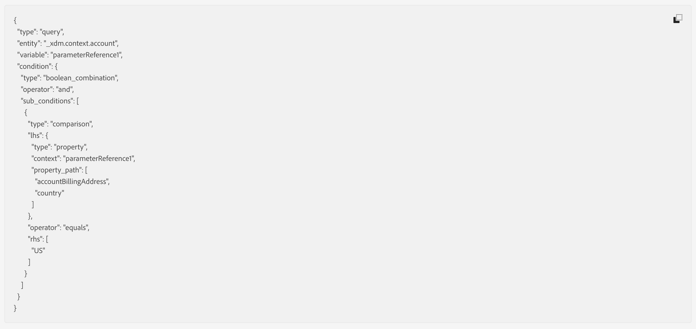

# Audience Builder in Real-Time Customer Data Platform

Basato su Adobe Experience Platform, [!DNL Adobe Real-Time Customer Data Platform] può utilizzare tutte le funzionalità di Audience Builder che fanno parte di [!DNL Experience Platform]. L’area di lavoro fornisce controlli intuitivi per la creazione e la modifica di regole, ad esempio le tessere trascinate utilizzate per rappresentare le proprietà dei dati.

{zoomable="yes"}

## Campi {#fields}

>[!CONTEXTUALHELP]
>id="platform_b2b_audiencebuilder_showfullxdmschema"
>title="Mostra schema XDM completo"
>abstract="Per impostazione predefinita, vengono visualizzati solo i campi che contengono dati. Abilita questa opzione per mostrare tutti i campi nello schema XDM."

>[!CONTEXTUALHELP]
>id="platform_b2b_audiencebuilder_showrelationselectors"
>title="Mostra selettori di relazioni"
>abstract="Per impostazione predefinita, vengono utilizzate le relazioni standard della tua organizzazione. Abilita questa opzione per mostrare i selettori di relazione utilizzati."

>[!CONTEXTUALHELP]
>id="platform_b2b_audiencebuilder_showconstrainedfields"
>title="Mostra campi vincolati"
>abstract="Per impostazione predefinita, vengono visualizzati solo i campi privi di vincoli. Abilita questa opzione per mostrare i campi con vincoli."

Quando utilizzi Audience Builder per gli account, puoi utilizzare gli attributi dell’account o i tipi di pubblico esistenti come campi del pubblico.

È possibile selezionare l&#39;icona  per modificare le impostazioni per i campi visualizzati.

{zoomable="yes"}

>[!NOTE]
>
>La sezione **[!UICONTROL Field options]** è attualmente in versione beta ed è disponibile solo per alcuni clienti. Per ulteriori informazioni, contatta l’Assistenza clienti di Adobe.

Viene visualizzata la sezione [!UICONTROL Settings]. In questa sezione è possibile aggiornare i campi visualizzati e la relazione tra di essi.

Per **[!UICONTROL Field options]**, è possibile visualizzare solo i campi che contengono dati o lo schema XDM completo.

Per **[!UICONTROL Relationship of fields]** è possibile utilizzare le relazioni standard per l&#39;organizzazione oppure visualizzare i selettori di relazioni.

{width="300"}

### Attributi {#attributes}

La scheda [!UICONTROL Attributes] consente di sfogliare gli attributi dell&#39;account appartenenti alla classe dell&#39;account aziendale XDM, nonché gli attributi basati su opportunità e persone. Ogni cartella può essere espansa per visualizzare attributi aggiuntivi, dove ogni attributo è una sezione che può essere trascinata nell&#39;[area di lavoro del generatore di regole](#rule-builder-canvas) al centro dell&#39;area di lavoro.

Quando selezioni un attributo, puoi visualizzare i dati di riepilogo selezionando l&#39;[icona informazioni](../../images/icons/info.png). I dati di riepilogo includono informazioni quali i primi valori, una spiegazione di cosa è il campo e la percentuale di conti che contengono i valori per questo attributo.

{width="300"}

Se un attributo viene popolato da meno del 25% degli account, verrà visualizzata l&#39;icona . Gli stessi dati di riepilogo vengono visualizzati per l’attributo, indipendentemente da.

{width="300"}

>[!NOTE]
>
>I dati di riepilogo sono disponibili solo se l’attributo appartiene allo schema Account, Persona o Opportunità. Inoltre, i primi valori vengono visualizzati solo se il campo **non** contiene troppi valori diversi e se i valori di tali campi sono comunemente ripetuti.
>
>Questi dati di riepilogo vengono aggiornati **ogni giorno**.

Per una guida più dettagliata su Audience Builder, consulta la [guida utente di Audience Builder](../../segmentation/ui/segment-builder.md){target="_blank"}.

### Tipi di pubblico {#audiences}

Nella scheda **[!UICONTROL Audiences]** sono elencati tutti i tipi di pubblico basati su persone e account disponibili in Experience Platform.

Puoi passare il cursore del mouse sull&#39; accanto a un pubblico per visualizzare informazioni sul pubblico, tra cui l&#39;ID, la descrizione e la gerarchia delle cartelle per individuare il pubblico.

{zoomable="yes"}

## Area di lavoro del generatore di regole {#rule-builder-canvas}

Un pubblico creato in Audience Builder è una raccolta di regole utilizzate per descrivere caratteristiche o comportamenti chiave di un pubblico target. Queste regole vengono create utilizzando l’area di lavoro del generatore di regole, che si trova al centro di Audience Builder.

Per aggiungere una nuova regola alla definizione del segmento, trascina un riquadro dalla scheda **[!UICONTROL Fields]** e rilascialo nell&#39;area di lavoro del generatore di regole.

{zoomable="yes"}

Per ulteriori informazioni sull&#39;utilizzo dell&#39;area di lavoro del generatore di regole, leggere la [documentazione del Generatore di segmenti](../../segmentation/ui/segment-builder.md#rule-builder-canvas){target="_blank"}.

### Contenitori {#containers}

Le regole del pubblico vengono valutate nell’ordine in cui sono elencate. Puoi utilizzare i contenitori per consentire un maggiore controllo sull’ordine di esecuzione, tramite l’utilizzo di query nidificate.

Per ulteriori informazioni sui contenitori, consulta la [documentazione del Generatore di segmenti](../../segmentation/ui/segment-builder.md#containers){target="_blank"}.

## Proprietà pubblico {#properties}

Nella sezione **[!UICONTROL Audience properties]** vengono visualizzate informazioni sul pubblico, inclusa una stima della dimensione del pubblico. Puoi anche specificare dettagli sul pubblico, tra cui nome, descrizione e tag.

{width="300"}

**[!UICONTROL Qualified accounts]** indica il numero effettivo di account che corrispondono alle regole del pubblico. Questo numero viene aggiornato ogni 24 ore, dopo l’esecuzione del processo di segmentazione.

**[!UICONTROL Estimated accounts]** indica il numero approssimativo di account in base al processo di esempio. È possibile aggiornare questo valore dopo aver aggiunto nuove regole o condizioni e aver selezionato **[!UICONTROL Refresh estimate]**.

{width="300"}

È possibile selezionare **[!UICONTROL View accounts]** per visualizzare un campione degli account idonei per il pubblico con le regole correnti.

{width="300"}

**[!UICONTROL Code view]** fornisce una descrizione testuale del codice delle regole del pubblico.

È possibile selezionare **[!UICONTROL Apply access labels]** per applicare le etichette di accesso pertinenti per il pubblico. Ulteriori informazioni sulle etichette di accesso sono disponibili nella [guida gestione etichette](../../access-control/abac/ui/labels.md){target="_blank"}.

Il resto della sezione delle proprietà del pubblico consente di modificare i dettagli relativi al pubblico dell’account, tra cui il nome, la descrizione e i tag.

{width="300"}

**impossibile** modificare il metodo di valutazione per i tipi di pubblico dell&#39;account, poiché tutti i tipi di pubblico dell&#39;account vengono valutati utilizzando la segmentazione batch.

## Passaggi successivi {#next-steps}

Audience Builder offre un flusso di lavoro avanzato che consente di creare tipi di pubblico dai dati dell’account aziendale XDM.

Per ulteriori informazioni sul servizio di segmentazione per i dati del profilo cliente, consulta la [panoramica del servizio di segmentazione](../../segmentation/home.md){target="_blank"}.
