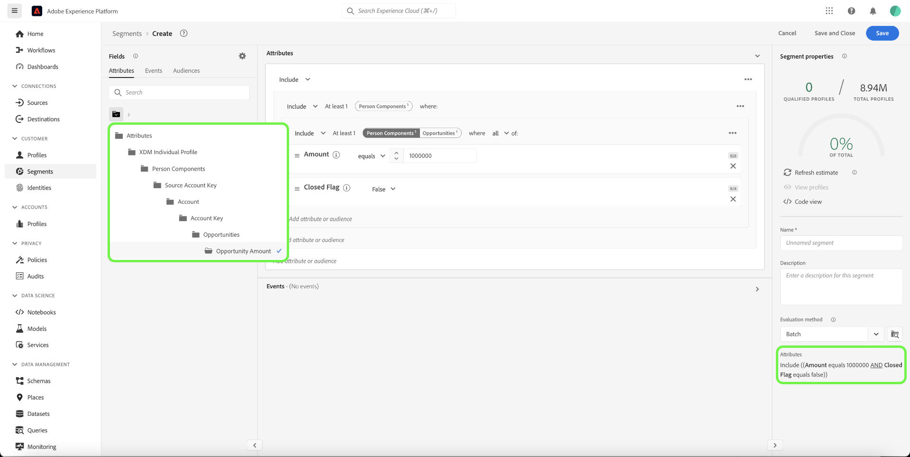
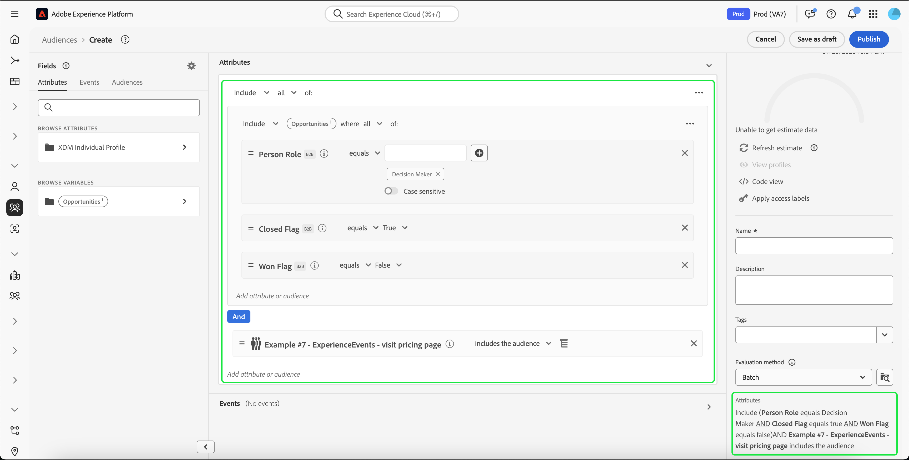

# Casi di utilizzo della segmentazione per Real-Time Customer Data Platform B2B edition

Questo documento fornisce esempi di definizioni di segmenti in Adobe Real-Time Customer Data Platform B2B edition e di come diversi tipi di attributi possono essere combinati per i casi d’uso B2B comuni. Per comprendere come le destinazioni si adattano al flusso di lavoro B2B, consulta l&#39;[esercitazione end-to-end](../b2b-tutorial.md#create-a-segment-to-evaluate-your-data).

>[!NOTE]
>
>Gli attributi necessari per questi casi di utilizzo della segmentazione sono disponibili solo per i clienti di Real-Time Customer Data Platform B2B edition. Se non utilizzi Real-Time Customer Data Platform B2B edition, consulta invece la [panoramica sulla segmentazione](./segmentation-overview.md).

>[!BEGINSHADEBOX]

## Modifica criterio di unione

Come parte degli aggiornamenti all’architettura di Real-Time CDP B2B edition, i tipi di pubblico con più entità con attributi B2B ora supportano un solo criterio di unione (il criterio di unione predefinito), anziché più criteri di unione. Inoltre, le modifiche in cui i profili possono qualificarsi per i tipi di pubblico possono influire sui flussi di lavoro a valle come l’attivazione, l’orchestrazione del percorso e il targeting delle campagne. Si consiglia di effettuare le seguenti operazioni per assicurarsi che i dati funzionino come previsto:

- Rivedi e testa eventuali tipi di pubblico che si basano su una logica di unione non predefinita per comprendere i potenziali impatti di questo aggiornamento.
- Rivaluta i criteri di qualificazione del pubblico per i tipi di pubblico chiave per capire se le modifiche nella logica di unione possono influire sulle qualifiche.
- Monitora i risultati dell’attivazione per rilevare eventuali spostamenti nei risultati del pubblico causati dalla modifica del criterio di unione.

>[!ENDSHADEBOX]

## Prerequisiti {#prerequisites}

Prima di poter utilizzare gli attributi di segmentazione per le classi B2B, è necessario completare i passaggi seguenti:

1. Creare schemi che utilizzano le classi B2B. Le classi B2B edition includono Account, Campaign, Opportunità, Elenco marketing e altro ancora. Per informazioni su [come impostare gli schemi da utilizzare con le classi B2B](../schemas/b2b.md), vedere la documentazione dello schema.
2. Crea relazioni tra gli schemi B2B di Experience Data Model (XDM). I tipi di pubblico basati sugli attributi di B2B edition richiedono relazioni tra le classi per utilizzare appieno la funzionalità di segmentazione B2B estesa. Per ulteriori informazioni, consulta la documentazione su [come definire una relazione tra due schemi B2B](../../xdm/tutorials/relationship-b2b.md).
3. Acquisire dati utilizzando set di dati basati sugli schemi B2B. Consulta la documentazione sulle origini per [informazioni su come acquisire i dati](../../sources/connectors/adobe-applications/marketo/marketo.md).
4. Leggi la [guida utente di Segment Builder](../../segmentation/ui/segment-builder.md) per informazioni più dettagliate su come creare tipi di pubblico.

Una volta soddisfatti questi requisiti, puoi combinare questi attributi per i casi d’uso B2B comuni.

## Introduzione {#getting-started}

Una volta che gli schemi di unione per le classi B2B hanno relazioni stabilite e sono stati utilizzati per acquisire i dati, i loro attributi sono resi disponibili nella barra a sinistra del Generatore di segmenti.

Alle classi B2B e ai relativi attributi viene aggiunta un&#39;etichetta `B2B` nell&#39;area di lavoro Segmentazione per differenziarle da quelle disponibili come standard in Real-Time Customer Data Platform.

Per creare in modo efficace tipi di pubblico per i casi di utilizzo B2B, è importante avere una conoscenza approfondita dello schema e comprendere l’aspetto del modello di dati. È inoltre utile essere a conoscenza del percorso che i dati traggono da un oggetto dati a un altro.

L’immagine seguente illustra le relazioni tra le classi B2B disponibili in Real-Time CDP B2B edition.

Poiché il modello dati può essere complicato, puoi utilizzare l’interfaccia utente di Platform per visualizzare una rappresentazione visiva più dettagliata del modello dati per trovare gli attributi rilevanti per il caso d’uso. Per iniziare, passa all’interfaccia utente di Platform e seleziona Schemi nel menu di navigazione a sinistra.

Seleziona lo schema appropriato dall&#39;elenco disponibile e seleziona la relazione appropriata dalla barra laterale [!UICONTROL Composizione]. Nell’esempio seguente, selezionando la relazione &quot;Person&quot; (Persona), viene mostrato quale attributo nello schema corrente fa riferimento allo schema &quot;Person&quot; correlato (se si tratta dello schema di origine nella relazione) oppure allo schema &quot;Person&quot; (se si tratta dello schema di riferimento nella relazione).

Questa relazione si riflette nel Generatore di segmenti tramite l&#39;utilizzo di `Key` cartelle, come illustrato nell&#39;immagine seguente.

Per ulteriori informazioni sulle classi B2B disponibili, fare riferimento agli [schemi nella documentazione di Real-Time Customer Data Platform B2B edition](../schemas/b2b.md).

I casi d’uso riportati di seguito forniscono informazioni sulle classi utilizzate per stabilire relazioni tra i diversi schemi al fine di ottenere questi risultati. Questi esempi possono essere utilizzati per creare tipi di pubblico personalizzati.

## Esempi di diversi casi di utilizzo della segmentazione {#use-cases}

I seguenti casi d’uso sono disponibili per la segmentazione con B2B edition. Ogni esempio fornisce una descrizione di ciò che il pubblico fa e una descrizione delle classi utilizzate per crearle. Le immagini fornite evidenziano il percorso del file nella barra laterale [!UICONTROL Attributi] che riflette la struttura dello schema. La sezione [!UICONTROL Proprietà segmento] a destra della visualizzazione contiene un raggruppamento scritto degli attributi del pubblico.

### Esempio 1: trovare &quot;responsabili decisionali&quot; per le opportunità B2B {#find-decision-maker}

Trova tutte le persone che sono &quot;Responsabili delle decisioni&quot; di qualsiasi opportunità. Questo pubblico richiede un collegamento tra la classe [!UICONTROL Profilo individuale XDM] e la classe [!UICONTROL Relazione persona opportunità di business XDM].

### Esempio 2: trovare profili B2B assegnati a opportunità per un determinato importo in dollari {#find-opportunities-amount}

Trova tutte le persone che sono direttamente assegnate a qualsiasi opportunità la cui quantità di opportunità è superiore all&#39;importo specificato (1 milione di dollari). Questo pubblico richiede un collegamento tra la classe [!UICONTROL Profilo individuale XDM], [!UICONTROL Relazione persona opportunità di business XDM] e la classe [!UICONTROL Opportunità di business XDM].

### Esempio 3: trovare profili B2B assegnati alle opportunità per posizione {#find-opportunities-location}

Trova tutte le persone che sono assegnate direttamente alle opportunità in cui l’account si trova in una determinata posizione (Canada). Questo pubblico richiede un collegamento tra la classe [!UICONTROL Profilo individuale XDM], la classe [!UICONTROL Relazione persona opportunità di business XDM], la classe [!UICONTROL Opportunità di business XDM] e la classe [!UICONTROL Account di business XDM].

### Esempio 4: trovare &quot;decision-maker&quot; per le opportunità in base al settore e al comportamento di navigazione {#find-industry-browsing-behavior}

Trova tutte le persone che sono &quot;Responsabili decisionali&quot; di qualsiasi opportunità in cui l’account si trova nel settore &quot;Finanza&quot; e hanno visitato la pagina dei prezzi negli ultimi tre giorni.

Per creare questo pubblico, devi utilizzare &quot;segmenti di segmenti&quot; creando un pubblico di base per tutte le persone che hanno visitato la pagina dei prezzi negli ultimi tre giorni.

Dopo aver creato il primo pubblico, puoi combinarlo con un altro pubblico di persone che sono &quot;decisori&quot; di qualsiasi opportunità in cui l’account si trova nel settore &quot;Finanza&quot;.

### Esempio 5: trovare profili B2B per le opportunità in base al nome del reparto e all’importo dell’opportunità {#find-department-opportunity-amount}

Trova tutte le persone che lavorano nel reparto Risorse Umane (HR) e dispongono di un account con almeno un&#39;opportunità aperta del valore specificato (1 milione di dollari) o superiore. Questo pubblico richiede un collegamento tra la classe [!UICONTROL Profilo individuale XDM], [!UICONTROL Account aziendale XDM] e la classe [!UICONTROL Opportunità aziendale XDM].

### Esempio 6: trovare profili B2B per qualifica professionale e ricavi del conto annuale {#find-by-job-title-and-revenue}

Trova tutte le persone il cui titolo lavorativo è Vice Presidente e hanno un account con ricavi annuali pari o superiori a un determinato importo (100 milioni di dollari) e hanno visitato la pagina dei prezzi almeno 3 volte nell’ultimo mese. Questo pubblico richiede un collegamento tra la classe [!UICONTROL XDM Individual Profile], [!UICONTROL XDM Business Account] e [!UICONTROL XDM ExperienceEvent].

### Esempio 7: trovare i &quot;responsabili decisionali&quot; in base allo stato dell’opportunità e al comportamento di navigazione {#find-by-opportunity-status-and-browsing-behavior}

Trova tutte le persone che sono &quot;responsabili decisionali&quot; di qualsiasi opportunità persa e hanno visitato la pagina dei prezzi negli ultimi tre giorni.

Per creare questo pubblico, devi utilizzare &quot;segmenti di segmenti&quot; creando un pubblico di base per tutte le persone che hanno visitato la pagina dei prezzi negli ultimi tre giorni.

Dopo aver creato il primo pubblico, puoi combinarlo con un altro pubblico di persone che sono &quot;responsabili delle decisioni&quot; di qualsiasi opportunità in cui sia &quot;Contrassegno chiuso&quot; è impostato su true che &quot;Contrassegno perso&quot; è impostato su false.

### Esempio 8: utilizzare account correlati per espandere la portata della segmentazione {#related-accounts}

Trova tutte le persone che lavorano in un reparto Risorse Umane e sono correlate a qualsiasi account *o a uno qualsiasi degli account correlati dell&#39;account* che dispone di almeno un&#39;opportunità aperta del valore specificato ($1 milione) o superiore. Questo pubblico richiede un collegamento tra la classe [!UICONTROL Profilo individuale XDM], [!UICONTROL Account aziendale XDM] e la classe [!UICONTROL Opportunità aziendale XDM].

### Esempio 9: utilizzare i punteggi dei lead e/o dei conti per qualificare il profilo {#account-scoring}

Trova tutti i profili con un punteggio di lead superiore a 80.

### Esempio 10: trova profili B2B associati a conti la cui organizzazione principale genera ricavi per un determinato importo in dollari {#find-parent-org-amount}

Trova tutte le persone associate ad account la cui organizzazione principale ha un ricavo maggiore dell&#39;importo specificato ($ 100.000.000).

### Esempio 11: trovare profili B2B per posizione lavorativa e nome account con una relazione attiva {#find-by-job-title-and-account-name}

Trova tutte le persone che sono &quot;Manager&quot; sull’account &quot;Acme&quot;, dove la relazione dell’account è &quot;Attiva&quot;.

### Esempio 12: trova profili B2B destinati a campagne in cui il costo effettivo supera il costo preventivato {#find-actualcost-exceed-budgetcost}

Trova tutte le persone target delle campagne in cui il costo effettivo ha superato il costo preventivato.

### Esempio 13: trovare profili B2B appartenenti a un elenco statico di Marketo e isDeleted=false {#find-marketo-static-list}

Trova tutte le persone appartenenti all’elenco statico di Marketo &quot;Utenti dell’anniversario&quot; dove isDeleted=false.

<!-- 
### Example 14: Find "decision makers" by opportunity status using streaming or edge segmentation {#find-decision-makers-personalization}

>[!NOTE]
>
>This example uses **streaming or edge** segmentation, as opposed to batch segmentation.

Find all the people who are a "Decision Maker" of any closed-lost opportunity and visited the pricing page in the last 24 hours. This example can be evaluated using streaming or edge segmentation, to support more real-time use cases.

To create this audience, you must use "segment of segments" by creating a base audience of all the people who visited the pricing page in the last 24 hours.

After creating the first audience, you can combine that with another audience of  people who are a "Decision Maker" of any opportunity where both the "Closed Flag" is set to true and the "Lost Flag" is set to false.

 -->

## Passaggi successivi {#next-steps}

Dopo aver letto questa panoramica, ora conosci le possibilità di segmentazione disponibili tramite Real-Time CDP, B2B edition. Per ulteriori informazioni sul servizio di segmentazione, consulta la [documentazione sulla segmentazione](../../segmentation/home.md).
