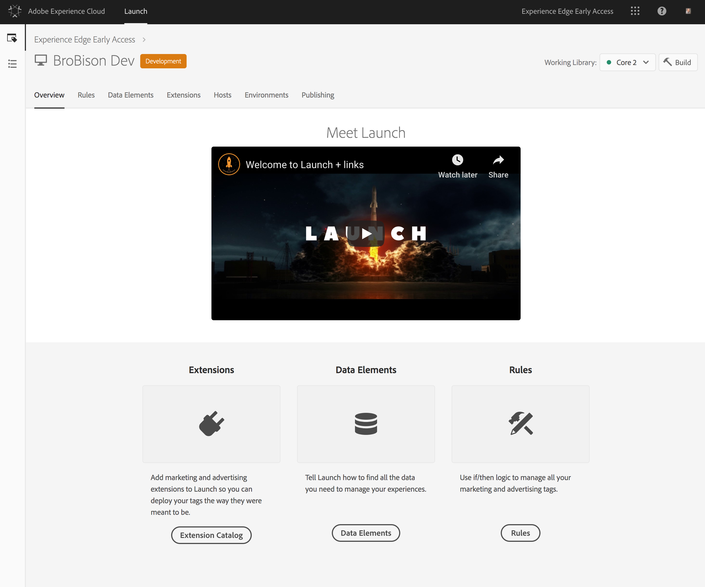

# Esercitazione: Implementare i tag dei siti Web con  lancio Adobe

Questa esercitazione spiega come implementare i tag del sito Web per inviare i dati ad Adobe Experience Platform tramite  Adobe Launch.

## Prerequisiti

* Lo schema e il dataset necessari vengono creati in [!DNL Platform].
* La configurazione necessaria è stata implementata in Experience Edge e ha l&#39;ID di configurazione e il dominio Edge corrispondenti.
* La società CMS è già stata configurata per distribuire un oggetto JavaScript su ogni pagina con i dati da inviare alla piattaforma.

## Passaggi

Questa esercitazione contiene i passaggi seguenti:

1. Installate l&#39;estensione Adobe Experience Platform [!DNL Web SDK].
1. Crea una regola per indicare [!DNL Launch] quali dati inviare.
1. Create un bundle dell&#39;estensione e della regola in una libreria.

## Installare l&#39;estensione Adobe Experience Platform [!DNL Web SDK]

Innanzitutto, installate l&#39;estensione Adobe Experience Platform [!DNL Web SDK].

1. In [!DNL Launch] , apri la scheda **[!UICONTROL Extensions]**.

   

1. Selezionate l’estensione Adobe Experience Platform Web SDK dal Catalogo estensioni Launch
Viene visualizzata la schermata di configurazione.

   

   Per ulteriori informazioni, vedere [Estensioni](https://docs.adobe.com/content/help/en/launch/using/reference/manage-resources/extensions/overview.html) nella [!DNL Launch] documentazione.

1. Configura l&#39;estensione.

   Le uniche impostazioni necessarie al momento sono:

   * **ID configurazione:** specifica l’ID di configurazione ottenuto dal rappresentante del Adobe .
   * **Dominio Edge:** specifica il dominio periferico ottenuto dal rappresentante del Adobe .

1. Selezionare **[!UICONTROL Save]** e continuare fino al passaggio successivo.

## Crea una regola per indicare a [!DNL Launch] quali dati inviare

Quindi, create una regola per fare in modo che [!DNL Launch] sappia quali dati inviare ad Adobe Experience Platform e quando inviarlo.

1. Nella scheda **[!UICONTROL Rules]**, configurate un evento che verrà attivato su ogni nuova pagina del sito Web quando viene caricata la libreria [!DNL Launch].

   

1. Aggiungi un&#39;azione.

   Per configurare l&#39;azione, indicare a [!DNL Launch] dove trovare il livello dati. Il livello dati è un oggetto JavaScript esistente sulla pagina, che viene distribuito dallo stesso CMS che esegue il rendering della pagina Web. Fornire il percorso JavaScript all&#39;oggetto dati.

   

   L&#39;oggetto dati inviato deve essere un XDM valido che trasmette la convalida rispetto allo schema utilizzato dal set di dati connesso all&#39;ID di configurazione.

1. Seleziona **[!UICONTROL Keep Changes]**.

Per ulteriori informazioni, vedere [Regole](https://docs.adobe.com/content/help/en/launch/using/reference/manage-resources/rules.html) nella documentazione [!DNL Launch].

## Eseguire il bundle dell&#39;estensione e della regola in una libreria

Successivamente, [raggruppare l&#39;estensione](https://docs.adobe.com/content/help/en/launch/using/reference/publish/overview.html) e la nuova regola in una libreria e sottoporre a test tali modifiche in un ambiente di sviluppo.

Dopo aver completato il test, promuovi la libreria attraverso il flusso di lavoro in modo che possa essere distribuita sul sito Produzione. I dati ora scorrono da ogni singolo utente ad Adobe Experience Platform.

Per ulteriori informazioni, vedere [Librerie](https://docs.adobe.com/content/help/en/launch/using/reference/publish/libraries.html) nella documentazione di [!DNL Launch].