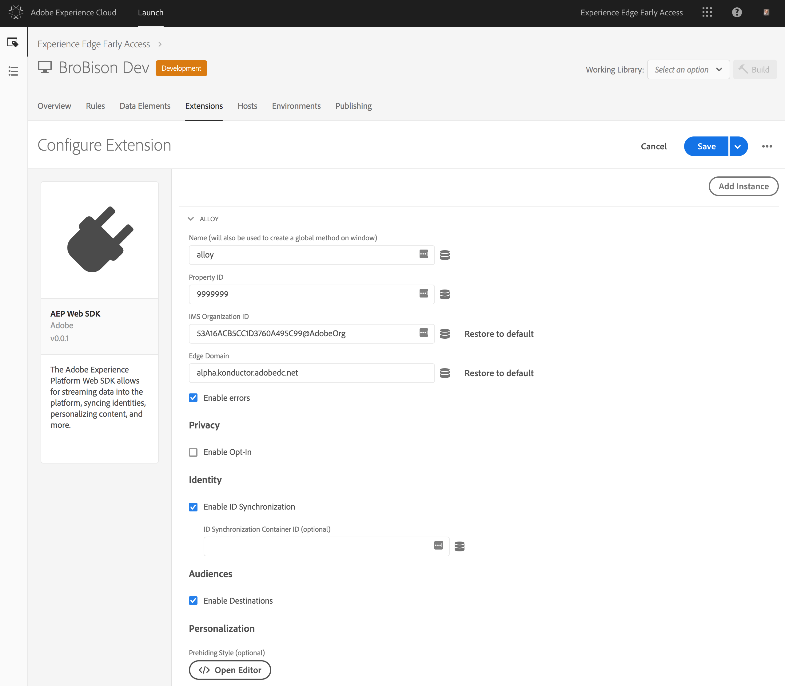
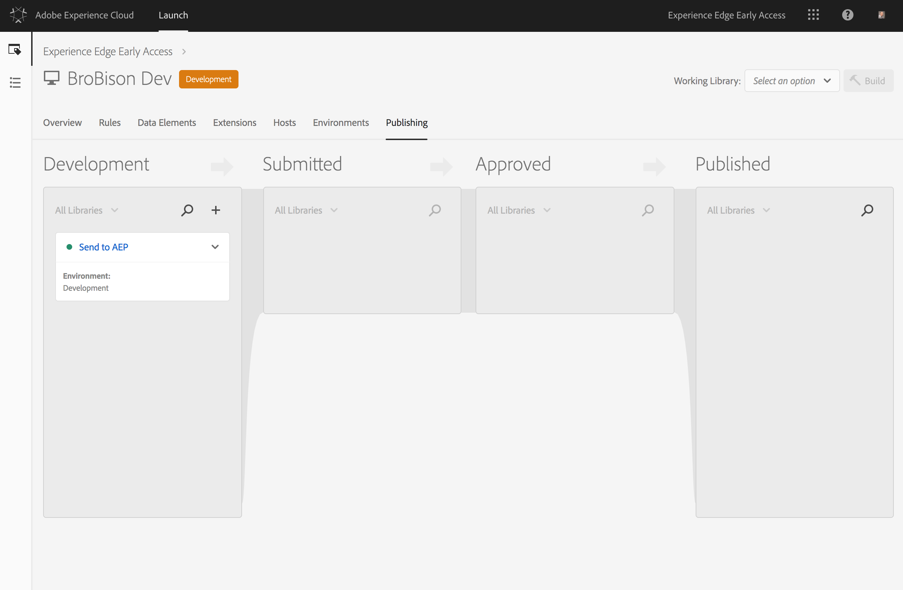

# Esercitazione: Implementare i tag dei siti Web con Adobe Launch

Questa esercitazione spiega come implementare i tag del sito Web per inviare dati ad Adobe Experience Platform utilizzando Adobe Launch.

## Prerequisiti

* Lo schema e il dataset necessari vengono creati in Piattaforma.
* La configurazione necessaria è stata implementata in Experience Edge e ha l&#39;ID di configurazione e il dominio Edge corrispondenti.
* La società CMS è già stata configurata per distribuire un oggetto JavaScript su ogni pagina con i dati da inviare alla piattaforma.

## Passaggi

Questa esercitazione contiene i passaggi seguenti:

1. Installa l’estensione SDK Web per Adobe Experience Platform.
1. Crea una regola per indicare a Launch quali dati inviare.
1. Create un bundle dell&#39;estensione e della regola in una libreria.

## Installare l’estensione SDK Web di Adobe Experience Platform

Innanzitutto, installa l’estensione Adobe Experience Platform Web SDK.

1. In Launch, apri la scheda **[!UICONTROL Extensions]**.

   

1. Selezionate l’estensione SDK Web per Adobe Experience Platform dal catalogo delle estensioni LaunchViene visualizzata la schermata di configurazione.

   

   Per ulteriori informazioni, consulta [Estensioni](https://docs.adobe.com/content/help/en/launch/using/reference/manage-resources/extensions/overview.html) nella documentazione di Launch.

1. Configura l&#39;estensione.

   Le uniche impostazioni necessarie al momento sono:

   * **ID configurazione:** Specificate l&#39;ID di configurazione ricevuto dal rappresentante Adobe.
   * **Dominio Edge:** Specificate il dominio periferico ricevuto dal rappresentante Adobe.

1. Fate clic **[!UICONTROL Save]** e continuate con il passaggio successivo.

## Crea una regola per indicare a Launch quali dati inviare

Quindi, crea una regola per far sapere a Launch quali dati vuoi inviare ad Adobe Experience Platform e quando vuoi inviarli.

1. Nella **[!UICONTROL Rules]** scheda, configurate un evento che verrà attivato su ogni nuova pagina del sito Web al caricamento della libreria Lancio.

   

1. Aggiungi un&#39;azione.

   Per configurare l’azione, indicate a Launch dove trovare il livello dati. Il livello dati è un oggetto JavaScript esistente sulla pagina, che viene distribuito dallo stesso CMS che esegue il rendering della pagina Web. Fornire il percorso JavaScript all&#39;oggetto dati.

   

   L&#39;oggetto dati inviato deve essere un XDM valido che trasmette la convalida rispetto allo schema utilizzato dal set di dati connesso all&#39;ID di configurazione.

1. Fai clic su **[!UICONTROL Keep Changes]**.

Per ulteriori informazioni, consulta [Regole](https://docs.adobe.com/content/help/en/launch/using/reference/manage-resources/rules.html) nella documentazione di Launch.

## Eseguire il bundle dell&#39;estensione e della regola in una libreria

Quindi, [raggruppate l&#39;estensione](https://docs.adobe.com/content/help/en/launch/using/reference/publish/overview.html) e la nuova regola in una libreria e verificate le modifiche in un ambiente di sviluppo.

Dopo aver completato il test, promuovi la libreria attraverso il flusso di lavoro in modo che possa essere distribuita sul sito Produzione. I dati ora scorrono da ogni singolo utente ad Adobe Experience Platform.

Per ulteriori informazioni, consulta [Librerie](https://docs.adobe.com/content/help/en/launch/using/reference/publish/libraries.html) nella documentazione di Launch.