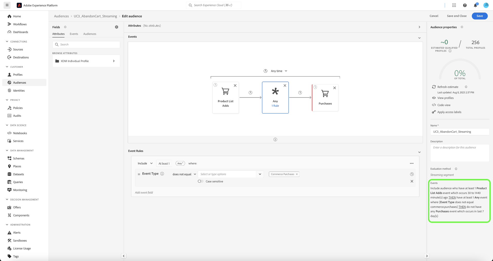

# Coinvolgi di nuovo i tuoi clienti in modo intelligente per tornare

Il ricoinvolgimento intelligente consente di impostare una campagna di drip cross-channel personalizzata per convincere i clienti a eseguire un’azione particolare. La campagna di nudging è destinata a funzionare per un periodo di tempo limitato, che include l’invio di clienti che hanno mostrato e-mail, SMS e annunci a pagamento intenzionali. Una volta che il cliente ha intrapreso l’azione appropriata, la campagna nudge terminerà immediatamente.

## Prerequisiti e pianificazione {#prerequisites-and-planning}

Man mano che completi i passaggi per implementare il caso d’uso, utilizzerai le seguenti funzionalità di Real-Time CDP ed elementi dell’interfaccia utente (elencati nell’ordine in cui verranno utilizzati). Verificare di disporre delle autorizzazioni di controllo dell&#39;accesso basate su attributi necessarie per tutte queste aree o richiedere all&#39;amministratore di sistema di concedere le autorizzazioni necessarie.

* [Adobe Real-time Customer Data Platform (Real-Time CDP)](https://experienceleague.adobe.com/docs/platform-learn/tutorials/rtcdp/understanding-the-real-time-customer-data-platform.html) - Aggrega i dati tra le diverse origini dati per alimentare la campagna. Questi dati vengono quindi utilizzati per creare i tipi di pubblico della campagna e far emergere elementi di dati personalizzati utilizzati nell’e-mail e nelle tessere delle promozioni web (ad esempio, nome o informazioni relative all’account). CDP viene utilizzato anche per attivare i tipi di pubblico tramite e-mail e sul web (tramite Adobe Target).
   * [Schemi](/help/xdm/home.md)
   * [Profili](/help/profile/home.md)
   * [Set di dati](/help/catalog/datasets/overview.md)
   * [Tipi di pubblico](/help/segmentation/home.md)
   * [Adobe Journey Optimizer](https://experienceleague.adobe.com/docs/journey-optimizer/using/orchestrate-journeys/journey.html)
   * [Destinazioni](/help/destinations/home.md)
   * [Attivatore evento o pubblico](https://experienceleague.adobe.com/docs/journey-optimizer/using/offer-decisioning/collect-event-data/data-collection.html)
   * [Pubblico/Eventi](https://experienceleague.adobe.com/docs/journey-optimizer/using/audiences-profiles-identities/audiences/about-audiences.html)
   * [Azioni percorso](https://experienceleague.adobe.com/docs/journey-optimizer/using/orchestrate-journeys/journey.html)

### Come utilizzare il caso d’uso: panoramica di alto livello {#achieve-the-use-case-high-level}

Al momento sono stati sviluppati tre diversi percorsi di ricoinvolgimento.

>[!BEGINTABS]

>[!TAB Percorso di ricoinvolgimento]

Il percorso di ricoinvolgimento esegue il targeting della navigazione abbandonata dei prodotti sia sul sito web che sull’app. Questo percorso viene attivato quando un prodotto viene visualizzato ma non acquistato o aggiunto al carrello. Il coinvolgimento con il brand viene attivato dopo tre giorni se non sono presenti aggiunte di elenco nelle ultime 24 ore.

1. I dati vengono aggregati in SDK per web, SDK per dispositivi mobili o acquisizione API Edge Network tramite la rete Edge (metodo preferito).
2. As a **cliente**, puoi creare set di dati contrassegnati per [!UICONTROL Profilo].
3. As a **cliente**, carichi i profili in Real-Time CDP e definisci criteri di governance per assicurarne un utilizzo responsabile.
4. As a **cliente**, puoi creare tipi di pubblico mirati dall’elenco dei profili per verificare se **utente** negli ultimi tre giorni ha creato un nuovo brand engagement.
5. As a **cliente**, creerai un percorso di ricoinvolgimento in Adobe Journey Optimizer.
6. Se necessario, utilizza **partner dati** per l’attivazione dei tipi di pubblico nelle destinazioni desiderate dei media a pagamento.
7. Adobe Journey Optimizer verifica la presenza del consenso e invia le varie azioni configurate.

>[!TAB Percorso carrello abbandonato]

Il percorso del carrello abbandonato individua i prodotti che sono stati inseriti nel carrello ma che non sono ancora stati acquistati sia sul sito web che sull’app. Inoltre, le campagne Paid Media vengono avviate e interrotte utilizzando questo metodo.

1. I dati vengono aggregati in SDK per web, SDK per dispositivi mobili o acquisizione API Edge Network tramite la rete Edge (metodo preferito).
2. As a **cliente**, puoi creare set di dati contrassegnati per [!UICONTROL Profilo].
3. As a **cliente**, carichi i profili in Real-Time CDP e definisci criteri di governance per assicurarne un utilizzo responsabile.
4. As a **cliente**, puoi creare tipi di pubblico mirati dall’elenco dei profili per verificare se **utente** ha inserito un articolo nel carrello ma non ha completato l&#39;acquisto. Il **[!UICONTROL Aggiungi al carrello]** l’evento avvia un timer che attende 30 minuti, quindi controlla se è stato acquistato. Se non è stato effettuato alcun acquisto, il **utente** viene aggiunto al **[!UICONTROL Abbandona carrello]** pubblico.
5. As a **cliente**, verrà creato un percorso di carrello abbandonato in Adobe Journey Optimizer
6. Se necessario, utilizza **partner dati** per l’attivazione dei tipi di pubblico nelle destinazioni desiderate dei media a pagamento.
7. Adobe Journey Optimizer verifica la presenza del consenso e invia le varie azioni configurate.

>[!TAB Percorso di conferma ordine]

Il percorso di conferma degli ordini si concentra sugli acquisti di prodotti effettuati tramite il sito web e l’app mobile.

1. I dati vengono aggregati in SDK per web, SDK per dispositivi mobili o acquisizione API Edge Network tramite la rete Edge (metodo preferito).
2. As a **cliente**, puoi creare set di dati contrassegnati per [!UICONTROL Profilo].
3. As a **cliente**, carichi i profili in Real-Time CDP e definisci criteri di governance per assicurarne un utilizzo responsabile.
4. As a **cliente**, puoi creare tipi di pubblico mirati dall’elenco dei profili per verificare se **utente** ha effettuato un acquisto.
5. As a **cliente**, verrà creato un percorso di conferma in Adobe Journey Optimizer.
6. Adobe Journey Optimizer invia un messaggio di conferma dell’ordine utilizzando il canale preferito.

>[!ENDTABS]

## Come utilizzare il caso d’uso: istruzioni dettagliate {#step-by-step-instructions}

Per completare ciascuno dei passaggi descritti nelle panoramiche di alto livello precedenti, leggere le sezioni seguenti, che offrono collegamenti a ulteriori informazioni e istruzioni più dettagliate.

### Funzionalità ed elementi dell’interfaccia utente che utilizzerai {#ui-functionality-and-elements}

Dopo aver completato i passaggi per implementare il caso d’uso, utilizzerai le funzionalità Real-Time CDP e gli elementi dell’interfaccia utente elencati all’inizio del presente documento. Verificare di disporre delle autorizzazioni di controllo dell&#39;accesso basate su attributi necessarie per tutte queste aree o richiedere all&#39;amministratore di sistema di concedere le autorizzazioni necessarie.

### Creare una struttura di schema e specificare i gruppi di campi

Le risorse Experience Data Model (XDM) sono gestite in [!UICONTROL Schemi] in Adobe Experience Platform. Puoi visualizzare ed esplorare le risorse core fornite da Adobe e creare risorse e schemi personalizzati per la tua organizzazione.

<!--
To create a schema, complete the steps below:

1. Navigate to **[!UICONTROL Data Management]** > **[!UICONTROL Schemas]** and select **[!UICONTROL Create schema]**.
2. Select **[!UICONTROL XDM Individual Profile]/[!UICONTROL XDM ExperienceEvent]**.
3. Navigate to **[!UICONTROL Field groups]** and select **[!UICONTROL Add]**.
4. Use the search box to find and select the field group, then select **[!UICONTROL Add field groups]**.
5. Give your schema a name and optionally a description.
6. Select **[!UICONTROL Save]**.

 
-->

Per ulteriori informazioni sulla creazione di schemi, consulta [tutorial su come creare uno schema.](/help/xdm/tutorials/create-schema-ui.md)

Per il percorso di ricoinvolgimento vengono utilizzati quattro schemi. Ogni schema richiede la configurazione di campi specifici, nonché di alcuni campi fortemente consigliati.

#### Schema attributi cliente

Lo schema degli attributi del cliente è rappresentato da un [!UICONTROL Profilo individuale XDM] classe, che include i seguenti gruppi di campi:

+++Dati di contatto personali (gruppo di campi)

[Dettagli di contatto personali](/help/xdm/field-groups/profile/personal-contact-details.md) è un gruppo di campi di schema standard per la classe Profilo individuale XDM che descrive le informazioni di contatto per una singola persona.

| Campi | Requisito | Descrizione |
| --- | --- | --- |
| mobilePhone.number | Obbligatorio | Il numero di telefono cellulare della persona, che verrà utilizzato per gli SMS. |
| personalEmail.address | Obbligatorio | Indirizzo e-mail della persona. |

+++

+++Dettagli demografici (gruppo di campi)

[Dettagli demografici](/help/xdm/field-groups/profile/demographic-details.md) è un gruppo di campi di schema standard per la classe Profilo individuale XDM. Il gruppo di campi fornisce un oggetto persona a livello principale, i cui sottocampi descrivono informazioni su una singola persona.

| Campi | Requisito |
| --- | --- |
| person.name.firstName | Consigliato |
| person.name.lastName | Consigliato |

+++

+++Dettagli di controllo del sistema di sorgente esterna (gruppo di campi)

[Attributi di controllo del sistema di sorgente esterna](/help/xdm/data-types/external-source-system-audit-attributes.md) è un tipo di dati Experience Data Model (XDM) standard che acquisisce dettagli di audit su un sistema di origine esterno.

+++

+++Gruppi di campi di consenso e preferenze (gruppo di campi)

[Consensi e preferenze](/help/xdm/field-groups//profile/consents.md) gruppo di campi fornisce un singolo campo di tipo oggetto, consenti, per acquisire informazioni su consenso e preferenze.

| Campi | Requisito |
| --- | --- |
| consents.marketing.email.val | Obbligatorio |
| consents.marketing.preferred | Obbligatorio |
| consents.marketing.push.val | Obbligatorio |
| consents.marketing.sms.val | Obbligatorio |
| consents.personalize.content.val | Obbligatorio |
| consents.share.val | Obbligatorio |

+++

+++Dettagli test profilo (gruppo di campi)

Questo gruppo di campi viene utilizzato come best practice.

+++

<!--
 
-->

#### Schema transazioni digitali cliente

Lo schema delle transazioni digitali del cliente è rappresentato da un [!UICONTROL XDM ExperienceEvent] classe, che include i seguenti gruppi di campi:

+++Adobe Experience Platform Web SDK ExperienceEvent (gruppo di campi)

| Campi | Requisito |
| --- | --- |
| device.model | Consigliato |
| environment.browserDetails.userAgent | Consigliato |

+++

+++Dettagli Web (gruppo di campi)

Dettagli web è un gruppo di campi di schema standard per la classe XDM ExperienceEvent, utilizzato per descrivere informazioni relative a eventi di dettagli web come interazione, dettagli della pagina e referrer.

| Campi | Requisito | Descrizione |
| --- | --- | --- |
| web.webInteraction.linkClicks.id | Consigliato | ID del collegamento web o dell’URL che corrisponde all’interazione. |
| web.webInteraction.linkClicks.value | Consigliato | Il numero di clic per il collegamento web o l’URL che corrisponde all’interazione. |
| web.webInteraction.name | Consigliato | Il nome della pagina web. |
| web.webInteraction.URL | Consigliato | L’URL della pagina web. |
| web.webPageDetails.name | Consigliato | Il nome della pagina web in cui si è verificata l’interazione web. |
| web.webPageDetails.URL | Consigliato | L’URL della pagina web in cui si è verificata l’interazione web. |
| web.webReferrer.URL | Consigliato | Descrive il referente di un’interazione web, che è l’URL da cui un visitatore proviene immediatamente prima che l’interazione web corrente sia stata registrata. |

+++

+++Evento esperienza del consumatore (gruppo di campi)

| Campi | Requisito |
| --- | --- |
| commerce.cart.cartID | Consigliato |
| commerce.cart.cartSource | Consigliato |
| commerce.cartAbandons.id | Consigliato |
| commerce.cartAbandons.value | Consigliato |
| commerce.order.orderType | Consigliato |
| commerce.order.payments.paymentAmount | Consigliato |
| commerce.order.payments.paymentType | Consigliato |
| commerce.order.payments.transactionID | Consigliato |
| commerce.order.priceTotal | Consigliato |
| commerce.order.purchaseID | Consigliato |
| commerce.productListAdds.id | Consigliato |
| commerce.productListAdds.value | Consigliato |
| commerce.productListOpens.id | Consigliato |
| commerce.productListOpens.value | Consigliato |
| commerce.productListRemoval.id | Consigliato |
| commerce.productListRemoval.value | Consigliato |
| commerce.productListViews.id | Consigliato |
| commerce.productListViews.value | Consigliato |
| commerce.productViews.id | Consigliato |
| commerce.productViews.value | Consigliato |
| commerce.purchases.id | Consigliato |
| commerce.purchases.value | Consigliato |
| marketing.campaignGroup | Consigliato |
| marketing.campaignName | Consigliato |
| marketing.trackingCode | Consigliato |
| productListItems.name | Consigliato |
| productListItems.priceTotal | Consigliato |
| productListItems.product | Consigliato |
| productListItems.quantity | Consigliato |

+++

+++Dettagli ID utente finale (gruppo di campi)

| Campi | Requisito | Descrizione |
| --- | --- | --- |
| endUserIDs._experience.emailid.authenticatedState | Obbligatorio | Stato di autenticazione dell’ID dell’indirizzo e-mail dell’utente finale. |
| endUserIDs._experience.emailid.id | Obbligatorio | ID indirizzo e-mail utente finale. |
| endUserIDs._experience.emailid.namespace.code | Obbligatorio | Codice spazio dei nomi dell’indirizzo e-mail dell’utente finale. |
| endUserIDs._experience.mcid.authenticatedState | Obbligatorio | Stato di autenticazione di Adobe Marketing Cloud ID (MCID). Il MCID è ora noto come ID Experience Cloud (ECID). |
| endUserIDs._experience.mcid.id | Obbligatorio | Adobe Marketing Cloud ID (MCID). Il MCID è ora noto come ID Experience Cloud (ECID). |
| endUserIDs._experience.mcid.namespace.code | Obbligatorio | Codice spazio dei nomi Adobe Marketing Cloud ID (MCID). |

+++

+++Valore classe (gruppo di campi)

| Campi | Requisito |
| --- | --- |
| eventType | Obbligatorio |
| timestamp | Obbligatorio |

+++

+++Dettagli di controllo del sistema di sorgente esterna (gruppo di campi)

Attributi di controllo del sistema di origine esterna è un tipo di dati standard Experience Data Model (XDM) che acquisisce i dettagli di controllo di un sistema di origine esterno.

+++

<!--
 
-->

#### Schema transazioni cliente offline

Lo schema di transazioni cliente non in linea è rappresentato da un [!UICONTROL XDM ExperienceEvent] classe, che include i seguenti gruppi di campi:

+++Dettagli Commerce (Gruppo Di Campi)

| Campi | Requisito | Descrizione |
| --- | --- | --- |
| commerce.cart.cartID | Obbligatorio | Un ID per il carrello. |
| commerce.order.orderType | Obbligatorio | Oggetto che descrive il tipo di ordine del prodotto. |
| commerce.order.payments.paymentAmount | Obbligatorio | Oggetto che descrive l&#39;importo del pagamento dell&#39;ordine di prodotto. |
| commerce.order.payments.paymentType | Obbligatorio | Oggetto che descrive il tipo di pagamento dell&#39;ordine di prodotto. |
| commerce.order.payments.transactionID | Obbligatorio | ID transazione ordine prodotti oggetto. |
| commerce.order.purchaseID | Obbligatorio | Un ID acquisto ordine prodotto oggetto. |
| productListItems.name | Obbligatorio | Un elenco di nomi di articoli che rappresentano i prodotti selezionati da un cliente. |
| productListItems.priceTotal | Obbligatorio | Il prezzo totale del listino di articoli che rappresentano i prodotti selezionati da un cliente. |
| productListItems.product | Obbligatorio | I prodotti selezionati. |
| productListItems.quantity | Obbligatorio | Quantità di elenco di articoli che rappresentano i prodotti selezionati da un cliente. |

+++

+++Dati di contatto personali (gruppo di campi)

| Campi | Requisito | Descrizione |
| --- | --- | --- |
| mobilePhone.number | Obbligatorio | Il numero di telefono cellulare della persona, che verrà utilizzato per gli SMS. |
| personalEmail.address | Obbligatorio | Indirizzo e-mail della persona. |

+++

+++Valore classe (gruppo di campi)

| Campi | Requisito |
| --- | --- |
| eventType | Obbligatorio |
| timestamp | Obbligatorio |

+++

+++Dettagli di controllo del sistema di sorgente esterna (gruppo di campi)

Attributi di controllo del sistema di origine esterna è un tipo di dati standard Experience Data Model (XDM) che acquisisce i dettagli di controllo di un sistema di origine esterno.

+++

<!--
 
-->

#### Schema del connettore web Adobe

Lo schema del connettore web Adobe è rappresentato da un [!UICONTROL XDM ExperienceEvent] classe, che include i seguenti gruppi di campi:

Modello +++Adobe Analytics ExperienceEvent (gruppo di campi)

| Campi | Requisito | Descrizione |
| --- | --- | --- |
| web.webInteraction.linkClicks.id | Consigliato | ID del collegamento web o dell’URL che corrisponde all’interazione. |
| web.webInteraction.linkClicks.value | Consigliato | Il numero di clic per il collegamento web o l’URL che corrisponde all’interazione. |
| web.webInteraction.name | Consigliato | Il nome della pagina web. |
| web.webInteraction.URL | Consigliato | L’URL della pagina web. |
| web.webPageDetails.name | Consigliato | Il nome della pagina web in cui si è verificata l’interazione web. |
| web.webPageDetails.URL | Consigliato | L’URL della pagina web in cui si è verificata l’interazione web. |
| web.webReferrer.URL | Consigliato | Descrive il referente di un’interazione web, che è l’URL da cui un visitatore proviene immediatamente prima che l’interazione web corrente sia stata registrata. |
| commerce.cart.cartID | Consigliato | |
| commerce.cart.cartSource | Consigliato | |
| commerce.cartAbandons.id | Consigliato | |
| commerce.cartAbandons.value | Consigliato | |
| commerce.order.orderType | Consigliato | |
| commerce.order.payments.paymentAmount | Consigliato | |
| commerce.order.payments.paymentType | Consigliato | |
| commerce.order.payments.transactionID | Consigliato | |
| commerce.order.priceTotal | Consigliato | |
| commerce.order.purchaseID | Consigliato | |
| commerce.productListAdds.id | Consigliato | |
| commerce.productListAdds.value | Consigliato | |
| commerce.productListOpens.id | Consigliato | |
| commerce.productListOpens.value | Consigliato | |
| commerce.productListRemoval.id | Consigliato | |
| commerce.productListRemoval.value | Consigliato | |
| commerce.productListViews.id | Consigliato | |
| commerce.productListViews.value | Consigliato | |
| commerce.productViews.id | Consigliato | |
| commerce.productViews.value | Consigliato | |
| commerce.purchases.id | Consigliato | |
| commerce.purchases.value | Consigliato | |
| marketing.campaignGroup | Consigliato | |
| marketing.campaignName | Consigliato | |
| marketing.trackingCode | Consigliato | |
| productListItems.name | Consigliato | |
| productListItems.priceTotal | Consigliato | |
| productListItems.product | Consigliato | |
| productListItems.quantity | Consigliato | |
| endUserIDs._experience.emailid.authenticatedState | Obbligatorio | Stato di autenticazione dell’ID dell’indirizzo e-mail dell’utente finale. |
| endUserIDs._experience.emailid.id | Obbligatorio | ID indirizzo e-mail utente finale. |
| endUserIDs._experience.emailid.namespace.code | Obbligatorio | Codice spazio dei nomi dell’indirizzo e-mail dell’utente finale. |
| endUserIDs._experience.mcid.authenticatedState | Obbligatorio | Stato di autenticazione di Adobe Marketing Cloud ID (MCID). Il MCID è ora noto come ID Experience Cloud (ECID). |
| endUserIDs._experience.mcid.id | Obbligatorio | Adobe Marketing Cloud ID (MCID). Il MCID è ora noto come ID Experience Cloud (ECID). |
| endUserIDs._experience.mcid.namespace.code | Obbligatorio | Codice spazio dei nomi Adobe Marketing Cloud ID (MCID). |

+++

+++Valore classe (gruppo di campi)

| Campi | Requisito |
| --- | --- |
| eventType | Obbligatorio |
| timestamp | Obbligatorio |

+++

+++Dettagli di controllo del sistema di sorgente esterna (gruppo di campi)

Attributi di controllo del sistema di origine esterna è un tipo di dati standard Experience Data Model (XDM) che acquisisce i dettagli di controllo di un sistema di origine esterno.

+++

<!--
 
-->

### Creare un set di dati da uno schema

Un set di dati è una struttura di archiviazione e gestione per un gruppo di dati, spesso una tabella con campi (righe) e uno schema (colonne). Ogni schema per percorsi di ricoinvolgimento intelligente avrà un singolo set di dati.

Per ulteriori informazioni su come creare un set di dati da uno schema, leggi [Guida all’interfaccia utente dei set di dati](/help/catalog/datasets/user-guide.md).
<!-- 
To create a dataset from a schema, complete the steps below:

1. Navigate to **[!UICONTROL Data Management]** > **[!UICONTROL Datasets]** and select **[!UICONTROL Create dataset]**.
2. Select **[!UICONTROL Create dataset from schema]**.
3. Select the relevant re-engagement schema you created.
4. Give your dataset a name and optionally a description.
5. Select **[!UICONTROL Finish]**.

-->

>[!NOTE]
>
>Simile al passaggio per creare uno schema, devi abilitare il set di dati per essere incluso nel Profilo cliente in tempo reale. Per ulteriori informazioni sull’abilitazione del set di dati per l’utilizzo in Real-Time Customer Profile, consulta [tutorial su come creare uno schema.](/help/xdm/tutorials/create-schema-ui.md#profile).

<!-- 

-->

### Privacy, consenso e governance dei dati

#### Criteri di consenso

>[!IMPORTANT]
>
>Come requisito legale, è necessario fornire ai clienti la possibilità di annullare l’abbonamento alla ricezione di comunicazioni da un marchio e garantire che questa scelta sia rispettata. Ulteriori informazioni sulle normative applicabili sono disponibili nella [documentazione di Experience Platform](https://experienceleague.adobe.com/docs/experience-platform/privacy/regulations/overview.html).

Durante la creazione di un percorso di ricoinvolgimento, è necessario considerare e utilizzare i seguenti criteri di consenso:

* Se consents.marketing.email.val = &quot;Y&quot;, allora Can Email
* Se consents.marketing.sms.val = &quot;Y&quot; allora Can SMS
* Se consents.marketing.push.val = &quot;Y&quot;, allora Can Push
* Se consents.share.val = &quot;Y&quot; allora Can Advertise
* Necessità definita dall’implementazione del cliente

#### Etichetta DULE e applicazione

Gli indirizzi e-mail personali vengono utilizzati come dati direttamente identificabili utilizzati per identificare o contattare una persona specifica anziché un dispositivo.

* personalEmail.address = I1

#### Politiche di marketing

Non sono necessari criteri di marketing aggiuntivi per i percorsi di ricoinvolgimento, tuttavia, è necessario considerare quanto segue come desiderato:

* Limita dati sensibili
* Limitare la pubblicità in loco
* Limita targeting e-mail
* Limitare il targeting tra siti
* Limita la combinazione di dati direttamente identificabili con dati anonimi

### Creazione di un pubblico

<!--
To create an audience, complete the steps below:

1. Navigate to **[!UICONTROL Customer]** > **[!UICONTROL Audiences]** and select **[!UICONTROL Create audience]**.
2. Select **[!UICONTROL Build rule]** and select **[!UICONTROL Create]**.
3. Navigate to **[!UICONTROL Field]** and select **[!UICONTROL Events]** tab.
4. Navigate or use the search box to find the event type, then drag this to the builder. Finally add event rules by dragging event types.
5. Give your schema a name and optionally a description.
6. Select **[!UICONTROL Save]**.

-->

#### Creazione di tipi di pubblico per percorsi di ricoinvolgimento del brand

I percorsi di ricoinvolgimento utilizzano i tipi di pubblico per definire attributi o comportamenti specifici condivisi da un sottoinsieme di profili dall’archivio dei profili, al fine di distinguere un gruppo di persone commerciabile dalla base dei clienti. I tipi di pubblico possono essere creati in due modi diversi su Adobe Experience Platform: direttamente composti come tipi di pubblico o tramite definizioni di segmenti derivate da Platform.

Per ulteriori informazioni su come comporre direttamente i tipi di pubblico, consulta [Guida dell’interfaccia utente di Audience Composition](/help/segmentation/ui/audience-composition.md).

Per ulteriori informazioni su come creare tipi di pubblico tramite le definizioni dei segmenti derivate da Platform, leggi [Guida dell’interfaccia utente di Audience Builder](/help/segmentation/ui/segment-builder.md).

>[!BEGINTABS]

>[!TAB Percorso di ricoinvolgimento]

I seguenti eventi vengono utilizzati per il percorso di ricoinvolgimento in cui gli utenti visualizzano i prodotti online e non vengono aggiunti al carrello nelle 24 ore successive, seguito da nessun coinvolgimento del brand nei 3 giorni successivi.

Includi il pubblico che ha almeno 1 EventType = ProductViews event THEN ha almeno 1 Any event where (EventType non è uguale a commerce.productListAdds) e si verifica nelle ultime 24 ore quindi dopo 3 giorni non ha alcun Any event where (EventType = application.launch o web.webpagedetails.pageViews o commerce.purchases) e si verifica negli ultimi 2 giorni.

<!--
 
-->

>[!TAB Percorso carrello abbandonato]

I seguenti eventi vengono utilizzati per i profili che hanno aggiunto un prodotto al carrello, ma non hanno completato l’acquisto o cancellato il carrello nelle ultime 24 ore.

Include EventType = commerce.productListAggiunge tra 30 minuti e 1440 minuti prima di ora.
escludi EventType = commerce.purchases 30 minuti prima di ora OPPURE EventType = commerce.productListRemovals AND Cart ID è uguale a Product List Adds1 Cart ID (l’evento di inclusione).

<!--
 
-->

>[!ENDTABS]

### Configurazione del percorso in Adobe Journey Optimizer

>[!NOTE]
>
>Adobe Journey Optimizer non include tutti gli elementi visualizzati nei diagrammi nella parte superiore della pagina. Tutti gli annunci multimediali a pagamento vengono creati in [!UICONTROL Destinazioni].

Adobe Journey Optimizer ti consente di fornire ai clienti esperienze connesse, contestuali e personalizzate. Il percorso del cliente è l’intero processo di interazione del cliente con il marchio. Ogni caso d’uso può avere diversi percorsi, ciascuno dei quali richiede informazioni specifiche. Di seguito sono elencati i dati precisi necessari per ogni ramo del Percorso.

>[!BEGINTABS]

>[!TAB Percorso di ricoinvolgimento]

<!--
 
-->

+++Eventi

* Visualizzazioni prodotto
   * Schema: Transazioni digitali del cliente
   * Campi:
      * TipoEvento
   * Condizione:
      * EventType = commerce.productViews
      * Campi:
         * Commerce.productViews.id
         * Commerce.productViews.value
         * eventType
         * identityMap.authenticatedState
         * identityMap.id
         * identityMap.primary
         * productListItems.SKU
         * productListItems.currencyCode
         * productListItems.name
         * productListItems.priceTotal
         * productListItems.product
         * productListItems.productImageUrl
         * productListItems.quantity
         * timestamp
         * endUserIDs._experience.emailid.authenticatedState
         * endUserIDs._experience.emailid.id
         * endUserIDs._experience.emailid.namespace.code
         * _id

* Aggiungi al carrello
   * Schema: Transazioni digitali del cliente
   * Campi:
      * Tipo evento
   * Condizione:
      * Tipo evento = commerce.productListAdds
      * Campi:
         * Commerce.productListAdds.id
         * Commerce.productListAdds.value
         * eventType
         * identityMap.authenticatedState
         * identityMap.id
         * identityMap.primary
         * productListItems.SKU
         * productListItems.currencyCode
         * productListItems.name
         * productListItems.priceTotal
         * productListItems.product
         * productListItems.productImageUrl
         * productListItems.quantity
         * timestamp
         * commerce.cart.cartID
         * endUserIDs._experience.emailid.authenticatedState
         * endUserIDs._experience.emailid.id
         * endUserIDs._experience.emailid.namespace.code
         * _id

* Coinvolgimento del brand
   * Schema: Transazioni digitali del cliente
   * Campi:
      * TipoEvento
   * Condizione:
      * EventType in application.launch, commerce.purchases, web.webpagedetails.pageViews
      * Campi:
         * eventType
         * identityMap.authenticatedState
         * identityMap.id
         * identityMap.primary
         * productListItems.SKU
         * productListItems.currencyCode
         * productListItems.name
         * productListItems.priceTotal
         * productListItems.product
         * productListItems.productImageUrl
         * productListItems.quantity
         * timestamp
         * web.webpagedetails.URL
         * web.webpagedetails.isHomePage
         * web.webpagedetails.name
         * endUserIDs._experience.emailid.authenticatedState
         * endUserIDs._experience.emailid.id
         * endUserIDs._experience.emailid.namespace.code
         * _id
         * Commerce.purchases.id
         * Commerce.purchases.value
         * shipping.address.city
         * shipping.address.countryCode
         * shipping.address.postalCode
         * shipping.address.state
         * shipping.address.street1
         * shipping.address.street2
         * shipping.shipDate
         * shipping.trackingNumber
         * shipping.trackingURL

+++

+++Logica del Percorso di chiavi

* Logica di ingresso percorso
   * Evento visualizzazione prodotto

* Condizioni
   * Verifica la presenza di almeno un evento di acquisto online o offline dall’ultima visualizzazione del prodotto.
      * Schema: Transazioni digitali del cliente
      * eventType = commerce.purchases
      * timestamp > timestamp dell’ultima visualizzazione del prodotto

   * Verifica la presenza di almeno un acquisto offline dall’ultima visualizzazione del prodotto:
      * Schema: Transazioni cliente offline v.1
      * eventType = commerce.purchases
      * timestamp > timestamp dell’ultima visualizzazione del prodotto

   * Condizioni: seleziona il canale di destinazione
      * E-mail
         * consents.marketing.email.val = y
      * Push
         * consents.marketing.push.val=y
      * SMS
         * consents.marketing.sms.val = y

   * Personalizzazione dei canali
      * Contenuto del canale personalizzato in base alla visualizzazione del prodotto.

+++

>[!TAB Percorso carrello abbandonato]

<!--
 
-->

+++Eventi

* Aggiungi al carrello
   * Schema: Transazioni digitali del cliente
   * Campi:
      * Tipo evento
   * Condizione:
      * Tipo evento = commerce.productListAdds
      * Campi:
         * Commerce.productListAdds.id
         * Commerce.productListAdds.value
         * eventType
         * identityMap.authenticatedState
         * identityMap.id
         * identityMap.primary
         * productListItems.SKU
         * productListItems.currencyCode
         * productListItems.name
         * productListItems.priceTotal
         * productListItems.product
         * productListItems.productImageUrl
         * productListItems.quantity
         * timestamp
         * commerce.cart.cartID
         * endUserIDs._experience.emailid.authenticatedState
         * endUserIDs._experience.emailid.id
         * endUserIDs._experience.emailid.namespace.code
         * _id

* Acquisti online
   * Schema: Transazioni digitali del cliente
   * Campi:
      * Tipo evento
   * Condizione:
      * Tipo evento = commerce.purchases
      * Campi:
         * Commerce.purchases.id
         * Commerce.purchases.value
         * eventType
         * identityMap.authenticatedState
         * identityMap.id
         * identityMap.primary
         * productListItems.SKU
         * productListItems.currencyCode
         * productListItems.name
         * productListItems.priceTotal
         * productListItems.product
         * productListItems.productImageUrl
         * productListItems.quantity
         * timestamp
         * endUserIDs._experience.emailid.authenticatedState
         * endUserIDs._experience.emailid.id
         * endUserIDs._experience.emailid.namespace.code
         * _id

* Coinvolgimento del brand
   * Schema: Transazioni digitali del cliente
   * Campi:
      * TipoEvento
   * Condizione:
      * EventType in application.launch, commerce.purchases, web.webpagedetails.pageViews
      * Campi:
         * eventType
         * identityMap.authenticatedState
         * identityMap.id
         * identityMap.primary
         * productListItems.SKU
         * productListItems.currencyCode
         * productListItems.name
         * productListItems.priceTotal
         * productListItems.product
         * productListItems.productImageUrl
         * productListItems.quantity
         * timestamp
         * web.webpagedetails.URL
         * web.webpagedetails.isHomePage
         * web.webpagedetails.name
         * endUserIDs._experience.emailid.authenticatedState
         * endUserIDs._experience.emailid.id
         * endUserIDs._experience.emailid.namespace.code
         * _id
         * Commerce.purchases.id
         * Commerce.purchases.value
         * shipping.address.city
         * shipping.address.countryCode
         * shipping.address.postalCode
         * shipping.address.state
         * shipping.address.street1
         * shipping.address.street2
         * shipping.shipDate
         * shipping.trackingNumber
         * shipping.trackingURL

+++

+++Logica di Percorso chiave

* Logica di ingresso percorso
   * AddToCart, evento

* AuthenticatedState in Authenticated

* Condizione: acquisti offline dall’ultimo abbandono del carrello:
   * Schema: Transazioni cliente offline v.1
   * eventType = commerce.purchases
   * timestamp > timestamp del carrello abbandonato l’ultima volta

* Condizione: il carrello è stato cancellato dall’ultimo abbandono del carrello:
   * Schema: Customer Digital Transactions v.1
   * eventType = commerce.cartCleared
   * cartID (ID del carrello)
   * timestamp > timestamp del carrello abbandonato l’ultima volta

* Seleziona canale di destinazione (seleziona uno o più canali per una portata più ampia)
   * E-mail
      * consents.marketing.email.val = y
   * Push
      * consents.marketing.push.val = y
   * SMS
      * consents.marketing.sms.val = y
   * Personalizzazione dei canali
      * Visualizza informazioni dettagliate sul carrello e può visualizzare più prodotti in un formato tabella.

+++

>[!TAB Percorso di conferma ordine]

<!--
 
-->

+++Eventi

* Acquisti online
   * Schema: Transazioni digitali del cliente
   * Campi:
      * TipoEvento
   * Condizione:
      * Tipo evento = commerce.purchases
      * Campi:
         * Commerce.purchases.id
         * Commerce.purchases.value
         * eventType
         * identityMap.authenticatedState
         * identityMap.id
         * identityMap.primary
         * productListItems.SKU
         * productListItems.currencyCode
         * productListItems.name
         * productListItems.priceTotal
         * productListItems.product
         * productListItems.productImageUrl
         * productListItems.quantity
         * timestamp
         * endUserIDs._experience.emailid.authenticatedState
         * endUserIDs._experience.emailid.id
         * endUserIDs._experience.emailid.namespace.code
         * _id

+++

+++Logica del Percorso di chiavi

* Logica di ingresso percorso
   * Evento ordine

* Condizioni
   * Seleziona Canale di destinazione (seleziona uno o più canali per una portata più ampia).
      * La conferma dell’ordine è considerata utile in natura, pertanto il controllo del consenso è solitamente superfluo.
      * E-mail
      * Push
      * SMS

   * Personalizzazione dei contenuti del canale
      * Visualizza le informazioni sui dettagli dell’ordine e può visualizzare un elenco di prodotti utilizzando un formato tabella.

+++

>[!ENDTABS]

Per ulteriori informazioni sulla creazione di percorsi in [Adobe Journey Optimizer], leggi [Guida introduttiva ai percorsi](https://experienceleague.adobe.com/docs/journey-optimizer/using/orchestrate-journeys/journey.html).

### Impostazione di annunci multimediali a pagamento nelle destinazioni

Il framework delle destinazioni viene utilizzato per gli annunci multimediali a pagamento. Una volta verificato il consenso, questo verrà inviato alle varie destinazioni configurate. Ad esempio direct mailing, e-mail e così via.

#### Dati richiesti per le destinazioni

Le destinazioni di esportazione dei segmenti in streaming (come Facebook, Google Customer Match, Google DV360) supportano varie identità dai dati dei clienti:

* `personalEmail.address`
* `ECID`
* `mobilePhone.number`

Il segmento del carrello di abbandono è in streaming e può quindi essere utilizzato dal framework di destinazione per questo caso d’uso.

* Streaming/Triggered
   * [Pubblicità](/help/destinations/catalog/advertising/overview.md)/[Media a pagamento e social network](/help/destinations/catalog/social/overview.md)
   * [Dispositivi mobili](/help/destinations/catalog/mobile-engagement/overview.md)
   * [Destinazione streaming](/help/destinations/catalog/streaming/http-destination.md)
   * [Destination SDK personalizzata](/help/destinations/destination-sdk/overview.md)

* File/Pianificato ogni tre ore
   * [E-mail marketing](/help/destinations/catalog/email-marketing/overview.md)
