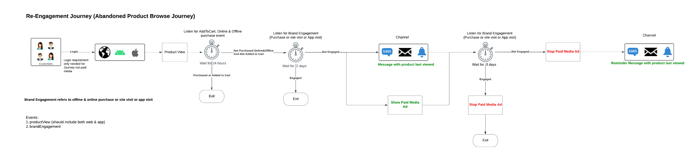

# Coinvolgi nuovamente i tuoi clienti con intelligenza, per farli tornare

Coinvolgi nuovamente i clienti che hanno abbandonato una conversione prima di completarla in modo intelligente e responsabile. Coinvolgi i clienti inattivi attraverso esperienze anziché promemoria per migliorare la conversione e stimolare la crescita del valore del ciclo di vita del cliente.

Utilizza considerazioni in tempo reale, prendi in considerazione tutte le qualità e i comportamenti dei consumatori e offri una riqualificazione rapida in base a eventi online e offline.

## Panoramica del caso d’uso

Costruirai schemi, set di dati e tipi di pubblico mentre lavori su esempi di percorsi di ricoinvolgimento. Scoprirai anche le funzioni necessarie per impostare i percorsi di esempio in [!DNL Adobe Journey Optimizer] e quelle necessarie per creare annunci pubblicitari a pagamento nelle destinazioni. Questa guida utilizza esempi di coinvolgimento dei clienti nei percorsi di casi d’uso descritti di seguito:

* **Percorso di ricoinvolgimento** : è rivolto ai clienti che hanno abbandonato la navigazione dei prodotti sia sul sito web che sull’app mobile.
* **Percorso carrello abbandonato** : è destinato ai clienti che hanno inserito dei prodotti nel carrello ma che non sono ancora stati acquistati né sul sito web né sull’app mobile.
* **Percorso di conferma dell’ordine** - Si concentra sugli acquisti di prodotti effettuati tramite il sito web e l’app mobile.

## Prerequisiti e pianificazione {#prerequisites-and-planning}

Man mano che completi i passaggi per implementare il caso d’uso, utilizzerai le funzionalità di Real-Time CDP ed elementi dell’interfaccia utente seguenti (elencati nell’ordine in cui verranno utilizzati). Assicurati di disporre delle autorizzazioni di controllo degli accessi basate su attributi per tutte queste aree o richiedi all’amministratore di sistema di concedere le autorizzazioni necessarie.

* [[!DNL Adobe Real-Time Customer Data Platform (Real-Time CDP)]](https://experienceleague.adobe.com/docs/platform-learn/tutorials/rtcdp/understanding-the-real-time-customer-data-platform.html) - Integra i dati tra le diverse sorgenti di dati per alimentare la campagna. Questi dati vengono quindi utilizzati per creare i tipi di pubblico della campagna e far emergere elementi di dati personalizzati utilizzati nell’e-mail e nelle tessere delle promozioni web (ad esempio, nome o informazioni relative all’account). Il CDP viene utilizzato anche per attivare i tipi di pubblico tra e-mail e sul web (tramite [!DNL Adobe Target]).
   * [Schemi](/help/xdm/home.md)
   * [Profili](/help/profile/home.md)
   * [Set di dati](/help/catalog/datasets/overview.md)
   * [Tipi di pubblico](/help/segmentation/home.md)
   * [[!DNL Adobe Journey Optimizer]](https://experienceleague.adobe.com/docs/journey-optimizer/using/orchestrate-journeys/journey.html)
   * [Destinazioni](/help/destinations/home.md)
   * [Attivatore evento o pubblico](https://experienceleague.adobe.com/docs/journey-optimizer/using/offer-decisioning/collect-event-data/data-collection.html)
   * [Pubblico/Eventi](https://experienceleague.adobe.com/docs/journey-optimizer/using/audiences-profiles-identities/audiences/about-audiences.html?lang=it)
   * [Azioni percorso](https://experienceleague.adobe.com/docs/journey-optimizer/using/orchestrate-journeys/journey.html)

### Come utilizzare il caso d’uso: panoramica di alto livello {#achieve-the-use-case-high-level}

Di seguito è riportata una panoramica generale dei tre percorsi di ricoinvolgimento di esempio.

>[!BEGINTABS]

>[!TAB Percorso di ricoinvolgimento]

Il percorso di ricoinvolgimento esegue il targeting della navigazione abbandonata dei prodotti sia sul sito web che sull’app mobile. Questo percorso viene attivato quando un prodotto viene visualizzato ma non acquistato o aggiunto al carrello. Il coinvolgimento con il brand viene attivato dopo tre giorni se non sono presenti aggiunte di elenco nelle ultime 24 ore.
{width="2560" zoomable="yes"}

1. Puoi creare schemi e set di dati, quindi contrassegnare per [!UICONTROL Profilo].
2. I dati sono integrati in Experienci Platform tramite Web SDK, Mobile Edge SDK o API. È possibile utilizzare anche il connettore dati di Analytics, ma potrebbe causare latenza del percorso.
3. Carichi i profili in Real-Time CDP e definisci criteri di governance per assicurarne l’utilizzo responsabile.
4. Puoi creare tipi di pubblico mirati dall’elenco dei profili per verificare se **cliente** ha preso un impegno negli ultimi tre giorni.
5. Puoi creare un percorso di ricoinvolgimento in [!DNL Adobe Journey Optimizer].
6. Se necessario, utilizza **partner dati** per l’attivazione dei tipi di pubblico nelle destinazioni desiderate dei media a pagamento.
7. [!DNL Adobe Journey Optimizer] verifica la presenza del consenso e invia le varie azioni configurate.

>[!TAB Percorso carrello abbandonato]

Il percorso del carrello abbandonato esegue il targeting dei prodotti che sono stati inseriti nel carrello ma che non sono ancora stati acquistati sia sul sito web che sull’app mobile. Inoltre, le campagne Paid Media vengono avviate e interrotte utilizzando questo metodo.
{width="2560" zoomable="yes"}

1. Si creano schemi e set di dati, il contrassegno per [!UICONTROL Profilo].
2. I dati sono integrati in Experienci Platform tramite Web SDK, Mobile Edge SDK o API. È possibile utilizzare anche il connettore dati di Analytics, ma potrebbe causare latenza del percorso.
3. Carichi i profili in Real-Time CDP e definisci criteri di governance per assicurarne l’utilizzo responsabile.
4. Puoi creare tipi di pubblico mirati dall’elenco dei profili per verificare se **cliente** ha inserito un articolo nel carrello ma non ha completato l&#39;acquisto. Il **[!UICONTROL Aggiungi al carrello]** l’evento avvia un timer che attende 30 minuti, quindi controlla se è stato acquistato. Se non è stato effettuato alcun acquisto, il **cliente** viene aggiunto al **[!UICONTROL Abbandona carrello]** pubblico.
5. Si crea un percorso di carrello abbandonato in [!DNL Adobe Journey Optimizer].
6. Se necessario, utilizza **partner dati** per l’attivazione dei tipi di pubblico nelle destinazioni desiderate dei media a pagamento.
7. [!DNL Adobe Journey Optimizer] verifica la presenza del consenso e invia le varie azioni configurate.

>[!TAB Percorso di conferma ordine]

Il percorso di conferma degli ordini si concentra sugli acquisti di prodotti effettuati tramite il sito web e l’app mobile.
{width="2560" zoomable="yes"}

1. Puoi creare schemi e set di dati, quindi contrassegnare per [!UICONTROL Profilo].
2. I dati sono integrati in Experienci Platform tramite Web SDK, Mobile Edge SDK o API. È possibile utilizzare anche il connettore dati di Analytics, ma potrebbe causare latenza del percorso.
3. Carichi i profili in Real-Time CDP e definisci criteri di governance per assicurarne l’utilizzo responsabile.
4. Puoi creare un percorso di conferma in [!DNL Adobe Journey Optimizer].
5. [!DNL Adobe Journey Optimizer] invia un messaggio di conferma dell’ordine utilizzando il canale preferito.

>[!ENDTABS]

## Come ottenere il caso d’uso {#achieve-use-case-instruction}

Per completare ciascuno dei passaggi descritti nelle panoramiche di alto livello precedenti, leggere le sezioni seguenti, che offrono collegamenti a ulteriori informazioni e istruzioni più dettagliate.

### Funzionalità ed elementi dell’interfaccia utente che utilizzerai {#ui-functionality-and-elements}

Dopo aver completato i passaggi per implementare il caso d’uso, utilizzerai le funzionalità Real-Time CDP e gli elementi dell’interfaccia utente elencati all’inizio del presente documento. Assicurati di disporre delle autorizzazioni di controllo degli accessi basate su attributi per tutte queste aree o richiedi all’amministratore di sistema di concedere le autorizzazioni necessarie.

### Creare una struttura di schema e specificare i gruppi di campi {#schema-design}

Le risorse Experience Data Model (XDM) sono gestite in [!UICONTROL Schemi] workspace in [!DNL Adobe Experience Platform]. Puoi visualizzare ed esplorare le risorse core fornite da [!DNL Adobe] (ad esempio, [!UICONTROL Gruppi di campi]) e creare risorse e schemi personalizzati per la tua organizzazione.

Per ulteriori informazioni sulla creazione di [schemi](https://experienceleague.adobe.com/docs/experience-platform/xdm/home.html?lang=it), leggi [tutorial su come creare uno schema.](/help/xdm/tutorials/create-schema-ui.md)

Per il caso di utilizzo del ricoinvolgimento vengono utilizzate quattro progettazioni di schemi. Ogni schema richiede la configurazione di campi specifici e di alcuni campi fortemente consigliati.

#### Schema attributi cliente

Questo schema viene utilizzato per strutturare e fare riferimento ai dati di profilo che compongono le informazioni sul cliente. Questi dati vengono generalmente acquisiti in [!DNL Adobe Experience Platform] tramite CRM o un sistema simile ed è necessario per fare riferimento ai dettagli dei clienti utilizzati per la personalizzazione, il consenso al marketing e le funzionalità di segmentazione avanzate.

Lo schema degli attributi del cliente è rappresentato da un [!UICONTROL Profilo individuale XDM] classe, che include i seguenti gruppi di campi:

+++Dati di contatto personali (gruppo di campi)

[Dettagli di contatto personali](/help/xdm/field-groups/profile/personal-contact-details.md) è un gruppo di campi di schema standard per la classe Profilo individuale XDM che descrive le informazioni di contatto per una singola persona.

| Campi | Requisito | Descrizione |
| --- | --- | --- |
| `mobilePhone.number` | Obbligatorio | Il numero di telefono cellulare della persona, che verrà utilizzato per gli SMS. |
| `personalEmail.address` | Obbligatorio | Indirizzo e-mail della persona. |

+++

+++Dettagli demografici (gruppo di campi)

[Dettagli demografici](/help/xdm/field-groups/profile/demographic-details.md) è un gruppo di campi di schema standard per la classe Profilo individuale XDM. Il gruppo di campi fornisce un oggetto persona a livello principale, i cui sottocampi descrivono informazioni su una singola persona.

| Campi | Requisito |
| --- | --- |
| `person.name.firstName` | Consigliato |
| `person.name.lastName` | Consigliato |

+++

+++Dettagli di controllo del sistema di sorgente esterna (gruppo di campi)

[Attributi di controllo del sistema di sorgente esterna](/help/xdm/data-types/external-source-system-audit-attributes.md) è un tipo di dati Experience Data Model (XDM) standard che acquisisce dettagli di audit su un sistema di origine esterno.

+++

+++Gruppi di campi di consenso e preferenze (gruppo di campi)

[Consensi e preferenze](/help/xdm/field-groups//profile/consents.md) gruppo di campi fornisce un singolo campo di tipo oggetto, consenti, per acquisire informazioni su consenso e preferenze.

| Campi | Requisito |
| --- | --- |
| `consents.marketing.email.val` | Obbligatorio |
| `consents.marketing.preferred` | Obbligatorio |
| `consents.marketing.push.val` | Obbligatorio |
| `consents.marketing.sms.val` | Obbligatorio |
| `consents.personalize.content.val` | Obbligatorio |
| `consents.share.val` | Obbligatorio |

+++

+++Dettagli test profilo (gruppo di campi)

Questo gruppo di campi viene utilizzato come best practice.

+++

#### Schema transazioni digitali cliente

Questo schema viene utilizzato per strutturare e fare riferimento ai dati dell’evento che costituisce l’attività del cliente che si verifica sul sito web e/o sulle piattaforme digitali associate. Questi dati vengono generalmente acquisiti in [!DNL Adobe Experience Platform] tramite Web SDK ed è necessario per fare riferimento ai vari eventi di navigazione e conversione utilizzati per attivare i percorsi, per eseguire dettagliate analisi online dei clienti e per abilitare funzionalità di segmentazione avanzate.

Lo schema delle transazioni digitali del cliente è rappresentato da un [!UICONTROL XDM ExperienceEvent] classe, che include i seguenti gruppi di campi:

+++Adobe Experience Platform Web SDK ExperienceEvent (gruppo di campi)

| Campi | Requisito |
| --- | --- |
| `device.model` | Consigliato |
| `environment.browserDetails.userAgent` | Consigliato |

+++

+++Dettagli Web (gruppo di campi)

Dettagli web è un gruppo di campi di schema standard per la classe XDM ExperienceEvent, utilizzato per descrivere informazioni relative a eventi di dettagli web come interazione, dettagli della pagina e referrer.

| Campi | Requisito | Descrizione |
| --- | --- | --- |
| `web.webInteraction.linkClicks.id` | Consigliato | ID del collegamento web o dell’URL che corrisponde all’interazione. |
| `web.webInteraction.linkClicks.value` | Consigliato | Il numero di clic per il collegamento web o l’URL che corrisponde all’interazione. |
| `web.webInteraction.name` | Consigliato | Il nome della pagina web. |
| `web.webInteraction.URL` | Consigliato | L’URL della pagina web. |
| `web.webPageDetails.name` | Consigliato | Il nome della pagina web in cui si è verificata l’interazione web. |
| `web.webPageDetails.URL` | Consigliato | L’URL della pagina web in cui si è verificata l’interazione web. |
| `web.webReferrer.URL` | Consigliato | Descrive il referente di un’interazione web, che è l’URL da cui un visitatore proviene immediatamente prima che l’interazione web corrente sia stata registrata. |

+++

+++Evento esperienza del consumatore (gruppo di campi)

| Campi | Requisito |
| --- | --- |
| `commerce.cart.cartID` | Consigliato |
| `commerce.cart.cartSource` | Consigliato |
| `commerce.cartAbandons.id` | Consigliato |
| `commerce.cartAbandons.value` | Consigliato |
| `commerce.order.orderType` | Consigliato |
| `commerce.order.payments.paymentAmount` | Consigliato |
| `commerce.order.payments.paymentType` | Consigliato |
| `commerce.order.payments.transactionID` | Consigliato |
| `commerce.order.priceTotal` | Consigliato |
| `commerce.order.purchaseID` | Consigliato |
| `commerce.productListAdds.id` | Consigliato |
| `commerce.productListAdds.value` | Consigliato |
| `commerce.productListOpens.id` | Consigliato |
| `commerce.productListOpens.value` | Consigliato |
| `commerce.productListRemoval.id` | Consigliato |
| `commerce.productListRemoval.value` | Consigliato |
| `commerce.productListViews.id` | Consigliato |
| `commerce.productListViews.value` | Consigliato |
| `commerce.productViews.id` | Consigliato |
| `commerce.productViews.value` | Consigliato |
| `commerce.purchases.id` | Consigliato |
| `commerce.purchases.value` | Consigliato |
| `marketing.campaignGroup` | Consigliato |
| `marketing.campaignName` | Consigliato |
| `marketing.trackingCode` | Consigliato |
| `productListItems.name` | Consigliato |
| `productListItems.priceTotal` | Consigliato |
| `productListItems.product` | Consigliato |
| `productListItems.quantity` | Consigliato |

+++

+++Dettagli ID utente finale (gruppo di campi)

| Campi | Requisito | Descrizione |
| --- | --- | --- |
| `endUserIDs._experience.emailid.authenticatedState` | Obbligatorio | Stato di autenticazione dell’ID dell’indirizzo e-mail dell’utente finale. |
| `endUserIDs._experience.emailid.id` | Obbligatorio | ID indirizzo e-mail utente finale. |
| `endUserIDs._experience.emailid.namespace.code` | Obbligatorio | Codice spazio dei nomi dell’indirizzo e-mail dell’utente finale. |
| `endUserIDs._experience.mcid.authenticatedState` | Obbligatorio | [!DNL Adobe] Stato di autenticazione dell’ID Marketing Cloud (MCID). Il MCID è ora noto come ID Experience Cloud (ECID). |
| `endUserIDs._experience.mcid.id` | Obbligatorio | [!DNL Adobe] ID Marketing Cloud (MCID). Il MCID è ora noto come ID Experience Cloud (ECID). |
| `endUserIDs._experience.mcid.namespace.code` | Obbligatorio | [!DNL Adobe] Codice spazio dei nomi ID Marketing Cloud (MCID). |

+++

+++Dettagli di controllo del sistema di sorgente esterna (gruppo di campi)

Attributi di controllo del sistema di origine esterna è un tipo di dati standard Experience Data Model (XDM) che acquisisce i dettagli di controllo di un sistema di origine esterno.

+++

#### Schema transazioni cliente offline

Questo schema viene utilizzato per strutturare e fare riferimento ai dati dell’evento che costituisce l’attività del cliente che si verifica su piattaforme al di fuori del sito web. Questi dati vengono generalmente acquisiti in [!DNL Adobe Experience Platform] da un POS (o sistema simile) e il più delle volte inviato in streaming a Platform tramite una connessione API. Il suo scopo è quello di fare riferimento ai vari eventi di conversione offline utilizzati per attivare percorsi, analisi approfondite dei clienti online e offline e funzionalità di segmentazione avanzate.

Lo schema di transazioni cliente offline è rappresentato da un [!UICONTROL XDM ExperienceEvent] classe, che include i seguenti gruppi di campi:

+++Dettagli Commerce (Gruppo Di Campi)

| Campi | Requisito | Descrizione |
| --- | --- | --- |
| `commerce.cart.cartID` | Obbligatorio | Un ID per il carrello. |
| `commerce.order.orderType` | Obbligatorio | Oggetto che descrive il tipo di ordine del prodotto. |
| `commerce.order.payments.paymentAmount` | Obbligatorio | Oggetto che descrive l&#39;importo del pagamento dell&#39;ordine di prodotto. |
| `commerce.order.payments.paymentType` | Obbligatorio | Oggetto che descrive il tipo di pagamento dell&#39;ordine di prodotto. |
| `commerce.order.payments.transactionID` | Obbligatorio | ID transazione ordine prodotti oggetto. |
| `commerce.order.purchaseID` | Obbligatorio | Un ID acquisto ordine prodotto oggetto. |
| `productListItems.name` | Obbligatorio | Un elenco di nomi di articoli che rappresentano i prodotti selezionati da un cliente. |
| `productListItems.priceTotal` | Obbligatorio | Il prezzo totale del listino di articoli che rappresentano i prodotti selezionati da un cliente. |
| `productListItems.product` | Obbligatorio | I prodotti selezionati. |
| `productListItems.quantity` | Obbligatorio | Quantità di elenco di articoli che rappresentano i prodotti selezionati da un cliente. |

+++

+++Dati di contatto personali (gruppo di campi)

| Campi | Requisito | Descrizione |
| --- | --- | --- |
| `mobilePhone.number` | Obbligatorio | Il numero di telefono cellulare della persona, che verrà utilizzato per gli SMS. |
| `personalEmail.address` | Obbligatorio | Indirizzo e-mail della persona. |

+++

+++Dettagli di controllo del sistema di sorgente esterna (gruppo di campi)

Attributi di controllo del sistema di origine esterna è un tipo di dati standard Experience Data Model (XDM) che acquisisce i dettagli di controllo di un sistema di origine esterno.

+++

#### Schema del connettore web Adobe

>[!NOTE]
>
>Questa è un’implementazione facoltativa se utilizzi il [!DNL Adobe Analytics Data Connector].

Questo schema viene utilizzato per strutturare e fare riferimento ai dati dell’evento che costituisce l’attività del cliente che si verifica sul sito web e/o sulle piattaforme digitali associate. Questo schema è simile allo schema Customer Digital Transactions ma differisce in quanto è destinato a essere utilizzato quando Web SDK non è un’opzione per la raccolta dei dati; pertanto, questo schema è necessario quando si utilizza il [!DNL Adobe Analytics Data Connector] per inviare i dati online a [!DNL Adobe Experience Platform] come flusso di dati primario o secondario.

Il [!DNL Adobe] lo schema del connettore web è rappresentato da un [!UICONTROL XDM ExperienceEvent] classe, che include i seguenti gruppi di campi:

Modello +++Adobe Analytics ExperienceEvent (gruppo di campi)

| Campi | Requisito | Descrizione |
| --- | --- | --- |
| `web.webInteraction.linkClicks.id` | Consigliato | ID del collegamento web o dell’URL che corrisponde all’interazione. |
| `web.webInteraction.linkClicks.value` | Consigliato | Il numero di clic per il collegamento web o l’URL che corrisponde all’interazione. |
| `web.webInteraction.name` | Consigliato | Il nome della pagina web. |
| `web.webInteraction.URL` | Consigliato | L’URL della pagina web. |
| `web.webPageDetails.name` | Consigliato | Il nome della pagina web in cui si è verificata l’interazione web. |
| `web.webPageDetails.URL` | Consigliato | L’URL della pagina web in cui si è verificata l’interazione web. |
| `web.webReferrer.URL` | Consigliato | Descrive il referente di un’interazione web, che è l’URL da cui un visitatore proviene immediatamente prima che l’interazione web corrente sia stata registrata. |
| `commerce.cart.cartID` | Consigliato | |
| `commerce.cart.cartSource` | Consigliato | |
| `commerce.cartAbandons.id` | Consigliato | |
| `commerce.cartAbandons.value` | Consigliato | |
| `commerce.order.orderType` | Consigliato | |
| `commerce.order.payments.paymentAmount` | Consigliato | |
| `commerce.order.payments.paymentType` | Consigliato | |
| `commerce.order.payments.transactionID` | Consigliato | |
| `commerce.order.priceTotal` | Consigliato | |
| `commerce.order.purchaseID` | Consigliato | |
| `commerce.productListAdds.id` | Consigliato | |
| `commerce.productListAdds.value` | Consigliato | |
| `commerce.productListOpens.id` | Consigliato | |
| `commerce.productListOpens.value` | Consigliato | |
| `commerce.productListRemoval.id` | Consigliato | |
| `commerce.productListRemoval.value` | Consigliato | |
| `commerce.productListViews.id` | Consigliato | |
| `commerce.productListViews.value` | Consigliato | |
| `commerce.productViews.id` | Consigliato | |
| `commerce.productViews.value` | Consigliato | |
| `commerce.purchases.id` | Consigliato | |
| `commerce.purchases.value` | Consigliato | |
| `marketing.campaignGroup` | Consigliato | |
| `marketing.campaignName` | Consigliato | |
| `marketing.trackingCode` | Consigliato | |
| `productListItems.name` | Consigliato | |
| `productListItems.priceTotal` | Consigliato | |
| `productListItems.product` | Consigliato | |
| `productListItems.quantity` | Consigliato | |
| `endUserIDs._experience.emailid.authenticatedState` | Obbligatorio | Stato di autenticazione dell’ID dell’indirizzo e-mail dell’utente finale. |
| `endUserIDs._experience.emailid.id` | Obbligatorio | ID indirizzo e-mail utente finale. |
| `endUserIDs._experience.emailid.namespace.code` | Obbligatorio | Codice spazio dei nomi dell’indirizzo e-mail dell’utente finale. |
| `endUserIDs._experience.mcid.authenticatedState` | Obbligatorio | [!DNL Adobe] Stato di autenticazione dell’ID Marketing Cloud (MCID). Il MCID è ora noto come ID Experience Cloud (ECID). |
| `endUserIDs._experience.mcid.id` | Obbligatorio | [!DNL Adobe] ID Marketing Cloud (MCID). Il MCID è ora noto come ID Experience Cloud (ECID). |
| `endUserIDs._experience.mcid.namespace.code` | Obbligatorio | [!DNL Adobe] Codice spazio dei nomi ID Marketing Cloud (MCID). |

+++

+++Dettagli di controllo del sistema di sorgente esterna (gruppo di campi)

Attributi di controllo del sistema di origine esterna è un tipo di dati standard Experience Data Model (XDM) che acquisisce i dettagli di controllo di un sistema di origine esterno.

+++

### Creare un set di dati da uno schema {#dataset-from-schema}

Un set di dati è una struttura di archiviazione e gestione per un gruppo di dati. Ogni schema per percorsi di ricoinvolgimento intelligente ha un singolo set di dati.

Per ulteriori informazioni su come creare una [set di dati](/help/catalog/datasets/overview.md) da uno schema, leggi [Guida all’interfaccia utente dei set di dati](/help/catalog/datasets/user-guide.md).

>[!NOTE]
>
>Simile al passaggio per creare uno schema, devi abilitare il set di dati per essere incluso nel Profilo cliente in tempo reale. Per ulteriori informazioni sull’abilitazione del set di dati per l’utilizzo nel Profilo cliente in tempo reale, consulta il [tutorial sulla creazione di uno schema.](/help/xdm/tutorials/create-schema-ui.md#profile).

### Privacy, consenso e governance dei dati {#privacy-consent}

#### Criteri di consenso

>[!IMPORTANT]
>
>Come requisito legale, è necessario fornire ai clienti la possibilità di annullare l’abbonamento alla ricezione di comunicazioni da un marchio e garantire che questa scelta sia rispettata. Per ulteriori informazioni sulle normative applicabili, consulta [Panoramica sulle normative sulla privacy](https://experienceleague.adobe.com/docs/experience-platform/privacy/regulations/overview.html).

Durante la creazione di un percorso di ricoinvolgimento, è necessario quanto segue [criteri di consenso](https://experienceleague.adobe.com/docs/platform-learn/data-collection/web-sdk/consent/overview.html) da considerare:

* Se `consents.marketing.email.val = "Y"` allora può inviare un messaggio e-mail
* Se `consents.marketing.sms.val = "Y"` allora può inviare un SMS
* Se `consents.marketing.push.val = "Y"` then Can Push
* Se `consents.share.val = "Y"` then Can Advertise

#### Etichetta e applicazione della governance dei dati

Durante la creazione di un percorso di ricoinvolgimento, è necessario quanto segue [Etichette per governance dei dati](/help/data-governance/labels/overview.md) da considerare:

* Gli indirizzi e-mail personali vengono utilizzati come dati direttamente identificabili utilizzati per identificare o contattare una persona specifica anziché un dispositivo.
   * `personalEmail.address = I1`

#### Politiche di marketing

Non sono presenti [criteri di marketing](/help/data-governance/policies/overview.md) necessari per i percorsi di ricoinvolgimento, tuttavia, devono essere considerati come desiderati:

* Limita dati sensibili
* Limitare la pubblicità in loco
* Limita targeting e-mail
* Limitare il targeting tra siti
* Limita la combinazione di dati direttamente identificabili con dati anonimi

### Creazione di un pubblico {#create-audience}

#### Creazione di tipi di pubblico per percorsi di ricoinvolgimento del brand

I percorsi di ricoinvolgimento utilizzano i tipi di pubblico per definire attributi o comportamenti specifici condivisi da un sottoinsieme di profili dall’archivio dei profili, al fine di distinguere un gruppo di persone commerciabile dalla base dei clienti. I tipi di pubblico possono essere creati in più modi su [!DNL Adobe Experience Platform].

Per ulteriori informazioni su come creare un pubblico, consulta la sezione [Guida dell’interfaccia utente di Audience Service](https://experienceleague.adobe.com/docs/experience-platform/segmentation/ui/overview.html#create-audience).

Per ulteriori informazioni sulla composizione diretta [Tipi di pubblico](/help/segmentation/home.md), leggi [Guida dell’interfaccia utente di Audience Composition](/help/segmentation/ui/audience-composition.md).

Per ulteriori informazioni su come creare tipi di pubblico tramite le definizioni dei segmenti derivate da Platform, leggi [Guida dell’interfaccia utente di Audience Builder](/help/segmentation/ui/segment-builder.md).

>[!BEGINTABS]

>[!TAB Percorso di ricoinvolgimento]

Questo pubblico viene creato come miglioramento del classico scenario &quot;Abbandono del carrello&quot;. Mentre l’abbandono del carrello in genere si concentra su un’aggiunta al carrello senza un acquisto successivo in un determinato periodo di tempo, questo pubblico cerca un impegno precedente, in particolare coloro che potrebbero aver navigato in un particolare prodotto ma non l’hanno aggiunto al carrello e non hanno avuto attività di follow-up sul sito entro un determinato intervallo di tempo. Questo pubblico aiuta a mantenere il tuo marchio &quot;top of mind&quot; per i clienti che soddisfano questi criteri di inclusione e può essere utilizzato anche per i clienti le cui proprietà digitali possono differire da un modello di e-commerce tradizionale.

I seguenti eventi vengono utilizzati per il percorso di ricoinvolgimento in cui gli utenti visualizzano i prodotti online e non vengono aggiunti al carrello nelle 24 ore successive, seguito da nessun coinvolgimento del brand nei 3 giorni successivi.

Durante la configurazione del pubblico sono necessari i campi e le condizioni seguenti:

* `EventType: commerce.productViews`
   * `Timestamp: <= 24 hours before now`
* `EventType is not: commerce.procuctListAdds`
   * `Timestamp: <= 24 hours before now, GAP(>= 3 days)`
* `EventType: application.launch or web.webpagedetails.pageViews or commerce.purchases`
   * `Timestamp: <= 2 days before now`

Il descrittore del percorso di ricoinvolgimento viene visualizzato come:

`Include audience who have at least 1 EventType = ProductViews event THEN have at least 1 Any event where (EventType does not equal commerce.productListAdds) and occurs in last 24 hour(s) then after 3 days do not have any Any event where (EventType = application.launch or web.webpagedetails.pageViews or commerce.purchases) and occurs in last 2 day(s).`

>[!TAB Percorso carrello abbandonato]

Questo pubblico viene creato per supportare lo scenario classico &quot;Abbandono del carrello&quot;. Il suo scopo è quello di trovare i clienti che hanno aggiunto un prodotto al carrello ma alla fine non hanno effettuato un acquisto. Questo tipo di pubblico contribuirà a mantenere non solo il tuo marchio &quot;top of mind&quot; per i tuoi clienti, ma anche i prodotti che hanno lasciato senza un acquisto successivo.

I seguenti eventi vengono utilizzati per il percorso di carrello abbandonato in cui gli utenti hanno aggiunto un prodotto al carrello, ma non hanno completato l’acquisto o cancellato il carrello nelle ultime 24 ore.

Durante la configurazione del pubblico sono necessari i campi e le condizioni seguenti:

* `EventType: commerce.productListAdds`
   * `Timestamp: >= 1 days before now and <= 4 days before now `
* `EventType: commerce.purchases`
   * `Timestamp: <= 4 days before now`
* `EventType: commerce.productListRemovals`
   * `Timestamp: <= 4 days before now`

Il descrittore del percorso di carrello abbandonato viene visualizzato come segue:

`Include EventType = commerce.productListAdds between 30 min and 1440 minutes before now. exclude EventType = commerce.purchases 30 minutes before now OR EventType = commerce.productListRemovals AND Cart ID equals Product List Adds1 Cart ID (the inclusion event).`

>[!TAB Percorso di conferma ordine]

Questo percorso non richiede la creazione di tipi di pubblico.

>[!ENDTABS]

### Configurazione del percorso in Adobe Journey Optimizer {#journey-setup}

>[!NOTE]
>
>[!DNL Adobe Journey Optimizer] non include tutti gli elementi visualizzati nei diagrammi. Tutti [annunci multimediali a pagamento](/help/destinations/catalog/social/overview.md) sono create in [!UICONTROL Destinazioni].

[[!DNL Adobe Journey Optimizer]](https://experienceleague.adobe.com/docs/journey-optimizer/using/orchestrate-journeys/journey.html) ti consente di fornire ai clienti esperienze connesse, contestuali e personalizzate. Il percorso del cliente è l’intero processo di interazione del cliente con il marchio. Ogni percorso di casi d’uso richiede informazioni specifiche. Di seguito sono elencati i dati precisi necessari per ogni ramo del Percorso.

>[!BEGINTABS]

>[!TAB Percorso di ricoinvolgimento]

Il percorso di ricoinvolgimento esegue il targeting della navigazione abbandonata dei prodotti sia sul sito web che sull’app mobile.
{width="2560" zoomable="yes"}

+++Eventi

* Evento 1: Visualizzazioni prodotto
   * Schema: Transazioni digitali del cliente
   * Campi:
      * `EventType`
   * Condizione:
      * `EventType = commerce.productViews`
      * Campi:
         * `Commerce.productViews.id`
         * `Commerce.productViews.value`
         * `eventType`
         * `identityMap.authenticatedState`
         * `identityMap.id`
         * `identityMap.primary`
         * `productListItems.SKU`
         * `productListItems.currencyCode`
         * `productListItems.name`
         * `productListItems.priceTotal`
         * `productListItems.product`
         * `productListItems.productImageUrl`
         * `productListItems.quantity`
         * `timestamp`
         * `endUserIDs._experience.emailid.authenticatedState`
         * `endUserIDs._experience.emailid.id`
         * `endUserIDs._experience.emailid.namespace.code`
         * `_id`

* Evento 2: aggiungi al carrello
   * Schema: Transazioni digitali del cliente
   * Campi:
      * `EventType`
   * Condizione:
      * `EventType = commerce.productListAdds`
      * Campi:
         * `Commerce.productListAdds.id`
         * `Commerce.productListAdds.value`
         * `eventType`
         * `identityMap.authenticatedState`
         * `identityMap.id`
         * `identityMap.primary`
         * `productListItems.SKU`
         * `productListItems.currencyCode`
         * `productListItems.name`
         * `productListItems.priceTotal`
         * `productListItems.product`
         * `productListItems.productImageUrl`
         * `productListItems.quantity`
         * `timestamp`
         * `commerce.cart.cartID`
         * `endUserIDs._experience.emailid.authenticatedState`
         * `endUserIDs._experience.emailid.id`
         * `endUserIDs._experience.emailid.namespace.code`
         * `_id`

* Evento 3: Brand Engagement
   * Schema: Transazioni digitali del cliente
   * Campi:
      * `EventType`
   * Condizione:
      * `EventType in application.launch, commerce.purchases, web.webpagedetails.pageViews`
      * Campi:
         * `eventType`
         * `identityMap.authenticatedState`
         * `identityMap.id`
         * `identityMap.primary`
         * `productListItems.SKU`
         * `productListItems.currencyCode`
         * `productListItems.name`
         * `productListItems.priceTotal`
         * `productListItems.product`
         * `productListItems.productImageUrl`
         * `productListItems.quantity`
         * `timestamp`
         * `web.webpagedetails.URL`
         * `web.webpagedetails.isHomePage`
         * `web.webpagedetails.name`
         * `endUserIDs._experience.emailid.authenticatedState`
         * `endUserIDs._experience.emailid.id`
         * `endUserIDs._experience.emailid.namespace.code`
         * `_id`
         * `Commerce.purchases.id`
         * `Commerce.purchases.value`
         * `shipping.address.city`
         * `shipping.address.countryCode`
         * `shipping.address.postalCode`
         * `shipping.address.state`
         * `shipping.address.street1`
         * `shipping.address.street2`
         * `shipping.shipDate`
         * `shipping.trackingNumber`
         * `shipping.trackingURL`

+++

+++Logica del Percorso di chiavi

* Logica di ingresso percorso
   * Evento visualizzazione prodotto

* Condizioni
   * Verifica la presenza di almeno un evento di acquisto online o offline dall’ultima visualizzazione del prodotto.
      * Schema: Transazioni digitali del cliente
      * `eventType = commerce.purchases`
      * `timestamp > timestamp of product last viewed`

   * Verifica la presenza di almeno un acquisto offline dall’ultima visualizzazione del prodotto:
      * Schema: Transazioni non in linea cliente
      * `eventType = commerce.purchases`
      * `timestamp > timestamp of product last viewed`

   * Condizioni: seleziona il canale di destinazione
      * E-mail
         * `consents.marketing.email.val = y`
      * Push
         * `consents.marketing.push.val=y`
      * SMS
         * `consents.marketing.sms.val = y`

   * Personalizzazione dei canali
      * Contenuto del canale personalizzato in base alla visualizzazione del prodotto.

+++

>[!TAB Percorso carrello abbandonato]

Il percorso del carrello abbandonato esegue il targeting dei prodotti che sono stati inseriti nel carrello ma che non sono ancora stati acquistati sia sul sito web che sull’app mobile.
{width="2560" zoomable="yes"}

+++Eventi

* Evento 2: aggiungi al carrello
   * Schema: Transazioni digitali del cliente
   * Campi:
      * `EventType`
   * Condizione:
      * `EventType = commerce.productListAdds`
      * Campi:
         * `Commerce.productListAdds.id`
         * `Commerce.productListAdds.value`
         * `eventType`
         * `identityMap.authenticatedState`
         * `identityMap.id`
         * `identityMap.primary`
         * `productListItems.SKU`
         * `productListItems.currencyCode`
         * `productListItems.name`
         * `productListItems.priceTotal`
         * `productListItems.product`
         * `productListItems.productImageUrl`
         * `productListItems.quantity`
         * `timestamp`
         * `commerce.cart.cartID`
         * `endUserIDs._experience.emailid.authenticatedState`
         * `endUserIDs._experience.emailid.id`
         * `endUserIDs._experience.emailid.namespace.code`
         * `_id`

* Evento 4: Acquisti online
   * Schema: Transazioni digitali del cliente
   * Campi:
      * `EventType`
   * Condizione:
      * `EventType = commerce.purchases`
      * Campi:
         * `Commerce.purchases.id`
         * `Commerce.purchases.value`
         * `eventType`
         * `identityMap.authenticatedState`
         * `identityMap.id`
         * `identityMap.primary`
         * `productListItems.SKU`
         * `productListItems.currencyCode`
         * `productListItems.name`
         * `productListItems.priceTotal`
         * `productListItems.product`
         * `productListItems.productImageUrl`
         * `productListItems.quantity`
         * `timestamp`
         * `endUserIDs._experience.emailid.authenticatedState`
         * `endUserIDs._experience.emailid.id`
         * `endUserIDs._experience.emailid.namespace.code`
         * `_id`

* Evento 3: Brand Engagement
   * Schema: Transazioni digitali del cliente
   * Campi:
      * `EventType`
   * Condizione:
      * `EventType in application.launch, commerce.purchases, web.webpagedetails.pageViews`
      * Campi:
         * `eventType`
         * `identityMap.authenticatedState`
         * `identityMap.id`
         * `identityMap.primary`
         * `productListItems.SKU`
         * `productListItems.currencyCode`
         * `productListItems.name`
         * `productListItems.priceTotal`
         * `productListItems.product`
         * `productListItems.productImageUrl`
         * `productListItems.quantity`
         * `timestamp`
         * `web.webpagedetails.URL`
         * `web.webpagedetails.isHomePage`
         * `web.webpagedetails.name`
         * `endUserIDs._experience.emailid.authenticatedState`
         * `endUserIDs._experience.emailid.id`
         * `endUserIDs._experience.emailid.namespace.code`
         * `_id`
         * `Commerce.purchases.id`
         * `Commerce.purchases.value`
         * `shipping.address.city`
         * `shipping.address.countryCode`
         * `shipping.address.postalCode`
         * `shipping.address.state`
         * `shipping.address.street1`
         * `shipping.address.street2`
         * `shipping.shipDate`
         * `shipping.trackingNumber`
         * `shipping.trackingURL`

+++

+++Logica di Percorso chiave

* Logica di ingresso percorso
   * `AddToCart` Evento

* AuthenticatedState in Authenticated

* Condizione: acquisti offline dall’ultimo abbandono del carrello:
   * Schema: Transazioni non in linea cliente
   * `eventType = commerce.purchases`
   * `timestamp > timestamp of cart was last abandoned`

* Condizione: il carrello è stato cancellato dall’ultimo abbandono del carrello:
   * Schema: Transazioni digitali del cliente
   * `eventType = commerce.cartCleared`
   * `cartID` (ID del carrello)
   * `timestamp > timestamp of cart was last abandoned`

* Seleziona canale di destinazione (seleziona uno o più canali per una portata più ampia)
   * E-mail
      * `consents.marketing.email.val = y`
   * Push
      * `consents.marketing.push.val = y`
   * SMS
      * `consents.marketing.sms.val = y`
   * Personalizzazione dei canali
      * Visualizza informazioni dettagliate sul carrello e può visualizzare più prodotti in un formato tabella.

+++

>[!TAB Percorso di conferma ordine]

Il percorso di conferma degli ordini si concentra sugli acquisti di prodotti effettuati tramite il sito web e l’app mobile.
{width="2560" zoomable="yes"}

+++Eventi

* Evento 4: Acquisti online
   * Schema: Transazioni digitali del cliente
   * Campi:
      * `EventType`
   * Condizione:
      * `EventType = commerce.purchases`
      * Campi:
         * `Commerce.purchases.id`
         * `Commerce.purchases.value`
         * `eventType`
         * `identityMap.authenticatedState`
         * `identityMap.id`
         * `identityMap.primary`
         * `productListItems.SKU`
         * `productListItems.currencyCode`
         * `productListItems.name`
         * `productListItems.priceTotal`
         * `productListItems.product`
         * `productListItems.productImageUrl`
         * `productListItems.quantity`
         * `timestamp`
         * `endUserIDs._experience.emailid.authenticatedState`
         * `endUserIDs._experience.emailid.id`
         * `endUserIDs._experience.emailid.namespace.code`
         * `_id`

+++

+++Logica del Percorso di chiavi

* Logica di ingresso percorso
   * Evento ordine

* Condizioni
   * Seleziona Canale di destinazione (seleziona uno o più canali per una portata più ampia).
      * La conferma dell’ordine è considerata utile in natura, pertanto il controllo del consenso è solitamente superfluo.
      * E-mail
      * Push
      * SMS

   * Personalizzazione dei contenuti del canale
      * Visualizza le informazioni sui dettagli dell’ordine e può visualizzare un elenco di prodotti utilizzando un formato tabella.

+++

>[!ENDTABS]

Per ulteriori informazioni sulla creazione di percorsi in [!DNL Adobe Journey Optimizer], leggi [Guida introduttiva ai percorsi](https://experienceleague.adobe.com/docs/journey-optimizer/using/orchestrate-journeys/journey.html).

### Impostazione di annunci multimediali a pagamento nelle destinazioni {#paid-media-ads}

Il framework delle destinazioni viene utilizzato per gli annunci multimediali a pagamento. Una volta verificato il consenso, questo viene inviato alle varie destinazioni configurate. Per ulteriori informazioni sulle destinazioni, consulta [Panoramica sulle destinazioni](/help/destinations/home.md) documento.

#### Dati richiesti per le destinazioni

Le destinazioni di esportazione dei segmenti in streaming (come Facebook, Google Customer Match, Google DV360) supportano varie identità dai dati dei clienti:

* `personalEmail.address`
* `ECID`
* `mobilePhone.number`

Il segmento del carrello di abbandono è in streaming e può quindi essere utilizzato dal framework di destinazione per questo caso d’uso.

* Streaming/Triggered
   * [Pubblicità](/help/destinations/catalog/advertising/overview.md)/[Media a pagamento e social network](/help/destinations/catalog/social/overview.md)
   * [Dispositivi mobili](/help/destinations/catalog/mobile-engagement/overview.md)
   * [Destinazione streaming](/help/destinations/catalog/streaming/http-destination.md)
   * [Destination SDK personalizzata](/help/destinations/destination-sdk/overview.md)
