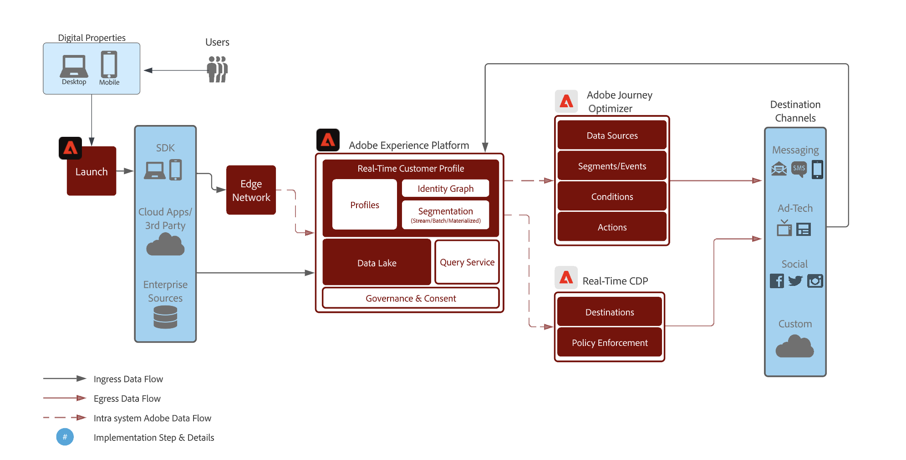

# Coinvolgi nuovamente i tuoi clienti con intelligenza, per farli tornare

>[!NOTE]
>
>Questa è un’implementazione di esempio e gli esempi riportati in questa pagina, ad esempio la sintassi dei segmenti, sono meramente esempi. Utilizza gli esempi come guida, in quanto la tua implementazione potrebbe differire.

Coinvolgi nuovamente i clienti che hanno abbandonato una conversione in modo intelligente e responsabile. Coinvolgi i clienti meno esperti con esperienze per aumentare la conversione e il valore del ciclo di vita del client.

Utilizza considerazioni in tempo reale, prendi in considerazione tutte le qualità e i comportamenti dei consumatori e offri una riqualificazione rapida in base a eventi online e offline.

Di seguito è riportata una panoramica dell’architettura di alto livello dei vari componenti di Real-Time CDP e Journey Optimizer. Questo diagramma mostra il modo in cui i dati fluiscono attraverso le due app di Experience Platform, dalla raccolta dati al punto in cui vengono attivati tramite percorsi o campagne verso le destinazioni, per ottenere il caso d’uso descritto in questa pagina.

## Panoramica del caso d’uso {#overview}

Costruirai schemi, set di dati e tipi di pubblico mentre lavori attraverso esempi di scenari di ricoinvolgimento. Scoprirai anche le funzioni necessarie per impostare i percorsi di esempio in [!DNL Adobe Journey Optimizer] e quelle necessarie per creare annunci pubblicitari a pagamento nelle destinazioni. Questa guida utilizza esempi di coinvolgimento dei clienti nei percorsi di casi d’uso descritti di seguito:

* **Scenario di navigazione prodotto abbandonato** : rivolgiti ai clienti che hanno abbandonato la navigazione dei prodotti sia sul sito web che sull’app mobile.
* **Scenario carrello abbandonato** - Puoi indirizzare l’attività ai clienti che hanno inserito dei prodotti nel carrello ma che non sono ancora stati acquistati né sul sito web né sull’app mobile.
* **Scenario di conferma dell’ordine** - Concentrati sugli acquisti di prodotti effettuati tramite il sito web e l’app mobile.

## Prerequisiti e pianificazione {#prerequisites-and-planning}

Una volta completati i passaggi per implementare il caso d’uso, utilizzerai le seguenti funzionalità di Real-Time CDP e Adobe Journey Optimizer (elencate nell’ordine in cui verranno utilizzate). Assicurati di disporre delle [autorizzazioni di controllo degli accessi basate su attributi](/help/access-control/home.md) per tutte queste aree o richiedi all’amministratore di sistema di concedere le autorizzazioni necessarie.

* [[!DNL Adobe Real-Time Customer Data Platform (Real-Time CDP)]](https://experienceleague.adobe.com/docs/platform-learn/tutorials/rtcdp/understanding-the-real-time-customer-data-platform.html) - Integra i dati tra le diverse sorgenti di dati per alimentare la campagna. Questi dati vengono quindi utilizzati per creare i tipi di pubblico della campagna e far emergere elementi di dati personalizzati utilizzati nell’e-mail e nelle tessere delle promozioni web (ad esempio, nome o informazioni relative all’account). Il CDP viene utilizzato anche per attivare i tipi di pubblico tra e-mail e sul web (tramite [!DNL Adobe Target]).
   * [Schemi](/help/xdm/home.md)
   * [Profili](/help/profile/home.md)
   * [Set di dati](/help/catalog/datasets/overview.md)
   * [Tipi di pubblico](/help/segmentation/home.md)
   * [[!DNL Adobe Journey Optimizer]](https://experienceleague.adobe.com/docs/journey-optimizer/using/orchestrate-journeys/journey.html)
   * [Destinazioni](/help/destinations/home.md)

* [[!DNL Adobe Journey Optimizer]](https://experienceleague.adobe.com/docs/journey-optimizer-learn/tutorials/introduction-to-journey-optimizer/introduction.html?lang=it) - Consente di offrire ai clienti esperienze connesse, contestuali e personalizzate.
   * [Attivatore evento o pubblico](https://experienceleague.adobe.com/docs/journey-optimizer/using/offer-decisioning/collect-event-data/data-collection.html)
   * [Pubblico/Eventi](https://experienceleague.adobe.com/docs/journey-optimizer/using/audiences-profiles-identities/audiences/about-audiences.html?lang=it)
   * [Azioni percorso](https://experienceleague.adobe.com/docs/journey-optimizer/using/orchestrate-journeys/journey.html)

## Come ottenere il caso d’uso {#achieve-use-case-instruction}

Di seguito è riportata una panoramica generale dei tre scenari di ricoinvolgimento di esempio.

>[!BEGINTABS]

>[!TAB Scenario di navigazione prodotto abbandonato]

Lo scenario di navigazione dei prodotti abbandonati è incentrato sulla navigazione dei prodotti abbandonati sia sul sito web che sull’app mobile. Questo scenario si attiva quando un prodotto viene visualizzato ma non acquistato o aggiunto al carrello. In questo esempio, il brand engagement viene attivato dopo tre giorni se non ci sono aggiunte di elenchi nelle ultime 24 ore.
{width="1920" zoomable="yes"}

1. Puoi creare schemi e set di dati, quindi abilitare per [!UICONTROL Profilo].
2. Acquisisci i dati in Experienci Platform tramite Web SDK, Mobile SDK o API. È possibile utilizzare anche il connettore di origine di Analytics, ma potrebbe causare latenza del percorso.
3. Acquisisci dati aggiuntivi abilitati per il profilo, che possono essere collegati al visitatore autenticato dell’app web e mobile tramite grafici di identità.
4. Puoi creare tipi di pubblico mirati dall’elenco dei profili per verificare se **cliente** ha preso un impegno negli ultimi tre giorni.
5. Creazione di un percorso di navigazione prodotto abbandonato in [!DNL Adobe Journey Optimizer].
6. Se necessario, utilizza **partner dati** per l’attivazione dei tipi di pubblico nelle destinazioni desiderate dei media a pagamento.
7. [!DNL Adobe Journey Optimizer] verifica la presenza del consenso e invia le varie azioni configurate.

>[!TAB Scenario carrello abbandonato]

Lo scenario del carrello abbandonato si applica quando i prodotti sono stati inseriti nel carrello ma non sono ancora stati acquistati sia sul sito web che sull’app mobile. Inoltre, le campagne Paid Media vengono avviate e interrotte utilizzando questo metodo.
{width="1920" zoomable="yes"}

1. Si creano schemi e set di dati, l’opzione abilita per [!UICONTROL Profilo].
2. Acquisisci i dati in Experienci Platform tramite Web SDK, Mobile SDK o API. È possibile utilizzare anche il connettore di origine di Analytics, ma potrebbe causare latenza del percorso.
3. Acquisisci dati aggiuntivi abilitati per il profilo, che possono essere collegati al visitatore autenticato dell’app web e mobile tramite grafici di identità.
4. Puoi creare tipi di pubblico mirati dall’elenco dei profili per verificare se **cliente** ha inserito un articolo nel carrello ma non ha completato l&#39;acquisto. Il **[!UICONTROL Aggiungi al carrello]** l’evento avvia un timer che attende 30 minuti, quindi controlla se è stato acquistato. Se non è stato effettuato alcun acquisto, il **cliente** viene aggiunto al **[!UICONTROL Abbandona carrello]** pubblico.
5. Si crea un percorso di carrello abbandonato in [!DNL Adobe Journey Optimizer].
6. Se necessario, utilizza **partner dati** per l’attivazione dei tipi di pubblico nelle destinazioni desiderate dei media a pagamento.
7. [!DNL Adobe Journey Optimizer] verifica la presenza del consenso e invia le varie azioni configurate.

>[!TAB Scenario di conferma ordine]

Lo scenario di conferma dell’ordine si concentra sugli acquisti di prodotti effettuati tramite il sito web e l’app mobile.
{width="1920" zoomable="yes"}

1. Puoi creare schemi e set di dati, quindi abilitare per [!UICONTROL Profilo].
2. Acquisisci i dati in Experienci Platform tramite Web SDK, Mobile SDK o API. È possibile utilizzare anche il connettore di origine di Analytics, ma potrebbe causare latenza del percorso.
3. Acquisisci dati aggiuntivi abilitati per il profilo, che possono essere collegati al visitatore autenticato dell’app web e mobile tramite grafici di identità.
4. Puoi creare un percorso di conferma in [!DNL Adobe Journey Optimizer].
5. [!DNL Adobe Journey Optimizer] invia un messaggio di conferma dell’ordine utilizzando il canale preferito.

>[!ENDTABS]

Per completare ciascuno dei passaggi descritti nelle panoramiche di alto livello precedenti, leggere le sezioni seguenti, che offrono collegamenti a ulteriori informazioni e istruzioni più dettagliate.

### Creare schemi e specificare gruppi di campi {#schema-design}

Le risorse Experience Data Model (XDM) sono gestite in [!UICONTROL Schemi] workspace in [!DNL Adobe Experience Platform]. Puoi visualizzare ed esplorare le risorse core fornite da [!DNL Adobe] (ad esempio, gruppi di campi) e creare risorse e schemi personalizzati per la tua organizzazione.

Per ulteriori informazioni sulla creazione di [schemi](/help/xdm/home.md), vedere [tutorial su come creare uno schema.](/help/xdm/tutorials/create-schema-ui.md) e [Modellare i dati sull’esperienza del cliente con XDM](https://experienceleague.adobe.com/docs/courses/using/experienceplatform-d-1-2021-1-xdm.html).

Per il caso di utilizzo del ricoinvolgimento vengono utilizzate quattro progettazioni di schemi. Ogni schema richiede la configurazione di campi specifici. Devi abilitare lo schema per essere incluso nel Profilo cliente in tempo reale. Per ulteriori informazioni sull’abilitazione dello schema per l’utilizzo in Real-Time Customer Profile, consulta [abilitare uno schema per Real-Time Customer Profile](/help/xdm/ui/resources/schemas.md#enable-a-schema-for-real-time-customer-profile).

#### Schema attributi cliente

Questo schema viene utilizzato per strutturare e fare riferimento ai dati di profilo che compongono le informazioni sul cliente. Questi dati vengono generalmente acquisiti in [!DNL Adobe Experience Platform] tramite il tuo sistema CRM o simile ed è necessario per fare riferimento ai dettagli dei clienti utilizzati per la personalizzazione, il consenso al marketing e le funzionalità avanzate di pubblico.

Lo schema degli attributi del cliente è rappresentato da un [[!UICONTROL Profilo individuale XDM]](/help/xdm/classes/individual-profile.md) classe, che include i seguenti gruppi di campi:

+++Dati di contatto personali (gruppo di campi)

[Dettagli di contatto personali](/help/xdm/field-groups/profile/personal-contact-details.md) è un gruppo di campi di schema standard per la classe Profilo individuale XDM che descrive le informazioni di contatto per una singola persona.

| Campi | Descrizione |
| --- | --- |
| `mobilePhone.number` | Il numero di telefono cellulare della persona, che verrà utilizzato per gli SMS. |
| `personalEmail.address` | Indirizzo e-mail della persona. |

+++

+++Dettagli di controllo del sistema di sorgente esterna (gruppo di campi)

[Attributi di controllo del sistema di sorgente esterna](/help/xdm/data-types/external-source-system-audit-attributes.md) è un tipo di dati Experience Data Model (XDM) standard che acquisisce dettagli di audit su un sistema di origine esterno.

+++

+++Gruppi di campi di consenso e preferenze (gruppo di campi)

Il [Consensi e preferenze](/help/xdm/field-groups//profile/consents.md) gruppo di campi fornisce un singolo campo di tipo oggetto, consenti, per acquisire informazioni su consenso e preferenze.

| Campi | Requisito |
| --- | --- |
| `consents.marketing.email.val` | Obbligatorio |
| `consents.marketing.preferred` | Obbligatorio |
| `consents.marketing.push.val` | Obbligatorio |
| `consents.marketing.sms.val` | Obbligatorio |
| `consents.personalize.content.val` | Obbligatorio |
| `consents.share.val` | Obbligatorio |

+++

+++Dettagli test profilo (gruppo di campi)

Questo gruppo di campi ti consente di testare il percorso prima che venga pubblicato, utilizzando i profili di test. Per ulteriori informazioni sulla creazione di profili di test, consulta [tutorial su come creare profili di test](https://experienceleague.adobe.com/docs/journeys/using/building-journeys/about-journey-building/creating-test-profiles.html) e [esercitazione sul test del percorso](https://experienceleague.adobe.com/docs/journeys/using/building-journeys/testing-the-journey.html).

+++

#### Schema transazioni digitali cliente

Questo schema viene utilizzato per strutturare e fare riferimento ai dati dell’evento che costituisce l’attività del cliente che si verifica sul sito web o sulle piattaforme digitali associate. Questi dati vengono generalmente acquisiti in [!DNL Adobe Experience Platform] tramite [SDK per web](/help/web-sdk/home.md) ed è necessario per fare riferimento ai vari eventi di navigazione e conversione utilizzati per attivare i percorsi, analizzare in modo dettagliato i clienti online e migliorare le funzionalità di pubblico.

Lo schema delle transazioni digitali del cliente è rappresentato da un [[!UICONTROL XDM ExperienceEvent]](/help/xdm/classes/experienceevent.md) classe.

+++XDM ExperienceEvent (classe)

Il [[!UICONTROL XDM ExperienceEvent]](/help/xdm/classes/experienceevent.md) La classe include i seguenti gruppi di campi:

| Campi | Descrizione |
| --- | --- |
| `_id` | Identifica in modo univoco i singoli eventi acquisiti in [!DNL Adobe Experience Platform]. |
| `timestamp` | Una marca temporale ISO 8601 indicante quando si è verificato l’evento, formattata come indicato nella sezione 5.6 della RFC 3339. Questa marca temporale deve essere nel passato. |
| `eventType` | Stringa che indica il tipo di categoria per l’evento. |

+++

+++Dettagli ID utente finale (gruppo di campi)

Il [Dettagli ID utente finale](/help/xdm/field-groups/event/enduserids.md) è utilizzato per descrivere le informazioni sull’identità di un individuo in diverse applicazioni di Adobe.

| Campi | Descrizione |
| --- | --- |
| `endUserIDs._experience.emailid.authenticatedState` | Stato di autenticazione dell’ID dell’indirizzo e-mail dell’utente finale. |
| `endUserIDs._experience.emailid.id` | ID indirizzo e-mail utente finale. |
| `endUserIDs._experience.emailid.namespace.code` | Codice spazio dei nomi dell’indirizzo e-mail dell’utente finale. |
| `endUserIDs._experience.mcid.authenticatedState` | [!DNL Adobe] Stato di autenticazione dell’ID Marketing Cloud (MCID). Il MCID è ora noto come ID Experience Cloud (ECID). |
| `endUserIDs._experience.mcid.id` | [!DNL Adobe] ID Marketing Cloud (MCID). Il MCID è ora noto come ID Experience Cloud (ECID). |
| `endUserIDs._experience.mcid.namespace.code` | [!DNL Adobe] Codice spazio dei nomi ID Marketing Cloud (MCID). |

+++

+++Dettagli di controllo del sistema di sorgente esterna (gruppo di campi)

Attributi di controllo del sistema di origine esterna è un tipo di dati standard Experience Data Model (XDM) che acquisisce i dettagli di controllo di un sistema di origine esterno.

+++

#### Schema transazioni cliente offline

Questo schema viene utilizzato per strutturare e fare riferimento ai dati dell’evento che costituisce l’attività del cliente che si verifica su piattaforme al di fuori del sito web. Questi dati vengono generalmente acquisiti in [!DNL Adobe Experience Platform] da un POS (o sistema simile) e il più delle volte inviato in streaming a Platform tramite una connessione API. Il suo scopo è quello di fare riferimento ai vari eventi di conversione offline utilizzati per attivare percorsi, analisi approfondite dei clienti online e offline e funzionalità di pubblico avanzate.

Lo schema di transazioni cliente offline è rappresentato da un [[!UICONTROL XDM ExperienceEvent]](/help/xdm/classes/experienceevent.md) classe.

+++XDM ExperienceEvent (classe)

Il [[!UICONTROL XDM ExperienceEvent]](/help/xdm/classes/experienceevent.md) La classe include i seguenti gruppi di campi:

| Campi | Descrizione |
| --- | --- |
| `_id` | Identifica in modo univoco i singoli eventi acquisiti in [!DNL Adobe Experience Platform]. |
| `timestamp` | Una marca temporale ISO 8601 indicante quando si è verificato l’evento, formattata come indicato nella sezione 5.6 della RFC 3339. Questa marca temporale deve essere nel passato. |
| `eventType` | Stringa che indica il tipo di categoria per l’evento. |

+++

+++Dettagli Commerce (Gruppo Di Campi)

Il [Dettagli Commerce](/help/xdm/field-groups/event/commerce-details.md) il gruppo di campi viene utilizzato per descrivere i dati commerciali, ad esempio le informazioni sul prodotto (SKU, nome, quantità) e le operazioni standard del carrello (ordine, pagamento, abbandono).

| Campi | Descrizione |
| --- | --- |
| `commerce.cart.cartID` | Un ID per il carrello. |
| `commerce.order.orderType` | Oggetto che descrive il tipo di ordine del prodotto. |
| `commerce.order.payments.paymentAmount` | Oggetto che descrive l&#39;importo del pagamento dell&#39;ordine di prodotto. |
| `commerce.order.payments.paymentType` | Oggetto che descrive il tipo di pagamento dell&#39;ordine di prodotto. |
| `commerce.order.payments.transactionID` | ID transazione ordine prodotti oggetto. |
| `commerce.order.purchaseID` | Un ID acquisto ordine prodotto oggetto. |
| `productListItems.name` | Un elenco di nomi di articoli che rappresentano i prodotti selezionati da un cliente. |
| `productListItems.priceTotal` | Il prezzo totale del listino di articoli che rappresentano i prodotti selezionati da un cliente. |
| `productListItems.product` | I prodotti selezionati. |
| `productListItems.quantity` | Quantità di elenco di articoli che rappresentano i prodotti selezionati da un cliente. |

+++

+++Dati di contatto personali (gruppo di campi)

[Dettagli di contatto personali](/help/xdm/field-groups/profile/personal-contact-details.md) è un gruppo di campi di schema standard per la classe Profilo individuale XDM che descrive le informazioni di contatto per una singola persona.

| Campi | Descrizione |
| --- | --- |
| `mobilePhone.number` | Il numero di telefono cellulare della persona, che verrà utilizzato per gli SMS. |
| `personalEmail.address` | Indirizzo e-mail della persona. |

+++

+++Dettagli di controllo del sistema di sorgente esterna (gruppo di campi)

Attributi di controllo del sistema di origine esterna è un tipo di dati standard Experience Data Model (XDM) che acquisisce i dettagli di controllo di un sistema di origine esterno.

+++

#### Schema del connettore web Adobe

>[!NOTE]
>
>Questa è un’implementazione facoltativa se utilizzi il [[!DNL Adobe Analytics Source Connector]](/help/sources/connectors/adobe-applications/analytics.md).

Questo schema viene utilizzato per strutturare e fare riferimento ai dati dell’evento che costituisce l’attività del cliente che si verifica sul sito web o sulle piattaforme digitali associate. Questo schema è simile allo schema Customer Digital Transactions ma differisce in quanto è destinato a essere utilizzato quando [SDK per web](/help/web-sdk/home.md) non è un’opzione per la raccolta dati; pertanto, questo schema è necessario quando utilizzi il [!DNL Adobe Analytics Source Connector] per inviare i dati online a [!DNL Adobe Experience Platform] come flusso di dati primario o secondario.

Il [!DNL Adobe] lo schema del connettore web è rappresentato da un [[!UICONTROL XDM ExperienceEvent]](/help/xdm/classes/experienceevent.md) classe.

+++XDM ExperienceEvent (classe)

Il [[!UICONTROL XDM ExperienceEvent]](/help/xdm/classes/experienceevent.md) La classe include i seguenti gruppi di campi:

| Campi | Descrizione |
| --- | --- |
| `_id` | Identifica in modo univoco i singoli eventi acquisiti in [!DNL Adobe Experience Platform]. |
| `timestamp` | Una marca temporale ISO 8601 indicante quando si è verificato l’evento, formattata come indicato nella sezione 5.6 della RFC 3339. Questa marca temporale deve essere nel passato. |
| `eventType` | Stringa che indica il tipo di categoria per l’evento. |

+++

Modello +++Adobe Analytics ExperienceEvent (gruppo di campi)

Il [Adobe Analytics ExperienceEvent](/help/xdm/field-groups/event/analytics-full-extension.md) gruppo di campi acquisisce le metriche comuni raccolte da Adobe Analytics.

| Campi | Descrizione |
| --- | --- |
| `endUserIDs._experience.emailid.authenticatedState` | Stato di autenticazione dell’ID dell’indirizzo e-mail dell’utente finale. |
| `endUserIDs._experience.emailid.id` | ID indirizzo e-mail utente finale. |
| `endUserIDs._experience.emailid.namespace.code` | Codice spazio dei nomi dell’indirizzo e-mail dell’utente finale. |
| `endUserIDs._experience.mcid.authenticatedState` | [!DNL Adobe] Stato di autenticazione dell’ID Marketing Cloud (MCID). Il MCID è ora noto come ID Experience Cloud (ECID). |
| `endUserIDs._experience.mcid.id` | [!DNL Adobe] ID Marketing Cloud (MCID). Il MCID è ora noto come ID Experience Cloud (ECID). |
| `endUserIDs._experience.mcid.namespace.code` | [!DNL Adobe] Codice spazio dei nomi ID Marketing Cloud (MCID). |

+++

+++Dettagli di controllo del sistema di sorgente esterna (gruppo di campi)

Attributi di controllo del sistema di origine esterna è un tipo di dati standard Experience Data Model (XDM) che acquisisce i dettagli di controllo di un sistema di origine esterno.

+++

### Creare un set di dati da uno schema {#create-datasets}

Un set di dati è una struttura di archiviazione e gestione per un gruppo di dati. Ogni schema per scenari di ricoinvolgimento intelligente deve avere un proprio set di dati.

Per ulteriori informazioni su come creare una [set di dati](/help/catalog/datasets/overview.md) da uno schema, leggi [Guida all’interfaccia utente dei set di dati](/help/catalog/datasets/user-guide.md).

>[!NOTE]
>
>Simile al passaggio per creare uno schema, devi abilitare il set di dati per essere incluso nel Profilo cliente in tempo reale. Per ulteriori informazioni sull’abilitazione del set di dati per l’utilizzo in Real-Time Customer Profile, consulta l’esercitazione su [inserire dati in Real-Time Customer Profile](https://experienceleague.adobe.com/docs/platform-learn/tutorials/profiles/bring-data-into-the-real-time-customer-profile.html?lang=it).

### Consenso e governance dei dati {#privacy-consent}

>[!IMPORTANT]
>
>Come requisito legale, è necessario dare ai clienti la possibilità di annullare l’abbonamento alla ricezione di comunicazioni da un marchio e garantire che questa scelta sia rispettata. Per ulteriori informazioni sulle normative applicabili, consulta [Panoramica sulle normative sulla privacy](https://experienceleague.adobe.com/docs/experience-platform/privacy/regulations/overview.html).

#### Criteri di consenso

Quando crei un percorso di ricoinvolgimento, prendi in considerazione l’aggiunta dei seguenti elementi [criteri di consenso](https://experienceleague.adobe.com/docs/platform-learn/data-collection/web-sdk/consent/overview.html):

* Se `consents.marketing.email.val = "Y"` allora può inviare un messaggio e-mail
* Se `consents.marketing.sms.val = "Y"` allora può inviare un SMS
* Se `consents.marketing.push.val = "Y"` then Can Push
* Se `consents.share.val = "Y"` then Can Advertise

#### Etichettatura e applicazione della governance dei dati

Quando crei un percorso di ricoinvolgimento, prendi in considerazione l’aggiunta dei seguenti elementi [Etichette per governance dei dati](/help/data-governance/labels/overview.md):

* Gli indirizzi e-mail personali vengono utilizzati come dati direttamente identificabili utilizzati per identificare o contattare una persona specifica anziché un dispositivo.
   * `personalEmail.address = I1`

#### Criteri di utilizzo dei dati

Non sono presenti [criteri di utilizzo dati](/help/data-governance/policies/overview.md) richiesto per lo scenario di navigazione prodotto abbandonato. Tuttavia, è necessario considerare quanto segue:

* Limita dati sensibili
* Limitare la pubblicità in loco
* Limita targeting e-mail
* Limitare il targeting tra siti
* Limita la combinazione di dati direttamente identificabili con dati anonimi

### Creare tipi di pubblico {#create-audience}

Gli scenari di ricoinvolgimento utilizzano i tipi di pubblico per definire attributi o comportamenti specifici condivisi da un sottoinsieme di profili dall’archivio dei profili, al fine di distinguere un gruppo di persone commerciabile dalla base dei clienti. I tipi di pubblico possono essere creati in più modi in [!DNL Adobe Experience Platform].

Per ulteriori informazioni su come creare un pubblico, consulta la sezione [guida dell’interfaccia utente di audience service](https://experienceleague.adobe.com/docs/experience-platform/segmentation/ui/overview.html#create-audience).

Per ulteriori informazioni sulla composizione diretta [Tipi di pubblico](/help/segmentation/home.md), leggi [Guida dell’interfaccia utente di Audience Composition](/help/segmentation/ui/audience-composition.md).

Per ulteriori informazioni su come creare tipi di pubblico tramite le definizioni di pubblico derivate da Platform, leggi [Guida dell’interfaccia utente di Audience Builder](/help/segmentation/ui/segment-builder.md).

>[!BEGINTABS]

>[!TAB Scenario di navigazione prodotto abbandonato]

Questo pubblico viene creato come miglioramento del classico scenario &quot;Abbandono del carrello&quot;. Mentre l’abbandono del carrello in genere si concentra su un’aggiunta al carrello senza un acquisto successivo in un determinato periodo di tempo, questo pubblico cerca un impegno precedente, in particolare coloro che potrebbero aver navigato in un particolare prodotto ma non l’hanno aggiunto al carrello e non hanno avuto attività di follow-up sul sito entro un determinato intervallo di tempo. Questo pubblico aiuta a mantenere il tuo marchio &quot;top of mind&quot; per i clienti che soddisfano questi criteri di inclusione e può essere utilizzato anche per i clienti le cui proprietà digitali possono differire da un modello di e-commerce tradizionale.

+++Visualizzazione prodotto abbandonata senza coinvolgimento negli ultimi tre giorni

Il seguente evento viene utilizzato per lo scenario di navigazione del prodotto abbandonato, in cui gli utenti hanno visualizzato i prodotti online e non hanno partecipato (visite al sito, visite all’app, acquisto online, acquisto offline ed eventi di aggiunta al carrello) nei 3 giorni successivi.

Durante la configurazione del pubblico sono necessari i campi e le condizioni seguenti:

* `eventType: commerce.productViews`
* E `THEN` (evento sequenziale) escludi `eventType: commerce.productListAdds` o `application.launch` o `web.webpagedetails.pageViews` o `commerce.purchases` (inclusi sia online che offline)
   * `Timestamp: > 3 days after productView`
* `Timestamp: > 4 days`

+++

+++Visualizzazione prodotto con coinvolgimento negli ultimi tre giorni

Il seguente evento è utilizzato per lo scenario di navigazione del prodotto abbandonato, in cui gli utenti hanno visualizzato i prodotti online e hanno partecipato (visite al sito, visite all’app, acquisto online, acquisto offline ed eventi di aggiunta al carrello) nei 3 giorni successivi.

Durante la configurazione del pubblico sono necessari i campi e le condizioni seguenti:

* `eventType: commerce.productViews`
* E `THEN` (evento sequenziale) include `eventType: commerce.productListAdds` o `application.launch` o `web.webpagedetails.pageViews` o `commerce.purchases` (inclusi sia online che offline)
   * `Timestamp: > 3 days after productView`
* `Timestamp: > 4 days`
+++

+++Streaming del coinvolgimento nell’ultimo giorno

Il seguente evento viene utilizzato per lo scenario di navigazione del prodotto abbandonato in cui gli utenti si sono impegnati (visite al sito, visite all’app, acquisto online, acquisto offline ed eventi di aggiunta al carrello) nell’ultimo giorno.

Durante la configurazione del pubblico sono necessari i campi e le condizioni seguenti:

* `eventType: commerce.productListAdds or application.launch or web.webpagedetails.pageViews or commerce.purchases`
   * `Timestamp: in last 1 day` (Streaming)

+++

+++Batch di coinvolgimento negli ultimi tre giorni

Il seguente evento viene utilizzato per lo scenario di navigazione del prodotto abbandonato in cui gli utenti si sono impegnati (visite al sito, visite all’app, acquisto online, acquisto offline ed eventi di aggiunta al carrello) negli ultimi 3 giorni.

Durante la configurazione del pubblico sono necessari i campi e le condizioni seguenti:

* `EventType: commerce.productListAdds or application.launch or web.webpagedetails.pageViews or commerce.purchases`
   * `Timestamp: in last 3 days` (Batch)

+++

>[!TAB Scenario carrello abbandonato]

Questo pubblico viene creato per supportare lo scenario classico &quot;Abbandono del carrello&quot;. Il suo scopo è quello di trovare i clienti che hanno aggiunto un prodotto al carrello ma alla fine non hanno effettuato un acquisto. Questo tipo di pubblico contribuirà a mantenere non solo il tuo marchio &quot;top of mind&quot; per i tuoi clienti, ma anche i prodotti che hanno lasciato senza un acquisto successivo.

I seguenti eventi vengono utilizzati per lo scenario del carrello abbandonato in cui gli utenti hanno aggiunto un prodotto al carrello tra 1 e 4 giorni fa, ma non hanno completato l’acquisto o cancellato il carrello.

Durante la configurazione del pubblico sono necessari i campi e le condizioni seguenti:

* `eventType: commerce.productListAdds`
   * `Timestamp: >= 1 days before now and <= 4 days before now `
* `eventType: commerce.purchases`
   * `Timestamp: <= 4 days before now`
* `eventType: commerce.productListRemovals`
   * `Timestamp: <= 4 days before now`

Il descrittore dello scenario del carrello abbandonato viene visualizzato come segue:

`Include eventType = commerce.productListAdds between 30 min and 1440 minutes before now. exclude eventType = commerce.purchases 30 minutes before now OR eventType = commerce.productListRemovals AND Cart ID equals Product List Adds1 Cart ID (the inclusion event).`

>[!TAB Scenario di conferma ordine]

Questo percorso non richiede la creazione di tipi di pubblico.

>[!ENDTABS]

### Configurazione del percorso in Adobe Journey Optimizer {#journey-setup}

>[!NOTE]
>
>[!DNL Adobe Journey Optimizer] non include tutti gli elementi visualizzati nei diagrammi. Tutti [annunci multimediali a pagamento](/help/destinations/catalog/social/overview.md) sono create in [!UICONTROL Destinazioni].

[[!DNL Adobe Journey Optimizer]](https://experienceleague.adobe.com/docs/journey-optimizer/using/orchestrate-journeys/journey.html) ti consente di fornire ai clienti esperienze connesse, contestuali e personalizzate. Il percorso del cliente è l’intero processo di interazione del cliente con il marchio. Ogni percorso di casi d’uso richiede informazioni specifiche. Di seguito sono elencati i dati precisi necessari per ciascun percorso.

>[!BEGINTABS]

>[!TAB Scenario di navigazione prodotto abbandonato]

Lo scenario di navigazione dei prodotti abbandonati è incentrato sulla navigazione dei prodotti abbandonati sia sul sito web che sull’app mobile.
{width="1920" zoomable="yes"}

+++Eventi

Gli eventi consentono di attivare i percorsi in modo unitario per inviare messaggi in tempo reale all’utente che entra nel percorso. Per ulteriori informazioni sugli eventi, consulta [guida generale agli eventi](https://experienceleague.adobe.com/docs/journey-optimizer/using/orchestrate-journeys/about-journey-building/general-events.html).

* Evento 1: Visualizzazioni prodotto
   * Schema: Transazioni digitali del cliente
   * Campi:
      * `eventType`
   * Condizione:
      * `eventType = commerce.productViews`
      * Campi:
         * `eventType`
         * `productListItems.name`
         * `productListItems.priceTotal`
         * `productListItems.product`
         * `productListItems.productImageUrl`
         * `productListItems.quantity`
         * `timestamp`
         * `endUserIDs._experience.emailid.authenticatedState`
         * `endUserIDs._experience.emailid.id`
         * `endUserIDs._experience.emailid.namespace.code`
         * `_id`

* Evento 2: aggiungi al carrello
   * Schema: Transazioni digitali del cliente
   * Campi:
      * `eventType`
   * Condizione:
      * `eventType = commerce.productListAdds`
      * Campi:
         * `commerce.productListAdds.id`
         * `commerce.productListAdds.value`
         * `eventType`
         * `identityMap.authenticatedState`
         * `identityMap.id`
         * `identityMap.primary`
         * `productListItems.SKU`
         * `productListItems.currencyCode`
         * `productListItems.name`
         * `productListItems.priceTotal`
         * `productListItems.product`
         * `productListItems.productImageUrl`
         * `productListItems.quantity`
         * `timestamp`
         * `commerce.cart.cartID`
         * `endUserIDs._experience.emailid.authenticatedState`
         * `endUserIDs._experience.emailid.id`
         * `endUserIDs._experience.emailid.namespace.code`
         * `_id`

* Evento 3: Brand Engagement
   * Schema: Transazioni digitali del cliente
   * Campi:
      * `eventType`
   * Condizione:
      * `eventType in application.launch, commerce.purchases, web.webpagedetails.pageViews`
      * Campi:
         * `eventType`
         * `identityMap.authenticatedState`
         * `identityMap.id`
         * `identityMap.primary`
         * `productListItems.SKU`
         * `productListItems.currencyCode`
         * `productListItems.name`
         * `productListItems.priceTotal`
         * `productListItems.product`
         * `productListItems.productImageUrl`
         * `productListItems.quantity`
         * `timestamp`
         * `web.webpagedetails.URL`
         * `web.webpagedetails.isHomePage`
         * `web.webpagedetails.name`
         * `endUserIDs._experience.emailid.authenticatedState`
         * `endUserIDs._experience.emailid.id`
         * `endUserIDs._experience.emailid.namespace.code`
         * `_id`
         * `commerce.purchases.id`
         * `commerce.purchases.value`
         * `shipping.address.city`
         * `shipping.address.countryCode`
         * `shipping.address.postalCode`
         * `shipping.address.state`
         * `shipping.address.street1`
         * `shipping.address.street2`
         * `shipping.shipDate`
         * `shipping.trackingNumber`
         * `shipping.trackingURL`

+++

+++Logica chiave area di lavoro Percorso

La logica chiave dell’area di lavoro di percorso richiede di identificare eventi specifici e configurare le azioni da eseguire dopo che l’evento si è verificato.

* Logica di ingresso percorso
   * Evento visualizzazione prodotto

* Condizioni
   * Verifica la presenza di almeno un evento di acquisto online o offline dall’ultima visualizzazione del prodotto.
      * Schema: Transazioni digitali del cliente
      * `eventType = commerce.purchases`
      * `timestamp > timestamp of product last viewed`

   * Verifica la presenza di almeno un acquisto offline dall’ultima visualizzazione del prodotto:
      * Schema: Transazioni non in linea cliente
      * `eventType = commerce.purchases`
      * `timestamp > timestamp of product last viewed`

   * Condizioni: seleziona il canale di destinazione
      * E-mail
         * `consents.marketing.email.val = y`
      * Push
         * `consents.marketing.push.val=y`
      * SMS
         * `consents.marketing.sms.val = y`

   * Personalizzazione dei canali
      * Contenuto del canale personalizzato in base alla visualizzazione del prodotto.

+++

>[!TAB Scenario carrello abbandonato]

Lo scenario del carrello abbandonato riguarda i prodotti che sono stati inseriti nel carrello ma che non sono ancora stati acquistati sia sul sito web che sull’app mobile.
{width="1920" zoomable="yes"}

+++Eventi

Gli eventi consentono di attivare i percorsi in modo unitario per inviare messaggi in tempo reale all’utente che entra nel percorso. Per ulteriori informazioni sugli eventi, consulta [guida generale agli eventi](https://experienceleague.adobe.com/docs/journey-optimizer/using/orchestrate-journeys/about-journey-building/general-events.html).

* Evento 2: aggiungi al carrello
   * Schema: Transazioni digitali del cliente
   * Campi:
      * `eventType`
   * Condizione:
      * `eventType = commerce.productListAdds`
      * Campi:
         * `commerce.productListAdds.id`
         * `commerce.productListAdds.value`
         * `eventType`
         * `identityMap.authenticatedState`
         * `identityMap.id`
         * `identityMap.primary`
         * `productListItems.SKU`
         * `productListItems.currencyCode`
         * `productListItems.name`
         * `productListItems.priceTotal`
         * `productListItems.product`
         * `productListItems.productImageUrl`
         * `productListItems.quantity`
         * `timestamp`
         * `commerce.cart.cartID`
         * `endUserIDs._experience.emailid.authenticatedState`
         * `endUserIDs._experience.emailid.id`
         * `endUserIDs._experience.emailid.namespace.code`
         * `_id`

* Evento 4: Acquisti online
   * Schema: Transazioni digitali del cliente
   * Campi:
      * `eventType`
   * Condizione:
      * `eventType = commerce.purchases`
      * Campi:
         * `commerce.purchases.id`
         * `commerce.purchases.value`
         * `eventType`
         * `identityMap.authenticatedState`
         * `identityMap.id`
         * `identityMap.primary`
         * `productListItems.SKU`
         * `productListItems.currencyCode`
         * `productListItems.name`
         * `productListItems.priceTotal`
         * `productListItems.product`
         * `productListItems.productImageUrl`
         * `productListItems.quantity`
         * `timestamp`
         * `endUserIDs._experience.emailid.authenticatedState`
         * `endUserIDs._experience.emailid.id`
         * `endUserIDs._experience.emailid.namespace.code`
         * `_id`

* Evento 3: Brand Engagement
   * Schema: Transazioni digitali del cliente
   * Campi:
      * `eventType`
   * Condizione:
      * `eventType in application.launch, commerce.purchases, web.webpagedetails.pageViews`
      * Campi:
         * `eventType`
         * `identityMap.authenticatedState`
         * `identityMap.id`
         * `identityMap.primary`
         * `productListItems.SKU`
         * `productListItems.currencyCode`
         * `productListItems.name`
         * `productListItems.priceTotal`
         * `productListItems.product`
         * `productListItems.productImageUrl`
         * `productListItems.quantity`
         * `timestamp`
         * `web.webpagedetails.URL`
         * `web.webpagedetails.isHomePage`
         * `web.webpagedetails.name`
         * `endUserIDs._experience.emailid.authenticatedState`
         * `endUserIDs._experience.emailid.id`
         * `endUserIDs._experience.emailid.namespace.code`
         * `_id`
         * `commerce.purchases.id`
         * `commerce.purchases.value`
         * `shipping.address.city`
         * `shipping.address.countryCode`
         * `shipping.address.postalCode`
         * `shipping.address.state`
         * `shipping.address.street1`
         * `shipping.address.street2`
         * `shipping.shipDate`
         * `shipping.trackingNumber`
         * `shipping.trackingURL`

+++

+++Logica chiave area di lavoro Percorso

La logica chiave dell’area di lavoro di percorso richiede di identificare eventi specifici e configurare le azioni da eseguire dopo che l’evento si è verificato.

* Logica di ingresso percorso
   * `AddToCart` Evento

* AuthenticatedState in Authenticated

* Condizione: acquisti offline dall’ultimo abbandono del carrello:
   * Schema: Transazioni non in linea cliente
   * `eventType = commerce.purchases`
   * `timestamp > timestamp of cart was last abandoned`

* Condizione: il carrello è stato cancellato dall’ultimo abbandono del carrello:
   * Schema: Transazioni digitali del cliente
   * `eventType = commerce.cartCleared`
   * `cartID` (ID del carrello)
   * `timestamp > timestamp of cart was last abandoned`

* Seleziona canale di destinazione (seleziona uno o più canali per una portata più ampia)
   * E-mail
      * `consents.marketing.email.val = y`
   * Push
      * `consents.marketing.push.val = y`
   * SMS
      * `consents.marketing.sms.val = y`
   * Personalizzazione dei canali
      * Visualizza informazioni dettagliate sul carrello e può visualizzare più prodotti in un formato tabella.

+++

>[!TAB Scenario di conferma ordine]

Lo scenario di conferma dell’ordine si concentra sugli acquisti di prodotti effettuati tramite il sito web e l’app mobile.
{width="1920" zoomable="yes"}

+++Eventi

Gli eventi consentono di attivare i percorsi in modo unitario per inviare messaggi in tempo reale all’utente che entra nel percorso. Per ulteriori informazioni sugli eventi, consulta [guida generale agli eventi](https://experienceleague.adobe.com/docs/journey-optimizer/using/orchestrate-journeys/about-journey-building/general-events.html).

* Evento 4: Acquisti online
   * Schema: Transazioni digitali del cliente
   * Campi:
      * `eventType`
   * Condizione:
      * `eventType = commerce.purchases`
      * Campi:
         * `commerce.purchases.id`
         * `commerce.purchases.value`
         * `eventType`
         * `identityMap.authenticatedState`
         * `identityMap.id`
         * `identityMap.primary`
         * `productListItems.SKU`
         * `productListItems.currencyCode`
         * `productListItems.name`
         * `productListItems.priceTotal`
         * `productListItems.product`
         * `productListItems.productImageUrl`
         * `productListItems.quantity`
         * `timestamp`
         * `endUserIDs._experience.emailid.authenticatedState`
         * `endUserIDs._experience.emailid.id`
         * `endUserIDs._experience.emailid.namespace.code`
         * `_id`

+++

+++Logica chiave area di lavoro Percorso

La logica chiave dell’area di lavoro di percorso richiede di identificare eventi specifici e configurare le azioni da eseguire dopo che l’evento si è verificato.

* Logica di ingresso percorso
   * Evento ordine

* Condizioni
   * Seleziona Canale di destinazione (seleziona uno o più canali per una portata più ampia).
      * La conferma dell’ordine è considerata utile in natura, pertanto il controllo del consenso è solitamente superfluo.
      * E-mail
      * Push
      * SMS

   * Personalizzazione dei contenuti del canale
      * Visualizza le informazioni sui dettagli dell’ordine e può visualizzare un elenco di prodotti utilizzando un formato tabella.

+++

>[!ENDTABS]

Per ulteriori informazioni sulla creazione di percorsi in [!DNL Adobe Journey Optimizer], leggi [Guida introduttiva ai percorsi](https://experienceleague.adobe.com/docs/journey-optimizer/using/orchestrate-journeys/journey.html).

### Impostazione di annunci multimediali a pagamento nelle destinazioni {#paid-media-ads}

Il framework delle destinazioni viene utilizzato per gli annunci multimediali a pagamento. Una volta verificato il consenso, questo viene inviato alle varie destinazioni configurate. Per ulteriori informazioni sulle destinazioni, consulta [Panoramica sulle destinazioni](/help/destinations/home.md) documento.

#### Dati richiesti per le destinazioni

Le destinazioni di esportazione del pubblico in streaming (come Facebook, Google Customer Match, Google DV360) supportano varie identità dai dati dei clienti:

* `personalEmail.address`
* `ECID`
* `mobilePhone.number`

Puoi attivare la navigazione nei prodotti abbandonati e abbandonare il pubblico del carrello per gli annunci multimediali a pagamento.

* Streaming/Triggered
   * [Pubblicità](/help/destinations/catalog/advertising/overview.md)/[Media a pagamento e social network](/help/destinations/catalog/social/overview.md)
   * [Dispositivi mobili](/help/destinations/catalog/mobile-engagement/overview.md)
   * [Destinazione streaming](/help/destinations/catalog/streaming/http-destination.md)
   * [Destinazione personalizzata creata utilizzando Destination SDK.](/help/destinations/destination-sdk/overview.md). Se sei un cliente di Real-Time CDP Ultimate, puoi anche creare un [destinazione personalizzata tramite Destination SDK](/help/destinations/destination-sdk/overview.md#productized-and-custom-integrations)

## Passaggi successivi {#next-steps}

Coinvolgendo nuovamente i clienti che hanno abbandonato una conversione in modo intelligente e responsabile, si spera di aver aumentato le conversioni e il valore del ciclo di vita del cliente.

Successivamente, puoi esplorare altri casi d’uso supportati da Real-Time CDP, ad esempio [visualizzazione di contenuti personalizzati a utenti non autenticati](/help/rtcdp/partner-data/onsite-personalization.md) nelle proprietà web.
